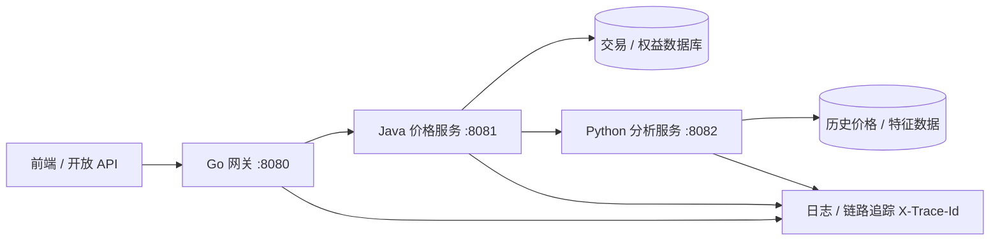

# 第 1 章 为什么 Java 工程师要掌握多语言？

> 所属篇章：第一篇 认知篇

**本章技术占比**：技术 50% + 引导 20% + 案例 30%

**前置 Java 知识映射**：Spring Boot 与 Spring Cloud 微服务、JVM 运行模型与容器化部署、领域驱动设计与复杂业务建模、团队协作中的分层规范与代码约定、基础的运维与可观测性经验

## 本章导读

这是全书的第一章，它不教任何语法。作为一名资深 Java 工程师，你大概率不缺"再学一门语言"的能力——你缺的是一个**判断框架**：什么时候该坚守 Java，什么时候该把某段链路交给 Go 或 Python，以及跨语言之后要付出哪些原本不存在的成本。本章要解决的就是这个判断问题。

我见过太多团队在"要不要上多语言"上摇摆：一部分人把 Java 当锤子，所有问题都想用 Spring 生态砸平；另一部分人被"Go 性能碾压""Python 才有 AI"之类的口号裹挟，急着把核心交易也改写成别的语言。这两种姿态都危险。前者会在云原生弹性、数据处理和 AI 适配上持续付出隐性代价；后者则会用团队最不熟悉的语言去承载最不能出错的业务，把复杂度引向失控。

正确的姿态是第三种：**承认 Java 的强项与边界都是真实的，也承认 Go、Python 各自站在某个位置上确有不可替代的价值，然后按业务链路而非语言偏好去分工。** 本书贯穿始终的实战背景——电商价格计算平台——正是这种分工的样板：Go 网关（`:8080`）扛流量入口与聚合，Java 价格服务（`:8081`）守核心交易与一致性，Python 分析服务（`:8082`）做历史数据与智能评分，三者用统一响应壳和经 `X-Trace-Id` 头透传的 `traceId` 串起来。本章会第一次把这条链路完整摊开，解释为什么它的三层恰好适配三种语言。

读完本章，你应该能对着自己团队的系统，指着某个环节说出："这段留在 Java，因为它是核心账务；那段可以交给 Go，因为它是高并发入口；这块适合 Python，因为它是数据与模型。"——并且说得出理由，也说得出代价。

## 技术地图



上图不是随手画的架构图，而是本章论证的可视化结论：**入口层要弹性、核心层要稳固、分析层要生态**，这三种诉求分别把 Go、Java、Python 拉到了它们最擅长的位置。后面每一节都会不断回到这张图。

## 知识点拆解

| 小节 | 论证内容 | Java 视角切入 | 落地案例 |
| --- | --- | --- | --- |
| 1.1 | 从"单一语言全栈"到"多语言协同"的演进动因：不是技术时髦，而是场景分化 | 从 Java 一栈打天下的历史优势谈起，再看它撑不住的新战场 | 价格平台为何天然是三段式而非一个大单体 |
| 1.2 | Java 的真实强项（生态 / 协作 / 建模 / 工程化）与真实边界（冷启动 / 内存 / 云原生基建语言 / 数据与 AI 生态） | 承认 Java 的价值，也不回避它的软肋 | 价格服务 `:8081` 该守什么、不该硬扛什么 |
| 1.3 | Go 与 Python 的互补价值：一份可操作的选型矩阵 | 用 Java 熟悉的维度（并发模型、部署形态、生态深度）横向对比 | 网关 `:8080` 选 Go、分析 `:8082` 选 Python 的理由 |
| 1.4 | 多语言协作范式：流量分层、数据驱动、服务解耦，以及它们的成本 | 对标 Java 单体 / 微服务的协作方式，追加跨语言治理项 | 三段链路如何靠统一契约与 `traceId` 协同 |

## 1.1 从"单一语言开发"到"多语言协同全栈架构"的技术演进

### Java 中我们通常怎么做

过去十几年，Java 工程师习惯的是"一栈打天下"。一套 Spring Boot 起服务，Spring Cloud 或 Dubbo 做微服务治理，MyBatis / JPA 落库，Kafka 做异步，前端交给同事，后端从接入层到数据层几乎全用 Java 覆盖。这套打法之所以能统治企业级开发这么久，是有硬道理的：Java 有极其成熟的生态，有稳定的团队人才供给，有久经考验的分层规范，一个新人进来照着约定就能产出不太离谱的代码。

在这种模式下，"技术选型"往往退化成"选哪个 Spring Starter""用哪个中间件"，语言本身从来不是变量。系统的复杂度靠框架吸收，靠约定沉淀，靠团队的集体记忆维持。对绝大多数以业务规则为主、并发压力可控、部署环境稳定的系统来说，这套模式至今仍然是最优解——不要因为本书讲多语言，就误以为 Java 单体一栈已经过时。它没有过时，只是不再是唯一答案。

### 多语言协同的对应设计

多语言协同的出现，不是因为某门新语言"更先进"，而是因为**场景分化了**。当系统同时要面对三类差异极大的诉求时，一门语言的设计取向就很难同时最优：

- 有的环节是**流量入口**：要在 K8s 里频繁扩缩容，要求镜像小、冷启动快、单机能扛住海量长连接。
- 有的环节是**核心业务**：规则复杂、状态关键、需要强团队约束和长期可维护性。
- 有的环节是**数据与智能**：要接历史数据、跑统计、调机器学习模型，要求的是生态里现成的轮子而非从零造。

一门语言可以在其中一类做到最好，却很难在三类同时最优——这不是能力问题，是设计取向的取舍。Go 为并发与部署简洁而生，Python 为数据表达力与生态而生，Java 为复杂业务与工程规模而生。多语言协同的本质，是**让每类诉求落到与它设计取向最契合的语言上**，而不是逼一门语言去覆盖它并不擅长的战场。

### 全栈选型逻辑

把这套逻辑套到价格计算平台上，三段式几乎是自然浮现的，而非硬拆的：

- 用户请求先打到**网关**，这里要鉴权、限流、生成 `traceId`、把一个前端请求扇出成对多个下游的调用再聚合——典型的高并发入口，交给 Go。
- 网关把清洗后的请求转给**价格服务**，这里要算基础价、叠加会员权益、套用优惠规则、保证账务一致——典型的复杂核心业务，留在 Java。
- 价格服务再调**分析服务**，让它基于历史价格算趋势、波动率、竞品对比、推荐分——典型的数据与模型场景，交给 Python。

判断依据始终是"这个环节的主要诉求是什么"，而不是"我更喜欢哪门语言"。如果价格平台并发不高、也不需要复杂分析，那用一个 Java 单体做完全合理——多语言从来不是目标，它是被场景逼出来的手段。

### Java 开发者容易踩的坑

1. **把"引入新语言"当成技术升级的 KPI**。为了简历或架构好看而拆语言，却没有真实的场景分化支撑，结果是徒增运维复杂度、团队认知负担和联调成本，收益却接近零。多语言的前提是场景真的分化了。
2. **先决定用什么语言，再去找它适合的活**。正确顺序恰好相反：先厘清每个环节的核心诉求，再匹配语言。倒过来做，往往会把不适合的活硬塞给某门语言。
3. **低估"从一栈到多栈"的组织成本**。多语言不只是多学几门语法，还意味着多套构建、多套 CI、多套监控接入、多份运维知识、跨团队的契约协商。技术选型表上写着"Go 更快"，但组织账本上可能是净亏——这笔账必须一起算。

## 1.2 Java 的技术边界：全栈场景下的优势与短板

### Java 中我们通常怎么做

要谈边界，先得诚实地承认 Java 的强项，否则"多语言"就成了对 Java 的贬低，那是错的。Java 在四个维度上依然是企业级开发的第一梯队：

- **生态深度**：从 Web、ORM、消息、缓存到分布式事务、服务网格，Spring 全家桶几乎为每个企业级问题都准备了标准答案，遇到问题大概率有成熟轮子和海量踩坑记录。
- **团队协作**：Java 的强类型、清晰的分层约定、成熟的 IDE 重构支持，让大团队、长周期的协作有了可依赖的地基。一个五十人的团队维护一个 Java 大系统，是能跑得起来的。
- **复杂业务建模**：领域驱动设计、丰富的设计模式实践、`record` 与模式匹配等现代语法，让 Java 在表达复杂交易规则时游刃有余。价格计算里那些叠加、互斥、优先级各异的优惠规则，正是 Java 的主场。
- **JVM 工程化**：JIT 让长时运行的服务性能持续优化，成熟的 GC、丰富的诊断工具（JFR、堆栈分析、APM 生态）让线上问题可观测、可定位。

这些不是营销话术，是每天在生产环境里被验证的事实。

### Java 边界的对应设计

但同样诚实地讲，Java 有几条真实的边界，而且恰恰都落在"全栈协同"最需要的新战场上：

- **冷启动与内存足迹**：JVM 要类加载、要预热才能进入高性能状态，一个 Spring Boot 服务从启动到就绪常需数秒甚至更久，基础镜像动辄一两百 MB。在需要秒级弹性扩缩容、按请求计费的云原生与 Serverless 场景，这是实打实的成本。GraalVM 原生镜像能缓解，但会牺牲一部分动态性与生态兼容，并非免费午餐。
- **云原生基建的语言生态**：这里有一个**可核实的公开事实**——当今云原生基础设施的主干几乎是 Go 写成的：Docker、Kubernetes、Prometheus、etcd、Containerd、Istio 的核心组件均以 Go 实现。这意味着当你要写一个 K8s Operator、一个 Prometheus exporter、一个自定义控制器时，Go 是与这套生态同源的"母语"，SDK 最全、示例最多；用 Java 去做，往往是在逆着生态走。
- **数据与 AI 生态**：数据科学、机器学习、深度学习的主流工具链（NumPy、pandas、PyTorch、scikit-learn 等）都以 Python 为第一公民。Java 侧虽有对应尝试，但生态成熟度、社区活跃度、模型可用性与 Python 不在一个量级。要做特征工程、跑模型、接 LLM，Python 是阻力最小的路径。

关键在于：**这些边界不是"Java 不行"，而是"Java 的设计取向没有把这些场景放在第一优先级"。** 硬要 Java 去啃，不是不能，而是要付出与收益不成正比的代价。

### 全栈选型逻辑

回到价格平台。价格服务 `:8081` 应该**牢牢守住**它擅长的部分：交易一致性、权益规则、优惠计算、账务状态——这些是复杂业务建模，是 Java 的主场，谁都别想把它抢走。

但价格服务**不该硬扛**两类活：一是纯粹的高并发接入与聚合（那是网关的事，交给 Go 更省资源、启动更快）；二是历史数据统计与模型推理（那是分析的事，交给 Python 生态更省力）。让 Java 服务保持"核心业务纯粹"，反而能让它把最擅长的事做到最好——边界清晰，是让强项更强的前提。

### Java 开发者容易踩的坑

1. **把 Java 的强项当成万能的理由**。"我们 Java 生态什么都有"是真的，但"有"不等于"最优"。Java 有画图库、有数据分析库、有机器学习框架，可当你真要交付一个数据分析特性时，用 Java 的边际成本常远高于 Python，这笔差价长期看很可观。
2. **把 Java 的边界当成需要"捍卫"的面子**。承认 Java 在冷启动、云原生基建语言、AI 生态上不占优，不是贬低 Java，而是工程务实。死守"全用 Java"往往是团队惯性和情感，而非技术判断。
3. **用一次性能测试否定 Java**。反过来也有坑：看到某个 Go 基准比 Java 快就想全面替换。JIT 加持下长时运行的 Java 服务性能往往很能打，且复杂业务的可维护性收益远超那点吞吐差异。别用微基准替代真实链路的综合判断。

## 1.3 Go/Python 的核心互补价值：与 Java 的技术选型矩阵

### Java 中我们通常怎么做

在纯 Java 世界里，做选型时我们比较的维度通常是框架和中间件：用 Netty 还是 Tomcat、用线程池还是响应式、用 JPA 还是 MyBatis。这些比较都在"语言之内"。引入多语言后，比较维度上升了一层——变成了**语言层面的并发模型、部署形态、生态深度**的横向对比。对 Java 工程师而言，最有效的理解方式，就是用你熟悉的这几个维度去给 Go 和 Python 定位。

### Go / Python 的对应设计

先说 Go，可以把它理解成"为并发与部署简洁而生的系统语言"：

- **并发模型**：goroutine + channel 让你用近乎同步的写法表达海量并发，一台机器轻松跑起成千上万的 goroutine，调度由运行时负责。对标 Java，这大致是"比线程更轻、比响应式回调更直观"的位置。网关要把一个请求扇出成对 `:8081`/`:8082` 的多路并发调用再聚合，Go 写起来格外顺手。
- **部署形态**：`go build` 产出静态链接的单个二进制，不依赖外部运行时，塞进 `scratch` 空镜像就能跑，最终镜像可到十几 MB，冷启动亚秒级。这正好补上了 Java 在弹性场景的短板。
- **生态位置**：如前所述，云原生基建以 Go 为母语。写网关、Operator、exporter、CLI 工具，Go 与生态同源。

再说 Python，可以把它理解成"为表达力与生态而生的胶水与数据语言"：

- **表达力与迭代速度**：动态类型、简洁语法、REPL 交互，让写脚本、做数据探索、快速验证想法的反馈循环极短。对标 Java 的严谨，Python 用一部分类型安全换来了开发速度。
- **数据与 AI 生态**：pandas / NumPy / PyTorch / scikit-learn 这套工具链是数据与机器学习事实上的标准，模型、算法、数据集大多以 Python 为第一接口。
- **自动化与胶水**：运维脚本、数据管道、ETL、爬取清洗，Python 是黏合各种系统的天然选择。

一句话概括这份选型矩阵：**Java 强在复杂业务与工程规模，Go 强在并发入口与云原生部署，Python 强在数据表达与 AI 生态。** 三者不是竞争关系，而是互补的三块拼图。

需要提醒的是，业界的语言趋势可以**定性参考**公开的社区调查（如 TIOBE 指数、Stack Overflow 年度开发者调查），它们能反映"哪些语言在被广泛使用、被开发者喜爱"的大致方向；但本书不会引用其中任何具体百分比或排名数字——那些数据会随时间波动，且对你的选型决策而言，定性的生态位判断远比某个月的排名更可靠。

### 全栈选型逻辑

把矩阵落到价格平台的三层，选型就有了可复述的理由：

| 维度 | 网关 `:8080` | 价格服务 `:8081` | 分析服务 `:8082` |
| --- | --- | --- | --- |
| 核心诉求 | 高并发接入、扇出聚合、弹性扩缩容 | 复杂交易规则、账务一致性、长期可维护 | 历史统计、模型推理、快速迭代 |
| 并发压力 | 极高（每个外部请求都过它） | 中（受核心业务节奏约束） | 中低（离线 / 近线为主） |
| 对生态的要求 | 云原生基建同源 | 企业级业务框架完备 | 数据与 AI 工具链丰富 |
| 首选语言 | Go | Java | Python |
| 选它的关键理由 | 单二进制小镜像、goroutine 并发、与 K8s/Prometheus 同源 | Spring 生态、DDD 建模、JVM 工程化与可观测 | pandas/PyTorch 生态、表达力、迭代速度 |

这张表就是本节的结论：**选型不是比谁先进，而是让每个环节的核心诉求，落到设计取向与之最契合的语言上。**

### Java 开发者容易踩的坑

1. **被单一维度的口号带偏**。"Go 性能高""Python 有 AI"都是片面标签。Go 在复杂业务建模上远不如 Java 表达力强，Python 在高并发核心交易上也不合适。任何"某语言全面碾压"的说法都值得警惕。
2. **忽略团队现状这个隐藏维度**。选型矩阵是技术层面的理想解，但真实决策还要叠加"团队会不会""招不招得到人""出了线上问题谁能兜"。一个没人懂 Go 的团队贸然把网关改成 Go，风险可能盖过收益。先从边界最清晰、最独立的环节切入。
3. **用 Python 的开发速度掩盖它的工程弱项**。Python 写起来快，但动态类型在大型协作、长期维护中会累积隐性成本。所以本书让 Python 只承担"建议型"的分析职责，不让它进入核心交易的写路径——把它放在它的优势区，避开它的弱项区。

## 1.4 全栈架构下的多语言协作范式：流量分层、数据驱动、服务解耦

### Java 中我们通常怎么做

在 Java 微服务时代，我们已经很熟悉"服务解耦"了：按业务域拆服务，用 REST 或 RPC 通信，用注册中心做服务发现，用统一网关做接入。协作规范也成熟：接口用 OpenAPI 描述，DTO 有明确契约，链路追踪靠 Sleuth/Micrometer 打通。**这些经验绝大部分可以平移到多语言场景**——多语言协同并没有推翻微服务的方法论，它只是把"每个服务用什么语言实现"这个变量放开了。

### 多语言协作的对应设计

多语言协作可以归纳成三条相互支撑的范式，恰好对应技术地图的三条主线：

- **流量分层**：请求按"入口 → 核心 → 辅助"的深度分层，越靠外层越强调吞吐与弹性（Go 网关），越靠内层越强调一致性与规则（Java 核心），最里层是建议型的数据服务（Python 分析）。分层让每层可以独立选型、独立扩缩容、独立发布。
- **数据驱动**：分析服务不参与交易的写路径，它只消费历史数据、产出趋势与评分这类"建议型结果"。这条边界至关重要——它保证了即使 Python 分析服务挂了或算错了，核心账务也不受影响，价格照样能算出来，只是少了趋势展示。
- **服务解耦**：三种语言之间只通过网络契约耦合，不共享内存、不共享代码。契约就是它们唯一的公共语言：统一的响应壳、统一的错误码语义、经 `X-Trace-Id` 头透传的 `traceId`、明确约定的字段与版本策略。

统一契约是多语言协同的地基。同一个概念，在三种语言里用各自的方式承载，但字段语义必须一致：

```java
// Java 价格服务 :8081 —— 用 record 承载统一响应壳
public record ApiResponse<T>(int code, String message, T data, String traceId) {
    public static <T> ApiResponse<T> ok(T data, String traceId) {
        return new ApiResponse<>(0, "OK", data, traceId);
    }
}
```

```go
// Go 网关 :8080 —— 与 Java ApiResponse 字段对齐的响应壳
type ApiResponse struct {
    Code    int         `json:"code"`
    Message string      `json:"message"`
    Data    interface{} `json:"data,omitempty"`
    TraceID string      `json:"traceId"`
}
```

```python
# Python 分析服务 :8082 —— 与上游字段对齐的分析入参
from dataclasses import dataclass

@dataclass
class PriceAnalysisRequest:
    sku: str
    base_price: float
    member_level: str
```

`record`、`struct`、`dataclass` 只是三种承载结构的形式，真正需要团队盯死的，是它们背后**共享的那份契约**：字段叫什么、错误码代表什么、`traceId` 怎么传、版本怎么兼容。这份契约不统一，多语言协同就会在边界上悄悄漂移，最终酿成难以排查的跨服务故障。

### 全栈选型逻辑

多语言协作的收益是真实的：每层站在自己的优势区，弹性、性能、迭代速度、生态适配都拿到了各自的最优解。但它的成本也同样真实，必须摊开在决策桌上：

- **认知负担**：团队要同时维护三套语言的心智模型、三套惯用法、三套调试手感。一个工程师在 Go 的 `defer`、Java 的 `try-with-resources`、Python 的 `with` 之间切换，是有切换成本的。
- **运维复杂度**：三套构建工具、三套 CI 流水线、三种基础镜像、三份依赖安全扫描、三套监控接入。原本一套 JVM 参数调优的知识，现在要扩成三份运维知识。
- **协作摩擦**：契约的每次变更都要跨语言、可能跨团队协商；一个字段改名，三个服务都要动、都要测。

所以本书的立场很明确：**多语言不是越多越好，而是"该分才分"。** 价格平台拆成三段，是因为它的三层诉求确实分化到了单语言难以同时最优的程度；如果你的系统没有这种分化，一个 Java 单体就是最优解，硬上多语言只会用收益换来一堆成本。判断的标尺，永远是"场景的分化程度是否已经超过了多语言治理的成本"。

### Java 开发者容易踩的坑

1. **只统一了协议，没统一语义**。三个服务都用 JSON、都用 HTTP，但一个把"未传会员等级"编码成字段缺失、另一个编码成 `0`、第三个编码成空字符串——协议一致而语义漂移，跨服务对不上账。契约要统一到语义层，不能停在协议层。
2. **让分析服务越界写核心状态**。一旦 Python 分析服务被允许直接改价格、改账务，"数据驱动"的边界就破了，Python 的工程弱项会直接威胁核心一致性。分析服务必须严守"只出建议、不改状态"的红线。
3. **`traceId` 断链**。跨语言调用时，若某一跳没把 `X-Trace-Id` 头透传下去，链路追踪就在那里断掉，出问题时无法把三段日志串起来。跨语言链路里，`traceId` 的透传是可观测性的生命线，任何一跳漏传都是隐患。
4. **忽视跨语言调用的超时与降级**。Java 里习惯了同进程调用近乎零成本，跨语言后每一跳都是网络调用，都有超时、重试、熔断、降级的问题。分析服务超时了，网关该降级返回"暂无趋势"而不是让整个请求失败——这类边界策略必须显式设计，不能想当然。

## 对比代码示例

前面的响应壳展示了"契约如何在三种语言里对齐"。这里再补一个更贴近判断框架的例子：同一个"是否要为某段逻辑引入新语言"的决策，用一段可复述的伪逻辑表达出来，帮你把本章的选型直觉落成可执行的判断。

```text
决策：某个环节该用哪门语言？

if 环节属于核心交易 / 复杂规则 / 强一致性 / 长期大团队维护:
    留在 Java            # 复杂业务建模与工程规模是 Java 主场
elif 环节属于高并发入口 / 扇出聚合 / 云原生基建 / 弹性扩缩容:
    考虑 Go              # 单二进制、goroutine 并发、与 K8s 生态同源
elif 环节属于数据统计 / 模型推理 / 自动化脚本 / AI 适配:
    考虑 Python          # pandas/PyTorch 生态与迭代速度
else:
    默认留在 Java        # 场景未分化时，单语言就是最优解

# 无论选哪门，都要追加：统一契约 + traceId 透传 + 超时降级策略
```

这段伪逻辑不是要你机械套用，而是提醒你：选型有清晰的判断顺序——**先看是不是核心业务（守住 Java），再看是不是入口/云原生（考虑 Go），再看是不是数据/AI（考虑 Python），都不是就别拆。** 最后那行注释同样重要：任何跨语言决策都自带一份治理成本，必须一并纳入。

## 章节综合案例：企业级项目技术栈拆分实战

以电商价格计算平台为例，我们把本章的判断框架完整走一遍，看三段式是如何被"论证"出来而非"拍脑袋"定出来的。

### 场景输入

用户在商品详情页请求某个 SKU 的实时价格。系统需要：校验请求合法性并限流，读取商品基础价，叠加该用户的会员权益与当前可用优惠，同时返回这个 SKU 近期的价格趋势与一个"是否值得买"的智能评分，最终以统一响应壳返回前端。

### 关键流程与选型论证

1. **入口治理 → Go 网关 `:8080`**。这一跳要面对全部外部流量，要鉴权、限流、生成并注入 `traceId`，还要把一个前端请求扇出成对价格服务和分析服务的并发调用再聚合。核心诉求是高并发与弹性——`goroutine` 并发写起来直观、单二进制小镜像便于在 K8s 里快速扩缩容，Go 是自然选择。
2. **核心计算 → Java 价格服务 `:8081`**。基础价、会员权益、优惠叠加与互斥、账务一致性，是规则复杂、状态关键、需要长期维护的核心业务。这是 Java 的主场：DDD 建模、Spring 生态、JVM 工程化与成熟可观测性，一个都不能少。
3. **数据分析 → Python 分析服务 `:8082`**。历史价格趋势、波动率、竞品对比、推荐分，是典型的数据处理与模型推理。pandas 做统计、模型库做评分，Python 的生态与迭代速度让这块事半功倍。且它只产出"建议型结果"，不碰核心账务状态。
4. **统一收口**。三段都用同一响应壳返回，日志里携带同一个经 `X-Trace-Id` 透传的 `traceId`。分析服务若超时，网关降级返回"暂无趋势"，核心价格照常返回——数据驱动的边界保证了辅助层的故障不拖垮核心链路。

### 本章落地点

读完本章，你应该能对着这条链路复述出**每一段选型的理由和代价**：网关为什么是 Go 而不是 Java（弹性与并发 vs 冷启动与镜像）、核心为什么必须留在 Java（复杂业务建模不可替代）、分析为什么交给 Python 且只做建议（生态优势 + 严守不写状态的边界）、以及这套拆分额外背上了哪些治理成本（契约、`traceId`、超时降级）。能把这四件事讲清楚，你就已经具备了本书要建立的核心能力——**基于业务链路做多语言分工的判断力**。

## 本章小结

1. 本章不教语法，只建立判断框架：多语言不是技术时髦，而是场景分化到单语言难以同时最优时的务实选择。
2. Java 的强项（生态、协作、复杂业务建模、JVM 工程化）与边界（冷启动、内存足迹、云原生基建语言生态、数据与 AI 生态）都是真实的，承认边界是让强项更强的前提。
3. Go 强在并发入口与云原生部署（Docker/K8s/Prometheus 均以 Go 写成，是可核实的事实），Python 强在数据表达与 AI 生态，二者与 Java 互补而非竞争。
4. 选型的标尺永远是业务链路的核心诉求：核心交易守 Java，高并发入口与云原生考虑 Go，数据与 AI 考虑 Python，场景未分化时单语言就是最优解。
5. 多语言协作靠流量分层、数据驱动、服务解耦三条范式支撑，但它自带认知负担、运维复杂度与协作摩擦的成本，必须一并计入决策。
6. 统一契约（响应壳、错误码、`traceId` 透传、超时降级）是多语言协同的地基，任何一处漂移或断链都是跨服务故障的隐患。
7. 价格计算平台的三段式——Go 网关 `:8080`、Java 价格服务 `:8081`、Python 分析服务 `:8082`——是本章判断框架的样板，也是全书各章最终汇入的第 13 章实战平台。

## 选型思考题

1. 如果坚持把价格平台的入口、核心、分析三层全部用 Java 单体实现，你会在稳定性和团队协作上获得什么？又会在弹性扩缩容、云原生集成和数据分析迭代速度上损失什么？请对着 1.2 的边界逐条评估，并给出一个"什么规模之前不必拆、什么信号出现后该拆"的判断线。
2. 假设你所在团队目前零 Go、零 Python 经验，但价格平台的网关确实面临高并发弹性压力。你会一步到位三段全拆，还是先只把网关切成 Go？这个决策里，"团队现状"这个隐藏维度应该占多大权重，你用什么标准来平衡技术理想解与组织现实成本？
3. 多语言协同额外引入了契约治理、`traceId` 透传、超时降级三类成本。请挑一类，具体描述：如果这块治理缺失，最可能在价格平台的哪个跨语言边界上、以什么形式暴露成线上故障？你会用什么最小成本的手段先把这个风险堵住？

## 延伸阅读资源

1. **Kubernetes 官方文档与源码仓库**（`kubernetes.io`、`github.com/kubernetes/kubernetes`）：直观感受云原生基建以 Go 为母语这一事实，理解为什么写 Operator/控制器时 Go 是同源选择。
2. **Prometheus 官方文档**（`prometheus.io`）与其 Go 客户端库：观察一个以 Go 写成的可观测性基建如何设计 exporter 与指标模型，对应本章对 Go 生态位的论证。
3. **Python 数据科学生态入口**：pandas（`pandas.pydata.org`）、NumPy（`numpy.org`）、PyTorch（`pytorch.org`）官方文档，感受数据与 AI 场景下 Python 生态的成熟度，对应 1.2 与 1.3 的选型依据。
4. **Spring Boot 与 Spring Cloud 参考文档**（`spring.io`）：重新校准 Java 侧的强项边界——复杂业务建模、微服务治理、工程化能力，避免在讨论多语言时低估 Java。
5. **OpenAPI 规范**（`spec.openapis.org`）与 **Protocol Buffers 文档**（`protobuf.dev`）：统一跨语言接口契约的两套主流手段，对应 1.4 的契约治理。
6. **社区语言趋势调查**：TIOBE 指数、Stack Overflow 年度开发者调查——仅作定性参考，用于把握生态大方向，切勿据其某月具体排名或百分比做选型决策。

## 第 1 章落地设计卡：技术栈拆分决策表

把本章的判断框架浓缩成一张可以贴在设计评审白板上的决策表。做技术栈拆分时，对每个环节逐行打分，而不是凭感觉定语言。

| 判断问题 | 继续留在 Java | 引入 Go | 引入 Python |
| --- | --- | --- | --- |
| 是否承载核心交易 / 复杂规则 / 强一致性 | 是（首选） | 否 | 否 |
| 是否处在高并发入口、需要频繁弹性扩缩容 | 可用但冷启动 / 镜像成本高 | 是（首选） | 否 |
| 是否要写云原生基建组件（Operator/exporter/CLI） | 逆生态，成本高 | 是（与生态同源） | 否 |
| 是否以数据统计 / 模型推理 / AI 适配为主 | 可用但生态吃力 | 否 | 是（首选） |
| 是否需要强团队约束与长期大规模协作 | 是（首选） | 视团队 Go 经验 | 需额外类型与规范约束 |
| 该环节是否会写核心业务状态 | 可以 | 可以（如网关侧写缓存） | 不应该（只出建议） |

用法提示：企业落地多语言时，第一步永远不是引入运行时，而是**写清楚服务边界与契约**。Java 价格服务持有订单、价格、权益等核心领域状态；Go 网关只做入口治理与聚合，不侵入核心业务规则；Python 分析服务只返回建议型结果，绝不直接修改交易状态。边界写清楚了，语言只是把这份边界落地的工具；边界不清，用再多语言也只是把混乱分散到了三处。
