# 第 2 章 从 Java 视角学习新语言的高效方法

> 所属篇章：第一篇 认知篇

**本章技术占比**：技术 50% + 引导 20% + 案例 30%

**前置 Java 知识映射**：Java 类型系统与接口、异常与 `try-catch`、Maven/Gradle 依赖管理、Spring Boot 分层与线程池、Stream 与函数式、Java 21 的 `record`、IDE 调试经验

## 本章导读

上一章我们确认了一个判断：全栈不是让一门语言吞掉所有职责，而是让 Java、Go、Python 各自站在最合适的链路环节。既然要同时驾驭三门语言，一个资深 Java 工程师最该问的不是"怎么把它们从头学一遍"，而是"怎么用最短的路径、只学真正有差异的部分"。这就是本章要交付的方法论。

这套方法论只有一条主线：**以 Java 已有经验为坐标系，把新语言的特性映射成"和 Java 相比多了什么、少了什么、语义变了什么"，然后只投资那些"变了"的地方**。你已经会写 `if`、`for`、`switch`，也理解封装、依赖注入、连接池这些工程概念——这些认知在 Go 和 Python 里大多能直接复用，不需要重学。真正值得花时间的，是 Go 的零值与 error 返回、Python 的鸭子类型与 GIL 这类"Java 里找不到直接对应物"的差异点。

本章四个小节层层递进：2.1 建立技术映射表，给你一张随时可查的对照坐标；2.2 是全书方法论的核心——教你如何"跳过共通语法糖、只学差异特性"，并给出明确的 Go/Python 差异清单；2.3 讲学习路径的顺序（语法→特性→框架→场景→协同）以及它为什么对应全书的章节结构；2.4 落到工具链，给出 Windows 环境下三语言 + Docker 的可执行验证命令。读完本章，你手里会有一张地图和一条路径，后面的第 3~13 章都是在这张地图上填充细节。

## 技术地图

```mermaid
flowchart TD
  A[Java 已有经验] --> B[2.1 建立技术映射表]
  B --> C[2.2 规避无效学习<br/>只学差异特性]
  C --> D[2.3 核心学习逻辑<br/>语法→特性→框架→场景→协同]
  D --> E[2.4 工程化工具链准备]
  C --> F[Go 差异清单<br/>第 3~4 章]
  C --> G[Python 差异清单<br/>第 8 章]
  D --> H[全书章节结构<br/>第 3~13 章]
  E --> I[Windows 三语言联调环境]
```



## 知识点拆解

| 小节 | 技术内容 | Java 视角切入 | 落地案例 |
| --- | --- | --- | --- |
| 2.1 | 建立 Java→Go→Python 三语言概念映射表，理解映射法的适用边界 | 用 Java 概念做锚点，逐项对照 Go/Python 的对应设计 | 价格计算平台各环节的语言职责对照 |
| 2.2 | 区分"共通语法糖"与"差异特性"，只投资后者；给出 Go/Python 差异清单 | 复用 Java 的控制流与工程认知，只补真正不同的部分 | 排出学习清单，直接指向第 3~4、8 章 |
| 2.3 | 核心学习逻辑：语法→特性→框架→场景→协同的五级路径 | 对标 Java 从语言到 Spring 到分布式的成长轨迹 | 学习路径映射到全书 Go 线 / Python 线 / 整合线 |
| 2.4 | Windows 下 JDK 21 + Go 1.22 + Python 3.11 + Docker 的环境搭建与验证 | 对标 Java 的 JDK 安装、Maven 配置、IDE 调试 | 一键验证三语言 + 联调环境就绪 |

## 2.1 建立技术映射：把 Go/Python 特性对应到 Java 技术体系

### Java 中我们通常怎么做

Java 工程师面对一个陌生框架时，惯用的第一步是"找对应物"：Spring Data JPA 出来时，我们问它相当于 MyBatis 加了什么；见到 Kafka，我们拿 JMS 去对照；学 Reactor 的 `Flux`，我们用 `Stream` 做类比。这种"锚定已知、对照未知"的学习方式效率极高，因为它复用了大脑里已经建好的概念网络，只需要标注差异，而不是从零构建。

在 Java 内部，我们还有一整套稳定的概念坐标：接口定义契约、`try-catch` 处理错误、线程池管理并发、Maven 坐标管理依赖、`Stream` 做集合变换、`record` 承载不可变数据。这些概念之间的关系我们烂熟于心，它们构成了判断"新东西属于哪一类"的参照系。

### Go/Python 的对应设计

学 Go 和 Python，最好的入口就是把这套 Java 坐标系直接铺开，逐项填入两门语言的对应物。下面这张表是本书后续所有章节的"总索引"，建议你收藏并随查随用：

| Java 概念 | Go 对应 | Python 对应 | 差异要点（本书章节） |
| --- | --- | --- | --- |
| `interface`（显式 implements） | 隐式接口（方法签名匹配即满足） | Protocol / 鸭子类型（有方法就能用） | 契约从"声明"变成"约定"（3.3 / 8.1） |
| `try-catch` 异常 | `value, err :=` 多返回值 + `errors.Is/As` | `try/except`（与 Java 最像） | Go 把错误当值；Python 与 Java 近似（3.4 / 8.4） |
| `null` / `Optional` | 零值机制（声明即可用）+ `nil` 多义 | `None` + `Optional[T]` | Go 无 null，靠零值与指针区分"未设置"（3.2） |
| 线程池 `ExecutorService` | goroutine + channel（CSP 模型） | `asyncio` / 线程（受 GIL 约束） | 并发模型三种范式完全不同（4.x / 8.6） |
| `Stream` / lambda | `for` + 闭包（无内建流式 API） | 列表推导式 / 生成器 | Go 显式循环，Python 推导式更紧凑（3.8 / 8.2） |
| `record`（不可变数据） | `struct`（值语义、可嵌入） | `@dataclass` | 三者都承载结构，语义细节不同（3.2 / 8.3） |
| Maven / Gradle | `go mod` + `go.sum` | `pip` + `venv` / `poetry` | 依赖与构建心智（3.1 / 8 章工具链） |
| `try-with-resources` / `finally` | `defer`（LIFO 栈） | `with`（上下文管理器） | 资源收尾三种写法（3.5 / 8.5） |
| `enum` | `iota` + 类型定义 | `enum.Enum` | Go 的 iota 更轻但功能更弱（3.8） |
| 泛型（类型擦除） | 类型参数 `[T any]`（单态化） | 类型注解 `TypeVar`（运行期不强制） | 泛型三种实现取舍（3.9 / 8.3） |
| `@Component` + AOP 切面 | 显式组合 + 中间件函数 | 装饰器 `@decorator` | 横切能力的三种表达（3.3 / 8.2） |
| JIT + 字节码 + JVM | 静态编译单二进制 | 解释执行 + CPython | 运行模型决定部署形态（3.1 / 8 章） |

这张表的价值不在于"背下来"，而在于给你一个**心理预期**：当你在第 3 章看到 Go 的 `defer`，脑子里立刻浮现"哦，这是 Java 的 `try-with-resources` 的位置，但语义不同，得看差异"；当你在第 8 章看到 Python 的 `with`，同样能把它挂到已知的钉子上。

### 全栈选型逻辑

映射表也直接服务于选型。回到本书贯穿的价格计算平台：网关 `:8080` 要高并发处理入口流量，映射表告诉你 Go 的 goroutine 比 Java 线程池更轻、比 Python 的 GIL 更适合 CPU 无关的高并发聚合，于是网关选 Go；核心价格计算要复杂领域建模和团队协作沉淀，Java 的 `record` + 分层 + 成熟生态是优势，于是价格服务 `:8081` 留在 Java；历史数据分析要对接 pandas、numpy 这些 AI 生态，映射表里 Python 的 `@dataclass` + 推导式 + 数据栈无可替代，于是分析服务 `:8082` 选 Python。选型的每一步，都是在映射表上比较"这个环节最吃哪一列的长处"。

### Java 开发者容易踩的坑

1. **把映射当等价，忽略"假朋友"（false friends）**。映射是学习的入口，不是终点。Go 的 `interface` 和 Java 的 `interface` 名字相同，但一个是隐式满足、一个是显式声明，语义差一大截；Python 的 `None` 和 Java 的 `null` 看着像，但 Python 一切皆对象、`None` 也是单例对象，行为并不一致。把映射当成"约等于"会让你在差异点上栽跟头。
2. **只映射语法，不映射工程边界**。真正要对齐的不是"这行代码 Java 怎么写、Go 怎么写"，而是"谁负责启动、谁管理依赖、谁暴露错误、谁承接接口契约"。只对着语法糖做翻译，写出来的 Go/Python 代码会带着浓重的 Java 腔，既不地道也不好维护。
3. **映射方向搞反，用新语言的习惯倒推 Java**。学 Go 一段时间后，有人会反过来嫌 Java 啰嗦，试图在 Java 里模拟 error 返回、放弃异常——这是把工具用错了地方。每门语言的惯用法要在它自己的语境里成立，映射是为了理解差异，不是为了互相改造。

## 2.2 规避无效学习：只掌握全栈场景必需的语言特性

### Java 中我们通常怎么做

资深 Java 工程师深知"学得多"不等于"学得对"。你不会因为要用 Spring Boot 就把整个 Servlet 规范背一遍，而是先跑通一个 Controller，遇到过滤器、拦截器、异步这些点时再针对性深入。学习是**按需的、以问题为驱动的**，而不是把语言手册从头读到尾。这种克制在学新语言时更重要——因为你要同时学两门，任何一分钟花在"其实早就会了"的东西上，都是净亏损。

### Go/Python 的对应设计

这一节是全书方法论的核心，只讲一件事：**跳过共通语法糖，只学差异特性**。

先说为什么 `if/else`、`for`、算术运算、`switch` 这些不值得花时间。因为它们在三门语言里**心智模型完全一致**：`for i := 0; i < n; i++` 你扫一眼就懂，Python 的 `for x in items` 你更是秒会。它们没有需要你"换脑子"的地方，官方 Tour 或任意入门教程花十分钟就能扫完语法细节，投入产出比极低。把宝贵的学习时间投在这些地方，是最典型的无效学习。

真正值得逐个攻克的，是下面两张"差异清单"。**Go 差异清单**（对应第 3~4 章，逐一在那里展开）：

| Go 特性 | 为什么是差异点（Java 里没有直接对应） | 本书章节 |
| --- | --- | --- |
| 零值机制 / `nil` 多义 | Java 有 null 但无"声明即可用的零值"；nil 在 Go 里有多重含义 | 3.2 |
| 多返回值 + error | Java 用异常，Go 把错误当普通返回值 | 3.4 |
| `defer` | Java 是 `try-with-resources`，defer 的参数求值时机是新坑 | 3.5 |
| 指针与值语义 | Java 对象全是引用，Go 默认值拷贝、需显式用指针 | 3.6 |
| slice 三元组 | Java 的 `ArrayList` 不会"有时共享、有时脱钩底层数组" | 3.7 |
| 闭包引用捕获 / 循环变量 | Java 要求 effectively final，Go 是引用捕获（1.22 有语义变更） | 3.8 |
| `iota` | Java 的 `enum` 是完整类型，iota 只是常量生成器 | 3.8 |
| 泛型（单态化） | 与 Java 的类型擦除实现路线不同 | 3.9 |
| goroutine | 比 Java 线程轻几个数量级，由运行时调度 | 4.x |
| channel / `select` | Java 无语言级 CSP 通信原语 | 4.x |

**Python 差异清单**（对应第 8 章）：

| Python 特性 | 为什么是差异点 | 本书章节 |
| --- | --- | --- |
| 鸭子类型 / Protocol | Java 靠显式接口，Python 靠"长得像就是" | 8.1 |
| 列表 / 字典推导式 | Java 用 `Stream`，Python 用更紧凑的推导式语法 | 8.2 |
| `with` 上下文管理器 | 对标 `try-with-resources`，但可自定义 `__enter__/__exit__` | 8.5 |
| 装饰器 `@decorator` | 对标 Java 注解 + AOP，但是一等函数直接包装 | 8.2 |
| 生成器 / `yield` | Java 无语言级惰性序列 | 8.2 |
| 魔术方法（dunder） | `__init__`/`__eq__`/`__enter__` 等约定驱动的协议 | 8.3 |
| GIL | Java 真并行，CPython 有全局解释器锁，影响并发策略 | 8.6 |

判断一个特性该不该学，只需一个标准：**它是否会改变你写代码的心智模型**。会（如 error 返回、GIL），就投入；不会（如 `for` 循环写法），就跳过。

### 全栈选型逻辑

这份"只学差异"的清单，本身就是选型能力的基础。你之所以能判断"网关该用 Go 而非 Python"，正是因为你掌握了 goroutine 与 GIL 这两个差异点——若你只学了两门语言共通的 `for` 和 `if`，你根本无从比较它们在高并发入口上的高下。差异特性清单和选型判断是一体两面：清单里的每一项，都对应一个"在什么场景下该选谁"的决策依据。所以本书刻意不铺陈共通语法，把篇幅全压在这些差异点上，就是为了让你的每一分钟学习都直接转化为选型判断力。

### Java 开发者容易踩的坑

1. **强迫症式地"学完整"**。Java 工程师习惯了系统化学习，容易觉得"跳过基础语法不踏实"。但对一个能读懂三门语言 `for` 循环的资深工程师来说，逐字读语法手册就是浪费。要克服"必须从头学"的心理惯性，允许自己直接跳到差异点。
2. **误把差异特性当边角料略过**。反过来的错误更致命：因为 `defer`、GIL 这些东西"Java 里没有、看着陌生"，有人反而选择性回避，只用自己熟悉的写法硬凑。结果是写出一堆 goroutine 却踩了循环变量捕获的坑，或者在 CPython 里开一堆线程做 CPU 密集计算却被 GIL 锁死。差异点恰恰是必须硬啃的部分。
3. **把"跳过语法糖"误解成"不用动手"**。跳过的是"读语法说明"，不是"跳过练习"。零值、slice 共享、GIL 这些差异点，光看文字理解得再透，不亲手写几段验证代码、不制造一次崩溃，就不会真正内化。方法论省的是无效阅读时间，不是必要的动手时间。

## 2.3 核心学习逻辑：语法到特性到框架到场景到协同

### Java 中我们通常怎么做

回顾你自己成为资深 Java 工程师的路径，其实是有清晰台阶的：先学语言语法（类、方法、集合），再掌握语言特性与 JVM（泛型、并发、GC），然后是框架（Spring、MyBatis），接着是把框架用到真实业务场景（分层架构、事务、缓存），最后才是分布式协同（微服务、消息队列、一致性）。你不会跳过前面的台阶直接学分布式事务——那会悬空。学习是**分层递进**的，每一层为上一层提供支撑。

### Go/Python 的对应设计

学 Go 和 Python 应当复用同样的递进逻辑，本书把它固化成五级路径：**语法 → 特性 → 框架 → 场景 → 协同**。

- **语法**：只花最少时间扫过共通部分（2.2 已说明），确认能读能写。
- **特性**：主攻 2.2 那两张差异清单，这是投入最大的一级——零值、error、goroutine、鸭子类型、GIL 都在这里啃透。
- **框架**：在语言特性扎实后学生态框架，Go 学 Gin，Python 学 FastAPI，此时你已理解语言的错误处理和并发模型，框架只是把它们工程化。
- **场景**：把框架用到真实业务环节——网关做限流聚合、分析服务做数据清洗，让特性落到链路里。
- **协同**：最后是跨语言整合，统一响应壳、`traceId` 透传、gRPC/HTTP 契约，把三门语言串成一条完整链路。

这条路径不是空谈，它**就是本书的章节结构**：

| 学习级别 | 对应章节 | 内容 |
| --- | --- | --- |
| 语法 + 特性（Go） | 第 3~4 章 | Go 与 Java 的核心差异映射、并发模型 |
| 框架 + 场景（Go） | 第 5~7 章 | Gin、Go 网关工程化、Go 侧实战 |
| 语法 + 特性（Python） | 第 8 章 | Python 与 Java 的核心差异映射 |
| 框架 + 场景（Python） | 第 9~11 章 | FastAPI、数据分析、Python 侧实战 |
| 协同 | 第 12~13 章 | 跨语言通信整合、电商价格计算平台综合实战 |

也就是说，你现在读的这一章，是在为整本书铺路：先建映射（2.1）、定策略（2.2）、排路径（2.3）、备环境（2.4），然后沿着 Go 线（3~7）、Python 线（8~11）、整合线（12~13）一路走下去。

### 全栈选型逻辑

这条五级路径本身就暗含选型思维。到"场景"这一级，你会自然地问"这个业务环节放在 Go 还是 Python 更合适"，因为前面"特性"级已经让你知道两门语言各自的长短；到"协同"这一级，你考虑的是"三门语言如何分工才能让整条链路最优"。跳过前面的级别直接谈选型，就会退化成拍脑袋；踩实每一级，选型判断就是水到渠成的结论。本书把综合实战放在第 13 章的最后，正是因为它需要前面所有级别的积累才能真正落地。

### Java 开发者容易踩的坑

1. **越级学习，直接扑框架**。有人跳过语言特性直接学 Gin 或 FastAPI，遇到 Go 的 error 处理或 Python 的 async 就懵，因为框架只是把语言特性包装了一层。没有"特性"这一级的支撑，框架代码你只能照抄不能改。
2. **停在"特性"级不往上走**。反过来，有人把 Go 的每个语法坑都研究透了，却从没写过一个真实服务，学到的东西全是孤立知识点，无法形成链路级的工程经验。特性必须落到场景，否则等于没学。
3. **忽略"协同"级，以为学会单语言就是全栈**。全栈的难点恰恰在协同：三门语言的错误码怎么统一、`traceId` 怎么透传、超时如何级联。只会单独用 Go 或 Python，不等于会做跨语言全栈——第 12~13 章存在的意义就是补上这最后一级。

## 2.4 工程化工具链准备：Java+Go+Python 统一开发环境搭建

### Java 中我们通常怎么做

Java 工程师配环境的流程很成熟：装 JDK、配 `JAVA_HOME`、验证 `java -version`，再配 Maven 的 `settings.xml` 指向私有仓库，最后在 IDEA 里导入项目、跑起来能断点调试就算就绪。核心就是三步——装运行时、配依赖源、验证可运行。学新语言时，把这套"装、配、验"的严谨习惯照搬过来即可，只是对象换成了 Go 和 Python。

### Go/Python 的对应设计

本书读者环境是 Windows，下面给出三语言 + Docker 的工具链检查表，每一项都配了可在 PowerShell 里直接执行的验证命令：

| 工具 | 版本基线 | 作用 | 验证命令 |
| --- | --- | --- | --- |
| JDK | 21 | 编译运行 Java 价格服务 `:8081` | `java -version` |
| Go | 1.22+ | 编译运行网关 `:8080` 与并发示例 | `go version` |
| Python | 3.11+ | 运行分析服务 `:8082` 与脚本 | `python --version` |
| Docker Compose | v2+ | 本地一键编排三个服务联调 | `docker compose version` |
| Git | 2.x | 拉取本书配套仓库 | `git --version` |

在 PowerShell 里可以一次性把四项核心工具全验证一遍：

```powershell
# 逐项打印版本，任一命令报"不是内部或外部命令"即表示该工具未装或未配 PATH
java -version        # 期望：openjdk version "21" 或更高
go version           # 期望：go version go1.22 或更高
python --version     # 期望：Python 3.11 或更高
docker compose version   # 期望：Docker Compose version v2.x

# 顺带确认 Go 的关键环境变量（国内建议配代理，否则拉依赖易超时）
go env GOPROXY GOPRIVATE
```

其中 Go 的 `GOPROXY` 值得单独说明。国内直连 `proxy.golang.org` 常超时，建议设置为国内代理：

```powershell
# 设置 Go 模块代理（对标 Maven 配私有 Nexus 镜像）
go env -w GOPROXY=https://goproxy.cn,direct
```

Python 侧的关键动作是**为每个项目建独立虚拟环境**，不要往全局装依赖（对标 Java 每个项目独立的依赖树）：

```powershell
# 在项目目录下创建并激活虚拟环境（venv 相当于隔离的依赖沙箱）
python -m venv .venv
.\.venv\Scripts\Activate.ps1   # 激活后命令行前缀出现 (.venv)
pip install fastapi uvicorn    # 依赖只装进本项目，不污染全局
```

IDE 建议按语言主战场分工：Java 用 IntelliJ IDEA（生态最成熟）；Go 用 GoLand 或装了 Go 扩展的 VS Code；Python 用 PyCharm 或 VS Code + Python 扩展。若想在一个窗口里同时改三门语言，VS Code 配齐三套扩展是最省心的统一方案，也便于跨语言联调时来回跳转。

### 全栈选型逻辑

工具链的差异本身就折射了语言的定位。Go 装完就是一个静态编译器，`go build` 直接产出不依赖运行时的单二进制，这正是它适合做网关、能塞进十几 MB 镜像的底层原因；Java 需要 JVM 运行时、Python 需要解释器，部署形态更重，但换来的是 Java 的生态深度和 Python 的数据栈。当你在 Docker Compose 里把三个服务编排起来，会直观看到：Go 服务的镜像最小、启动最快，Java 服务最稳重、内存占用高，Python 服务胜在能直接 `import pandas`。环境搭建这一步，其实是你第一次亲手感受三门语言工程形态差异的机会。

### Java 开发者容易踩的坑

1. **不建虚拟环境，往全局 `pip install`**。Java 工程师习惯了 Maven 每个项目依赖天然隔离，容易忽略 Python 默认是全局装包的。多个项目共用全局环境，迟早因为依赖版本冲突而互相打架。每个 Python 项目开工第一件事就是 `python -m venv .venv`。
2. **忽略 `GOPROXY` 导致拉依赖卡死**。在 Windows 上直接 `go mod download` 却不配国内代理，命令会长时间无响应甚至报 `410 Gone`，新手常误以为是网络断了。配一次 `go env -w GOPROXY=https://goproxy.cn,direct` 即可。
3. **PATH 里混入多个版本，`go version` 或 `python --version` 不是预期值**。Windows 上装过多个 Python（比如系统自带 + 手动装 + 应用商店版）时，`python` 命令可能指向错误版本。验证时若版本不对，先 `where.exe python`、`where.exe go` 看命令实际解析到哪个可执行文件，再清理 PATH 顺序。
4. **只验证"装上了"，不验证"跑得起来"**。装完工具就以为环境就绪，等真正联调时才发现 Docker Desktop 没启动、或端口 8080/8081/8082 被占用。建议装完立刻用 `docker compose up` 把三个服务空跑一遍，确认端口通、容器起，才算真正就绪。

## 对比代码示例

方法论最终要落到"三门语言如何表达同一件事"。下面用最基础的一件事——定义一个价格请求的数据载体——对比三门语言，你会看到 2.1 映射表里 `record`/`struct`/`@dataclass` 那一行在真实代码里的样子。

```java
// Java 21：record 承载不可变 DTO，字段引用可能为 null
public record PriceRequest(String sku, Integer memberLevel) {
    public int levelOrDefault() {
        return memberLevel == null ? 0 : memberLevel; // 必须显式防御 null
    }
}
```

```go
// Go 1.22：struct 值语义，零值即可用；用指针区分"未传"与"等级 0"
type PriceRequest struct {
    SKU         string `json:"sku"`
    MemberLevel *int   `json:"memberLevel"` // nil 表示未传，&0 表示显式 0
}
```

```python
# Python 3.11：dataclass 承载数据，字段默认值直接声明
from dataclasses import dataclass
from typing import Optional

@dataclass
class PriceRequest:
    sku: str
    member_level: Optional[int] = None  # None 相当于 Java 的 null
```

三段代码承载的是同一个概念，但每一处差异都在验证本章的方法论：Java 靠 `null` 检查、Go 靠零值加指针、Python 靠 `Optional` 和 `None`——它们在映射表里同属"不可变数据载体"这一行，却各有各的"缺失值"表达方式。学习时你不需要重新理解"什么是数据结构"（共通认知），只需要标注这三种"缺失值"处理的差异（差异特性）。这正是 2.1 的映射、2.2 的取舍在一段最简单代码里的合流。

## 章节综合案例：配置多语言统一开发、联调环境

本章的综合案例不是写业务代码，而是把方法论真正落地成一个可运行的三语言联调环境——这是你后续所有章节实操的前提。

### 场景输入

你刚拿到本书配套仓库，需要在自己的 Windows 机器上，把 Go 网关 `:8080`、Java 价格服务 `:8081`、Python 分析服务 `:8082` 三个服务一次性跑起来，并确认它们能互相调用、日志里能看到贯穿三段的同一个 `traceId`。

### 关键流程

1. **验证工具链**：按 2.4 的检查表，在 PowerShell 里依次跑 `java -version`、`go version`、`python --version`、`docker compose version`，四项全部返回预期版本。
2. **配好依赖源**：`go env -w GOPROXY=https://goproxy.cn,direct` 配 Go 代理；Python 侧进项目目录建 `.venv` 并 `pip install` 依赖；Java 侧确认 Maven 能拉到 Spring Boot 依赖。
3. **一键编排**：在仓库根目录 `docker compose up`，让三个服务按同一份编排文件启动。
4. **联调验证**：用 curl 带上自定义头 `X-Trace-Id` 请求网关，确认响应按统一壳返回，且三个服务的日志里都打印了同一个 traceId。

```powershell
# 启动全部服务后，带 traceId 请求网关，验证跨语言链路打通
curl.exe -H "X-Trace-Id: demo-0001" "http://localhost:8080/api/price?sku=A-1001"
# 期望：返回统一响应壳 {"code":0,"message":"OK","data":{...},"traceId":"demo-0001"}
# 并能在 8080/8081/8082 三个服务日志里都看到 traceId=demo-0001
```

### 本章落地点

读者完成本章后，应能把学习方法论真正用起来：手里有一张 2.1 的三语言映射表随时可查，心里有一份 2.2 的差异清单知道该学什么、跳过什么，脚下有一条 2.3 的五级路径知道按什么顺序推进，机器上有一套 2.4 验证通过的联调环境随时能动手。方法论不再是抽象口号，而是一张地图、一份清单、一条路径、一套环境。

## 本章小结

1. **映射法是入口而非终点**：以 Java 经验为坐标系，把 Go/Python 特性对应到已知概念，能极大加速学习——但要警惕"假朋友"，名字相同不代表语义等价（2.1）。
2. **只学差异特性，跳过共通语法糖**：`if/for/switch` 三门语言心智一致，不值得投入；真正要啃的是 Go 的零值/error/goroutine 和 Python 的鸭子类型/GIL——判断标准是"它是否改变你写代码的心智模型"（2.2）。
3. **学习按五级路径递进**：语法→特性→框架→场景→协同，这条路径就是本书 Go 线（3~7）、Python 线（8~11）、整合线（12~13）的章节结构（2.3）。
4. **工具链要"装、配、验"三步到位**：Windows 下用可执行命令验证 JDK 21 / Go 1.22 / Python 3.11 / Docker，配好 GOPROXY 与虚拟环境，并确认三服务能真正跑起来联调（2.4）。
5. 本章交付的是方法而非知识点，它决定了你读后面十一章的效率——地图、清单、路径、环境四样齐备，就可以正式进入 Go 世界了。

## 选型思考题

1. 面对 Go 的 `interface` 和 Python 的 Protocol/鸭子类型，你能否只用"它们都对应 Java 的接口"这一句话概括？请各举一个"名字相似但语义不同"的假朋友例子，说明为什么映射不能停在名字上。
2. 假设团队时间紧张，只能给每位工程师两周学 Go。按本章 2.2 的差异清单，你会把这两周优先分配给哪三个特性？为什么把 `for` 循环写法和 `switch` 语法排在最后甚至直接跳过？
3. 你所在团队目前 Java 单栈，想引入一门新语言做第一个跨语言边界。按本章 2.3 的五级路径，你会让团队先在哪一级投入，又会用什么标准判断"可以进入下一级"了？

## 延伸阅读资源

1. **A Tour of Go**（`go.dev/tour`）：官方交互式入门，用来在半小时内扫完 Go 的共通语法（2.2 里建议"跳过"的那部分），确认能读能写即可，不必深究。
2. **Effective Go**（`go.dev/doc/effective_go`）：官方惯用法权威，是把握 Go"差异特性"的核心读物，与本书第 3~4 章互为补充。
3. **Python 官方教程**（`docs.python.org/3/tutorial/`）与 **PEP 8 风格指南**（`peps.python.org/pep-0008/`）：快速定位 Python 与 Java 的语法差异和地道写法，服务于第 8 章。
4. **《Go Modules Reference》**（`go.dev/ref/mod`）与 **Python `venv` 文档**（`docs.python.org/3/library/venv.html`）：分别是 2.4 里 `go mod` 与虚拟环境配置的一手规范。
5. **Docker Compose 官方文档**（`docs.docker.com/compose/`）：本章综合案例里三服务一键编排的依据，也是后续所有联调章节的基础。

## 第 2 章工具链检查表

| 工具 | 作用 | 验收方式 |
| --- | --- | --- |
| JDK 21 | 编译运行 Java 价格服务 | `java -version` 返回 21 或更高 |
| Go 1.22+ | 编译运行网关与并发示例 | `go version` 返回 1.22 或更高 |
| Python 3.11+ | 运行分析服务与脚本 | `python --version` 返回 3.11 或更高 |
| Docker Compose | 本地编排三服务联调 | `docker compose version` 返回 v2+ |
| GOPROXY 配置 | 保证 Go 依赖可拉取 | `go env GOPROXY` 含 `goproxy.cn` |
| Python venv | 隔离项目依赖 | 项目目录下存在 `.venv` 且激活成功 |
| curl + 自定义头 | 跨语言联调 | 能携带 `X-Trace-Id` 请求 `:8080` 并看到统一响应壳 |

学习路径建议是先跑通标准库版本，再替换为 Spring Boot/Gin/FastAPI。这样读者能先看清跨语言链路的骨架，再理解框架帮我们省掉了哪些工程样板——这正是 2.3 里"框架"级排在"特性"级之后的原因。环境就绪之后，翻到第 3 章，我们正式进入 Java 眼中的 Go 世界。
