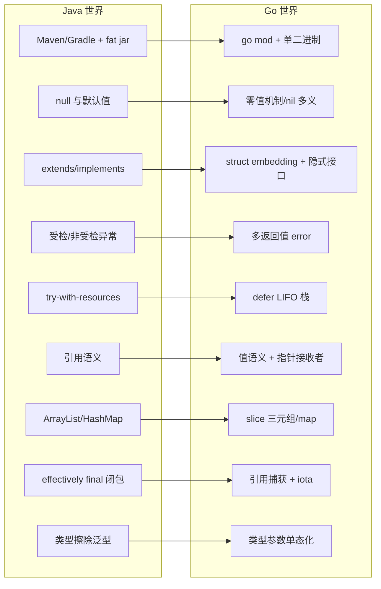

# 第 3 章 Go 基础语法：与 Java 的核心差异映射

> 所属篇章：第二篇 Java 眼中的 Go 世界

**本章技术占比**：技术 50% + 引导 20% + 案例 30%

**前置 Java 知识映射**：Maven/Gradle 依赖管理与打包、类与接口的继承体系、受检/非受检异常、`try-with-resources` 与 `finally`、Java 引用语义与 `NullPointerException`、`ArrayList`/`HashMap`/`ConcurrentHashMap`、Java 泛型与类型擦除、Java 21 的 `record` 与 `switch` 模式匹配

## 本章导读

作为资深 Java 工程师，你已经能熟练写 `if`、`for`、`switch`，也见过太多语言的循环语法糖。本章不会浪费篇幅教你 Go 的分号能不能省、`for` 有几种写法——这些共通的东西你扫一眼官方 Tour 就会了。本章只聚焦一件事：**Go 有、而 Java 没有或语义完全不同的特性**，以及这些差异会怎样改变你写代码时的心智模型。

具体来说，我们要回答的问题是：一门没有 `null`（严格说是没有 Java 那种到处 NPE 的 `null`）、没有 `extends`、没有异常、把错误当普通返回值、用 `defer` 代替 `finally`、默认值传递而非引用传递的语言，究竟逼着你换掉哪些下意识的习惯。这九个小节里，`零值机制`、`多返回值 + error`、`defer`、`slice 三元组`、`闭包引用捕获`、`接口隐式实现`、`单态化泛型`是重点中的重点——它们是 Java 里找不到直接对应物、最容易踩坑、也最能体现 Go 设计取向的地方。

学习节奏上，建议你带着本书的全栈场景来读：Go 网关（`:8080`）负责流量入口与聚合，Java 价格服务（`:8081`）承载核心交易规则，Python 分析服务（`:8082`）处理历史数据，三者用统一响应壳和 `traceId` 契约串联。每学一个特性，都想一想它落在这条链路的哪个环节最合适。

## 技术地图



## 知识点拆解

| 小节 | 技术内容 | Java 视角切入 | 落地案例 |
| --- | --- | --- | --- |
| 3.1 | go.mod/go.sum、GOPROXY、单二进制部署、cmd/internal/pkg 布局 | 对标 Maven/Gradle 的坐标依赖、fat jar + JVM 运行模型 | 网关服务镜像从 200MB+ JRE 基础镜像缩到十几 MB scratch 镜像 |
| 3.2 | `:=` 类型推导、结构体、零值机制、`nil` 的多重含义 | 对标 Java 的 `null`、字段默认值、`Optional` | 解析价格请求 DTO 时零值与"未传字段"的区分 |
| 3.3 | struct embedding、接口隐式满足、小接口哲学（`io.Reader`） | 对标 `extends`/`implements` 与显式接口声明 | 网关的日志中间件用嵌入复用、用小接口解耦下游客户端 |
| 3.4 | 多返回值、`value, err :=`、`errors.Is/As`、`%w` 包装、panic/recover | 对标受检/非受检异常与 `try-catch` | 跨语言调用失败时的错误分类与 traceId 透传 |
| 3.5 | defer 栈（LIFO）、参数求值时机、循环内 defer 陷阱、defer+recover | 对标 `try-with-resources`/`finally` | 网关中关闭响应体、释放连接、统一兜底 panic |
| 3.6 | 值传递默认拷贝、指针接收者 vs 值接收者、逃逸分析 | 对标 Java 全对象引用语义 | 价格聚合结构体在管道中传递时的拷贝成本控制 |
| 3.7 | slice 三元组、append 扩容、共享底层数组、map 无序/非并发安全/nil map | 对标 `ArrayList`/`HashMap`/`ConcurrentHashMap` | 批量 SKU 聚合结果的切片复用与并发写 map 崩溃 |
| 3.8 | 闭包引用捕获、循环变量陷阱（Go 1.22 语义变更）、iota 枚举 | 对标 effectively final 闭包与 `enum` | 并发拉取多个下游时的循环变量捕获、订单状态枚举 |
| 3.9 | 类型参数 `[T any]`、约束 constraints、单态化 vs 类型擦除 | 对标 Java 泛型与类型擦除、通配符 | 通用响应壳 `ApiResponse[T]` 与聚合工具函数 |

## 3.1 工程化差异：go mod 与单二进制 vs Maven/Gradle

### Java 中我们通常怎么做

Java 工程的依赖与构建心智是"坐标 + 仓库 + 打包器"。我们在 `pom.xml` 或 `build.gradle` 里声明 `groupId:artifactId:version`，由 Maven Central 或私有 Nexus 解析传递依赖，最终打成一个 fat jar（Spring Boot 的 `spring-boot-maven-plugin` 会把所有依赖塞进一个可执行 jar）。运行时再由 JVM 加载字节码。

```java
// pom.xml 片段：声明坐标，构建器负责解析传递依赖
// <dependency>
//   <groupId>org.springframework.boot</groupId>
//   <artifactId>spring-boot-starter-web</artifactId>
//   <version>3.3.0</version>
// </dependency>
```

这套体系的优点是生态极其成熟：版本仲裁、依赖树分析（`mvn dependency:tree`）、多模块聚合、profile 环境隔离都有标准答案。代价是部署产物需要一个 JRE/JDK 运行时，基础镜像动辄一两百 MB，冷启动还要经历 JVM 预热。

### Go 的对应设计

Go 用 `go.mod` 声明模块路径与依赖，用 `go.sum` 锁定每个依赖内容的哈希（对标 `mvn` 的 checksum，但默认强制校验）。依赖不走中央仓库的坐标体系，而是直接以**源码仓库路径**为标识，通过 `GOPROXY` 代理拉取。

```go
// go.mod
module github.com/acme/gateway

go 1.22

require (
    github.com/gin-gonic/gin v1.10.0
    golang.org/x/sync v0.7.0
)
```

关键差异有两点。第一，`go build` 默认产出**静态链接的单个可执行二进制**，不依赖外部运行时——把它 `COPY` 进一个空的 `scratch` 镜像就能跑，最终镜像可以做到十几 MB。第二，依赖版本用**最小版本选择（MVS）**：不像 Maven"就近优先/最新优先"的仲裁，Go 会选满足所有约束的**最低**兼容版本，构建结果因此高度可复现。

项目布局上，Go 有社区约定俗成的目录语义：`cmd/` 放各可执行入口的 `main` 包，`internal/` 放不允许被外部模块导入的私有代码（编译器强制），`pkg/` 放可复用的公开库。`internal` 的强制可见性是语言级特性，比 Java 靠 `package-private` 加人肉约束要硬。

```
gateway/
  cmd/gateway/main.go   // 可执行入口
  internal/router/      // 仅本模块可导入
  internal/client/      // 调用 :8081 / :8082 的客户端
  pkg/apiresp/          // 对外可复用的响应壳
  go.mod
  go.sum
```

### 全栈选型逻辑

在本书链路里，Go 网关（`:8080`）恰恰最吃"单二进制 + 小镜像 + 快冷启动"这套红利：网关要频繁滚动发布、要在 K8s 里快速扩缩容，十几 MB 的镜像和亚秒级启动直接影响弹性效率。而 Java 价格服务（`:8081`）承载复杂交易规则，更看重 Spring 生态与团队协作沉淀，fat jar + JVM 的成熟度反而是优势。选型的分界线不是"谁更先进"，而是这个环节更需要弹性还是更需要生态深度。

### Java 开发者容易踩的坑

1. **把 `GOPATH` 时代的经验当现状**。Go 1.16 起默认走 module 模式，不再需要把代码放进 `$GOPATH/src`。网上老教程让你 `go get` 到 GOPATH 的说法已经过时，现在项目在任意目录 `go mod init` 即可。
2. **忽略 `GOPROXY` 与私有仓库配置**。国内直连 `proxy.golang.org` 常超时，需要设 `GOPROXY=https://goproxy.cn,direct`；私有仓库还要配 `GOPRIVATE` 跳过校验，否则 `go mod download` 卡住或报 `410 Gone`。
3. **误以为 `internal` 只是命名约定**。把下游客户端放进 `internal/client`，另一个模块想 `import` 会直接编译报错 `use of internal package not allowed`。这不是警告，是硬性拒绝，迁移公共代码前要先想清楚可见性边界。
4. **按 Maven 多模块的粒度切 Go module**。Go 更提倡"一个仓库一个 module、用目录（package）而非多 module 做内部分层"，过度拆 module 会让本地联调频繁 `replace`，得不偿失。

## 3.2 类型系统与零值：没有 null 的世界

### Java 中我们通常怎么做

Java 里未初始化的对象引用是 `null`，基本类型有各自默认值（`int` 为 0、`boolean` 为 `false`）。这套设计的代价就是无处不在的 `NullPointerException`。为对抗它，现代 Java 会用 `Optional`、`@Nullable` 注解、或 Java 21 的 `record` + 模式匹配来显式表达"可能没有值"。

```java
// Java 21：用 record 承载 DTO，字段引用默认可能为 null
public record PriceRequest(String sku, Integer memberLevel) {
    public int levelOrDefault() {
        // 必须显式防御 null，否则拆箱 NPE
        return memberLevel == null ? 0 : memberLevel;
    }
}
```

优点是 `null` 语义清晰地表达了"缺失"；缺点是对象图里任何一处忘了判空，运行时就崩。

### Go 的对应设计

Go 最颠覆 Java 直觉的一点：**每种类型都有明确定义的零值，声明即可用，不存在"未初始化引用"这种东西**。数值型零值是 `0`，`string` 是 `""`，`bool` 是 `false`，指针/切片/map/channel/接口/函数是 `nil`。结构体的零值是其所有字段各自的零值。

```go
type PriceRequest struct {
    SKU         string // 零值 ""
    MemberLevel int    // 零值 0
    Tags        []string // 零值 nil，但可直接 range，长度为 0
}

func main() {
    var req PriceRequest        // 无需 new，所有字段已是零值
    fmt.Println(req.MemberLevel) // 0，不会 NPE
    for _, t := range req.Tags { // nil slice 可安全 range
        _ = t
    }
}
```

设计动机是让"零值可用"（zero value is useful）成为类型设计原则：`sync.Mutex` 的零值就是一把可用的未锁互斥量，`bytes.Buffer` 的零值就是一个空缓冲。这样能消除大量样板构造代码。

但要注意 `nil` 在 Go 里是**多义**的，不像 Java 的 `null` 只有一种含义：

```go
var s []int          // nil slice：len==0，append 可用
var m map[string]int // nil map：读安全返回零值，写会 panic
var p *int           // nil 指针：解引用 panic
var e error          // nil 接口：表示"无错误"
```

尤其是 `nil map` 写入会直接 `panic: assignment to entry in nil map`，这是 Java 里没有对应物的坑。

### 全栈选型逻辑

零值机制让 Go 网关的配置结构体、聚合中间结果可以"声明即用"，减少了防御性判空，路径更短、分支更少——这对高并发入口的可读性和性能都是加分。但跨语言边界上要小心：Go 的零值 `0`/`""` 和 Java 传来的 `null`/"字段缺失"语义不同。价格请求里 `MemberLevel == 0` 到底是"会员等级 0"还是"没传"，必须在契约层（JSON 用指针 `*int` 或额外 `has` 标志）显式约定，否则跨 `:8080`→`:8081` 会出现语义漂移。

### Java 开发者容易踩的坑

1. **用零值区分"未设置"和"真实的 0"**。Go 结构体反序列化 JSON 时，缺失字段和显式传 `0` 都会得到 `0`。要区分，得把字段声明成指针 `*int`：`nil` 表示未传，`&0` 表示显式 0。这是 Java 用 `Integer`（可为 null）表达的能力。
2. **对 nil map 直接赋值**。`var counts map[string]int; counts["a"]++` 会 panic。必须先 `counts = make(map[string]int)`。读 nil map 是安全的（返回零值），只有写会崩，这个不对称最容易漏。
3. **误以为 `:=` 到处能用**。`:=` 只能在函数内部声明新变量，包级变量必须用 `var`。且 `:=` 左侧至少要有一个新变量，否则报 `no new variables on left side of :=`。
4. **把 `nil` 接口和"装了 nil 指针的接口"当成一回事**。`var p *T = nil; var i interface{} = p; i == nil` 结果是 `false`——接口非 nil 是因为它带着类型信息。这个坑在错误返回里尤其致命，下一节会展开。

## 3.3 组合 vs 继承、接口隐式实现

### Java 中我们通常怎么做

Java 的复用主干是继承树：`class UserServiceImpl extends BaseService implements UserService`。子类通过 `extends` 拿到父类字段和方法，接口通过 `implements` 显式声明契约。编译器据此建立类型层级，`instanceof` 和向上转型都依赖这棵树。

```java
public interface Reader {
    int read(byte[] buf) throws IOException;
}
// 必须显式 implements，编译器才认这个类型关系
public class FileReader implements Reader {
    public int read(byte[] buf) { /* ... */ return 0; }
}
```

优点是类型关系明确、IDE 能顺着继承链导航；缺点是继承耦合强，深继承树容易变脆，接口一旦定义，所有实现类都得跟着改。

### Go 的对应设计

Go **没有继承，也没有 `extends`**。复用靠**结构体嵌入（embedding）**：把一个类型匿名嵌进另一个结构体，外层就"提升"了内层的字段和方法，但这是**组合**不是父子——没有 `super`，没有多态覆盖的类型链。

```go
type Logger struct{ prefix string }
func (l Logger) Log(msg string) { fmt.Println(l.prefix, msg) }

type Handler struct {
    Logger // 匿名嵌入，Handler 直接拥有 Log 方法
    route  string
}

func main() {
    h := Handler{Logger: Logger{prefix: "[gw]"}, route: "/price"}
    h.Log("hit") // 方法被提升，等价 h.Logger.Log("hit")
}
```

更颠覆的是**接口隐式满足**：一个类型只要实现了接口要求的全部方法，就自动满足该接口，**无需任何 `implements` 声明**。类型和接口可以分别定义在互不相识的两个包里。

```go
// 标准库定义：小接口
type Reader interface {
    Read(p []byte) (n int, err error)
}

// 我的类型，从没 import 过上面的包，只要方法签名对上就满足 Reader
type PriceStream struct{}
func (PriceStream) Read(p []byte) (int, error) { return 0, io.EOF }
```

这就是 Go 的"小接口哲学"：`io.Reader`、`io.Writer` 都只有一个方法，接口在**使用方**按需定义，而非在实现方预先规划。它把"依赖倒置"变成了默认姿势——下游只声明自己需要的最小行为集。

### 全栈选型逻辑

网关最需要这种解耦：路由层只想要一个"能把请求发出去并拿回字节流"的东西，就地定义一个单方法接口即可，真实实现是 HTTP 客户端还是本地 mock 都无所谓，测试时不用任何框架就能替换。嵌入则适合把 traceId 注入、访问日志、指标上报这类横切能力做成可复用的小结构体，嵌进各个 handler。相比 Java 靠 AOP/继承基类实现横切，Go 的组合更显式、更易追踪。

### Java 开发者容易踩的坑

1. **到处找 `extends` 的替代品**。想把 `BaseService` 的公共逻辑"继承"下来，正确姿势是嵌入或显式持有依赖字段，而不是构造伪继承。嵌入不给你多态覆盖：外层定义同名方法只是"遮蔽"，内层方法不会通过外层类型被虚调用。
2. **把接口定义得太大**。Java 习惯先设计一个胖 `Service` 接口。Go 里接口越小越好用，一个方法的接口能被最多类型满足。先写具体类型，等真正需要抽象时再在使用点提炼最小接口。
3. **嵌入指针还是值分不清**。嵌入 `Logger`（值）与 `*Logger`（指针）语义不同：嵌值会拷贝，若内层方法是指针接收者且你嵌的是值，某些方法不会被提升到值类型的方法集。
4. **误以为满足接口需要 import**。新手会问"我要 implements 哪个包的接口"。答案是不需要——方法签名匹配即满足。反过来，这也意味着你可能**意外**满足了某个接口，或者改了方法名后**悄无声息**地不再满足，编译器只在赋值给接口变量那一刻才报错。

## 3.4 错误处理与多返回值

### Java 中我们通常怎么做

Java 用异常分离正常流与错误流：受检异常（`IOException`）强制调用方处理或声明，非受检异常（`RuntimeException`）可以一路冒泡。`try-catch` 捕获，异常链用 `initCause`/构造器包装保留根因。

```java
try {
    var resp = client.callPriceService(sku);
    return resp;
} catch (TimeoutException e) {
    // 分类处理，包装后向上抛，保留 cause 链
    throw new GatewayException("price timeout, sku=" + sku, e);
}
```

优点是正常代码干净，错误自动冒泡；缺点是受检异常常被 `catch (Exception e) {}` 吞掉，异常还有栈展开成本，且"哪些方法会抛什么"往往不透明。

### Go 的对应设计

Go **没有异常式的控制流**（`panic` 是给不可恢复错误用的，不是常规手段）。错误是**普通的返回值**：函数把 `error` 作为最后一个返回值，调用方用 `if err != nil` 显式检查。这正是 Go 的**多返回值**特性最核心的用途。

```go
func fetchPrice(sku string) (Price, error) {
    resp, err := client.Call(sku)
    if err != nil {
        // %w 包装：保留错误链，可被 errors.Is/As 解开
        return Price{}, fmt.Errorf("fetch price sku=%s: %w", sku, err)
    }
    return resp, nil
}
```

错误的分类不靠 `catch` 的类型匹配，而靠 `errors.Is`（判断是否是某个哨兵错误）和 `errors.As`（把错误链里某种类型提取出来）：

```go
var ErrNotFound = errors.New("price not found")

price, err := fetchPrice(sku)
if errors.Is(err, ErrNotFound) {        // 沿 %w 链匹配哨兵值
    return respond(404, "no such sku")
}
var netErr *net.OpError
if errors.As(err, &netErr) {            // 提取链中的具体错误类型
    log.Printf("network layer failed: %v", netErr)
}
```

`panic`/`recover` 是最后防线：`panic` 触发栈展开，`recover` 只能在 `defer` 中拦截。它对标的不是 Java 的常规异常，而是"程序进入了不该到达的状态"。惯例是**库不 panic 给外部**，而在进程边界（如 HTTP 中间件）用 `recover` 兜底防止单个请求打崩整个服务。

### 全栈选型逻辑

在 `:8080`→`:8081`/`:8082` 的跨语言调用里，Go 的显式错误返回逼你在每个调用点就地决定：重试、降级、还是把带 `traceId` 的错误包装后返回。`%w` 链让根因（比如底层是 `context deadline exceeded`）能一路传到网关顶层，配合 `errors.Is(err, context.DeadlineExceeded)` 精准识别超时并映射成统一错误码。这种"错误必须被看见"的风格，比 Java 里可能被静默吞掉的异常更适合需要清晰失败语义的入口层。

### Java 开发者容易踩的坑

1. **用 `panic`/`recover` 模拟 `try-catch`**。这是最典型的迁移错误。业务失败（参数非法、下游 404）应该返回 `error`，而不是 `panic`。滥用 panic 会让控制流不可预测，也绕过了调用方的显式处理。
2. **忽略 err 直接用返回值**。`resp, _ := fetchPrice(sku)` 丢掉 error 后 `resp` 可能是零值，后续解引用其字段就崩。Go 没有编译器强制你处理 error（不像受检异常），全靠自律和 linter（`errcheck`）。
3. **返回"非 nil 却包着 nil"的错误接口**。
   ```go
   func do() error {
       var e *MyError = nil
       return e // 陷阱：返回的 error 接口非 nil！
   }
   // 调用方 if err != nil 恒为 true，即使逻辑上没出错
   ```
   原因是接口值带类型信息（见 3.2）。正确做法是成功路径显式 `return nil`。
4. **用 `==` 比较包装后的错误**。`err == ErrNotFound` 在错误被 `%w` 包装后会失败，必须用 `errors.Is(err, ErrNotFound)` 沿链匹配。

## 3.5 defer：资源管理的另一种答案

### Java 中我们通常怎么做

Java 用 `try-with-resources` 管理需要关闭的资源，实现了 `AutoCloseable` 的对象在 try 块结束时自动 `close()`，多个资源按声明逆序关闭。更早的写法是 `finally` 块手动释放。

```java
try (var conn = pool.get();
     var stmt = conn.prepareStatement(sql)) {
    return stmt.executeQuery();
} // conn、stmt 自动逆序关闭，即使抛异常
```

优点是资源释放和获取写在一起、异常安全；限制是只能用于实现了 `AutoCloseable` 的类型，且作用域绑定在 try 块。

### Go 的对应设计

Go 用 `defer` 关键字：把一个函数调用推迟到**当前函数返回前**执行。多个 `defer` 按**后进先出（LIFO）**顺序执行，形成一个栈。它不要求资源实现任何接口，任何函数调用都能 defer。

```go
func handle(w http.ResponseWriter, r *http.Request) {
    resp, err := client.Do(r) // 调用下游 :8081
    if err != nil {
        return
    }
    defer resp.Body.Close() // 无论后面从哪个分支返回，都会关闭
    // ... 读取 resp.Body
}
```

有一个 Java 开发者极易忽略的语义：**defer 的参数在 defer 语句执行那一刻就求值，但函数调用被推迟**。

```go
func trace() {
    i := 0
    defer fmt.Println("deferred i =", i) // 此刻就把 i=0 拷进去了
    i = 99
    fmt.Println("current i =", i) // 99
} // 输出：current i = 99  然后  deferred i = 0
```

要延迟到执行时才取值，得用闭包：`defer func() { fmt.Println(i) }()`。

`defer` 也是 `recover` 的唯一栖身之所，常用于进程边界兜底：

```go
func safeHandle(next http.Handler) http.Handler {
    return http.HandlerFunc(func(w http.ResponseWriter, r *http.Request) {
        defer func() {
            if v := recover(); v != nil {
                log.Printf("panic recovered traceId=%s: %v", traceID(r), v)
                http.Error(w, "internal error", 500)
            }
        }()
        next.ServeHTTP(w, r)
    })
}
```

### 全栈选型逻辑

网关每个请求都要关闭下游响应体、归还连接、结束 span、记录耗时。用 `defer` 把这些收尾动作声明在资源获取处，代码路径无论从哪个 `if err != nil` 提前返回都不会泄漏——这对高并发入口尤其关键，一个漏关的 `resp.Body` 就会耗尽连接池。加上 `recover` 兜底，单个请求的 panic 不会打垮整个 `:8080` 进程。

### Java 开发者容易踩的坑

1. **在循环里 defer**。
   ```go
   for _, sku := range skus {
       resp, _ := client.Get(sku)
       defer resp.Body.Close() // 陷阱：直到函数返回才全部关闭
   }
   ```
   所有 `Close` 堆到函数结束才执行，循环期间连接持续累积。正确做法是把循环体抽成独立函数，或在循环内显式 `resp.Body.Close()`。这不同于 `try-with-resources` 每次迭代即关闭。
2. **以为 defer 的参数会延迟取值**。如上例，`defer f(x)` 里的 `x` 在 defer 那行就定格了，不是执行时的值。
3. **在 defer 里改命名返回值出乎意料**。`defer func() { result++ }()` 能修改命名返回值（因为 defer 在 return 赋值之后、真正返回之前运行），这可以用来做统一错误包装，但也可能悄悄改掉你以为已经定死的返回值。
4. **误以为 defer 在 panic 时不执行**。恰恰相反，panic 触发栈展开时**会**执行已注册的 defer，这正是 recover 能工作的前提。但如果进程被 `os.Exit()` 直接终止，defer **不会**执行。

## 3.6 指针与值语义

### Java 中我们通常怎么做

Java 的对象一律是引用语义：变量持有的是对象的引用，方法传参传的是引用的拷贝，因此方法内改对象字段会影响调用方。基本类型是值传递。开发者基本不用操心"拷贝还是引用"，一切对象都是引用。

```java
void bump(Counter c) { c.value++; } // 改动对调用方可见
Counter c = new Counter();
bump(c); // c.value 变了
```

好处是心智简单；代价是难以获得真正的值拷贝语义（要手动 `clone` 或 copy 构造），也无法控制对象是否逃逸到堆。

### Go 的对应设计

Go **默认值传递**：传结构体给函数会**整体拷贝**。要让函数改动调用方的数据，或避免大结构体拷贝，就传**指针**。Go 有指针（`*T`、`&x`）但**没有指针运算**，比 C 安全得多。

```go
type Counter struct{ value int }

func bumpVal(c Counter)  { c.value++ }   // 改的是副本，无效
func bumpPtr(c *Counter) { c.value++ }   // 通过指针改原值

func main() {
    c := Counter{}
    bumpVal(c)          // c.value 仍是 0
    bumpPtr(&c)         // c.value 变成 1
}
```

方法可以定义在**值接收者**或**指针接收者**上，这是设计接口时的核心决策：

```go
func (c Counter) Read() int   { return c.value } // 值接收者：只读，操作副本
func (c *Counter) Inc()       { c.value++ }      // 指针接收者：需要修改
```

经验法则：需要修改接收者、或结构体较大、或类型含 `sync.Mutex` 等不可拷贝字段时，用指针接收者；且**同一类型的方法集要保持一致**，不要值指针混用。

Go 编译器通过**逃逸分析**决定变量分配在栈还是堆——你 `return &localVar` 是安全的，编译器发现它逃逸后会自动分配到堆，不像 C 会悬垂。概念上理解即可：`go build -gcflags='-m'` 能看到逃逸决策，性能敏感路径可据此减少堆分配。

### 全栈选型逻辑

网关聚合多个下游结果时，聚合结构体可能不小。如果在中间件、管道各环节都按值传，会产生大量拷贝，增加 GC 压力；改用指针传递可避免拷贝，但要注意并发场景下多个 goroutine 通过指针共享同一结构体时的数据竞争。值语义则天然适合"不可变的配置快照"这类要防误改的场景——传值即隔离。两者的取舍要落到具体的性能与并发安全权衡上。

### Java 开发者容易踩的坑

1. **默认所有东西都是引用**。Go 里 `a := b`（结构体）是**拷贝**，改 `a` 不影响 `b`。Java 老手常忘了这点，以为改了 slice 元素外面也变——slice 恰好是引用类型（下一节），但普通结构体不是，这种不一致最坑。
2. **值指针接收者混用导致方法集不全**。若 `Inc()` 是指针接收者，那么 `Counter` 值类型的方法集**不包含** `Inc`（`*Counter` 才包含）。当你把值赋给要求有 `Inc` 的接口时会编译失败，而指针可以。
3. **对 map 里的结构体字段直接赋值**。`m["k"].value = 1` 无法编译（`map` 的值不可寻址）。得取出、改、放回，或者把 value 类型设为指针 `map[string]*Counter`。
4. **过度指针化**。不是所有东西都该传指针。小结构体传值往往更快（无需堆分配、对缓存友好），且天然并发安全。盲目 `*` 反而制造别名和竞争。

## 3.7 slice 与 map 的底层机制

### Java 中我们通常怎么做

Java 用 `ArrayList` 做动态数组、`HashMap` 做键值表，`ConcurrentHashMap` 做并发安全表。`ArrayList` 内部维护数组并自动扩容，`subList` 返回的是**视图**（共享底层数组，改动互相影响），这点已经和 Go slice 有些神似。

```java
List<Integer> a = new ArrayList<>(List.of(1, 2, 3, 4));
List<Integer> b = a.subList(0, 2); // 视图，共享底层
b.set(0, 99); // a.get(0) 也变成 99
```

### Go 的对应设计

Go 的 `slice` 不是数组，而是一个**三元组描述符**：指向底层数组的指针 `ptr`、长度 `len`、容量 `cap`。多个 slice 可以指向同一底层数组的不同窗口。

```go
arr := [5]int{1, 2, 3, 4, 5}
s := arr[1:3]         // ptr→arr[1], len=2, cap=4（到底层数组末尾）
fmt.Println(len(s), cap(s)) // 2 4
```

`append` 是理解 slice 的关键：当 `len < cap` 时，追加**原地写入底层数组**，会影响共享该数组的其他 slice；当 `len == cap` 时，触发**扩容**——分配一块新的更大底层数组、拷贝过去，此后与原数组**脱钩**。

```go
a := make([]int, 2, 4)     // len=2, cap=4
b := append(a, 9)          // 未超 cap，b 与 a 共享底层
b[0] = 100                 // a[0] 也变成 100（共享）

c := make([]int, 2, 2)     // len=2, cap=2
d := append(c, 9)          // 超 cap，触发扩容，d 是新数组
d[0] = 100                 // c[0] 不变（已脱钩）
```

这个"有时共享、有时脱钩"的行为是 Go 最著名的坑之一。扩容策略也不是固定翻倍：小切片（历史上 <1024 元素）约翻倍，更大时增长因子降到约 1.25，具体阈值随版本调整，不应硬编码假设。

`map` 的三个硬约束 Java 开发者必须记牢：

```go
m := map[string]int{"a": 1, "b": 2}
for k, v := range m { // 遍历顺序是随机的，每次可能不同（刻意设计）
    _ = k; _ = v
}
```

1. **遍历无序**，且 Go 故意每次随机化顺序，防止你依赖顺序。要有序得自己排 key。
2. **非并发安全**：多个 goroutine 同时读写 map 会触发运行时检测并 `fatal error: concurrent map read and map write`，直接崩溃，无法 recover。并发场景要用 `sync.Mutex` 或 `sync.Map`——这才是 `ConcurrentHashMap` 的对应物。
3. **nil map 可读不可写**（见 3.2）。

### 全栈选型逻辑

网关批量聚合多个 SKU 的价格结果时，常用一个预分配 slice 收集：`make([]Result, 0, len(skus))` 提前给足 cap，避免 append 反复扩容拷贝，这是热点路径的常见优化。而聚合过程中若多个 goroutine 并发往同一个 `map[string]Result` 写结果，必然崩溃——要么每个 goroutine 写自己的局部 slice 最后合并，要么用带锁的容器。这正是 Go 并发（下一章详述）与数据结构底层机制交汇处最容易出事的地方。

### Java 开发者容易踩的坑

1. **append 的返回值不接回去**。`append(s, x)` **必须**写成 `s = append(s, x)`。因为扩容后返回的是新 slice 头，丢弃返回值会让你看到旧的、没更新的 slice。这是 Java `list.add()` 没有的心智负担。
2. **子 slice 意外改到原数组**。`sub := full[2:4]; sub[0] = 0` 会改动 `full[2]`。要彻底隔离必须 `copy` 到新 slice，或用三索引 `full[2:4:4]` 限制 cap 强制后续 append 脱钩。
3. **并发写 map 直接 fatal**。这不是普通 panic，`recover` 也拦不住，整个进程挂掉。Java 里并发改 `HashMap` 顶多死循环或数据错乱，Go 直接让你崩——所以务必上锁或 `sync.Map`。
4. **依赖 map 遍历顺序**。写测试时假设 `range` 顺序稳定，换台机器或换次运行就挂。Go 的随机化就是为了逼你不要依赖顺序。

## 3.8 闭包与 iota

### Java 中我们通常怎么做

Java 的 lambda 和匿名内部类捕获的局部变量必须是 `final` 或 **effectively final**（事实不可变），编译器不允许你在 lambda 里改捕获的局部变量。这从语言层面回避了"循环变量被共享"的经典陷阱。

```java
List<Runnable> tasks = new ArrayList<>();
for (int i = 0; i < 3; i++) {
    int captured = i; // 必须引入 effectively final 副本
    tasks.add(() -> System.out.println(captured)); // 打印 0,1,2
}
```

枚举用 `enum`，是带方法、可携带字段的完整类型。

```java
public enum OrderState { CREATED, PAID, SHIPPED }
```

### Go 的对应设计

Go 的闭包是**引用捕获**：闭包捕获的是变量本身（的地址），而非它当时的值。多个闭包捕获同一变量时共享它。这与 Java 的"值快照 + effectively final"根本不同。

```go
funcs := []func(){}
x := 0
for i := 0; i < 3; i++ {
    funcs = append(funcs, func() { fmt.Println(x) }) // 都捕获同一个 x
}
x = 42
funcs[0]() // 打印 42，不是 0
```

由此引出历史上最著名的 Go 陷阱——**循环变量捕获**。在 **Go 1.21 及之前**，`for` 的循环变量 `i`/`v` 在整个循环中是**同一个变量**，被反复赋值：

```go
// Go 1.21 及之前的行为（务必理解这段历史）
for _, v := range []int{1, 2, 3} {
    go func() { fmt.Println(v) }() // 极可能全打印 3
}
```

三个 goroutine 捕获的是同一个 `v`，等它们真正运行时循环早已结束、`v` 停在最后一个值。当年的解法是循环内 `v := v` 影子声明。

**Go 1.22 起，语言语义变更**：`for` 每次迭代都创建**新的**循环变量，上面的代码现在能正确打印 1、2、3。但你仍必须懂这段历史——维护旧代码、读老资料、或 `go.mod` 里 `go` 指令低于 1.22 时，旧语义依然生效。

`iota` 是 Go 的枚举惯用法：在 `const` 块里从 0 开始自增的行计数器，配合类型定义模拟枚举。

```go
type OrderState int

const (
    Created OrderState = iota // 0
    Paid                      // 1，自动延续表达式
    Shipped                   // 2
)

// 位标志模式
type Perm uint
const (
    Read  Perm = 1 << iota // 1
    Write                  // 2
    Exec                   // 4
)
```

注意：iota 只是常量生成器，它比 Java `enum` 弱——没有内建的值集合遍历、没有 `name()`，要打印名字得自己写 `String()` 方法（常用 `stringer` 工具生成）。

### 全栈选型逻辑

网关经常并发拉取多个下游（多个 SKU、多个分析维度），用 `for range` + `go func()` 是常见写法。在 Go 1.22 前，这里的循环变量捕获会让所有 goroutine 拿到同一个 SKU，导致聚合结果全错却难以复现（因为是竞态）。理解 1.22 的语义变更能帮你判断：项目 `go.mod` 声明的版本决定了要不要手动 `v := v`。iota 则适合给订单状态、错误码、权限位这类跨 `:8080`/`:8081` 契约的枚举做统一定义。

### Java 开发者容易踩的坑

1. **假设循环变量捕获总是安全**。别默认代码跑在 1.22 语义下。检查 `go.mod` 的 `go 1.xx`：低于 1.22 时，`for` + goroutine/闭包必须写 `v := v`，否则竞态。
2. **iota 不是 Java enum**。它给不了你 `values()`、`valueOf()`、`name()`。想要字符串名字要自己实现 `String() string`，否则打印出来是数字。
3. **iota 跨行计数的意外跳变**。`const` 块里每一行 iota 都 +1，即使某行没用它。插入一个空行或注释行不影响，但插入一个**常量声明行**会让后续所有值偏移，改动枚举时极易错位。
4. **闭包捕获循环外的共享变量**。即便在 1.22，若你捕获的是循环**外部**声明的变量（如上面的 `x`），依然是共享引用，值会随外部修改而变——1.22 只修了循环变量本身。

## 3.9 Go 泛型：与 Java 泛型的不同取舍

### Java 中我们通常怎么做

Java 5 引入泛型，用**类型擦除**实现：泛型信息只存在于编译期，运行时 `List<String>` 和 `List<Integer>` 都是 `List`。好处是与旧代码二进制兼容、不膨胀代码；代价是运行时拿不到类型参数（不能 `new T[]`、不能 `instanceof List<String>`），还有通配符 `? extends`/`? super` 的心智负担。

```java
public static <T extends Comparable<T>> T max(List<T> items) {
    T best = items.get(0);
    for (T t : items) if (t.compareTo(best) > 0) best = t;
    return best;
}
```

### Go 的对应设计

Go 1.18 才加入泛型，用**类型参数**语法 `[T constraint]`，约束用接口表达（可以是方法集，也可以是**类型集** `~int | ~float64`）。

```go
import "cmp"

// 约束用 constraints 或标准库 cmp.Ordered，表达"可比较大小"
func Max[T cmp.Ordered](items []T) T {
    best := items[0]
    for _, v := range items {
        if v > best { best = v }
    }
    return best
}

// 自定义类型集约束
type Number interface { ~int | ~int64 | ~float64 }
func Sum[T Number](xs []T) T {
    var total T // 零值起步
    for _, x := range xs { total += x }
    return total
}
```

实现机制上，Go 走的是介于 C++ 模板和 Java 擦除之间的路线：编译器采用**基于 GC shape 的部分单态化（stenciling + dictionaries）**——对内存布局相同的类型参数共享一份实例化代码、传字典区分，而非像 Java 那样完全擦除，也不像 C++ 那样为每个类型都生成一份。结果是：运行期**保留**类型信息（配合反射可用），但也可能带来代码体积和一定间接调用开销。

Go 泛型的克制体现在：官方明确建议**能用接口就别用泛型**。如果函数体只调用类型的方法（而非依赖具体类型的运算），普通接口更简单；泛型的价值在于容器、算法这类需要在**多个位置保持类型一致**、或需要对底层类型做运算（`+`、`<`）的场景。

### 全栈选型逻辑

网关的统一响应壳 `ApiResponse[T]` 是泛型的典型正解：`T` 是价格结果还是分析结果都用同一个壳，编译期保证 `Data` 字段类型安全，不用 `interface{}` 再强转。批量聚合的 `Map`/`Filter`/`Reduce` 工具函数也适合泛型。但下游客户端接口——"能发请求拿字节流"——就该用小接口（3.3）而非泛型，因为那里要的是**行为多态**不是类型参数化。用错工具会让网关代码无谓复杂。

### Java 开发者容易踩的坑

1. **把 Go 泛型当擦除来用**。Go 运行期保留类型信息，行为和 Java 不同；但反过来，别指望像 C++ 那样零成本——单态化 + 字典可能有间接调用，热点路径要实测。
2. **过度泛型化**。Java 老手容易一上来就 `[T any]`。若函数只需调方法，接口更清晰；`any`（即 `interface{}`）无约束时你几乎什么都不能对 `T` 做，等于没抽象。
3. **约束里混淆方法集与类型集**。`cmp.Ordered` / `~int | ~string` 是**类型集**约束，能让你用 `<`、`+`；而 `interface{ Read([]byte) }` 是**方法集**约束，只能调方法。想比大小却用了方法集约束，`v > best` 无法编译。
4. **忘了 `~` 的含义**。约束写 `int` 只匹配 `int` 本身，写 `~int` 才匹配所有底层类型是 int 的自定义类型（如 `type OrderState int`）。少写波浪号会让你的 `OrderState` 无法传进泛型函数。

## 对比代码示例

围绕本章特性，我们用同一个"读取配置文件并解析"的场景对比 Java 与 Go，看差异如何具体落地——注意 Go 版里同时出现了多返回值、defer、零值和错误包装。

```java
// Java 21：try-with-resources + 异常 + record 承载配置
public record GatewayConfig(int port, String upstreamPrice, String upstreamAnalytics) {}

public GatewayConfig loadConfig(Path path) throws IOException {
    try (var in = Files.newInputStream(path)) {
        Properties p = new Properties();
        p.load(in); // 失败抛 IOException，沿调用链冒泡
        return new GatewayConfig(
            Integer.parseInt(p.getProperty("port", "8080")),
            p.getProperty("upstream.price"),
            p.getProperty("upstream.analytics"));
    } // in 自动关闭
}
```

```go
// Go 1.22：多返回值 error + defer 关闭 + %w 包装
type GatewayConfig struct {
    Port             int
    UpstreamPrice    string
    UpstreamAnalytics string
}

func loadConfig(path string) (GatewayConfig, error) {
    f, err := os.Open(path)
    if err != nil {
        return GatewayConfig{}, fmt.Errorf("open config %s: %w", path, err) // 零值 + 包装错误
    }
    defer f.Close() // 无论从哪返回都关闭

    var cfg GatewayConfig
    cfg.Port = 8080 // 显式默认，因为零值 0 不是合理端口
    // ... 解析 f 填充 cfg（省略）
    return cfg, nil // 成功路径显式 nil
}
```

```python
# Python：上下文管理器 + 异常，作为对照
from dataclasses import dataclass

@dataclass
class GatewayConfig:
    port: int = 8080
    upstream_price: str = ""
    upstream_analytics: str = ""

def load_config(path: str) -> GatewayConfig:
    with open(path) as f:      # with 类比 defer/try-with-resources
        # ... 解析填充
        return GatewayConfig()
```

同一件事，三种错误哲学：Java 让异常冒泡、`try-with-resources` 收尾；Go 让错误随返回值显式流动、`defer` 收尾、`%w` 保留根因；Python 用 `with` + 异常。跨语言协同时，真正要统一的是**失败如何被表达和传递**——Go 网关把这些错误最终都要映射成带 `traceId` 的统一响应壳，这正是下面综合案例要串起来的东西。

## 章节综合案例：用户数据解析工具（可运行的 Go 实现）

我们把本章的 `defer`、多返回值、slice、闭包、零值、错误包装串成一个可运行的小工具：从一批原始 JSON 行里解析用户价格请求，过滤非法项，聚合出统计结果。它就是网关 `:8080` 在真实链路里做的"入口清洗 + 聚合"的缩影。

```go
package main

import (
	"encoding/json"
	"errors"
	"fmt"
	"strings"
)

// 价格请求（会员等级用指针区分"未传"与"等级 0"，呼应 3.2 零值坑）
type PriceRequest struct {
	SKU         string `json:"sku"`
	MemberLevel *int   `json:"memberLevel"`
}

var ErrEmptySKU = errors.New("empty sku")

// 多返回值：解析结果 + 错误
func parseRequest(line string) (PriceRequest, error) {
	var req PriceRequest
	if err := json.Unmarshal([]byte(line), &req); err != nil {
		return PriceRequest{}, fmt.Errorf("bad json %q: %w", line, err) // %w 包装
	}
	if strings.TrimSpace(req.SKU) == "" {
		return PriceRequest{}, ErrEmptySKU
	}
	return req, nil
}

// 聚合：预分配 slice（呼应 3.7），闭包做分类统计（呼应 3.8）
func aggregate(lines []string) (valid []PriceRequest, skipped int) {
	valid = make([]PriceRequest, 0, len(lines)) // 提前给足 cap，避免反复扩容

	count := 0
	report := func(reason string) { // 闭包捕获 count，引用捕获
		count++
		fmt.Printf("  skip #%d: %s\n", count, reason)
	}
	defer func() { // defer 在函数返回前统一收尾
		fmt.Printf("解析完成：有效 %d 条，跳过 %d 条\n", len(valid), skipped)
	}()

	for _, line := range lines { // Go 1.22：每次迭代新变量，闭包捕获安全
		req, err := parseRequest(line)
		if err != nil {
			skipped++
			if errors.Is(err, ErrEmptySKU) { // 沿错误链精确分类
				report("sku 为空")
			} else {
				report("json 非法")
			}
			continue
		}
		valid = append(valid, req) // 必须接回返回值
	}
	return valid, skipped
}

func main() {
	lines := []string{
		`{"sku":"A-1001","memberLevel":2}`,
		`{"sku":"","memberLevel":0}`, // sku 空
		`{"sku":"A-1002"}`,           // memberLevel 未传 -> nil 指针
		`not-json`,                   // json 非法
	}
	valid, _ := aggregate(lines)
	for _, r := range valid {
		level := 0
		if r.MemberLevel != nil { // 区分未传与 0
			level = *r.MemberLevel
		}
		fmt.Printf("  ok sku=%s level=%d\n", r.SKU, level)
	}
}
```

**运行输出**（顺序确定，因为没依赖 map 遍历）：

```
  skip #1: sku 为空
  skip #2: json 非法
解析完成：有效 2 条，跳过 2 条
  ok sku=A-1001 level=2
  ok sku=A-1002 level=0
```

### 与价格计算平台链路的关联

这个工具就是网关 `:8080` 入口逻辑的浓缩：`parseRequest` 对应请求体校验，`errors.Is` 分类对应把不同失败映射成不同错误码，聚合后的 `valid` 会被批量转发给 Java 价格服务 `:8081` 计算、再交给 Python 分析服务 `:8082` 出趋势。每条记录在真实系统里都带着 `traceId` 贯穿三段，`skip` 的记录则进入网关的降级日志。本章学到的 defer 收尾、多返回值错误流、slice 预分配、闭包统计，全都会在第 13 章的电商价格计算平台里以工程化形态再次出现。

## 本章小结

1. **零值机制取代了 null 的一部分职责**：类型声明即可用，但 `nil map` 写会 panic，且"未传"与"零值"需要用指针显式区分——这是跨语言契约里最易漂移的点。
2. **错误是值，不是异常**：`value, err :=` 的多返回值配合 `errors.Is/As` 和 `%w` 包装，把失败变成显式、可分类、可追踪的数据流；`panic/recover` 只用于进程边界兜底，不是常规控制流。
3. **defer 是资源管理与统一收尾的主力**：LIFO 栈、参数即时求值、循环内 defer 会累积——理解这三点才能安全地关连接、兜 panic。
4. **组合与隐式接口重塑了抽象方式**：没有 extends，用嵌入复用；接口隐式满足 + 小接口哲学让抽象发生在使用点而非规划期。
5. **值语义、slice 三元组、闭包引用捕获是三大"反 Java 直觉"点**：结构体默认拷贝、append 可能共享或脱钩底层数组、闭包捕获变量而非值（Go 1.22 修了循环变量但历史仍要懂）。
6. **泛型是克制的工具**：单态化保留运行期类型，但"能用接口就别用泛型"。
7. 所有这些特性最终都会在第 13 章的电商价格计算平台里，以网关 `:8080` 的工程形态汇聚落地。

## 选型思考题

1. 你的网关要在结构体里表达"会员等级字段可能未传、也可能显式为 0"。用 `int` 零值、`*int` 指针、还是额外的 `bool has` 标志？三种方案在 JSON 序列化、跨语言传给 Java `:8081`、以及代码可读性上各有什么代价？
2. 某个 Go 服务用 `for range` + `go func()` 并发拉取多个下游聚合结果，线上偶发"所有结果都等于最后一个 SKU"的诡异现象且难以复现。你会先检查 `go.mod` 的哪个字段？如果它写着 `go 1.21`，修复方式和写着 `go 1.22` 有何不同？
3. 你要给网关写一批集合工具（`Map`/`Filter`/求和/去重）和一个下游调用抽象。哪些该用泛型 `[T ...]`，哪些该用小接口，判断依据是什么？如果全用 `interface{}` 或全用泛型，分别会付出什么代价？

## 延伸阅读资源

1. **Effective Go**（`go.dev/doc/effective_go`）：官方风格与惯用法权威，尤其"Errors""Defer, Panic and Recover""Embedding"三节，直接对应本章 3.3~3.5。
2. **Go 官方博客《Go Slices: usage and internals》**（`go.dev/blog/slices-intro`）与《Arrays, slices: the mechanics of 'append'》（`go.dev/blog/slices`）：讲透 slice 三元组与 append 扩容，是 3.7 的必读底料。
3. **Go 官方博客《Working with Errors in Go 1.13》**（`go.dev/blog/go1.13-errors`）：`%w`、`errors.Is/As` 的一手说明，对应 3.4。
4. **《Fixing For Loops in Go 1.22》**（`go.dev/blog/loopvar-preview`）：循环变量语义变更的官方交代，对应 3.8 的历史与现状。
5. **Go 泛型教程《Tutorial: Getting started with generics》**（`go.dev/doc/tutorial/generics`）与设计博客《An Introduction To Generics》（`go.dev/blog/intro-generics`）：对应 3.9。
6. **《Go Modules Reference》**（`go.dev/ref/mod`）：go.mod/go.sum、MVS、GOPROXY/GOPRIVATE 的规范，对应 3.1。
7. **Go 官方博客《The Go Memory Model》** 与逃逸分析相关文档：为 3.6 的值语义与 3.7 的并发 map 崩溃提供更深的运行期背景。

## 第 3 章代码迁移提示：从类模型到组合模型

Java 中的 `UserServiceImpl extends BaseService implements UserService`，迁移到 Go 时不要急着寻找继承替代品。更自然的写法是：用结构体持有依赖（组合而非继承）、用**最小接口**描述行为、用构造函数显式装配、并让每个方法通过多返回值显式暴露错误。

```go
// 在"使用方"定义最小接口，而非预先规划一个胖接口
type UserRepository interface {
    FindByID(id int64) (User, error) // 多返回值：显式暴露错误
}

// 用嵌入复用横切能力（日志），用字段持有依赖
type UserService struct {
    Logger              // 嵌入：提升 Log 方法，替代"继承 BaseService"
    repo   UserRepository
}

func NewUserService(repo UserRepository) *UserService { // 显式装配，替代 Spring 自动注入
    return &UserService{repo: repo}
}

func (s *UserService) Load(id int64) (User, error) {
    u, err := s.repo.FindByID(id)
    if err != nil {
        return User{}, fmt.Errorf("load user %d: %w", id, err) // 错误包装，保留链
    }
    s.Log(fmt.Sprintf("loaded user %d", id)) // 嵌入方法直接可用
    return u, nil
}
```

对比 Spring 的构造器注入，这里没有反射、没有容器、没有继承基类：依赖在 `NewUserService` 里明明白白地传入，横切能力靠嵌入而非继承，错误靠返回值而非异常。这正是本章九个特性——组合、隐式接口、多返回值、错误包装、指针接收者——在一个迁移单元里的合流。
