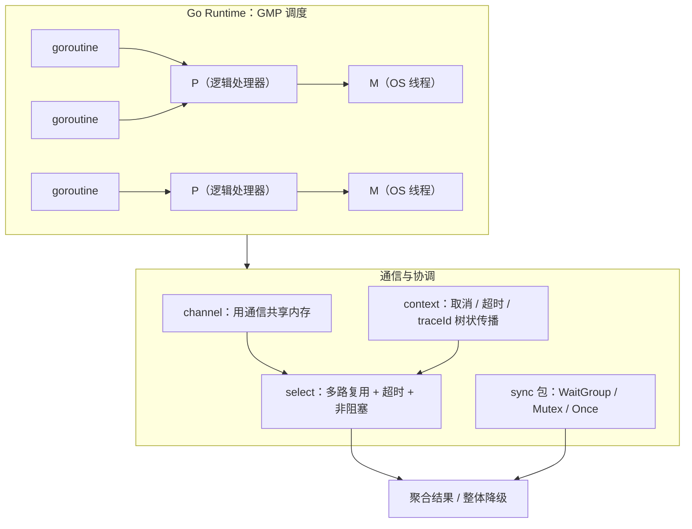

# 第 4 章 Go 的并发模型：Java 开发者必须掌握的核心差异

> 所属篇章：第二篇 Java 眼中的 Go 世界

**本章技术占比**：技术 50% + 引导 20% + 案例 30%

**前置 Java 知识映射**：线程与线程池（`Thread`、`ExecutorService`）、JUC 并发工具（`ReentrantLock`、`CountDownLatch`、`BlockingQueue`）、`CompletableFuture` 编排、JDK 21 虚拟线程（Project Loom）

## 本章导读

前面几章我们把 Go 当作“语法不同的 Java”来看，尚且成立。但从并发开始，这个类比会失效——因为 Go 的并发不是一套库，而是一套长在语言里的模型。`go` 是关键字，`chan` 是内建类型，`select` 是语句，编译器和运行时（runtime）一起为你调度成千上万个执行单元。Java 花了近三十年，从 `Thread` 到线程池，再到 `CompletableFuture`，直到 JDK 21 的虚拟线程，才逐步把“廉价并发”这件事补齐；而 Go 从 2009 年第一天起就把它焊死在语言层。

作为资深 Java 工程师，你已经很清楚“一个请求一个线程”会在什么并发量下崩掉，也知道为什么要用线程池限流、为什么 `Future.get()` 一定要带超时、为什么 `ThreadLocal` 在异步链路里会丢上下文。这些痛点恰恰是理解 Go 的最好切入点：Go 的 goroutine 回答了“线程太贵”，channel 回答了“共享内存太难写对”，`select` 回答了“怎么在多个异步事件里选一个”，`context` 回答了“怎么把取消和超时沿调用树传下去”。

本章的每个小节都遵循同一节奏：先看 Java 里我们通常怎么做，再看 Go 的对应设计与设计动机，然后回到全书那条链路——Go 网关（`:8080`）并发聚合 Java 价格服务（`:8081`）与 Python 分析服务（`:8082`）——讲清什么该用 Go、什么该留在 Java，最后列出 Java 老兵在 Go 里最容易踩的坑。读完你应该能回答：Go 的并发模型到底和虚拟线程差在哪，以及为什么“不要通过共享内存来通信”这句口号在生产里既是金律又有边界。

## 技术地图



上图给出本章的四条主线：GMP 调度解释 goroutine 为什么便宜（4.1），channel 与 `select` 解释 Go 如何组织协作（4.2），`sync` 与 `context` 解释同步与生命周期治理（4.3），而它们共同支撑起“并发聚合、任一超时则整体降级”的工程目标（4.4、4.5）。

## 知识点拆解

| 小节 | 技术内容 | Java 视角切入 | 落地案例 |
| --- | --- | --- | --- |
| 4.1 | 并发本质差异：goroutine vs 线程，GMP 调度与 2KB 栈 | 平台线程 1MB 栈、线程池调优、JDK 21 虚拟线程的异同 | 网关承接万级并发连接的入口层 |
| 4.2 | channel 与 select：用通信共享内存、关闭语义、超时与非阻塞 | `BlockingQueue`、`Future.get(timeout)`、`CompletableFuture` 编排 | 网关并发调用两个下游、任一超时则降级 |
| 4.3 | sync 包与 context：锁、Once、errgroup 与树状取消/traceId 传播 | JUC 的 `CountDownLatch`/`ReentrantLock`、`ThreadLocal` 上下文 | 一次请求的超时预算逐级递减与取消传播 |
| 4.4 | 并发安全最佳实践：goroutine 泄漏、数据竞态、-race、锁的边界 | 线程泄漏、可见性问题、`synchronized` 与 `volatile` | 聚合接口的泄漏排查与竞态修复 |
| 4.5 | 全栈并发选型：入口聚合用 Go、复杂事务留 Java | 分布式事务、领域建模、团队协作沉淀 | 价格计算平台的语言分工边界 |

## 4.1 并发本质差异：goroutine vs 线程

### Java 中我们通常怎么做

在 Java 里，并发的最小调度单位长期是平台线程（platform thread），它是操作系统内核线程的一层薄包装。我们都知道两个数字：每个线程默认栈约 1MB（`-Xss` 可调），线程的创建、销毁和上下文切换都要走内核。所以从来没人敢“一个请求 `new` 一个线程”，而是用线程池把线程复用起来，靠核心/最大线程数和队列长度做限流。

```java
// JDK 8~21 的经典做法：用有界线程池承接并发，避免线程无限增长
ExecutorService pool = new ThreadPoolExecutor(
        16, 64,                                   // 核心 16、最大 64
        60L, TimeUnit.SECONDS,
        new ArrayBlockingQueue<>(1000),           // 有界队列，堆积到上限就触发拒绝
        new ThreadPoolExecutor.CallerRunsPolicy()); // 背压：满了让调用线程自己跑

Future<Price> f = pool.submit(() -> priceClient.query(sku)); // 提交任务，拿回 Future
```

这套体系的心智负担在于“容量规划”：线程池开多大？队列多长？IO 密集还是 CPU 密集？开小了吞吐上不去，开大了内存和调度开销爆炸。JDK 21 的虚拟线程（virtual thread）正是为消灭这份负担而来——它把线程变成 JVM 调度的轻量对象，遇到阻塞 IO 时自动把底层载体线程（carrier thread）让出去，于是“一个请求一个（虚拟）线程”重新变得可行。

```java
// JDK 21：每个任务一个虚拟线程，阻塞 IO 不再占用 OS 线程
try (var executor = Executors.newVirtualThreadPerTaskExecutor()) {
    Future<Price> f = executor.submit(() -> priceClient.query(sku)); // 阻塞调用也无妨
}
```

### Go 的对应设计

Go 的执行单元是 goroutine，用 `go f()` 一行启动。它的初始栈只有约 2KB（早期是 4KB/8KB，现代运行时为 2KB），并且是可增长、可收缩的分段栈：需要更深的调用时运行时自动扩栈，用完再还回去。对比平台线程的 1MB，同样的内存能装下的 goroutine 多出两三个数量级，百万级并发在 Go 里是常规操作而非壮举。

goroutine 之所以便宜，关键在 GMP 调度模型（概念级理解即可）：

- **G**（goroutine）：你的并发任务，运行时里的一个轻量结构体。
- **M**（machine）：真正的 OS 线程，数量通常和 CPU 核数同量级。
- **P**（processor）：逻辑处理器，持有一个本地可运行 G 队列，数量由 `GOMAXPROCS` 决定（默认等于核数）。

调度器把大量 G 复用到少量 M 上，这是 M:N 调度。当某个 goroutine 执行阻塞的系统调用（比如网络读）时，运行时会把它挂起、让出 P，让别的 goroutine 在同一 M 上继续跑；网络 IO 更是被 netpoller 统一托管，成千上万个等待中的 goroutine 不占用任何 OS 线程。

```go
// Go：启动十万个 goroutine 只是常规操作，无需线程池容量规划
func main() {
    var wg sync.WaitGroup
    for i := 0; i < 100_000; i++ {
        wg.Add(1)
        go func(id int) { // go 关键字直接启动一个 goroutine
            defer wg.Done()
            _ = doWork(id) // 即使内部是阻塞 IO，运行时也会自动让出底层线程
        }(i) // 注意把循环变量作为参数传入，避免闭包捕获陷阱
    }
    wg.Wait() // 等所有 goroutine 结束，类似 CountDownLatch.await()
}
```

这里你会发现一个重要事实：Go 里没有“goroutine 池”这个概念级需求。你不必像调线程池那样纠结开多少，直接按业务语义 `go` 出去即可——限流应该发生在语义层（比如用带缓冲 channel 或信号量控制下游并发），而不是调度层。

### 全栈选型逻辑

回到全书链路：Go 网关处在流量入口，要同时握着大量客户端长连接并向下游扇出请求。这正是 goroutine 的主场——每条连接、每个下游调用都可以是一个 goroutine，内存成本以 KB 计。同样的机器，Go 网关能承接的并发连接数远高于用平台线程的 Java 服务。而超时预算的逐级递减（客户端 800ms → 网关 700ms → 下游 500ms）也天然落在 goroutine + `context` 上，我们会在 4.3 展开。

JDK 21 虚拟线程和 goroutine 在“廉价并发”这一层已经非常接近：都是 M:N、都能一请求一执行体、都在阻塞时让出载体线程。真正的差别不在调度，而在通信模型——虚拟线程给了你便宜的线程，但你依然用 `BlockingQueue`、`Future`、锁来协作；Go 则额外给了 channel 和 `select` 这套“把并发协作写成数据流”的原语。所以“该不该迁到 Go”不应该只看并发成本（虚拟线程已经拉平了很多），而要看后面几节讲的协作模型是否更契合你的场景。

### Java 开发者容易踩的坑

1. **把 goroutine 当线程池来“省着用”**。有人从 Java 惯性出发，先建一个固定大小的 worker 池再往里投任务。多数场景这是过度设计——goroutine 本就廉价，直接 `go` 出去、在语义层限并发即可。真要限并发，用带缓冲 channel 当信号量，而不是模仿 `ThreadPoolExecutor`。
2. **循环里闭包捕获循环变量**。这是从 Java lambda 迁移过来最经典的坑：
   ```go
   for i := 0; i < 3; i++ {
       go func() { fmt.Println(i) }() // 错误：Go 1.21 及更早，三个 goroutine 很可能都打印 3
   }
   ```
   Go 1.22 起循环变量每次迭代都是新实例，缓解了此坑；但若仍用旧版本或想写得稳妥，应显式 `go func(i int){...}(i)` 传参。跨版本协作时别赌读者用的是哪个版本。
3. **误以为 goroutine 无限便宜就可以无节制启动**。goroutine 便宜不等于免费：每个仍有栈内存，且更危险的是**泄漏**——一个永远阻塞在 channel 上的 goroutine 会一直占着内存直到进程退出。百万 goroutine 不可怕，百万**泄漏**的 goroutine 会拖垮服务（详见 4.4）。
4. **期待 goroutine 有“返回值”或能被 `join` 出结果**。`go f()` 没有任何返回值，也没有 `Future` 让你 `get()`。想拿结果必须通过 channel 回传——这不是缺陷，而是 Go 逼你走通信模型的入口。

## 4.2 Channel 与 select：用通信共享内存

### Java 中我们通常怎么做

Java 里线程间传递数据，主力是 `BlockingQueue`：生产者 `put`、消费者 `take`，队列满/空时自动阻塞，这已经很接近 channel。而“等一个异步结果、最多等多久”则是 `Future.get(timeout, unit)`：

```java
// Java：并发调两个下游，任一失败或超时则整体降级
CompletableFuture<PriceDto> priceF = CompletableFuture
        .supplyAsync(() -> priceClient.query(sku), pool)
        .orTimeout(500, TimeUnit.MILLISECONDS); // 单个调用 500ms 预算
CompletableFuture<AnalysisDto> analysisF = CompletableFuture
        .supplyAsync(() -> analysisClient.analyze(sku), pool)
        .orTimeout(500, TimeUnit.MILLISECONDS);

try {
    // allOf 等两个都完成；任一 orTimeout 触发都会让 join 抛异常
    CompletableFuture.allOf(priceF, analysisF).join();
    return AggregateResult.of(priceF.join(), analysisF.join());
} catch (Exception e) {
    return AggregateResult.degraded(); // 整体降级
}
```

`CompletableFuture` 把编排能力做得很强（`thenCompose`、`thenCombine`、`allOf`/`anyOf`），但代价是回调链一长就难读，异常传播和取消语义也需要格外小心（`orTimeout` 只是让 future 异常完成，底层任务其实还在线程池里跑）。

### Go 的对应设计

Go 的核心口号是 **“不要通过共享内存来通信，而要通过通信来共享内存”**（Do not communicate by sharing memory; instead, share memory by communicating）。承载“通信”的就是 channel：一个带类型、带方向、可关闭的管道。

```go
ch := make(chan int)        // 无缓冲 channel：发送与接收必须同时就绪（同步交接）
buf := make(chan int, 8)    // 有缓冲 channel：缓冲未满即可发送，类似容量 8 的 BlockingQueue
```

- **无缓冲 channel**：`ch <- v` 会阻塞，直到另一个 goroutine 执行 `<-ch`，两者“手递手”交接，是一种同步点。
- **有缓冲 channel**：缓冲未满时发送不阻塞、未空时接收不阻塞，缓冲满/空才阻塞，语义等价于有界 `BlockingQueue`。

channel 的**关闭语义**是 Java 老兵最需要背下来的三条规则，写错就是线上事故：

```go
close(ch)          // 关闭后：不能再发送，否则 panic
v, ok := <-ch      // 关闭且缓冲已排空后：ok 为 false，v 是元素类型的零值
close(ch)          // 对已关闭的 channel 再次 close：直接 panic
```

即：**关闭后读到的是零值而非阻塞**、**向已关闭 channel 发送会 panic**、**重复 close 会 panic**。约定俗成的纪律是“谁发送谁负责关闭，只关一次”。用 `for v := range ch` 遍历 channel，会在 channel 关闭且排空后自动结束循环，这是最常用的消费方式。

channel 还能带**方向类型**，把权责写进函数签名，编译期就防止误用：

```go
func produce(out chan<- int) { out <- 42; close(out) } // chan<- 只能发送
func consume(in <-chan int)  { for v := range in { _ = v } } // <-chan 只能接收
```

真正让 Go 并发“活”起来的是 **`select`**：它同时等待多个 channel 操作，哪个先就绪就执行哪个分支。这正是 Java 缺失的原语——`select` 让“多路复用 + 超时 + 非阻塞”统一成一种语句。

```go
// select 的三种关键用法：超时、非阻塞、取消
select {
case v := <-ch:                 // 数据先到，正常处理
    handle(v)
case <-time.After(500 * time.Millisecond): // 超时分支：500ms 内没数据就走这里
    return errTimeout
case <-ctx.Done():              // 上游取消（4.3 详解），立即收手
    return ctx.Err()
default:                        // 没有任何 case 就绪时立即执行，实现非阻塞尝试
    return errWouldBlock
}
```

两个必须记牢的 `select` 语义：**多个 case 同时就绪时，`select` 随机选一个执行**（防止饥饿，不能假设有优先级）；**带 `default` 的 `select` 永不阻塞**，适合做“试一下，不行就算了”的非阻塞探测。

下面是本章反复出现的“任一超时则降级”骨架，用 goroutine 把结果写回 channel，用 `select` 收敛：

```go
type result struct {
    price PriceDto
    err   error
}

func queryWithBudget(ctx context.Context, sku string) (PriceDto, error) {
    ch := make(chan result, 1) // 缓冲 1：即使调用方已超时离开，写入方也不会永久阻塞（防泄漏，见 4.4）
    go func() {
        p, err := priceClient.Query(ctx, sku)
        ch <- result{price: p, err: err} // 结果通过通信回传，而非共享变量
    }()

    select {
    case r := <-ch:
        return r.price, r.err
    case <-time.After(500 * time.Millisecond):
        return PriceDto{}, errTimeout // 500ms 预算耗尽，整体走降级
    case <-ctx.Done():
        return PriceDto{}, ctx.Err()  // 上游已取消，不必再等
    }
}
```

### 全栈选型逻辑

在网关聚合场景里，`select` 的价值是把“超时预算”写成显式代码：客户端给网关 700ms，网关给每个下游 500ms，剩余 200ms 留给序列化和自身逻辑。`time.After` 和 `ctx.Done()` 两条 case 并存，意味着无论是“下游太慢”还是“客户端已断开”，网关都能在预算内收手并返回降级结果，而不会被某个慢下游拖死。这种“预算逐级递减、任一维度超限即止损”的写法，在 Java 里要靠 `orTimeout` + `whenComplete` 拼，在 Go 里一个 `select` 就表达清楚了。

### Java 开发者容易踩的坑

1. **向已关闭或无人接收的 channel 发送**。前者直接 panic，后者让发送方 goroutine 永久阻塞泄漏。经典错误：
   ```go
   ch := make(chan int) // 无缓冲
   go func() { ch <- 1 }() // 若主 goroutine 因超时提前 return，这个发送永远阻塞 → 泄漏
   ```
   修法之一是像上面示例那样把 channel 设为**带缓冲 1**，让发送方“投递即走”不必等接收方。
2. **把 `select` 的随机性当成优先级**。多个 case 同时就绪时是**随机**选择。若你写了 `case <-dataCh` 和 `case <-time.After(...)` 并指望“有数据就一定先走数据”，在两者同一时刻就绪的边界上会偶发走超时分支。需要优先级时得嵌套 `select`（先用带 `default` 的 `select` 探数据，再进阻塞 `select`）。
3. **`for range` 消费一个永不关闭的 channel**。`range ch` 只有在 channel 被 `close` 后才会退出循环。生产者忘记 `close`，消费者 goroutine 就会永远卡在 `range` 上泄漏。谁发送谁负责 `close`，且只 `close` 一次。
4. **误用无缓冲 channel 做“扔了就走”的通知**。无缓冲 channel 的发送是同步的，必须有接收方在场才能完成。想做“尽力通知、无人听也不阻塞”应该用带缓冲 channel 配合 `select { case ch <- v: default: }`。

## 4.3 sync 包与 Context

### Java 中我们通常怎么做

不是所有协作都值得用 channel。Java 里我们有一整套 JUC 工具：`CountDownLatch` 等一批任务全部完成，`ReentrantLock`/`ReentrantReadWriteLock` 保护临界区，`AtomicInteger` 做无锁计数，`ConcurrentHashMap` 存共享状态。而“把请求级上下文（traceId、租户、deadline）带进每一层”，Java 传统上靠 `ThreadLocal`：

```java
// Java：ThreadLocal 存 traceId，CountDownLatch 等多个下游完成
static final ThreadLocal<String> TRACE = new ThreadLocal<>();

CountDownLatch latch = new CountDownLatch(2); // 等 2 个下游
pool.submit(() -> { try { callPrice(); } finally { latch.countDown(); } });
pool.submit(() -> { try { callAnalysis(); } finally { latch.countDown(); } });
latch.await(700, TimeUnit.MILLISECONDS); // 最多等 700ms
```

`ThreadLocal` 的软肋你我都遇到过：一旦任务切到线程池的另一个线程（`CompletableFuture` 异步回调、`@Async`），`ThreadLocal` 里的 traceId 就丢了，得靠 `TaskDecorator` 或 MDC 传递手动搬运。虚拟线程时代这个问题被 `ScopedValue`（JDK 21 预览）部分改善，但“上下文如何随异步任务流动”始终是个需要额外治理的点。

### Go 的对应设计

Go 的 `sync` 包提供了对应的低层原语，用法和 JUC 高度相似，Java 老兵几乎零成本上手：

```go
var mu sync.Mutex          // 互斥锁 ≈ ReentrantLock
var rw sync.RWMutex        // 读写锁 ≈ ReentrantReadWriteLock
var once sync.Once         // 一次性初始化 ≈ 双重检查锁定/静态初始化
var wg sync.WaitGroup      // 等一组 goroutine ≈ CountDownLatch（但计数动态可加）

once.Do(func() { initHeavyResource() }) // 无论多少 goroutine 调用，只执行一次
```

`sync.WaitGroup` 对标 `CountDownLatch`，但更灵活：`Add(n)` 增计数、`Done()` 减一、`Wait()` 阻塞到归零。需要“并发收集结果 + 首个错误即返回”时，官方扩展库 `golang.org/x/sync/errgroup` 几乎是聚合场景的标配——它内部就是 `WaitGroup` + 一次性错误捕获 + 派生 `context`：

```go
g, ctx := errgroup.WithContext(ctx) // 任一 goroutine 返回 error，ctx 立即被取消
g.Go(func() error { return callPrice(ctx) })
g.Go(func() error { return callAnalysis(ctx) })
if err := g.Wait(); err != nil { // 等全部完成或首个错误
    return degraded(err)
}
```

真正没有 Java 直接对应物、也最该重点掌握的是 **`context`**。它是 Go 处理“取消、超时、请求级值传递”的统一机制，且核心特性是**树状传播**：从根 context 派生子 context，取消父节点会级联取消所有子节点。

```go
// 从上游 context 派生一个带 500ms 超时的子 context
ctx, cancel := context.WithTimeout(parentCtx, 500*time.Millisecond)
defer cancel() // 【必须】无论正常还是异常返回都要调用 cancel，否则定时器与子 context 资源泄漏

// 把这个 ctx 传给每个下游调用；任一超时或上游取消，ctx.Done() 都会关闭
resp, err := priceClient.Query(ctx, sku)
```

关于 `context` 有三条工程纪律：

- **`context` 作为第一个参数显式贯穿调用链**（`func F(ctx context.Context, ...)`），Go 不做隐式传播，这是刻意的——调用链在签名里就一目了然，不会像 `ThreadLocal` 那样“看不见地丢失”。
- **`WithCancel`/`WithTimeout`/`WithDeadline` 返回的 `cancel` 必须调用**，惯用法是 `defer cancel()`。忘记它 `go vet` 会告警，且会造成资源泄漏。
- **`context.WithValue` 携带请求级数据（如 traceId）**，这正是 `ThreadLocal` 的替代，但它随 `ctx` 参数显式流动，跨 goroutine 不丢：
  ```go
  ctx = context.WithValue(ctx, traceIDKey{}, "trace-abc-123") // 键建议用自定义类型避免碰撞
  traceID, _ := ctx.Value(traceIDKey{}).(string)              // 下游各层都能取到同一个 traceId
  ```

### 全栈选型逻辑

`context` 是全书那条链路的“主动脉”。客户端请求进入 Go 网关时，网关用 `context.WithTimeout` 建立 700ms 根预算，并把 traceId 用 `WithValue` 塞进去；向 Java（`:8081`）与 Python（`:8082`）扇出时，各自再 `WithTimeout(ctx, 500ms)` 派生子预算，同时把 traceId 通过 HTTP Header 透传出去。于是超时预算逐级递减、traceId 全链路一致这两件事，用一个 `context` 就统一表达了。任何一层客户端断开或整体预算耗尽，`ctx.Done()` 级联关闭，所有在途的下游 goroutine 都能收到取消信号并及时收手——这正是 `ThreadLocal` + `CountDownLatch` 组合难以优雅做到的。

### Java 开发者容易踩的坑

1. **拿到 `cancel` 却忘了调用**。这是最高频的 `context` 事故：
   ```go
   ctx, cancel := context.WithTimeout(parent, 500*time.Millisecond)
   resp, err := call(ctx) // 忘了 defer cancel()
   return resp, err       // 定时器和子 context 直到超时才释放 → 资源泄漏、go vet 报警
   ```
   规则简单粗暴：拿到 `cancel` 的下一行就写 `defer cancel()`。
2. **把 `context.WithValue` 当通用参数传递通道**。`WithValue` 只应放请求级的横切数据（traceId、认证信息、deadline），不要拿它传业务参数——它是无类型的 `interface{}`、取值要断言、且滥用会让数据流向变得隐晦。业务参数请走正常函数入参。
3. **用 `ThreadLocal` 的心智期待 `context` 自动传播**。Go 没有隐式上下文，`context` 不显式传就是断了。常见现象：某个内层函数没接 `ctx` 参数，于是它发起的下游调用既不受超时约束也收不到取消信号，成了链路里的“失控分支”。约定是所有会阻塞或发起 IO 的函数都把 `ctx` 作为第一参数。
4. **在持有锁时执行阻塞的 channel 操作或 IO**。`sync.Mutex` 不可重入（不同于 `ReentrantLock`），同一 goroutine 重复 `Lock` 会自死锁；而在临界区里做网络调用会把锁的持有时间放大到不可控。锁只护内存状态，IO 和 channel 操作请挪到锁外。

## 4.4 并发安全最佳实践

### Java 中我们通常怎么做

Java 并发安全的两大主题你早已烂熟：**可见性/有序性**（靠 `volatile`、`synchronized`、`happens-before`，避免读到过期值）和**资源泄漏**（线程池队列无限堆积、线程忘记归还、连接未关闭）。排查手段也成熟：`jstack` 看线程栈找死锁，线程池监控看活跃/队列指标，JMM 规则指导什么时候必须加同步。

```java
// Java：可见性坑——没有 volatile，工作线程可能永远看不到 stop 的更新
private boolean stop = false;          // 应为 volatile
public void run() { while (!stop) { /* 可能死循环 */ } }
```

### Go 的对应设计

Go 把同样两个主题换了副面孔。先说**数据竞态（data race）**：多个 goroutine 并发读写同一变量且至少一个是写，就是竞态，行为未定义。Go 不像 Java 有完整的 JMM 保你“至少不崩”，竞态在 Go 里可能直接损坏数据结构。好在 Go 内置了神器 **`-race` 竞态检测器**：

```go
// 竞态示例：多个 goroutine 无保护地自增同一个变量
counter := 0
for i := 0; i < 1000; i++ {
    go func() { counter++ }() // counter++ 非原子：读-改-写三步，并发下丢更新
}
// 运行 `go test -race` 或 `go run -race main.go` 会精确报出这一行的竞态
```

修法要么加锁（`sync.Mutex`），要么用原子操作（`sync/atomic`），要么改成用 channel 把自增串行化到单个 goroutine。**养成在 CI 里跑 `go test -race` 的习惯**，它能在测试阶段抓出人眼几乎发现不了的竞态。

再说 Go 独有、且比 Java 线程泄漏更隐蔽的 **goroutine 泄漏**——泄漏的 goroutine 不会报错，只是静静地占着内存永不退出。三种典型模式必须刻进肌肉记忆：

```go
// 泄漏模式一：无接收者的发送。主 goroutine 提前 return，发送方永远阻塞在 ch <-
func leak1() {
    ch := make(chan int) // 无缓冲
    go func() { ch <- compute() }() // 若下方 select 走了超时分支离开，这里永久阻塞
    select {
    case v := <-ch:
        _ = v
    case <-time.After(100 * time.Millisecond):
        return // 超时返回后，上面的 goroutine 再也没人接收 → 泄漏
    }
    // 修法：ch := make(chan int, 1)，让发送方投递即走
}

// 泄漏模式二：忘记 close，消费者永远卡在 range
func leak2() {
    ch := make(chan int)
    go func() { for v := range ch { _ = v } }() // 生产者若不 close(ch)，这里永不退出
}

// 泄漏模式三：没有 context 的无限阻塞，无法被取消
func leak3() {
    go func() {
        for {
            job := <-jobCh // 若没有 ctx.Done() 分支，外部想停也停不掉
            process(job)
        }
    }()
    // 修法：for { select { case job := <-jobCh: process(job); case <-ctx.Done(): return } }
}
```

三种泄漏的共同解药就是本章前面反复强调的三件事：**给 channel 合适的缓冲、谁发送谁 close、每个长活 goroutine 都带上 `ctx.Done()` 退出分支**。

### 全栈选型逻辑

聚合网关是 goroutine 泄漏的重灾区：每个请求扇出若干下游 goroutine，只要有一条在超时后没被正确收尾，就会随 QPS 累积成缓慢的内存增长——现象是“服务跑几小时后 goroutine 数只增不减、内存曲线爬坡”。生产上用 `runtime.NumGoroutine()` 或 `pprof` 的 goroutine profile 监控数量，配合每个请求的 traceId 定位是哪条链路在泄漏。把“下游调用一律带缓冲 channel + `select` 带 `ctx.Done()`”固化成团队模板，能消灭绝大多数此类问题。

关于那句口号也要讲清**边界**：“不要通过共享内存来通信”是**默认倾向**而非绝对禁令。传递所有权、协调流程、扇出扇入，用 channel 最清晰；但对一个高频读写的计数器、一份共享配置缓存、一个连接池内部状态，用 `sync.Mutex`/`sync.RWMutex`/`atomic` 才是更简单更快的正解。判断标准是：**是在“交接数据/协调节奏”还是在“保护一块被共享的状态”**——前者用 channel，后者用锁。硬把计数器塞进 channel 会写出又慢又绕的代码。

### Java 开发者容易踩的坑

1. **以为 Go 有 JMM 兜底，竞态顶多读到旧值**。Go 的数据竞态是未定义行为，可能损坏 map 等结构导致直接 panic（并发写 map 会被运行时检测并 `fatal error: concurrent map writes`）。不要靠“看起来没事”过关，上 `-race`。
2. **用 `sync.WaitGroup` 时把 `Add` 放进 goroutine 内部**。
   ```go
   for _, u := range urls {
       go func(u string) {
           wg.Add(1)          // 错误：Add 可能在 Wait 已经放行之后才执行
           defer wg.Done()
           fetch(u)
       }(u)
   }
   wg.Wait() // 可能在还没 Add 时就返回，等于没等
   ```
   `wg.Add(1)` 必须在启动 goroutine **之前**、在父 goroutine 里调用。
3. **把“不要共享内存”当教条，该用锁时硬凑 channel**。给一个纯内存计数器套上 channel + 单独的管理 goroutine，比一个 `atomic.AddInt64` 慢一个数量级还更难读。识别“保护共享状态”场景就大方用锁。
4. **误用 `sync.Mutex` 的值拷贝**。`sync.Mutex`、`sync.WaitGroup` 等含锁结构体不能被值拷贝，一旦作为值传参或存进 slice 再取出，拷贝出的是“另一把锁”，保护失效。含锁结构体一律用指针传递（`go vet` 的 copylocks 检查会告警）。

## 4.5 全栈场景下的并发选型

### Java 中我们通常怎么做

面对高并发，Java 团队的标准动作是：Spring Boot + 线程池（或 JDK 21 虚拟线程）+ Resilience4j 做熔断限流 + `CompletableFuture` 编排下游。这套组合在**复杂业务事务**上无可替代——分布式事务、领域模型、状态机、强一致性校验、和几十个内部系统的深度集成，都沉淀在 Java 的生态与团队经验里。JVM 成熟的可观测性（JFR、Micrometer、Arthas）也让复杂系统的排障有据可依。

### Go 的对应设计

选型的判断轴不是“谁更快”，而是**这段职责的形状**：

- **适合交给 Go 的**：高并发流量入口、API 网关、BFF 聚合层、反向代理、Sidecar、需要海量长连接的推送/网关、云原生基础组件（Operator、CLI、Exporter）。它们的共性是**并发密集但业务相对轻**——扇出扇入、超时治理、协议转换，正好命中 goroutine + channel + `select` + `context` 的甜区，且 Go 编译成单静态二进制、启动毫秒级、内存占用低，天然贴合容器与弹性伸缩。
- **应当留在 Java 的**：核心交易、账务、库存、订单状态机等**强一致、重领域、多集成**的复杂事务。这些地方的价值在业务正确性和可维护性，而非并发吞吐，Java 的建模能力、事务生态和团队沉淀是护城河。

放到价格计算平台上，分工就很清楚：

```go
// Go 网关（:8080）：并发聚合 Java 价格服务与 Python 分析服务
func aggregate(ctx context.Context, sku string) (Aggregate, error) {
    // 网关级预算 700ms，向下派生
    ctx, cancel := context.WithTimeout(ctx, 700*time.Millisecond)
    defer cancel()

    g, ctx := errgroup.WithContext(ctx) // 任一失败即取消其余
    var price PriceDto
    var analysis AnalysisDto

    g.Go(func() error { // 调 Java :8081，业务规则留在 Java
        p, err := priceClient.Query(ctx, sku)
        price = p
        return err
    })
    g.Go(func() error { // 调 Python :8082，数据分析留在 Python
        a, err := analysisClient.Analyze(ctx, sku)
        analysis = a
        return err
    })

    if err := g.Wait(); err != nil {
        return degraded(sku), nil // 任一超时/失败 → 整体降级，仍返回可用响应
    }
    return Aggregate{Price: price, Analysis: analysis}, nil
}
```

Go 网关只做并发聚合、超时隔离、协议与契约对齐，不碰价格规则本身——价格怎么算是 Java 的事，历史趋势怎么分析是 Python 的事。这就是“用对语言做对的事”。

### 全栈选型逻辑

一句话收敛全书的分工哲学：**让并发密集的入口层用 Go 承接洪峰与聚合，让业务密集的核心层用 Java 守住一致性与领域复杂度，让数据密集的分析层用 Python 贴合算法生态。** traceId 贯穿三段、超时预算逐级递减、统一响应壳对齐契约——这三条纪律把三种语言缝成一条可观测、可降级、可演进的链路。选型永远跟着业务链路的形状走，而不是跟着语言偏好走。

### Java 开发者容易踩的坑

1. **因为 Go 并发香，就把核心交易也迁过去**。把分布式事务、复杂状态机搬到 Go，等于放弃 Java 成熟的事务生态和团队经验，换来的并发优势在这类场景根本用不上。并发密集 ≠ 全都用 Go。
2. **把 Java 的分层与框架心智整套搬进 Go 网关**。给一个只做聚合的网关套上 Controller-Service-Repository-DTO-Mapper 五层和一堆 AOP，Go 项目会失去它“小而直接”的优势。网关就该薄，逻辑集中在 handler 到下游客户端这一薄层。
3. **忽略跨语言边界的工程契约**。语言选对了，但没统一超时预算、错误码语义、traceId 透传方式和响应壳字段，链路照样会在联调和排障时崩溃。选型的收益必须靠契约治理才能兑现——这正是全书反复强调的主线。
4. **用虚拟线程一刀切否定 Go 的价值，或反之**。JDK 21 虚拟线程确实拉平了“廉价并发”这条轴，若你的团队全在 Java 且场景以阻塞 IO 编排为主，虚拟线程可能就够了；但 Go 的增量价值在 channel/`select`/`context` 这套通信与生命周期模型、单二进制部署和更低的运行时足迹。别用单一维度下结论，按场景权衡。

## 对比代码示例

同一个场景——**并发调用两个下游，任一超时则整体降级**——用两种语言各写一遍，差异一目了然。

Java `CompletableFuture` 版：

```java
// Java（JDK 21）：并发调两个下游，任一超时/失败则整体降级
public AggregateResult aggregate(String sku, String traceId) {
    try (var executor = Executors.newVirtualThreadPerTaskExecutor()) {
        CompletableFuture<PriceDto> priceF = CompletableFuture
                .supplyAsync(() -> priceClient.query(sku, traceId), executor)
                .orTimeout(500, TimeUnit.MILLISECONDS);   // 单下游 500ms 预算
        CompletableFuture<AnalysisDto> analysisF = CompletableFuture
                .supplyAsync(() -> analysisClient.analyze(sku, traceId), executor)
                .orTimeout(500, TimeUnit.MILLISECONDS);

        // allOf 等两个都完成；任一 orTimeout 触发都会让 join 抛异常
        CompletableFuture.allOf(priceF, analysisF)
                .orTimeout(700, TimeUnit.MILLISECONDS)      // 网关整体 700ms 预算
                .join();
        return AggregateResult.ok(priceF.join(), analysisF.join(), traceId);
    } catch (Exception e) {
        // 注意：orTimeout 只让 future 异常完成，底层任务其实仍在后台跑（需额外 cancel 治理）
        log.warn("aggregate degraded, traceId={}", traceId, e);
        return AggregateResult.degraded(traceId);
    }
}
```

Go `goroutine + select` 版：

```go
// Go（1.22+）：并发调两个下游，任一超时/失败则整体降级
func Aggregate(ctx context.Context, sku, traceID string) AggregateResult {
    ctx, cancel := context.WithTimeout(ctx, 700*time.Millisecond) // 网关整体 700ms 预算
    defer cancel()                                                // 取消会级联到两个下游

    priceCh := make(chan priceResult, 1)       // 缓冲 1，防止调用方离开后写入方泄漏
    analysisCh := make(chan analysisResult, 1)

    go func() {
        sub, c := context.WithTimeout(ctx, 500*time.Millisecond) // 单下游 500ms 子预算
        defer c()
        p, err := priceClient.Query(sub, sku, traceID)
        priceCh <- priceResult{data: p, err: err}
    }()
    go func() {
        sub, c := context.WithTimeout(ctx, 500*time.Millisecond)
        defer c()
        a, err := analysisClient.Analyze(sub, sku, traceID)
        analysisCh <- analysisResult{data: a, err: err}
    }()

    var price PriceDto
    var analysis AnalysisDto
    for got := 0; got < 2; got++ { // 收集两个结果
        select {
        case r := <-priceCh:
            if r.err != nil {
                return Degraded(traceID) // 任一失败即整体降级
            }
            price = r.data
        case r := <-analysisCh:
            if r.err != nil {
                return Degraded(traceID)
            }
            analysis = r.data
        case <-ctx.Done(): // 700ms 预算耗尽或上游取消，立即降级返回
            return Degraded(traceID)
        }
    }
    return OK(price, analysis, traceID)
}
```

两段代码解决同一问题，但气质不同：Java 用 `CompletableFuture` 把控制流藏进链式回调，超时靠 `orTimeout`，取消底层任务需要额外手段；Go 把控制流摊平在 `select` 里，超时和取消都是一等公民的 case，`context` 保证取消能级联到每个下游。前者的强项是编排 DSL 丰富，后者的强项是生命周期与取消语义显式可控。

## 章节综合案例：并行数据聚合接口——Go 网关并发调用 Java 服务

把前面所有原语拼成一个可读的完整实现：Go 网关（`:8080`）收到查询某 SKU 实时价格的请求，并发调用 Java 价格服务（`:8081`）与 Python 分析服务（`:8082`），用 goroutine 扇出、channel 回传、`select` 做超时收敛、`context` 做取消传播，任一下游超时或失败则整体降级，全程携带同一 traceId。

### 场景输入

用户请求某 SKU 的实时价格页。网关需要拿到两份数据：Java 侧的**计算后价格**（含会员优惠、活动规则）和 Python 侧的**分析结果**（历史趋势、波动率、推荐分），聚合成统一响应返回前端。任一下游在预算内没返回，就用可用的部分数据 + 降级标记应答，绝不让页面卡死。

### traceId 与超时预算契约

- **traceId 契约**：网关在入口生成或透传 `traceId`，通过 `context.WithValue` 注入请求上下文，并在向下游发起 HTTP 调用时写入 `X-Trace-Id` 头。Java 与 Python 服务收到后沿用同一 traceId 打日志。于是一次请求在三个服务、三种语言的日志里可用同一个 id 串起来，这是全链路排障的地基。
- **超时预算契约**：客户端 → 网关 700ms → 每个下游 500ms（子 `context` 派生），预算逐级递减，为序列化和网关自身逻辑留出余量。任一层 `ctx.Done()` 关闭，在途 goroutine 立即收手。

### 完整 Go 实现

```go
package gateway

import (
	"context"
	"encoding/json"
	"errors"
	"net/http"
	"time"
)

// 与 Java ApiResponse 对齐的统一响应壳
type ApiResponse struct {
	Code     int         `json:"code"`
	Message  string      `json:"message"`
	Data     interface{} `json:"data,omitempty"`
	TraceID  string      `json:"traceId"`
	Degraded bool        `json:"degraded"` // 是否降级返回
}

type PriceDto struct {
	SKU        string  `json:"sku"`
	FinalPrice float64 `json:"finalPrice"`
}

type AnalysisDto struct {
	Trend      string  `json:"trend"`
	Volatility float64 `json:"volatility"`
	Score      float64 `json:"score"`
}

type Aggregate struct {
	Price    PriceDto    `json:"price"`
	Analysis AnalysisDto `json:"analysis"`
}

// traceId 在 context 中的键，使用自定义类型避免键碰撞
type traceIDKey struct{}

// 泛型结果载体：把数据与错误一起通过 channel 回传
type fetchResult[T any] struct {
	data T
	err  error
}

const (
	gatewayBudget  = 700 * time.Millisecond // 网关整体预算
	downstreamBudget = 500 * time.Millisecond // 单下游子预算
)

// HTTP 入口：生成/透传 traceId，注入 context，调用聚合逻辑
func HandleAggregate(w http.ResponseWriter, r *http.Request) {
	traceID := r.Header.Get("X-Trace-Id")
	if traceID == "" {
		traceID = newTraceID() // 入口生成
	}
	sku := r.URL.Query().Get("sku")

	// 以请求自带 context 为根，注入 traceId 并设定网关总预算
	ctx := context.WithValue(r.Context(), traceIDKey{}, traceID)
	ctx, cancel := context.WithTimeout(ctx, gatewayBudget)
	defer cancel() // 必须：无论走哪条路径都释放定时器并级联取消下游

	agg, degraded := aggregate(ctx, sku)

	resp := ApiResponse{Code: 0, Message: "OK", Data: agg, TraceID: traceID, Degraded: degraded}
	w.Header().Set("Content-Type", "application/json")
	_ = json.NewEncoder(w).Encode(resp)
}

// 并发聚合：任一下游超时/失败 → 整体降级（degraded=true），仍返回已拿到的部分数据
func aggregate(ctx context.Context, sku string) (Aggregate, bool) {
	traceID, _ := ctx.Value(traceIDKey{}).(string)

	// 两个带缓冲 channel：即使聚合逻辑因超时提前返回，下游 goroutine 也能投递即走，不泄漏
	priceCh := make(chan fetchResult[PriceDto], 1)
	analysisCh := make(chan fetchResult[AnalysisDto], 1)

	// 扇出 1：调用 Java 价格服务 :8081
	go func() {
		sub, c := context.WithTimeout(ctx, downstreamBudget)
		defer c()
		p, err := callPriceService(sub, sku, traceID)
		priceCh <- fetchResult[PriceDto]{data: p, err: err}
	}()

	// 扇出 2：调用 Python 分析服务 :8082
	go func() {
		sub, c := context.WithTimeout(ctx, downstreamBudget)
		defer c()
		a, err := callAnalysisService(sub, sku, traceID)
		analysisCh <- fetchResult[AnalysisDto]{data: a, err: err}
	}()

	var agg Aggregate
	degraded := false
	// 收敛两个结果；任一失败或整体预算耗尽即标记降级并尽快返回
	for got := 0; got < 2; got++ {
		select {
		case r := <-priceCh:
			if r.err != nil {
				degraded = true // 价格拿不到，降级（保留分析数据）
			} else {
				agg.Price = r.data
			}
		case r := <-analysisCh:
			if r.err != nil {
				degraded = true // 分析拿不到，降级（保留价格数据）
			} else {
				agg.Analysis = r.data
			}
		case <-ctx.Done():
			// 700ms 预算耗尽或客户端断开：不再等待剩余下游，直接降级返回
			return agg, true
		}
	}
	return agg, degraded
}

// 下游调用：把 ctx 与 traceId 透传给 Java 服务
func callPriceService(ctx context.Context, sku, traceID string) (PriceDto, error) {
	req, err := http.NewRequestWithContext(ctx, http.MethodGet,
		"http://localhost:8081/prices?sku="+sku, nil)
	if err != nil {
		return PriceDto{}, err
	}
	req.Header.Set("X-Trace-Id", traceID) // traceId 全链路透传

	resp, err := http.DefaultClient.Do(req) // ctx 超时/取消会中断这次请求
	if err != nil {
		return PriceDto{}, err // 含 context deadline exceeded
	}
	defer resp.Body.Close()
	if resp.StatusCode != http.StatusOK {
		return PriceDto{}, errors.New("price service status " + resp.Status)
	}
	var dto PriceDto
	if err := json.NewDecoder(resp.Body).Decode(&dto); err != nil {
		return PriceDto{}, err
	}
	return dto, nil
}

// callAnalysisService 结构同上，指向 :8082 的 Python 服务，此处从略
```

### 这个案例说明了什么

1. **goroutine 扇出、channel 回传**：两个下游各跑在独立 goroutine 里真正并行，结果通过带缓冲 channel 交回，而不是共享变量——通信共享内存的范式落地。
2. **`select` 做超时收敛**：`ctx.Done()` 作为一等 case 与两个结果 channel 并列，无论“下游慢”还是“客户端断开”，网关都在 700ms 预算内返回，不被拖死。
3. **`context` 树状取消 + traceId 传播**：网关根 context 派生下游子 context，`cancel` 用 `defer` 保证释放；traceId 随 `context` 和 HTTP 头一起贯穿三种语言的服务，联调排障有据可依。
4. **降级而非失败**：任一下游拿不到就带 `degraded=true` 返回可用的部分数据，体现了入口层“保可用性优先”的治理取向——这正是把聚合职责放在 Go 网关的意义。

## 本章小结

1. **goroutine 便宜但不是免费**：2KB 可增长栈 + GMP 的 M:N 调度让百万级并发成为常态，但便宜也意味着泄漏更隐蔽——每个长活 goroutine 都要有明确的退出路径。JDK 21 虚拟线程在“廉价并发”这条轴上已与 goroutine 接近，差别在通信模型。
2. **channel 与 `select` 是 Go 的并发灵魂**：channel 用通信共享内存，关闭语义（读零值、发 panic、重复 close panic）必须背牢；`select` 把多路复用、超时（`time.After`）、非阻塞（`default`）、取消（`ctx.Done()`）统一成一种语句，且多 case 就绪时随机选择。
3. **`context` 是生命周期的主动脉**：树状取消让超时和取消沿调用链级联传播，`WithValue` 携带 traceId 替代 `ThreadLocal` 且不丢，`cancel` 必须 `defer` 调用。`sync` 包与 `errgroup` 补齐“保护共享状态”与“并发收集 + 首错即返回”。
4. **“不要共享内存来通信”是倾向而非教条**：交接数据与协调节奏用 channel，保护共享状态用锁/atomic；`-race` 抓竞态、`pprof` 抓 goroutine 泄漏应固化进 CI 与监控。
5. **选型跟着链路的形状走**：并发密集的入口聚合层用 Go，业务密集的核心事务留 Java，数据密集的分析层用 Python，用 traceId、超时预算、统一响应壳三条契约缝合。所有案例最终汇入第 13 章的电商价格计算平台。

## 选型思考题

1. 你的团队已经全面用上 JDK 21 虚拟线程，某个纯做“阻塞 IO 聚合”的 BFF 服务并发也扛得住了。此时再把它换成 Go 网关，能带来哪些**虚拟线程给不了**的增量价值？又要付出哪些团队成本？请从通信模型、部署形态、可观测性三个角度权衡。
2. 本章聚合案例里，如果把两个下游结果 channel 的缓冲从 `1` 改成无缓冲（`make(chan ..., 0)`），在“网关 700ms 预算已耗尽、`select` 走了 `ctx.Done()` 分支返回”的路径上会发生什么?这如何演变成一次 goroutine 泄漏?请结合 4.4 的泄漏模式说明修法。
3. 价格计算平台要新增一个“批量下单”接口：一次提交 50 个 SKU，需要扣减库存、生成订单、更新账务，要求强一致（部分失败要回滚）。这个接口该放在 Go 网关还是 Java 核心服务?为什么并发密集不构成把它交给 Go 的理由?

## 延伸阅读资源

1. Go 官方博客《Go Concurrency Patterns: Pipelines and cancellation》与《Concurrency is not parallelism》：理解 channel 管道、扇入扇出与取消传播的一手材料（`go.dev/blog`）。
2. Go 官方博客《Share Memory By Communicating》与官方文档《Effective Go》的 Concurrency 章节：口号背后的设计动机与惯用法。
3. Katherine Cox-Buday，《Concurrency in Go》（O'Reilly）：系统讲解 goroutine 泄漏、`context`、errgroup 与并发模式的经典书。
4. Go 官方文档 `context` 包与 `golang.org/x/sync/errgroup` 文档：取消/超时传播与并发编排的权威 API 说明。
5. JEP 444: Virtual Threads（JDK 21）与 JEP 446: Scoped Values：对照理解 Java 侧“廉价并发”与“上下文传播”的最新演进。
6. Go 官方《Data Race Detector》文档：`-race` 的原理与在 CI 中的用法。

## 第 4 章并发验收指标

| 指标 | Java 线程池 / 虚拟线程关注点 | Go 网关关注点 | 达标说明 |
| --- | --- | --- | --- |
| 并发上限 | core/max pool size、队列长度；虚拟线程看载体线程与内存 | goroutine 数、下游并发阈值（带缓冲 channel/信号量限流） | 压测下 goroutine 数随并发平稳、峰后能回落，不单调爬坡 |
| 超时控制 | `Future.get(timeout)`、`orTimeout`、WebClient timeout | `context.WithTimeout` 逐级派生，每层 `defer cancel()` | 预算 700ms→500ms 逐级递减，超时即降级返回 |
| 取消传播 | `Future.cancel(true)`、可中断阻塞 | `ctx.Done()` 树状级联，下游 `NewRequestWithContext` | 客户端断开时在途下游调用能在毫秒级被中断 |
| 泄漏风险 | 线程池队列堆积、线程未归还 | goroutine 阻塞（无接收发送/忘 close/无 ctx 循环） | `runtime.NumGoroutine()` 与 pprof goroutine profile 无持续增长 |
| 数据竞态 | JMM、`volatile`/`synchronized` 可见性 | `-race` 检测、`sync.Mutex`/`atomic`、并发 map 保护 | CI 跑 `go test -race` 零竞态告警 |
| 排查手段 | jstack、线程池监控、JFR、Micrometer | pprof、请求 traceId、结构化日志 | 一个 traceId 能串起三语言服务全链路日志 |

Go 并发实现的验收标准不是“能并发”，而是：每个下游调用都能被 `context` 取消、任何失败都能收敛到统一的降级响应、任何超时都在预算内被 `select` 兜住、任何 goroutine 都有明确的退出路径。做到这四点，才算把 Go 的并发模型真正用对。
