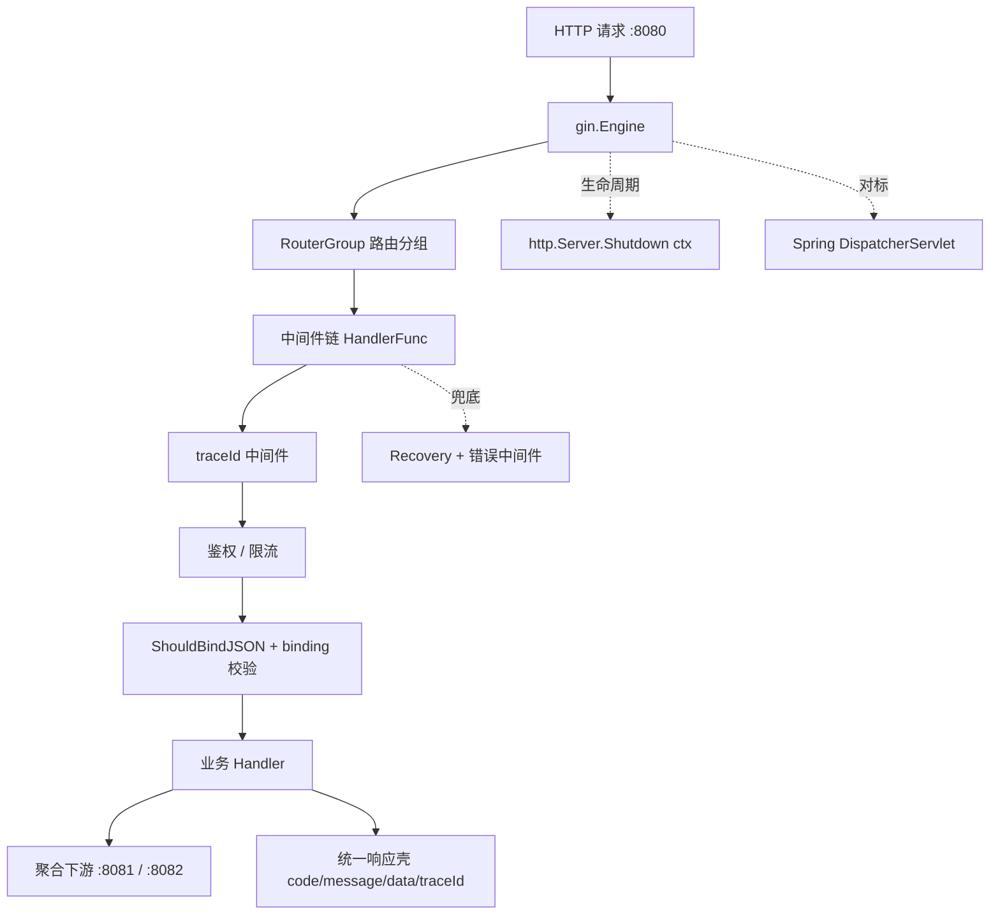

# 第 5 章 Go Web 框架 Gin：对标 Spring MVC 的技术映射

> 所属篇章：第二篇 Java 眼中的 Go 世界

**本章技术占比**：技术 50% + 引导 20% + 案例 30%

**前置 Java 知识映射**：Spring MVC 的 `DispatcherServlet` 与 `@RequestMapping` 路由、`Filter`/`HandlerInterceptor`/AOP 三层拦截、`@RequestBody` + Bean Validation 参数校验、`@ControllerAdvice`/`@ExceptionHandler` 统一异常、`ApplicationContext` 生命周期与优雅停机

## 本章导读

作为写过多年 Spring MVC 的 Java 工程师，你对一个 HTTP 请求的生命周期早已烂熟：`DispatcherServlet` 分发、`HandlerInterceptor` 前置拦截、`@RequestBody` 反序列化加 Bean Validation、Controller 调 Service、异常被 `@ControllerAdvice` 兜住、最后 `HttpMessageConverter` 把对象序列化回去。本章不打算教你"Gin 怎么写 Hello World"——那种东西官方 README 五分钟就能看完。本章只回答一个问题：**当你把这套请求处理心智搬到 Gin 上时，哪些约定消失了、哪些责任回到了你手里、哪些反而变简单了。**

Gin 和 Spring MVC 最根本的差异，是"约定优先"与"显式优先"的分野。Spring 用大量注解和自动配置替你做决定：组件扫描帮你注册 Bean，`@Valid` 帮你触发校验，异常解析器帮你兜底。Gin 几乎不做隐式决定——路由要你手写、中间件顺序由你排列、校验要你调用、panic 要你挂 `Recovery`、优雅停机要你自己写 `Shutdown`。少了魔法，也就少了"为什么这个注解没生效"的排查成本，代价是样板需要你亲手搭一次。

学习节奏上，仍然带着本书的全栈链路来读：Go 网关（`:8080`）负责流量入口、鉴权、限流与聚合，Java 价格服务（`:8081`）承载核心交易规则，Python 分析服务（`:8082`）处理历史数据，三者用统一响应壳 `{code,message,data,traceId}` 和 `X-Trace-Id` 请求头串联。本章最后会把项目里那个"零依赖 `net/http` 教学网关"升级成生产级的 Gin 版本，端口、契约、下游全部不变——这正是你在真实项目里会做的一次技术升级。

## 技术地图



## 知识点拆解

| 小节 | 技术内容 | Java 视角切入 | 落地案例 |
| --- | --- | --- | --- |
| 5.1 | `gin.Engine`/`RouterGroup`、路径参数与通配符、Go 1.22 `net/http` 增强路由 | 对标 `DispatcherServlet`、`@RestController`/`@RequestMapping` 注解式路由 | 网关按 `/api/v1` 分组注册价格、健康检查路由 |
| 5.2 | `HandlerFunc` 中间件链、`c.Next()`/`c.Abort()` 洋葱模型 | 对标 `Filter`/`HandlerInterceptor`/AOP 三层拦截 | 读取或生成 `X-Trace-Id` 的链路追踪中间件 |
| 5.3 | `ShouldBindJSON` + `binding` tag 校验、统一响应壳封装 | 对标 `@RequestBody` + Bean Validation + `HttpMessageConverter` | 价格请求 DTO 校验失败时返回统一错误响应 |
| 5.4 | `gin.Recovery`、自定义错误中间件、`http.Server.Shutdown(ctx)` 优雅停机 | 对标 `@ControllerAdvice`/`@ExceptionHandler`、Spring 生命周期回调 | 网关兜住下游 panic、滚动发布时不丢在途请求 |

## 5.1 Gin 核心设计与路由引擎：Engine/RouterGroup vs Spring MVC

### Java 中我们通常怎么做

在 Spring MVC 里，路由是"声明"出来的。`DispatcherServlet` 作为唯一入口 Servlet，启动时扫描所有 `@Controller`/`@RestController`，把类上和方法上的 `@RequestMapping`（以及 `@GetMapping`/`@PostMapping` 等派生注解）解析成一张 `HandlerMapping` 表。请求进来时，`DispatcherServlet` 按 URL 和 HTTP 方法在表里找到对应的处理方法，完成参数解析、调用、结果转换。

```java
// Spring MVC：注解式声明路由，路径参数用 @PathVariable 绑定
@RestController
@RequestMapping("/api/v1/prices")
public class PriceController {

    @GetMapping("/{sku}")
    public ApiResponse<PriceView> getPrice(
            @PathVariable String sku,
            @RequestParam(defaultValue = "NORMAL") String memberLevel) {
        // 路由与参数绑定都由框架在注解层完成
        return priceService.query(sku, memberLevel);
    }
}
```

你几乎不用关心"路由表长什么样"——它由组件扫描隐式生成。好处是声明贴着业务方法、可读性高；代价是路由分散在几十个 Controller 里，想看清全局路由需要借助 Actuator 的 `mappings` 端点或 IDE 索引。

### Go 的对应设计

Gin 里没有注解，也没有组件扫描。路由是**代码显式注册**出来的：你拿到一个 `*gin.Engine`（对标 `DispatcherServlet` 的角色，但它同时也是 `http.Handler`），在上面按方法逐条挂 handler。

```go
r := gin.New()                 // 不带默认中间件的干净引擎
r.GET("/health", healthHandler)

// RouterGroup：对标 @RequestMapping 类级别的公共前缀
v1 := r.Group("/api/v1")
{
    prices := v1.Group("/prices")
    prices.GET("/:sku", getPrice)          // :sku 是命名路径参数
    prices.POST("/batch", batchPrice)
}
```

三个要点需要 Java 视角重新校准：

第一，**`RouterGroup` 对标 `@RequestMapping` 的类级前缀，但它是一个真实的对象**，可以携带自己的中间件。`v1.Use(authMiddleware)` 只对 `/api/v1` 下的路由生效，这比 Spring 里 `HandlerInterceptor` 用 `addPathPatterns` 字符串匹配路径要直观得多——分组即作用域。

第二，**路径参数语法不同**。Gin 用 `:sku` 表示命名参数（`c.Param("sku")` 取值），用 `*filepath` 表示尾部通配（贪婪匹配剩余全部路径）。它底层是基于 Radix Tree（基数树）的前缀匹配，性能很高，但也因此**不支持 Spring 那种同段既有静态路由又有正则约束的自由度**——同一层级 `/:sku` 和 `/batch` 可以共存，但 `/:sku` 和 `/:id` 这类同位置不同名的参数会 panic 冲突。

第三，**Go 1.22 起标准库 `net/http` 的 `ServeMux` 也支持了方法 + 模式路由**，语法是 `mux.HandleFunc("GET /api/v1/prices/{sku}", handler)`，`r.PathValue("sku")` 取参数。对于只做转发、不需要中间件生态的极简网关，标准库路由已经够用（本书那个教学网关就是纯 `net/http`）；但一旦要中间件链、参数绑定、分组，Gin 仍是更省心的选择。

### 全栈选型逻辑

网关（`:8080`）的路由规模通常不大——十几条转发和聚合路由——但对中间件编排、分组作用域要求高，Gin 的 `RouterGroup` 正好贴合。Java 价格服务（`:8081`）承载几十上百个业务端点、需要和 Service/Repository 深度集成、依赖 Spring 事务与安全生态，注解式路由加自动装配反而是效率优势。判断依据不是"谁的路由更快"，而是这一层是"薄转发"还是"厚业务"：薄转发吃 Gin 的显式与轻量，厚业务吃 Spring 的约定与生态。

### Java 开发者容易踩的坑

1. **把 `Engine` 当成可以到处 `new` 的无状态工具**。`gin.Default()` 会自带 `Logger` 和 `Recovery` 两个中间件，生产环境你往往想自己控制日志格式，应该用 `gin.New()` 再按需 `Use`。更隐蔽的是——一个进程只应有一个 `Engine` 实例并 `Run` 一次，别在多个 goroutine 里各建各的。

2. **路由冲突在启动时才 panic，且信息不直观**。下面这种写法会直接崩：

   ```go
   r.GET("/api/v1/prices/:sku", getPrice)
   r.GET("/api/v1/prices/:id", getById) // panic: ':id' in new path conflicts with ':sku'
   ```

   Radix Tree 要求同一位置的参数名唯一。Spring 里两个方法用不同 `@PathVariable` 名字映射同一模式是允许的，迁移时这种"同位不同名"会让人措手不及。解决办法是统一参数命名，或把语义不同的路由拆到不同分组前缀下。

3. **误以为尾斜杠会自动兼容**。Gin 默认 `RedirectTrailingSlash = true`，`/api/v1/prices` 会 301 到 `/api/v1/prices/`（或反之）。这在浏览器里无感，但下游用 `POST` + 严格 client（如某些 gRPC-Gateway 转发）时，301 会把 `POST` 降级成 `GET` 丢掉 body。跨服务调用契约里要么两端统一带不带尾斜杠，要么显式关掉这个重定向。

## 5.2 中间件机制：HandlerFunc 链与洋葱模型 vs Filter/Interceptor

### Java 中我们通常怎么做

Spring 生态里"在请求前后插一段逻辑"有三层可选，粒度和时机各不相同：

- **`Filter`（Servlet 规范级）**：最外层，在 `DispatcherServlet` 之前，能改写 request/response 原始流，适合鉴权、跨域、请求日志。
- **`HandlerInterceptor`（Spring MVC 级）**：在 `DispatcherServlet` 内、handler 前后，有 `preHandle`/`postHandle`/`afterCompletion` 三个钩子，能拿到匹配到的 handler，适合登录校验、耗时统计。
- **AOP（`@Around`）**：方法级，切到 Service/Controller 的方法调用，适合事务、缓存、审计。

```java
// HandlerInterceptor：返回 false 即中断，后续 handler 不再执行
public class TraceInterceptor implements HandlerInterceptor {
    @Override
    public boolean preHandle(HttpServletRequest req, HttpServletResponse resp, Object handler) {
        String traceId = Optional.ofNullable(req.getHeader("X-Trace-Id"))
                .orElse("trace-" + UUID.randomUUID());
        MDC.put("traceId", traceId);      // 塞进日志上下文
        resp.setHeader("X-Trace-Id", traceId);
        return true;                      // 放行
    }
}
```

三层各有配置入口（`FilterRegistrationBean`、`WebMvcConfigurer#addInterceptors`、`@Aspect`），能力重叠又不完全等价，"这段逻辑该放哪一层"本身就是一道需要经验的选择题。

### Go 的对应设计

Gin 把这三层压成了一个东西：**`gin.HandlerFunc` 中间件链**。中间件和业务 handler 是同一个类型 `func(*gin.Context)`，通过 `c.Next()` 显式把控制权交给链上的下一个，形成"洋葱模型"——`c.Next()` 之前是前置逻辑，之后是后置逻辑，天然覆盖了 `preHandle` 和 `afterCompletion`。

```go
// traceId 中间件：读 X-Trace-Id，缺失则生成，写入 Context 与响应头
func TraceID() gin.HandlerFunc {
    return func(c *gin.Context) {
        traceID := c.GetHeader("X-Trace-Id")
        if traceID == "" {
            traceID = "trace-gw-" + uuid.NewString() // 入口统一补齐
        }
        c.Set("traceId", traceID)             // 存入 Context，供后续 handler 读取
        c.Writer.Header().Set("X-Trace-Id", traceID) // 回写响应头，贯穿全链路
        c.Next()                              // 交给下一个中间件 / handler
        // c.Next() 之后是后置段，可在这里记录状态码与耗时
    }
}
```

关键差异有三点：

第一，**顺序由注册顺序显式决定**，没有 `@Order` 的隐式仲裁。`r.Use(A, B)` 就是 A 包着 B，请求流是 `A 前置 → B 前置 → handler → B 后置 → A 后置`。你排的顺序就是执行顺序，这一点比 Spring 里 `Filter` 靠 `@Order`、`Interceptor` 靠 `addInterceptors` 调用次序、AOP 靠 `@Order` 三套机制混在一起要清爽。

第二，**中断用 `c.Abort()` 而不是返回布尔**。`preHandle` 返回 `false` 中断，Gin 里对应 `c.Abort()`（或 `c.AbortWithStatusJSON(...)`）——它设置一个标志位，让链上后续 handler 不再执行。**注意 `Abort()` 不会像 `return` 那样立刻结束当前函数**，如果你想中断就必须在 `Abort()` 后自己 `return`。

第三，**`c.Set/c.Get` 就是 `MDC` 的替代**，但它是请求级 `Context` 上的 KV，不像 `MDC` 依赖 ThreadLocal。Go 的请求可能在多个 goroutine 间流转，值挂在 `*gin.Context` 上传递更安全。

### 全栈选型逻辑

网关是整条链路的流量入口，`traceId` 的"读取或生成"必须发生在这里——一旦请求进了网关还没有 `traceId`，后面 Java、Python 服务就只能各自造一个，日志再也串不起来。所以本书约定：`X-Trace-Id` 由网关中间件统一补齐，通过请求头透传给 `:8081`/`:8082`，三方日志都打这同一个字段。鉴权、限流同理，放在入口做一次，下游服务就能信任"进来的都是合法流量"，专注业务。这正是把横切关注点前移到 Go 网关的价值。

### Java 开发者容易踩的坑

1. **`c.Abort()` 后忘记 `return`，逻辑继续往下跑**。这是最高频的坑：

   ```go
   func Auth() gin.HandlerFunc {
       return func(c *gin.Context) {
           if c.GetHeader("Authorization") == "" {
               c.AbortWithStatusJSON(401, gin.H{"code": 40100, "message": "unauthorized"})
               // 少写了 return！下面的 c.Next() 照样执行，业务 handler 被调用
           }
           c.Next()
       }
   }
   ```

   `Abort()` 只是打标记阻止**后续**中间件，不影响**当前函数**继续执行。缺了 `return`，`c.Next()` 依旧被调用，鉴权形同虚设。记住：Gin 的中断永远是 `Abort()` + `return` 两步。

2. **在 `c.Next()` 之后才写响应头，结果不生效**。响应头必须在 `c.Writer.WriteHeader()`（即第一次写 body）之前设置。如果你在 `c.Next()` 后（业务 handler 已经写完响应）再 `c.Writer.Header().Set(...)`，头已经发出去了，改动被丢弃且可能触发 `http: superfluous response.WriteHeader` 警告。像 `traceId` 这种要回写的头，务必在 `c.Next()` **之前**设置。

3. **把重活放进中间件却忘了它对所有路由生效**。`r.Use(...)` 挂在 `Engine` 上是全局的，包括 `/health` 健康检查。如果你在全局中间件里做了 DB 查询或远程调用，健康检查也会被拖慢甚至因下游故障而失败，导致 K8s 误杀 Pod。作用域敏感的逻辑要挂到具体 `RouterGroup`，别一股脑全局 `Use`。

## 5.3 参数绑定与统一响应：ShouldBindJSON + binding vs @RequestBody + Bean Validation

### Java 中我们通常怎么做

Spring MVC 的参数处理高度自动化。`@RequestBody` 触发 `HttpMessageConverter`（默认 Jackson）把 JSON 反序列化成 DTO，`@Valid`/`@Validated` 触发 Bean Validation（Hibernate Validator）按字段注解校验，校验失败抛 `MethodArgumentNotValidException`，通常再由 `@ControllerAdvice` 统一转成错误响应。

```java
public record PriceRequest(
        @NotBlank String sku,
        @Min(1) @Max(5) int memberLevel,
        @DecimalMin("0.0") BigDecimal basePrice) {}

@PostMapping("/calculate")
public ApiResponse<PriceView> calc(@Valid @RequestBody PriceRequest req) {
    // 进到方法体时，req 已经反序列化并通过校验
    return service.calc(req);
}
```

反序列化、校验、错误抛出三件事被注解串成一条隐式流水线，Controller 方法体里拿到的永远是"干净可信"的对象。

### Go 的对应设计

Gin 把同样三件事做成**显式调用**。DTO 是普通 struct，用 struct tag 声明 JSON 字段名和校验规则（`binding` tag 背后是 `go-playground/validator`，对标 Hibernate Validator）；`c.ShouldBindJSON(&req)` 一次完成反序列化 + 校验，通过返回的 `error` 告诉你成败。

```go
type PriceRequest struct {
    SKU         string  `json:"sku" binding:"required"`
    MemberLevel int     `json:"memberLevel" binding:"required,min=1,max=5"`
    BasePrice   float64 `json:"basePrice" binding:"gte=0"`
}

func calc(c *gin.Context) {
    var req PriceRequest
    if err := c.ShouldBindJSON(&req); err != nil {
        // 校验失败：自己决定错误响应形态，而不是框架替你抛异常
        traceID, _ := c.Get("traceId")
        c.JSON(http.StatusBadRequest, ApiResponse{
            Code:    40001,
            Message: "参数校验失败: " + err.Error(),
            TraceID: cast(traceID),
        })
        return
    }
    // 走到这里，req 才是可信的
    c.JSON(http.StatusOK, ok(service.Calc(req), cast2(c)))
}
```

需要 Java 视角重新校准的点：

第一，**校验失败不是异常，是返回值**。没有 `@ControllerAdvice` 自动兜底，你必须在每个入口 `if err != nil` 处理。实践中会把"校验失败 → 统一错误响应"抽成一个小工具函数或封装 `BindAndValidate`，避免重复。

第二，**`ShouldBind` 系列 vs `Bind` 系列**。`Bind*` 校验失败会自动写 400 响应并 `Abort`，看似省事，但它抢走了错误响应的控制权，你无法统一成自己的响应壳。生产里几乎总是用 `ShouldBind*`，自己掌控错误格式。

第三，**响应壳要团队自己约定并保持一致**。Spring 有 `ResponseEntity` 和一堆约定，Gin 只给你 `c.JSON(status, obj)`。所以本书定义统一响应壳，三语言字段对齐：

```go
// 统一响应壳，字段与 Java 侧 ApiResponse<T> 完全对齐
type ApiResponse struct {
    Code    int         `json:"code"`
    Message string      `json:"message"`
    Data    interface{} `json:"data,omitempty"`
    TraceID string      `json:"traceId"`
}

func ok(data interface{}, traceID string) ApiResponse {
    return ApiResponse{Code: 0, Message: "OK", Data: data, TraceID: traceID}
}
```

### 全栈选型逻辑

校验该放在哪一层，是全栈分工的关键问题。网关做的是**契约级校验**——字段非空、格式合法、枚举范围，把明显畸形的请求挡在入口，减轻下游压力；但**业务级校验**——会员等级是否有对应折扣策略、SKU 是否已下架——依赖领域数据和规则，应该留在 Java 价格服务（`:8081`）。网关别越界去做业务判断，否则规则散落两处、双份维护。响应壳则必须三方统一：Java 用 `record ApiResponse<T>`、Go 用 struct、Python 用 dataclass/pydantic，字段名、错误码语义、`traceId` 传递方式一次约定，全链路复用。

### Java 开发者容易踩的坑

1. **`required` 无法区分"未传字段"和"传了零值"**。Go 没有 `null`，`int` 的零值是 `0`、`string` 是 `""`。`binding:"required"` 判定的是"字段等于其类型零值"，所以 `{"memberLevel": 0}` 和完全不传 `memberLevel`，在 `required` 眼里都是"缺失"。如果 `0` 是合法业务值，必须把字段改成指针 `*int`，用 `nil` 表示"真的没传"：

   ```go
   MemberLevel *int `json:"memberLevel" binding:"required"` // nil 才算缺失，*p==0 合法
   ```

   这正是第 3 章零值机制在 Web 层的直接后果，Java 的 `Integer` 装箱天然区分 `null` 和 `0`，迁移时极易忽略。

2. **DTO 字段忘记大写导出，反序列化静默失败**。Go 只有首字母大写的字段才被 `encoding/json` 识别。写成 `sku string` 小写，JSON 里的 `sku` 永远绑不进去，且**不报错**——你拿到一个零值空串，误以为是客户端没传。字段必须大写导出，用 `json` tag 映射小写外部名。

3. **`ShouldBindJSON` 只能读一次 body**。请求 body 是流，读完就没了。如果你在中间件里先 `ShouldBindJSON` 打了日志，handler 里再 `ShouldBindJSON` 就会拿到 EOF 得到空对象。需要重复读时得先 `c.GetRawData()` 缓存再用 `bytes.NewBuffer` 重置 `c.Request.Body`，或干脆只在一处绑定。

## 5.4 统一错误处理、panic 恢复与优雅停机 vs @ControllerAdvice 与 Spring 生命周期

### Java 中我们通常怎么做

Spring 的错误兜底和生命周期管理几乎全自动。异常方面，`@ControllerAdvice` + `@ExceptionHandler` 提供全局异常处理器，把各类异常映射成统一响应；容器还会兜住未捕获异常返回 500。生命周期方面，`ApplicationContext` 管理 Bean 的创建与销毁，`@PreDestroy`、`DisposableBean`、`SmartLifecycle` 让你在关闭时释放资源，内嵌 Tomcat 收到停机信号后会走优雅关闭，等待在途请求处理完再退出。

```java
@RestControllerAdvice
public class GlobalExceptionHandler {

    @ExceptionHandler(BizException.class)
    public ApiResponse<Void> handleBiz(BizException e) {
        // 业务异常统一转成响应壳
        return new ApiResponse<>(e.getCode(), e.getMessage(), null, MDC.get("traceId"));
    }

    @ExceptionHandler(Exception.class)
    public ApiResponse<Void> handleUnknown(Exception e) {
        log.error("unhandled", e);
        return new ApiResponse<>(50000, "internal error", null, MDC.get("traceId"));
    }
}
```

你写业务代码时可以放心 `throw`，兜底和资源释放交给容器，这是 Spring "约定优先"最省心的部分之一。

### Go 的对应设计

Go 里这两件事都要显式搭。**错误兜底靠中间件**：`gin.Recovery()` 用 `defer` + `recover()` 捕获 handler 里的 panic，避免整个进程崩溃——它对标"容器兜住未捕获异常返回 500"。但 `Recovery` 默认返回的是 Gin 自己的格式，想统一成响应壳，得自己写一个错误中间件：

```go
// 自定义错误恢复中间件：兜住 panic，统一成响应壳
func Recovery() gin.HandlerFunc {
    return func(c *gin.Context) {
        defer func() {
            if err := recover(); err != nil {
                traceID, _ := c.Get("traceId")
                log.Printf("[panic] traceId=%v err=%v", traceID, err)
                c.AbortWithStatusJSON(http.StatusInternalServerError, ApiResponse{
                    Code:    50000,
                    Message: "internal error",
                    TraceID: cast(traceID),
                })
            }
        }()
        c.Next()
    }
}
```

至于"业务异常转响应壳"，Go 没有异常，走的是 `error` 返回值那条路（详见第 3 章）——handler 里 `if err != nil` 判断错误类型，用 `errors.As` 取出自定义的 `BizError` 拿到 code/message，再 `c.JSON` 输出。约定俗成的做法是让 handler 把 `error` 塞进 `c.Error(err)`，最后由一个统一中间件在 `c.Next()` 之后检查 `c.Errors` 集中转响应，效果接近 `@ControllerAdvice`。

**优雅停机则完全靠手写**。Gin 的 `r.Run()` 是阻塞式的、不支持优雅关闭，生产环境要退回到标准库 `http.Server`，监听系统信号后调 `Shutdown(ctx)`：

```go
srv := &http.Server{Addr: ":8080", Handler: r} // r 是 *gin.Engine，本身就是 http.Handler

go func() {
    if err := srv.ListenAndServe(); err != nil && err != http.ErrServerClosed {
        log.Fatalf("listen: %v", err)
    }
}()

// 等待中断信号（对标容器收到 SIGTERM）
quit := make(chan os.Signal, 1)
signal.Notify(quit, syscall.SIGINT, syscall.SIGTERM)
<-quit
log.Println("shutting down gateway...")

// 给在途请求 5 秒处理窗口，超时则强制退出
ctx, cancel := context.WithTimeout(context.Background(), 5*time.Second)
defer cancel()
if err := srv.Shutdown(ctx); err != nil { // 停止接新请求，等在途请求完成
    log.Fatalf("forced shutdown: %v", err)
}
log.Println("gateway exited")
```

`Shutdown(ctx)` 做的正是内嵌 Tomcat 优雅关闭做的事：停止接受新连接、等待在途请求处理完、超过 `ctx` 超时才强退。区别是 Spring 替你接管了整个流程，Go 让你亲手把信号监听、超时上下文、退出顺序串起来。

### 全栈选型逻辑

优雅停机对网关尤其重要。网关（`:8080`）是滚动发布最频繁的一层——K8s 每次更新都会给旧 Pod 发 `SIGTERM`。如果不做 `Shutdown`，进程被信号直接杀死，那些正在等待 `:8081` 返回的在途请求会被硬切断，用户看到 502。做了 `Shutdown(ctx)`，旧 Pod 会拒绝新请求但把在途的处理完再退出，配合就绪探针摘流量，就能做到发布无损。这是 Go 网关必须补齐的工程治理，也是它从"能跑"到"生产可用"的分水岭。错误兜底同理：`Recovery` 中间件必须挂，否则一个下游返回的畸形数据触发 panic，就能让整个网关进程崩溃，连累所有在途请求。

### Java 开发者容易踩的坑

1. **只挂了 `Recovery` 却指望它处理业务错误**。`recover()` 只能兜住 **panic**，兜不住普通 `error` 返回值。Go 社区强烈反对"用 panic 当异常抛"——`error` 该老实 `return` 和判断，panic 只留给真正不可恢复的程序 bug。指望像 Java 那样 `throw new BizException()` 让 `Recovery` 接住转响应，是把 Java 心智错误地套在 Go 上，会写出满是 panic 的反模式代码。

2. **用 `r.Run()` 上生产，滚动发布必丢在途请求**。`r.Run(":8080")` 简单但没有优雅停机钩子，收到 `SIGTERM` 直接退出。很多人本地 demo 用 `r.Run()` 顺手就带到了生产，直到某次发布大量 502 才发现。生产环境一律用 `http.Server` + `Shutdown(ctx)` 的模板。

3. **`Shutdown` 的 `ctx` 超时设得比下游超时还短**。如果下游调用超时是 1.5s，而你 `Shutdown` 的 `ctx` 只给 1s，那些还差半秒就能返回的在途请求会被强制打断，优雅停机反而制造了错误。停机窗口应当 ≥ 单个请求的最大处理时间（含下游超时），本书网关下游超时 1.5s，停机窗口给到 5s 留足余量。

## 对比代码示例

同一个"带 traceId 的统一响应"，三种语言三种承载方式，字段契约完全一致：

```java
// Java: Spring MVC 风格的统一响应壳
public record ApiResponse<T>(int code, String message, T data, String traceId) {
    public static <T> ApiResponse<T> ok(T data, String traceId) {
        return new ApiResponse<>(0, "OK", data, traceId);
    }
}
```

```go
// Go: 与 Java ApiResponse 对齐的响应壳
type ApiResponse struct {
    Code    int         `json:"code"`
    Message string      `json:"message"`
    Data    interface{} `json:"data,omitempty"`
    TraceID string      `json:"traceId"`
}

func ok(data interface{}, traceID string) ApiResponse {
    return ApiResponse{Code: 0, Message: "OK", Data: data, TraceID: traceID}
}
```

```python
# Python: 与 Java DTO 对齐的分析入参
from pydantic import BaseModel, Field

class PriceAnalysisRequest(BaseModel):
    sku: str
    base_price: float = Field(ge=0)
    member_level: str = "NORMAL"
```

三段代码表达同一件事：跨语言协同首先要统一契约。`record`、`struct`、`BaseModel` 只是承载结构的方式，真正要团队统一的是字段名称、错误码语义、`traceId` 传递方式和版本兼容策略。注意 Gin 里 `Data interface{}` 加了 `omitempty`，与 Java 的 `data` 为 `null` 时省略对齐——这类序列化细节不统一，前端就得写两套解析分支。

## 章节综合案例：把教学网关升级为 Gin 生产版

本书项目里的 `project/pricing-platform/go-gateway/main.go` 是一个**零依赖的 `net/http` 教学网关**：它用标准库把 `/api/v1/prices/{sku}` 转发到 Java 价格服务（`:8081`），手动拼 `traceId`、手动设超时。这种写法适合教学——没有任何第三方依赖，一眼看懂 HTTP 转发的本质。但它缺了生产必需的东西：没有中间件链、没有统一 panic 恢复、没有优雅停机、参数校验靠字符串拼接。

真实项目里，当网关要承载鉴权、限流、多下游聚合时，就该升级为 Gin 版。**升级契约保持不变**：仍监听 `:8080`，仍读取或补齐 `X-Trace-Id` 请求头并回写响应，下游 Java（`:8081`）与 Python（`:8082`）接口不动。

### 场景输入

用户请求某个 SKU 的实时价格。网关需要：补齐 `traceId`、校验会员等级参数、转发到 Java 计算基础价与会员折扣、（可选）聚合 Python 返回的历史趋势，最后以统一响应壳返回，全链路日志携带同一 `traceId`。

### Gin 版网关骨架

```go
func main() {
    r := gin.New()
    r.Use(Recovery(), TraceID()) // 先兜底 panic，再补 traceId（顺序即洋葱层次）

    client := &http.Client{Timeout: 1500 * time.Millisecond} // 下游超时契约不变

    v1 := r.Group("/api/v1")
    {
        v1.GET("/prices/:sku", func(c *gin.Context) {
            traceID := c.GetString("traceId")           // 由 TraceID 中间件写入
            sku := c.Param("sku")                        // 路径参数，替代手动切片
            member := c.DefaultQuery("memberLevel", "NORMAL")

            body := []byte(`{"sku":"` + sku + `","memberLevel":"` + member + `"}`)
            req, _ := http.NewRequest(http.MethodPost,
                "http://localhost:8081/api/v1/price/calculate", bytes.NewReader(body))
            req.Header.Set("Content-Type", "application/json")
            req.Header.Set("X-Trace-Id", traceID)        // 透传契约，下游日志可串联

            resp, err := client.Do(req)
            if err != nil {
                c.JSON(http.StatusGatewayTimeout, ApiResponse{
                    Code: 50401, Message: "java price service timeout", TraceID: traceID,
                })
                return
            }
            defer resp.Body.Close()
            data, _ := io.ReadAll(resp.Body)
            c.Data(resp.StatusCode, "application/json; charset=utf-8", data)
        })
    }

    r.GET("/health", func(c *gin.Context) {
        c.JSON(http.StatusOK, ok(gin.H{"status": "UP"}, "health"))
    })

    // 优雅停机（对标教学版缺失的部分）
    srv := &http.Server{Addr: ":8080", Handler: r}
    go func() {
        if err := srv.ListenAndServe(); err != nil && err != http.ErrServerClosed {
            log.Fatalf("listen: %v", err)
        }
    }()
    quit := make(chan os.Signal, 1)
    signal.Notify(quit, syscall.SIGINT, syscall.SIGTERM)
    <-quit
    ctx, cancel := context.WithTimeout(context.Background(), 5*time.Second)
    defer cancel()
    _ = srv.Shutdown(ctx)
}
```

### 教学版 vs Gin 版对照

| 能力 | `net/http` 教学版 | Gin 生产版 |
| --- | --- | --- |
| 路由 | `HandleFunc` + 手动切片取 SKU | `RouterGroup` + `:sku` 路径参数 |
| traceId | 每个 handler 内联拼接 | `TraceID()` 中间件统一补齐并回写 |
| panic 恢复 | 无，一次 panic 整进程崩 | `Recovery()` 中间件兜底成响应壳 |
| 优雅停机 | `ListenAndServe` 直接阻塞，信号即杀 | `http.Server` + `Shutdown(ctx)` 无损发布 |
| 响应格式 | 手拼 JSON 字符串 | 统一 `ApiResponse` 结构体序列化 |

契约层——`:8080` 端口、`X-Trace-Id` 头、下游 `:8081`/`:8082` 地址与超时——两版完全一致，所以这次升级对 Java 和 Python 服务是**透明**的：它们感知不到网关换了实现，这正是"契约稳定、实现可换"的价值。

### 本章落地点

读者完成本章后，应能把 Gin 的路由、中间件、参数校验、错误兜底、优雅停机放回企业链路解释清楚：网关这一层为什么用 Gin 而不是让 Java 兼任、每个横切关注点该落在入口还是下游、升级实现时如何靠契约保证下游无感。这套网关能力最终会汇入第 13 章的电商价格计算平台。

## 本章小结

1. Gin 与 Spring MVC 的根本差异是"显式优先"对"约定优先"：路由、中间件顺序、校验、panic 恢复、优雅停机在 Gin 里都要你亲手搭，少了魔法也少了排查魔法的成本。
2. `RouterGroup` 让路由分组即作用域，`HandlerFunc` 洋葱模型把 Spring 的 `Filter`/`Interceptor`/AOP 三层压成一条链，`c.Next()`/`c.Abort()` 显式控制流转与中断。
3. 参数校验用 `ShouldBindJSON` + `binding` tag，但没有 `@ControllerAdvice` 自动兜底——错误要显式处理，`required` 与零值的关系是 Java 开发者的头号坑。
4. 生产网关必须挂 `Recovery` 中间件并用 `http.Server` + `Shutdown(ctx)` 做优雅停机，否则滚动发布丢在途请求、下游异常拖垮整个进程。
5. 契约稳定则实现可换：把教学网关升级为 Gin 版时，`:8080` 端口、`X-Trace-Id` 契约、下游地址全部不变，下游服务对升级无感。

## 选型思考题

1. 网关的 `traceId` 中间件如果放到 Java 价格服务（`:8081`）里去做，而不是在 Go 网关入口做，会在哪些故障排查场景下失效？为什么"入口统一补齐"是更稳的约定？
2. 你的团队想在网关加一层限流。它应该做成全局 `r.Use()` 中间件，还是挂到具体 `RouterGroup`？把它放全局会给 `/health` 健康检查带来什么风险？
3. 如果把参数的**业务级校验**（如 SKU 是否已下架）也塞进 Gin 的 `binding` 校验里，短期看减少了一次下游调用，长期会给跨语言协作埋下什么维护隐患？

## 延伸阅读资源

1. Gin 官方文档与示例：<https://gin-gonic.com/docs/> ——路由、中间件、绑定校验、`ShouldBind` 系列 API 的权威说明。
2. Go 标准库 `net/http` 文档：<https://pkg.go.dev/net/http> ——重点看 `Server.Shutdown`、`http.Handler` 接口，以及 Go 1.22 `ServeMux` 的方法 + 模式路由增强。
3. Spring Framework Web MVC 参考文档：<https://docs.spring.io/spring-framework/reference/web/webmvc.html> ——对照 `DispatcherServlet`、`HandlerInterceptor`、`@ControllerAdvice` 的官方定义。
4. `go-playground/validator` 校验器文档：<https://github.com/go-playground/validator> ——Gin `binding` tag 背后的校验引擎，对标 Hibernate Validator 的规则表。
5. Go 官方博客《Contexts and structs》与 `context` 包文档：理解 `Shutdown(ctx)` 里超时上下文的传递语义。

## 第 5 章框架映射表

| Spring MVC 心智 | Gin 对应能力 | 迁移提醒 |
| --- | --- | --- |
| `DispatcherServlet` | `gin.Engine`（本身即 `http.Handler`） | 一个进程一个实例，用 `gin.New()` 控制默认中间件 |
| `@RequestMapping` 类前缀 | `RouterGroup` | 分组即作用域，可挂组级中间件 |
| `@PathVariable` | `:param` + `c.Param()` | 同层参数名必须唯一，否则启动 panic |
| `Filter`/`Interceptor`/AOP | 单一 `HandlerFunc` 中间件链 | 顺序即执行序，中断用 `Abort()`+`return` |
| `@RequestBody` + `@Valid` | `ShouldBindJSON` + `binding` tag | 校验失败是 `error` 不是异常，`required` 区分不了零值 |
| `@ControllerAdvice` | 自定义错误 / `Recovery` 中间件 | 只兜 panic，业务错误走 `error` 返回值 |
| 内嵌 Tomcat 优雅关闭 | `http.Server.Shutdown(ctx)` | 需自己监听信号、设停机窗口 |

Gin 项目要保持轻，不要把 Spring 的注解与自动装配心智整套搬过来。显式路由、显式中间件、显式错误处理，配上稳定的跨语言契约，足以支撑网关和聚合层的大多数场景。
