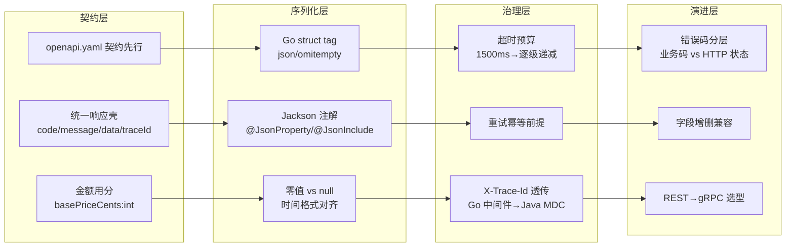

# 第 6 章 Go 与 Java 的协同通信机制

> 所属篇章：第二篇 Java 眼中的 Go 世界

**本章技术占比**：技术 50% + 引导 20% + 案例 30%

**前置 Java 知识映射**：RESTful API 与 `@RestController`、Jackson 序列化与 `@JsonProperty`、`RestTemplate`/`RestClient`/`WebClient`、连接池与超时配置、OpenFeign、SLF4J MDC 日志、gRPC/Protobuf 基础

## 本章导读

作为资深 Java 工程师，你大概率已经写过无数个 `@RestController`，配过 `RestTemplate` 的超时，也在 `application.yml` 里调过连接池。本章不打算重讲这些——它要回答的问题只有一个：**当 HTTP 请求的一端是 Go 网关（`:8080`）、另一端是 Java 价格服务（`:8081`）时，那条契约缝隙里到底埋着哪些坑，以及为什么这些坑在纯 Java 内部调用时你从来没遇到过。**

跨语言协同真正的难点不在“怎么发一个 HTTP 请求”——那是任何语言三行代码的事。难点在于两套类型系统、两套序列化规则、两套超时模型、两套日志体系要在一条链路上对齐：Go 的零值不是 Java 的 `null`，Go 的 `time.Time` 默认序列化格式不是 Jackson 的默认格式，Go 的 `http.Client` 超时语义和 Spring 的 `connectTimeout`/`readTimeout` 也不是一回事。任何一处对不齐，联调时都会变成“两边都说自己没错”的扯皮。

本章以本书固定的电商价格链路为主线：Go 网关收到 `GET /api/v1/prices/{sku}`，转发为对 Java 的 `POST /api/v1/price/calculate` 调用，Java 计算最终价并按统一响应壳返回。围绕这条真实链路，我们把协同通信拆成四件事——**契约先行**、**序列化边界**、**调用治理（超时/重试/traceId）**、**错误分层与演进选型**。学完你应该能独立回答：一个字段该叫什么、金额该用什么类型、超时预算怎么逐级分配、traceId 怎么从 Go 中间件一路带进 Java 的日志、什么时候才值得把 REST 换成 gRPC。

## 技术地图



## 知识点拆解

| 小节 | 技术内容 | Java 视角切入 | 落地案例 |
| --- | --- | --- | --- |
| 6.1 | 契约先行、`openapi.yaml` 驱动、统一响应壳、camelCase 字段、金额用分避免浮点 | 对标 Spring 的 `@RestController` + DTO + 统一返回封装 | 价格链路的 `code/message/data/traceId` 与 `basePriceCents` 约定 |
| 6.2 | Go struct tag vs Jackson 注解、`omitempty`、null/零值语义、时间格式对齐 | 对标 Jackson 的 `@JsonProperty`/`@JsonInclude`/`@JsonFormat` | 请求 DTO 中“未传字段”与“传了零”的区分 |
| 6.3 | `http.Client` 超时、`context` 传播、超时预算逐级递减、重试幂等、traceId 透传到 MDC | 对标 `RestClient`/`WebClient` 超时与 SLF4J MDC | 网关 1500ms 预算切给下游、`X-Trace-Id` 贯穿两语言日志 |
| 6.4 | 业务错误码 vs HTTP 状态分层、字段增删的向前兼容、REST→gRPC 升级判据 | 对标 Spring 的 `@ExceptionHandler` 与 API 版本策略 | 错误码表落地、字段演进规则、内部高频调用的 gRPC 选型 |

## 6.1 契约先行：REST/JSON 响应壳与字段规范

### Java 中我们通常怎么做

在 Java 单体或 Spring Cloud 微服务里，跨服务契约往往是“代码即契约”：你先写 `@RestController` 和 DTO，Springdoc/Swagger 再从注解**反向生成** OpenAPI 文档。字段名由 Java 的 `camelCase` 属性名决定，返回值一般套一层团队自定义的 `Result<T>` 或 `ApiResponse<T>`。

```java
// Java 侧：代码即契约的典型写法
public record ApiResponse<T>(int code, String message, T data, String traceId) {
    public static <T> ApiResponse<T> ok(T data, String traceId) {
        return new ApiResponse<>(0, "OK", data, traceId);
    }
    public static <T> ApiResponse<T> fail(int code, String message, String traceId) {
        return new ApiResponse<>(code, message, null, traceId);
    }
}
```

这套做法在纯 Java 团队里很顺：调用方直接依赖服务提供的 SDK jar，DTO 类共享，编译期就能发现字段对不上。代价是**契约隐含在实现里**——当调用方换成 Go、没法 `import` 那个 jar 时，字段命名、可空性、金额精度这些约定就全靠口头传递和联调时的报文猜测，极易漂移。

### Go 的对应设计

Go 侧没有共享 DTO jar 可依赖，因此本书采用**契约先行**：先在 `contracts/openapi.yaml` 里把接口写死，Go 和 Java 都以它为唯一事实来源。仓库里的契约已经定义了核心接口：

```yaml
# project/pricing-platform/contracts/openapi.yaml（节选）
paths:
  /api/v1/price/calculate:
    post:
      requestBody:
        required: true
        content:
          application/json:
            schema:
              type: object
              required: [sku, memberLevel]
              properties:
                sku:       { type: string }
                memberLevel: { type: string, enum: [NORMAL, SILVER, GOLD] }
```

响应壳是全链路统一的四字段结构，Go 与 Java 逐字段对齐：

```go
// Go 侧：与 Java ApiResponse 逐字段对齐的响应壳
type ApiResponse[T any] struct {
    Code    int    `json:"code"`
    Message string `json:"message"`
    Data    T      `json:"data,omitempty"`
    TraceID string `json:"traceId"` // 注意：字段名 traceId，不是 trace_id
}
```

两个约定必须写进契约、而不是靠默契：

- **字段命名统一 camelCase**。Java 的 Jackson 默认就是 camelCase（`basePriceCents`），Go 则默认按导出字段名的 `PascalCase` 序列化（`BasePriceCents`），所以 Go 必须靠 struct tag 把 `TraceID` 显式映射成 `traceId`。全链路选 camelCase 是为了让 Java 侧零配置、Go 侧只需加 tag。
- **金额一律用“分”表示、类型是整数**。契约里的 `basePriceCents`、`finalPriceCents` 都是 `int64`，代表以分为单位的整数金额（129900 = 1299.00 元）。绝不用 `float64`/`double` 表示钱——浮点在两种语言里都会带来 `129.9` 变 `129.89999999` 的精度漂移，跨语言累加时更会放大。

### 全栈选型逻辑

契约先行的价值在跨语言时才真正兑现。纯 Java 内部调用可以“代码即契约”，因为编译器是共同的守门人；一旦一端是 Go，编译器管不到对面，`openapi.yaml` 就成了唯一能同时约束两侧的守门人。在本书链路里，Go 网关（`:8080`）作为聚合入口需要清楚知道 Java（`:8081`）返回什么结构，Java 也需要知道网关会传什么——把这份约定固化在版本可控的 YAML 里，任何一方改字段都要走契约评审，漂移才不会在深夜联调时爆发。

金额用分同理：它不是 Go 或 Java 的语言特性，而是**跨语言的公共纪律**。谁都不许在自己那一侧“图方便”用浮点，否则精度损失会顺着链路传染。

### Java 开发者容易踩的坑

1. **默认让 Springdoc 反向生成契约，再让 Go “对着文档抄”**。这是把因果搞反了。反向生成的契约会随 Java 实现漂移，Go 永远在追赶。正确顺序是先改 `openapi.yaml`、评审、再两侧同步实现。
2. **用 `BigDecimal`/`double` 表示金额传给 Go**。`double` 会精度丢失；`BigDecimal` 序列化成 JSON 默认是带引号的字符串或高精度数字，Go 侧 `json.Unmarshal` 到 `int64` 会直接报 `cannot unmarshal string into Go value of type int64`。统一用整数分，两边都用 `int64`/`long`，干净利落。
3. **字段名大小写想当然**。Java 侧写了 `traceId`，Go 侧 struct 字段是 `TraceID` 却忘了加 `json:"traceId"` tag，序列化出来变成 `TraceID`，Java 反序列化拿到 `null`。跨语言时字段名必须以契约的字面量为准，逐字符核对。

## 6.2 序列化边界：struct tag vs Jackson 注解与零值语义

### Java 中我们通常怎么做

Java 用 Jackson 控制 JSON 与对象的映射，靠注解声明式配置：`@JsonProperty` 改名、`@JsonInclude` 控制是否输出空值、`@JsonFormat` 定制时间格式。可空性由类型天然表达——引用类型可以是 `null`，反序列化时缺失字段就落成 `null`。

```java
public class PriceRequest {
    @JsonProperty("sku")
    private String sku;

    @JsonProperty("memberLevel")
    private String memberLevel;

    // 缺省不传时，coupon 为 null，能和 "传了空串" 区分开
    @JsonInclude(JsonInclude.Include.NON_NULL)
    private String coupon;

    @JsonFormat(shape = JsonFormat.Shape.STRING, pattern = "yyyy-MM-dd'T'HH:mm:ss'Z'", timezone = "UTC")
    private Instant requestTime;
}
```

Java 这套的关键前提是：**引用类型能用 `null` 表达“没有值”**，因此“字段缺失”和“字段值为空”天然可区分。

### Go 的对应设计

Go 用 struct tag（`json:"..."`）替代 Jackson 注解，配置内联在字段上而非独立注解。但两者有一个语义鸿沟：**Go 的值类型没有 `null`，只有零值**。`string` 的零值是 `""`，`int64` 是 `0`，`bool` 是 `false`。这带来一个 Java 开发者最容易翻车的问题——**Go 无法天然区分“字段没传”和“传了零值”**。

```go
type PriceRequest struct {
    SKU         string `json:"sku"`
    MemberLevel string `json:"memberLevel"`
    // 反序列化后，Coupon == "" 无法区分是「没传 coupon」还是「传了空串」
    Coupon      string `json:"coupon,omitempty"`
    RequestTime time.Time `json:"requestTime"`
}
```

`omitempty` 是坑的高发区，它的语义是**序列化时**：如果字段是零值就**不输出**这个 key。也就是说，一个 `Amount int64` 加了 `omitempty`，当它等于 0 时序列化出的 JSON 里根本没有 `amount` 字段。如果 Java 那边期望 `amount` 恒定存在，就会拿到 `null` 或触发默认值分支。

要在 Go 里真正表达“可空”，得用**指针**：`*string`、`*int64`。指针为 `nil` 表示字段缺失，指向 `""` 或 `0` 表示传了零值——这才等价于 Java 的 `null` 语义。

```go
type PriceRequest struct {
    SKU         string  `json:"sku"`
    MemberLevel string  `json:"memberLevel"`
    Coupon      *string `json:"coupon,omitempty"` // nil=没传，&""=传了空串
}
```

时间格式是另一个必须显式对齐的边界。Go 的 `time.Time` 默认按 **RFC3339**（`2026-07-31T08:00:00Z`）序列化，Jackson 的 `Instant` 默认却是 epoch 秒/毫秒的**数字**。两边不约定就会一个发字符串、一个等数字，直接反序列化失败。本书统一约定时间字段用 RFC3339 字符串，Java 侧显式加 `@JsonFormat(shape = STRING, ...)` 对齐。

### 全栈选型逻辑

序列化边界的治理原则是：**把语义差异挡在契约层，别让它渗到业务代码里**。凡是“可空且需要区分零值”的字段（可选的优惠券、可选的覆盖价），Go 侧一律用指针；凡是“恒定存在”的字段（金额、状态码），两侧都不加 `omitempty`，保证 key 永远在。时间统一 RFC3339 字符串——它人类可读、时区明确，比 epoch 数字在跨语言联调时更省心。

这些决定不该在 Go 或 Java 各自内部拍板，而应写进 `openapi.yaml` 的字段描述，让两侧实现无歧义。

### Java 开发者容易踩的坑

1. **以为 Go 的零值等于 Java 的 `null`**。Java 里 `Integer amount` 没传是 `null`，业务能判空；Go 里 `int64 Amount` 没传是 `0`，你的“判空”逻辑 `if amount == 0` 会把“真的传了 0 元”也当成“没传”。需要区分时，Go 侧必须用 `*int64`。
2. **在恒定字段上误用 `omitempty`**。给响应壳的 `Code int` 加了 `json:"code,omitempty"`，当 `code == 0`（成功！）时序列化结果里**没有 `code` 字段**，Java 反序列化成默认值或报缺字段。响应壳的 `code`、`message` 这类字段绝不能加 `omitempty`。
3. **时间格式不对齐**。Go 发 `"2026-07-31T08:00:00Z"`，Java 的 `Instant` 字段没配 `@JsonFormat` 期望收数字，抛 `InvalidFormatException: Cannot deserialize value of type java.time.Instant from String`。反过来 Java 发毫秒数字、Go 等 RFC3339 字符串同样炸。时间字段必须两侧显式统一格式。

## 6.3 调用治理：超时预算、重试幂等与 traceId 透传

### Java 中我们通常怎么做

Java 侧发起下游调用，超时配置分得很细：连接超时（`connectTimeout`）和读超时（`readTimeout`）分开设，连接池（Apache HttpClient / Reactor Netty）管复用。JDK 21 推荐用 `RestClient`（同步）或 `WebClient`（响应式）：

```java
// JDK 21：RestClient 显式配置超时
RestClient priceClient = RestClient.builder()
    .baseUrl("http://localhost:8081")
    .requestFactory(new SimpleClientHttpRequestFactory() {{
        setConnectTimeout(500);   // 建连超时 500ms
        setReadTimeout(1200);     // 读超时 1200ms
    }})
    .build();
```

链路追踪上，Java 用 SLF4J 的 **MDC**（Mapped Diagnostic Context）把 `traceId` 塞进当前线程的诊断上下文，日志格式里用 `%X{traceId}` 自动打印，全程无需手动往每行日志拼 ID。

### Go 的对应设计

Go 的 `http.Client` 有一个整体 `Timeout` 字段，涵盖**从建连到读完响应体的全过程**——这和 Java 把 connect/read 分开不同。仓库网关就是这么配的：

```go
// project/pricing-platform/go-gateway/main.go（现状）
client := &http.Client{Timeout: 1500 * time.Millisecond}
```

`http.Client.Timeout` 是**粗粒度**的兜底。要做**超时预算逐级递减**——网关总预算 1500ms，扣掉自身处理和网络往返后，分给下游的时间必须更短——就要用 `context.WithTimeout` 把剩余预算显式传下去，而不是让每一跳都用满 1500ms。

```go
// 用 context 做超时预算传播：下游预算比网关总预算更短
func forwardToJava(parent context.Context, sku, member, traceID string) (*http.Response, error) {
    // 网关总预算 1500ms，给下游 Java 的调用只切 1200ms，
    // 预留 300ms 给网关自身的序列化、错误映射与响应写回
    ctx, cancel := context.WithTimeout(parent, 1200*time.Millisecond)
    defer cancel()

    body := []byte(`{"sku":"` + sku + `","memberLevel":"` + member + `"}`)
    req, err := http.NewRequestWithContext(ctx, http.MethodPost,
        "http://localhost:8081/api/v1/price/calculate", bytes.NewReader(body))
    if err != nil {
        return nil, err
    }
    req.Header.Set("Content-Type", "application/json")
    req.Header.Set("X-Trace-Id", traceID) // traceId 随请求头透传

    return client.Do(req)
}
```

`context` 是 Go 跨调用传播“截止时间 + 取消信号 + 请求元数据”的标准载体，Java 里没有完全对应物——最接近的是把 deadline 手动往下传。关键心智：**超时预算是一份会被逐级消耗的额度**，上游必须给下游留出更短的额度和自身的收尾时间，否则下游刚好用满时上游已经超时返回，白白浪费一次下游计算。

traceId 透传靠中间件在入口统一处理：生成或透传 `X-Trace-Id`，并放进 `context` 供后续每一跳带上。

```go
// traceId 中间件：入口生成或透传，后续调用从 context 取
func traceMiddleware(next http.HandlerFunc) http.HandlerFunc {
    return func(w http.ResponseWriter, r *http.Request) {
        traceID := r.Header.Get("X-Trace-Id")
        if traceID == "" {
            traceID = "trace-go-" + time.Now().Format("20060102150405")
        }
        ctx := context.WithValue(r.Context(), traceKey{}, traceID)
        w.Header().Set("X-Trace-Id", traceID) // 回写响应头，方便前端排错
        next(w, r.WithContext(ctx))
    }
}
```

Java 被调方在入口 `Filter`/拦截器里从 `X-Trace-Id` 头取值放进 MDC，日志就自动带上同一个 traceId，实现跨语言日志串联：

```java
// Java 入口拦截器：从头部取 traceId 塞进 MDC
public class TraceFilter implements Filter {
    public void doFilter(ServletRequest req, ServletResponse res, FilterChain chain)
            throws IOException, ServletException {
        String traceId = ((HttpServletRequest) req).getHeader("X-Trace-Id");
        MDC.put("traceId", traceId != null ? traceId : "trace-java-fallback");
        try {
            chain.doFilter(req, res); // 此后每行日志 %X{traceId} 自动带上
        } finally {
            MDC.clear(); // 线程复用前务必清理，否则串号
        }
    }
}
```

只要 Go 中间件、Java Filter 都把字段名统一成 `traceId`（对齐 `docs/protocols/api-contract.md` 的日志字段表），在日志平台按 `traceId` 一搜，就能把一次请求在 Go 和 Java 两侧的所有日志拉成一条完整时间线。

### 全栈选型逻辑

重试是治理里最危险的一环，前提是**幂等**。网关对 Java 价格计算这种**只读、无副作用**的调用可以安全重试；但对任何“下单”“扣库存”这类写操作，未经幂等设计（幂等键/去重表）绝不能盲目重试，否则一次超时重试就变成两次扣款。

超时与重试还要协同：重试会**叠加消耗预算**。如果网关总预算 1500ms、给下游 1200ms 还允许重试一次，那第二次几乎没有额度，等于必然再超时——重试前必须检查剩余预算够不够再发一次，够不上就直接返回超时错误码。本书链路的默认策略是：读操作（价格查询）在剩余预算允许时重试一次，写操作一律不自动重试。

### Java 开发者容易踩的坑

1. **误以为 Go 的 `http.Client.Timeout` 等于 Java 的 readTimeout**。它是**全过程**超时（建连+发送+等待+读体），不是单独的读超时。如果响应体很大、下载慢，即便服务端早已开始返回，也可能因为读体耗时撞上这个总超时。需要细粒度控制要用 `http.Transport` 的 `DialContext`、`ResponseHeaderTimeout` 分别设。
2. **每一跳都用满上游的总超时**。网关 1500ms，转发给 Java 也写 1500ms，网关自己的收尾时间没预留——下游刚返回，网关已经超时返回 504 给前端。必须逐级递减：下游预算 = 上游剩余预算 − 自身收尾预留。
3. **对非幂等接口盲目重试**。看到超时就 `for i := 0; i < 3; i++` 重发，如果打的是写接口，一次网络抖动会造成重复下单/重复扣款。重试的前置条件是接口幂等；不确定是否幂等，就不重试。
4. **忘了清理 MDC 导致 traceId 串号**。Java 线程池复用线程，若 `MDC.put` 后不在 `finally` 里 `MDC.clear()`，下一个请求会“继承”上一个请求残留的 traceId，日志追踪彻底错乱。

## 6.4 错误分层、版本兼容与 REST→gRPC 升级选型

### Java 中我们通常怎么做

Java 里错误处理靠 `@ExceptionHandler` + `@ControllerAdvice` 集中兜底，把异常翻译成统一响应壳。HTTP 状态码和业务语义常常被混用——有的团队用 HTTP 4xx/5xx 表达业务失败，有的坚持 HTTP 恒 200、业务结果全放 body 的 `code`。API 演进则靠 URL 版本（`/api/v1`、`/api/v2`）或媒体类型版本管理。

```java
@RestControllerAdvice
public class GlobalExceptionHandler {
    @ExceptionHandler(IllegalArgumentException.class)
    public ResponseEntity<ApiResponse<Void>> onBadRequest(IllegalArgumentException e) {
        // HTTP 400 + 业务码 40001，两层语义各表其意
        return ResponseEntity.badRequest()
            .body(ApiResponse.fail(40001, e.getMessage(), MDC.get("traceId")));
    }
}
```

### Go 的对应设计

本书采用**错误码与 HTTP 状态分层**：HTTP 状态表达“传输/协议层”结果，响应壳里的 `code` 表达“业务层”结果。二者由 `docs/protocols/api-contract.md` 的错误码表统一映射：

| 业务错误码 | 含义 | 建议 HTTP 状态 |
| ---: | --- | ---: |
| 0 | 成功 | 200 |
| 40001 | 请求参数非法 | 400 |
| 40101 | 鉴权失败 | 401 |
| 42901 | 网关限流 | 429 |
| 50001 | Java 核心服务失败 | 500 |
| 50002 | Python 分析服务失败 | 502 |
| 50401 | 下游调用超时 | 504 |

Go 网关的职责是把**下游的三类失败分开映射**，而不是一律折叠成 500：网络/超时错误映射为 `50401`（504）、Java 返回的业务错误透传其 `code`、参数问题映射为 `40001`（400）。仓库现状已经对超时做了正确映射：

```go
// 网关现状：超时被单独映射为 50401 / 504，而非笼统 500
resp, err := client.Do(req)
if err != nil {
    http.Error(w, `{"code":50401,"message":"java price service timeout","traceId":"`+traceID+`"}`,
        http.StatusGatewayTimeout)
    return
}
```

版本兼容遵循**向前兼容规则**，核心是“加字段安全、删/改字段危险”：

- **新增字段安全**。Go 用 `encoding/json` 反序列化时，JSON 里多出来的、struct 里没有的字段会被**默默忽略**；Java 的 Jackson 默认对未知字段会抛 `UnrecognizedPropertyException`，所以 Java 侧要配 `@JsonIgnoreProperties(ignoreUnknown = true)` 或全局 `FAIL_ON_UNKNOWN_PROPERTIES=false`，才能让“对面加了新字段”不至于打挂自己。
- **删除/重命名字段危险**。老调用方还在读那个字段，删掉后它拿到零值/`null`，逻辑静默出错。字段下线要走“先标记废弃、灰度观察无调用、再删除”的流程。
- **不复用字段名改语义**。把 `amount`（元）偷偷改成“分”是最阴险的破坏，编译不报错、序列化不报错，金额直接错 100 倍。要变语义就新增字段（`amountCents`），别原地改。

### 全栈选型逻辑

什么时候值得把 REST/JSON 升级到 gRPC/Protobuf？判据是**调用特征**，不是“gRPC 更先进”：

- **值得上 gRPC**：服务间**内部**、**高频**、**低延迟敏感**的调用（网关到核心服务每秒上万次），强契约需求（`.proto` 是编译期强类型契约，比 JSON 松散约定更硬），需要流式（Server/Client/双向 streaming）或多语言强一致 stub 的场景。Protobuf 二进制编码比 JSON 更小更快，HTTP/2 多路复用省连接。
- **继续用 REST**：面向浏览器/第三方的**公开**接口（JSON 人类可读、调试友好、无需生成 stub），调用频率低、契约演进频繁、需要用 curl/浏览器直接联调的场景。本书网关对外仍是 REST，正是这个理由。

gRPC 代码生成流程简述（不展开完整教程）：写 `.proto` 定义 service 和 message → 用 `protoc` 配合语言插件（Go 用 `protoc-gen-go` + `protoc-gen-go-grpc`，Java 用 `protobuf-maven-plugin`）生成两侧 stub → 双方基于生成的强类型接口编码。契约仍然先行，只是从 `openapi.yaml` 换成 `.proto`。

```protobuf
// price.proto：强类型契约，金额依然用整数分
syntax = "proto3";
package pricing.v1;

message PriceRequest {
  string sku = 1;
  string member_level = 2;
}
message PriceResponse {
  string sku = 1;
  int64 base_price_cents = 2;  // 仍然是整数分，选型变了纪律不变
  int64 final_price_cents = 3;
}
service PriceService {
  rpc Calculate(PriceRequest) returns (PriceResponse);
}
```

注意：即便换成 gRPC，“金额用分”“字段向前兼容”“traceId 透传”这些纪律一条都不能少——协议是可替换的，跨语言协同的治理原则是稳定的。

### Java 开发者容易踩的坑

1. **把所有下游失败折叠成一个 500**。网络超时、Java 业务拒绝、参数非法在网关侧全返 500，联调时根本分不清是网络问题、业务问题还是参数问题。必须按错误码表分层映射：超时 → 50401/504，业务失败透传 Java 的 `code`，参数错 → 40001/400。
2. **Jackson 默认对未知字段抛异常**。对面（Go）按契约新增了一个字段，Java 调用方没配 `ignoreUnknown`，反序列化直接 `UnrecognizedPropertyException`，一次“安全的加字段”把消费方打挂。跨语言消费方务必开启忽略未知字段。
3. **删字段/改字段语义不走灰度**。直接删掉还有人读的字段，或原地把 `amount` 从元改成分，编译期毫无提示，线上金额或逻辑静默出错。字段演进要“只增不改、下线先废弃观察”。
4. **为了“显得先进”把公开 REST 接口也换成 gRPC**。对外接口丢掉了 curl/浏览器可直接调试的便利，第三方接入成本陡增，收益却不明显。gRPC 的甜区是内部高频调用，不是对外门面。

## 对比代码示例

下面用同一条“网关调用价格服务”的链路，把 Go 调用方与 Java 被调方**完整对照**呈现，涵盖超时、错误映射、traceId 三个治理点。

```go
// Go 调用方：网关转发（超时预算 + traceId 透传 + 错误分层映射）
func handlePrice(w http.ResponseWriter, r *http.Request) {
    traceID, _ := r.Context().Value(traceKey{}).(string) // 由 traceMiddleware 注入
    sku := strings.TrimPrefix(r.URL.Path, "/api/v1/prices/")
    member := r.URL.Query().Get("memberLevel")
    if member == "" {
        member = "NORMAL"
    }

    // 网关总预算 1500ms，切 1200ms 给下游，预留 300ms 收尾
    ctx, cancel := context.WithTimeout(r.Context(), 1200*time.Millisecond)
    defer cancel()

    body := []byte(`{"sku":"` + sku + `","memberLevel":"` + member + `"}`)
    req, _ := http.NewRequestWithContext(ctx, http.MethodPost,
        "http://localhost:8081/api/v1/price/calculate", bytes.NewReader(body))
    req.Header.Set("Content-Type", "application/json")
    req.Header.Set("X-Trace-Id", traceID)

    resp, err := client.Do(req)
    if err != nil {
        // 网络/超时：单独映射 50401 / 504，不折叠成 500
        writeJSON(w, http.StatusGatewayTimeout,
            ApiResponse[any]{Code: 50401, Message: "java price service timeout", TraceID: traceID})
        return
    }
    defer resp.Body.Close()

    // 业务结果透传：Java 的 code 是什么就带回什么，网关不擅自改写
    w.Header().Set("Content-Type", "application/json; charset=utf-8")
    w.Header().Set("X-Trace-Id", traceID)
    w.WriteHeader(resp.StatusCode)
    _, _ = io.Copy(w, resp.Body)
}
```

```java
// Java 被调方：价格计算（MDC 记 traceId + 统一响应壳 + 金额用分）
@RestController
@RequestMapping("/api/v1/price")
public class PriceController {

    @PostMapping("/calculate")
    public ApiResponse<PriceResult> calculate(@RequestBody @Valid PriceRequest req,
                                              @RequestHeader(value = "X-Trace-Id", required = false) String traceId) {
        // traceId 已由 TraceFilter 放进 MDC，这里日志与响应壳都能带上
        long basePriceCents = catalog.basePriceCents(req.sku());   // 整数分，不用 double
        long finalPriceCents = discount.apply(basePriceCents, req.memberLevel());

        PriceResult data = new PriceResult(req.sku(), basePriceCents, finalPriceCents);
        return ApiResponse.ok(data, MDC.get("traceId"));
    }

    // 参数非法：映射业务码 40001 + HTTP 400，与错误码表一致
    @ExceptionHandler(MethodArgumentNotValidException.class)
    @ResponseStatus(HttpStatus.BAD_REQUEST)
    public ApiResponse<Void> onInvalid(MethodArgumentNotValidException e) {
        return ApiResponse.fail(40001, "请求参数非法", MDC.get("traceId"));
    }
}

// 金额字段全部整数分；用 record 承载不可变 DTO
record PriceResult(String sku, long basePriceCents, long finalPriceCents) {}
```

两段代码对照着看，你会发现跨语言协同的所有约定都在这里落地：字段名 camelCase 对齐、金额 `basePriceCents`/`finalPriceCents` 用整数分、`X-Trace-Id` 从 Go 请求头一路进 Java 的 MDC、超时被单独识别为 `50401`。语言不同，纪律一致。

## 章节综合案例：Go 网关转发请求到 Java 价格服务

本案例把仓库真实链路串起来：用户请求某个 SKU 的实时价格，Go 网关（`:8080`）接入、生成/透传 traceId、按超时预算转发给 Java 价格服务（`:8081`），Java 计算最终价并按统一响应壳返回，网关做错误分层后回写前端。

### 场景输入

前端发起 `GET /api/v1/prices/SKU-1001?memberLevel=GOLD`，希望拿到该 SKU 对 GOLD 会员的最终价，并在整条链路上可追踪。

### 关键流程

1. **网关入口**：`traceMiddleware` 从 `X-Trace-Id` 取值，无则生成 `trace-go-<时间戳>`，放进 `context` 并回写响应头。
2. **超时预算切分**：网关总预算 1500ms，用 `context.WithTimeout` 给下游 Java 调用切 1200ms，预留 300ms 收尾。
3. **契约对齐转发**：网关把路径参数 `SKU-1001` 与查询参数 `GOLD` 拼成契约要求的 `{"sku":"SKU-1001","memberLevel":"GOLD"}`，带上 `X-Trace-Id` 头 POST 给 Java。
4. **Java 计算**：`TraceFilter` 把 traceId 放进 MDC，`PriceController` 读基础价（`basePriceCents=129900`）、按 GOLD 折扣算出 `finalPriceCents=110415`，用 `ApiResponse.ok(...)` 返回。
5. **错误分层**：若 Java 超时或不可达，网关映射 `50401`/504；若 Java 返回业务错误，网关透传其 `code`；成功则 `io.Copy` 透传 body。
6. **日志串联**：Go 与 Java 两侧日志字段都叫 `traceId`，同一个 `trace-go-20260731...` 能把两语言的日志拉成一条时间线。

### 请求与响应报文

```http
POST /api/v1/price/calculate HTTP/1.1
Host: localhost:8081
X-Trace-Id: trace-go-20260731100000
Content-Type: application/json

{"sku":"SKU-1001","memberLevel":"GOLD"}
```

```json
{
  "code": 0,
  "message": "OK",
  "data": {
    "sku": "SKU-1001",
    "basePriceCents": 129900,
    "finalPriceCents": 110415
  },
  "traceId": "trace-go-20260731100000"
}
```

### 本章落地点

读者完成本章后，应能把 Go 与 Java 的协同通信机制放回企业链路里解释清楚：契约为什么要先行、金额为什么用分、`omitempty` 什么时候会坑到你、超时预算怎么逐级递减、traceId 怎么跨语言串联、错误为什么要分层、什么时候才升级到 gRPC。这条网关到价格服务的链路，正是全书第 13 章电商价格计算平台的通信骨架。

## 本章小结

1. 跨语言协同的第一件事是**契约先行**：`openapi.yaml` 是同时约束 Go 和 Java 的唯一守门人，字段统一 camelCase、金额一律用整数分。
2. 序列化边界的核心差异是 **Go 零值 ≠ Java null**：需要区分“没传”和“传了零”时用指针，恒定字段别加 `omitempty`，时间统一 RFC3339。
3. 调用治理三件套是**超时预算逐级递减、重试以幂等为前提、traceId 从 Go 中间件透传进 Java MDC**；`http.Client.Timeout` 是全过程粗粒度超时，细粒度用 `context`。
4. 错误要**分层**（HTTP 状态 vs 业务码），版本演进**只增不改**，REST 升级到 gRPC 的甜区是内部高频强契约调用——协议可换，纪律不变。
5. 本章的网关到价格服务链路，是全书电商价格计算平台的通信基座。

## 选型思考题

1. 你的团队把一个可选的“优惠券”字段从 Java 传给 Go，Go 侧用 `string` 接收并以 `if coupon == ""` 判断“没传优惠券”。上线后发现“传了空串代表清空优惠券”的场景被误判成“没传”。请说明根因，并给出 Go 侧和契约层各自的修复方案。
2. 网关总超时预算 1500ms，你希望在下游价格查询超时时重试一次以提高成功率。在什么前提下这个重试是安全的？预算该如何分配才能让重试真正有意义而不是必然二次超时？
3. 团队提议把网关到价格服务的调用从 REST 升级为 gRPC。请从调用频率、契约稳定性、调试便利性、对外/对内四个维度分析，这次升级值不值得；如果只升级内部这一跳、对外仍保留 REST，会带来哪些额外成本？

## 延伸阅读资源

1. **OpenAPI Specification 3.x 官方规范**（https://spec.openapis.org/oas/latest.html）：确认契约先行时 schema、字段约束、版本策略的标准写法。
2. **Go `net/http` 与 `context` 官方文档**（https://pkg.go.dev/net/http 、https://pkg.go.dev/context）：核对 `http.Client.Timeout` 语义与 `context.WithTimeout` 的超时传播机制。
3. **Jackson 注解参考**（https://github.com/FasterXML/jackson-annotations/wiki/Jackson-Annotations）：对齐 `@JsonProperty`/`@JsonInclude`/`@JsonFormat` 与 Go struct tag 的映射关系。
4. **gRPC 官方 Go/Java 快速上手与 Protobuf 语言指南**（https://grpc.io/docs/languages/go/quickstart/ 、https://protobuf.dev/programming-guides/proto3/）：REST→gRPC 选型落地时的代码生成流程与向前兼容规则。
5. **Spring Framework `RestClient` 文档**（https://docs.spring.io/spring-framework/reference/integration/rest-clients.html）：JDK 21 下 Java 侧发起下游调用与超时配置的推荐姿势。

## 第 6 章协同通信自检清单

跨语言联调前，逐条核对下面这份清单，能挡掉本章里绝大多数深夜扯皮：

- [ ] 契约（`openapi.yaml`）是否**先于实现**改动并评审？字段名是否统一 camelCase？
- [ ] 金额字段是否全部是**整数分**（`int64`/`long`），链路里没有任何 `float`/`double`/`BigDecimal` 表示钱？
- [ ] Go 侧“可空且需区分零值”的字段是否用了**指针**？恒定字段是否**避免了 `omitempty`**？
- [ ] 时间字段两侧是否统一为 **RFC3339 字符串**，Java 侧显式配了 `@JsonFormat`？
- [ ] 超时预算是否**逐级递减**（网关 1500ms → 下游更短并预留收尾）？重试的接口是否**幂等**？
- [ ] `X-Trace-Id` 是否在 Go 中间件生成/透传、并在 Java Filter 里进了 **MDC**？两侧日志字段是否都叫 `traceId`？
- [ ] 下游失败是否**分层映射**（超时 50401/504、业务码透传、参数 40001/400），而非一律 500？
- [ ] Java 消费方是否开启了**忽略未知字段**（`ignoreUnknown`），以容忍对面安全新增字段？
