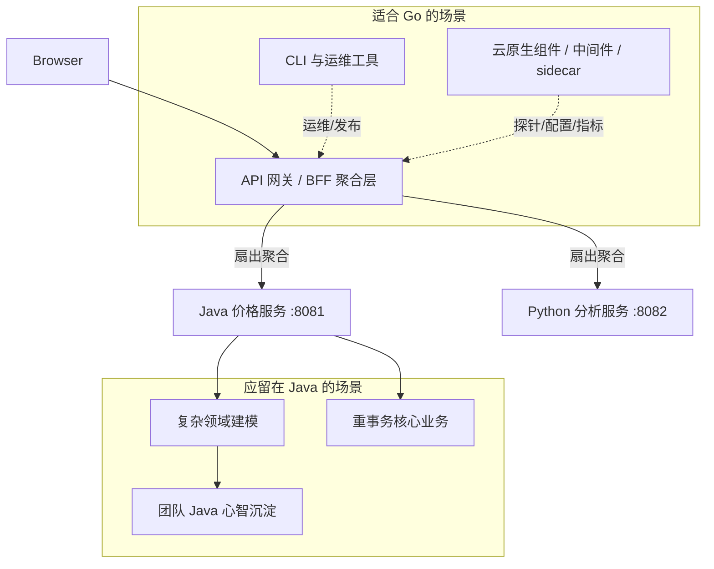
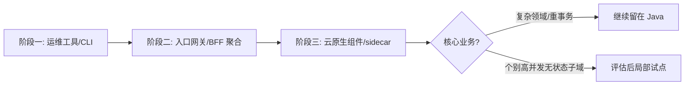

# 第 7 章 Go 在全栈架构下的落地场景实战

> 所属篇章：第二篇 Java 眼中的 Go 世界

**本章技术占比**：技术 50% + 引导 20% + 案例 30%

**前置 Java 知识映射**：Spring Cloud Gateway 与 BFF 聚合、Nginx/OpenResty 入口层、Maven 打 fat jar + JVM 运行模型、GraalVM native-image、Spring Boot Actuator 健康检查、Kubernetes 与容器化部署基础

## 本章导读

前面几章我们逐条对比了 Go 与 Java 的语法和并发差异。但工程决策从来不是「哪门语言更优雅」，而是「在这条具体链路的这个环节，该由谁来干」。本章要回答的正是这个问题：**在一套以 Java 为主干的企业全栈架构里，Go 真正值得落地的场景有哪些，又有哪些场景引入 Go 只会增加维护成本。**

这里必须先把一个常见误区说破：学会一门新语言，最大的诱惑是想「用它重写一切」。你刚体会到 Go 编译快、二进制小、并发轻，很容易产生「不如把订单服务也用 Go 重写一遍」的冲动。这几乎总是错的。语言的价值来自它和场景的匹配度，而不是它的新鲜感。Java 用二十年沉淀出的事务模型、领域建模能力、团队协作规范，不会因为 Go 的启动快 800 毫秒就失去意义。

所以本章的叙述会刻意「一半讲能用、一半讲别用」。我们会用价格计算平台里那个真实的 Go 网关（`:8080`，聚合 Java `:8081` 与 Python `:8082`，靠 `X-Trace-Id` 串联）作为主线，说明网关、CLI 工具、云原生组件这三类场景为什么天然适合 Go；也会用同样的篇幅说清楚：复杂领域、重事务业务、以及团队心智成本高的地方，为什么应该继续留在 Java，以及如果确实要引入 Go，正确的渐进路径是什么。

需要提前声明：本章不会给出任何「Go 比 Java 快 X%」「省了 Y% 成本」这类精确数字——这类数字高度依赖具体业务、机型和压测口径，脱离上下文的百分比是误导。我们只做**定性 + 机制**的对比：栈大小、GC 行为、启动时间的数量级差异从哪里来，为什么会在某类场景放大或收窄。技术基线是 JDK 21 与 Go 1.22+。

## 技术地图



## 知识点拆解

| 小节 | 技术内容 | Java 视角切入 | 落地案例 |
| --- | --- | --- | --- |
| 7.1 | API 网关 / BFF 聚合层：高并发扇出、低内存足迹、快冷启动 | 对标 Spring Cloud Gateway / BFF / `WebClient` 并发聚合 | 价格平台 Go 网关聚合 Java + Python 只读接口 |
| 7.2 | CLI 与运维工具：交叉编译、单二进制分发、零运行时依赖 | 对标 Java CLI 需 JVM 或 GraalVM native-image 的取舍 | 一个跨平台的下游健康巡检 CLI |
| 7.3 | 云原生组件与中间件：Operator/sidecar、探针、指标暴露 | 对标 Spring Boot Actuator、Java 写 K8s 控制器的重量 | Prometheus 指标 + 健康聚合 sidecar |
| 7.4 | 何时不该用 Go：领域/事务/团队边界与渐进引入路径 | 对标 Java 在复杂业务与团队协作上的既有优势 | 从网关切入、核心留 Java 的分阶段方案 |

## 7.1 高性能 API 网关与 BFF 聚合层

### Java 中我们通常怎么做

在纯 Java 体系里，网关和 BFF（Backend For Frontend）这一层有非常成熟的方案。入口治理可以用 Spring Cloud Gateway，它基于 Reactor + Netty，提供路由断言、过滤器链、限流（配合 Redis）、熔断（配合 Resilience4j）。如果要做 BFF 聚合——即把后端多个细粒度服务合并成一个「前端要什么就给什么」的粗粒度接口——通常会写一个 Spring Boot 应用，用 `WebClient` 或 `RestClient` 并发调用下游，再把结果拼装成一个响应。

```java
// Java BFF：用 WebClient 并发聚合两个下游，Reactor 编排
public Mono<PriceView> aggregate(String sku, String traceId) {
    Mono<PriceResult> price = priceClient.get()
        .uri("/api/v1/price/calculate?sku={s}", sku)
        .header("X-Trace-Id", traceId)
        .retrieve().bodyToMono(PriceResult.class)
        .timeout(Duration.ofMillis(1500));
    Mono<TrendResult> trend = analyzeClient.get()
        .uri("/api/v1/trend/{s}", sku)
        .header("X-Trace-Id", traceId)
        .retrieve().bodyToMono(TrendResult.class)
        .timeout(Duration.ofMillis(1500));
    // zip 并发合并，任一超时则整体降级
    return Mono.zip(price, trend)
        .map(t -> new PriceView(t.getT1(), t.getT2()));
}
```

这套方案功能完备、生态成熟。但它有两个和「入口层」定位不太契合的代价。第一是**内存足迹**：一个 Spring Cloud Gateway 实例即使空跑，JVM 堆加上元空间、线程栈，常驻内存通常也在数百 MB 量级；网关往往要横向铺很多副本，这个基数会被乘上副本数。第二是**冷启动**：JVM 要加载类、JIT 预热，Spring 上下文要扫描装配，从进程启动到能稳定承接第一批请求，通常是秒级甚至十几秒级。对一个需要频繁滚动发布、需要在流量高峰被 K8s HPA 快速拉起新副本的入口层来说，这个启动时间直接影响弹性响应速度。

### Go 的对应设计

Go 在网关/BFF 这一层的适配，本质来自三个机制层面的特性，而不是玄学的「快」。

**其一，goroutine 让扇出聚合的写法既直白又轻。** 网关的核心动作就是「把一个入站请求扇出成对多个下游的并发调用，再收敛结果」。在 Go 里这就是几个 goroutine + `sync.WaitGroup`（或 `errgroup`），每个 goroutine 阻塞在自己的 HTTP 调用上。goroutine 初始栈只有 2KB 并按需增长，调度在用户态完成，所以「一个入站请求对应几个下游 goroutine」这种模型即便在高并发扇出下，内存和调度开销也很低——你不需要像 Java 那样精心配置线程池大小来避免线程爆炸，也不需要为了省线程去写 Reactor 那套回调/操作符编排。

```go
// Go BFF：errgroup 并发聚合两个下游，任一失败可控降级
type priceView struct {
    Price *priceResult `json:"price"`
    Trend *trendResult `json:"trend"`
}

func aggregate(ctx context.Context, sku, traceID string) (*priceView, error) {
    // 给整个扇出挂一个总超时，随 ctx 向下游传播
    ctx, cancel := context.WithTimeout(ctx, 1500*time.Millisecond)
    defer cancel()

    var view priceView
    g, gctx := errgroup.WithContext(ctx)
    g.Go(func() error {
        p, err := callPrice(gctx, sku, traceID) // 阻塞在自己的 HTTP 调用上
        view.Price = p
        return err
    })
    g.Go(func() error {
        t, err := callTrend(gctx, sku, traceID)
        view.Trend = t
        return err
    })
    if err := g.Wait(); err != nil {
        return nil, err // 上层据此决定整体降级还是部分返回
    }
    return &view, nil
}
```

这段代码和前面 Java 的 `Mono.zip` 做的是同一件事，但心智模型完全不同：Java 版是「声明式编排一条异步数据流」，Go 版是「写同步阻塞代码，让运行时替你调度」。对入口层这种逻辑简单、并发密集的场景，后者的可读性和可调试性通常更好——你可以在每个 goroutine 里直接打断点、直接 `defer resp.Body.Close()`，栈追踪也是线性的。

**其二，单二进制 + 小镜像 + 快冷启动，恰好命中入口层的部署诉求。** Go 编译出的是静态链接的单个可执行文件，塞进 `scratch` 或 `distroless` 基础镜像后，网关镜像可以做到十几 MB 量级，而带 JRE 的镜像通常在一两百 MB 量级。进程启动没有 JVM 类加载和 JIT 预热，是毫秒到亚秒级。对一个要频繁发版、要被 HPA 快速扩缩的入口层，小镜像意味着更快的拉取和调度、更小的常驻内存基数，快启动意味着扩容时新副本能更早分担流量。

**其三，无 GC 停顿焦虑（但不是无 GC）。** Go 有 GC，但它是并发标记清除、以低延迟为设计目标，没有 Java 那种需要在 G1/ZGC 之间反复调参、盯着 STW 曲线的运维负担。对延迟敏感的入口层，这减少了一类常见的调优工作。注意这不是说 Go 没有 GC 或一定更快——重计算、大堆场景下 JVM 成熟的分代 GC 反而可能更优——而是说在「短生命周期请求对象为主」的网关负载下，Go 的 GC 模型更省心。

价格平台里的 `go-gateway/main.go` 就是这个定位的最小骨架：它读取或补全 `X-Trace-Id`，把请求转发到 Java 价格服务，超时则映射成统一错误响应，并暴露 `/health`。它刻意不做任何价格计算——那是 Java `:8081` 的职责。

### 全栈选型逻辑

判断一个环节该不该交给 Go 网关，就看它是否同时满足「逻辑轻、并发高、要弹性」。价格平台的读路径完美符合：前端要一次拿到「基础价 + 会员优惠 + 历史趋势 + 价格分」，其中价格计算在 Java、趋势分析在 Python，网关只做扇出、收敛、统一响应壳、traceId 透传——没有一行业务规则。这类只读聚合放在 Go 网关，前端请求次数下降、下游被超时隔离保护、入口层还能独立弹性伸缩。

反过来，如果这一层开始出现「根据聚合结果改写业务状态」「按复杂规则决定优惠」的需求，那就说明职责漂移了，应该把逻辑推回 Java，而不是让网关越权。网关是玻璃门厅，不是账房。

### Java 开发者容易踩的坑

1. **把 Spring 的分层照搬进 Go 网关**。Java 网关项目常见 controller/service/manager/dao 四层，很多人到 Go 也建同样的目录。但网关逻辑本就单薄，过度分层会让一个转发 handler 拆成四个文件、绕三层接口。Go 网关更适合扁平的 `handler + client + middleware` 三段式，把复杂度留给真正复杂的 Java 域服务。

2. **扇出时忘了传播 `context` 取消，导致 goroutine 泄漏**。这是最典型也最隐蔽的坑。下面是错误写法——总超时到了，但子调用没有拿到取消信号：

   ```go
   // 错误：每个子调用各起一个背景 context，父超时无法向下传播
   func aggregateBad(sku string) (*priceView, error) {
       var view priceView
       g := new(errgroup.Group)
       g.Go(func() error {
           // context.Background() 与父超时脱钩，父端放弃后这里仍在跑
           p, err := callPrice(context.Background(), sku, "")
           view.Price = p
           return err
       })
       // 若客户端已断开、父 ctx 已 cancel，这些 goroutine 仍阻塞在慢下游上，累积成泄漏
       return &view, g.Wait()
   }
   ```

   正确做法是像前面示例那样用 `errgroup.WithContext(ctx)` 拿到派生的 `gctx`，并把它一路传到 `http.NewRequestWithContext`，这样父端一取消，所有在途下游调用会立即收到 `context.Canceled` 并返回，goroutine 及时回收。

3. **误以为 Go 网关能「零配置扛住一切」而不做限流与超时隔离**。goroutine 便宜不代表可以无限扩张——每个 goroutine 背后可能是一个下游 TCP 连接和一份缓冲。没有限流的网关在下游变慢时，在途 goroutine 和连接会堆积，最终打爆下游或自身。入口层的超时（如 `main.go` 里 `http.Client{Timeout: 1500ms}`）、并发上限、下游连接池，一个都不能省。

4. **直接拼字符串造 JSON**。`main.go` 为了极简用了字符串拼 body，教学可以，生产不行——SKU 里一个引号就能破坏 JSON 甚至造成注入。正式代码请用 `encoding/json` 的 `Marshal`，让转义交给标准库。

## 7.2 CLI 与运维工具：交叉编译与单二进制分发

### Java 中我们通常怎么做

Java 写命令行工具与运维脚本当然可行：Picocli、Spring Shell 都很好用，业务逻辑还能直接复用现有 Java 库。但分发环节是老大难。一个 Java CLI 的产物是 jar，跑起来需要目标机器上有匹配版本的 JRE/JDK。给运维、给客户、给一台刚装好的裸机分发工具时，你要么假设对方已装好 Java（版本还得对得上），要么连 JRE 一起打包（体积几十上百 MB），要么用 GraalVM `native-image` 编译成原生可执行文件。

`native-image` 确实能产出无需 JVM 的单二进制，接近 Go 的分发体验，但代价不小：它对反射、动态代理、资源加载需要显式配置（reachability metadata），很多依赖反射的框架要额外适配；编译过程慢、吃内存；而且交叉编译支持有限，通常需要在目标平台或对应容器里构建。也就是说，Java 要达到「一个文件、拷过去就能跑、还能跨平台出包」这个效果，是可以的，但要付出可观的工程配置成本。

### Go 的对应设计

「单二进制、无运行时依赖、交叉编译」是 Go 的原生能力，几乎零配置。运维和 CLI 工具是 Go 最没有争议的适用场景之一。

交叉编译只需设两个环境变量 `GOOS`（目标操作系统）与 `GOARCH`（目标架构），在任意一台开发机上就能一次性出全平台包，不需要目标机器、不需要交叉工具链（纯 Go 代码时）：

```powershell
# 在一台开发机上交叉编译出三平台二进制（PowerShell 写法）
$env:GOOS="linux";   $env:GOARCH="amd64"; go build -o dist/healthcheck-linux-amd64   ./cmd/healthcheck
$env:GOOS="darwin";  $env:GOARCH="arm64"; go build -o dist/healthcheck-darwin-arm64  ./cmd/healthcheck
$env:GOOS="windows"; $env:GOARCH="amd64"; go build -o dist/healthcheck-windows-amd64.exe ./cmd/healthcheck
```

产物直接拷到目标机器就能运行，不装任何运行时。下面是一个接近可用的运维小工具：巡检价格平台三个下游的 `/health`，任一不健康则以非零退出码返回，方便接进发布流水线或 crontab 告警。

```go
// cmd/healthcheck/main.go —— 跨平台下游健康巡检 CLI
package main

import (
    "context"
    "encoding/json"
    "flag"
    "fmt"
    "net/http"
    "os"
    "strings"
    "time"
)

func main() {
    // 用标准库 flag 解析参数：--targets 逗号分隔，--timeout 每个探测的超时
    targets := flag.String("targets", "http://localhost:8080,http://localhost:8081,http://localhost:8082", "逗号分隔的健康检查地址前缀")
    timeout := flag.Duration("timeout", 2*time.Second, "单次探测超时")
    flag.Parse()

    client := &http.Client{Timeout: *timeout}
    failed := 0
    for _, base := range strings.Split(*targets, ",") {
        url := strings.TrimSpace(base) + "/health"
        ok, detail := probe(client, url)
        if ok {
            fmt.Printf("[UP]   %s  %s\n", url, detail)
        } else {
            fmt.Printf("[DOWN] %s  %s\n", url, detail)
            failed++
        }
    }
    if failed > 0 {
        // 非零退出码：CI/crontab 可据此判定巡检失败
        os.Exit(1)
    }
}

func probe(c *http.Client, url string) (bool, string) {
    ctx, cancel := context.WithTimeout(context.Background(), c.Timeout)
    defer cancel()
    req, _ := http.NewRequestWithContext(ctx, http.MethodGet, url, nil)
    resp, err := c.Do(req)
    if err != nil {
        return false, err.Error()
    }
    defer resp.Body.Close()
    if resp.StatusCode != http.StatusOK {
        return false, "status=" + resp.Status
    }
    var body struct {
        Data struct {
            Status string `json:"status"`
        } `json:"data"`
    }
    _ = json.NewDecoder(resp.Body).Decode(&body)
    return true, "status=" + body.Data.Status
}
```

这个工具全程只用标准库，`go build` 出来是一个几 MB 的可执行文件，跨三平台出包也就是上面三行命令。相比之下，用 Java 实现同样功能、达到同样的分发体验，要么依赖目标机 JRE，要么走 `native-image` 那套配置。这就是为什么运维圈子里大量工具（kubectl、helm、terraform、gh 等）都是 Go 写的——不是因为它们计算密集，而是因为「拷一个文件就能跑、一次编译全平台」对工具分发是决定性优势。

### 全栈选型逻辑

在一个 Java 为主的团队里，CLI 与运维工具是引入 Go 成本最低、收益最直接的切口。它们通常无状态、逻辑独立、不碰核心业务库，即便完全用另一门语言写，也不会污染主业务代码，团队接受度最高。发布巡检、配置校验、日志切割、批量数据订正、一次性迁移脚本——这些「用 Java 写嫌重、用 Bash 写嫌脆」的工具，Go 是很好的中间选择：有类型和错误处理的严谨，又有脚本级的分发便利。

要留意的反例是：如果这个工具需要大量复用现有 Java 领域模型（比如要用到复杂的定价规则库），那用 Go 重写这套规则的成本，可能远高于它带来的分发便利，此时反而应该用 Java + Picocli，或者干脆让工具通过网关调用 Java 服务，而不是重新实现业务逻辑。

### Java 开发者容易踩的坑

1. **以为 `CGO` 关闭下所有交叉编译都零配置**。纯 Go 代码交叉编译确实零配置，但一旦依赖了 cgo（比如某些 sqlite、图像、加密库绑定了 C），交叉编译就需要目标平台的 C 交叉工具链，复杂度陡增。做 CLI 工具时优先选纯 Go 实现的依赖，并在构建时显式 `CGO_ENABLED=0`，把「单二进制」这个红利守住。

2. **忽略退出码语义**。Java 开发者习惯抛异常让框架处理，写 CLI 时容易忘了 Unix 工具的契约是「用退出码表达成败」。像上面 `os.Exit(1)` 那样，成功 0、失败非零，才能被 `&&`、CI 步骤、crontab 正确判定。打印一句「失败了」但仍然退出 0，会让上游流水线误以为成功。

3. **把 `flag` 当成 Spring 的 `@Value` 全局注入**。Go 标准库 `flag` 只做进程入参解析，没有配置中心、profile、自动绑定那一套。需要多来源配置（文件 + 环境变量 + 命令行）时，用 `spf13/cobra` + `viper` 这类库，而不是硬把 Spring 的配置心智搬过来。

4. **交叉编译后没测目标平台的换行/路径分隔**。在 Windows 开发机上给 Linux 出包时，硬编码的 `\` 路径分隔、`\r\n` 换行会在目标平台出问题。用 `filepath` 包处理路径、注意文本换行，别假设开发机和运行机是同一个操作系统。

## 7.3 云原生组件与中间件：Go 与生态的天然亲和

### Java 中我们通常怎么做

Java 在云原生「之上」运行得很好——Spring Boot 应用打进容器、跑在 K8s 上，配 Actuator 暴露 `/actuator/health` 和 `/actuator/prometheus`，是标准操作。但当你要写云原生「基础设施本身」时，情况就不同了。比如写一个 Kubernetes Operator（自定义控制器）、一个随业务 Pod 一起部署的 sidecar、一个轻量的指标采集代理、一个服务网格的数据面组件——这些东西的诉求是：常驻内存极小（sidecar 要和主容器共享节点资源，几百 MB 的 JVM 基座是奢侈）、启动极快（节点上成百上千个 sidecar）、并发处理网络事件轻量。用 Java 写这类组件不是不能，而是「资源基座」和「组件应有的轻量」天然冲突。

### Go 的对应设计

这里有一个可以核实的客观事实：**当今云原生基础设施的主干几乎都是 Go 写的**。Docker、Kubernetes、etcd、Prometheus、Containerd、Helm、Istio 的控制面、Terraform——这些项目均以 Go 为主要实现语言。这不是巧合，而是 Go 的特性和这类组件的诉求高度吻合：单二进制便于作为基础镜像层分发、goroutine 便于处理大量并发的 watch/事件流、小内存基座适合密集部署的 sidecar、静态链接减少运行时依赖冲突。

正因为生态是 Go 写的，Go 写云原生组件还享有「一等公民」的库支持：`client-go` 是官方 Kubernetes 客户端、`controller-runtime` 是写 Operator 的官方框架、`prometheus/client_golang` 是指标暴露的官方库。用 Java 写 Operator 也有 fabric8 这类客户端，但它始终是「适配层」，而 Go 生态里这就是原生路径。

下面是一个接近可用的例子：一个健康聚合 + 指标暴露的 sidecar，它定期探测本节点上的下游、把结果聚合成一个 `/health`，同时以 Prometheus 文本格式暴露 `/metrics`，供集群的 Prometheus 抓取。

```go
// cmd/healthsidecar/main.go —— 健康聚合 + Prometheus 指标 sidecar
package main

import (
    "context"
    "fmt"
    "net/http"
    "sync"
    "sync/atomic"
    "time"
)

// upstreams 为要巡检的下游；生产中应从配置注入
var upstreams = map[string]string{
    "java-price":   "http://localhost:8081/health",
    "python-anal":  "http://localhost:8082/health",
}

// 用原子值缓存最近一次探测结果，供 /health 与 /metrics 并发读取
type state struct {
    up   sync.Map // name -> *int32(1 健康 / 0 异常)
}

func main() {
    st := &state{}
    for name := range upstreams {
        var v int32
        st.up.Store(name, &v)
    }

    // 后台探测循环，与请求处理解耦：请求侧只读缓存，不阻塞在下游上
    go st.probeLoop(2 * time.Second)

    http.HandleFunc("/health", func(w http.ResponseWriter, r *http.Request) {
        allUp := true
        st.up.Range(func(_, val any) bool {
            if atomic.LoadInt32(val.(*int32)) != 1 {
                allUp = false
                return false
            }
            return true
        })
        if allUp {
            w.Write([]byte(`{"code":0,"message":"OK","data":{"status":"UP"},"traceId":"sidecar"}`))
            return
        }
        w.WriteHeader(http.StatusServiceUnavailable)
        w.Write([]byte(`{"code":50300,"message":"downstream degraded","data":{"status":"DOWN"},"traceId":"sidecar"}`))
    })

    // Prometheus 抓取端点：这里手写文本格式以展示机制，生产用 client_golang
    http.HandleFunc("/metrics", func(w http.ResponseWriter, r *http.Request) {
        w.Header().Set("Content-Type", "text/plain; version=0.0.4")
        st.up.Range(func(key, val any) bool {
            fmt.Fprintf(w, "upstream_healthy{name=%q} %d\n",
                key.(string), atomic.LoadInt32(val.(*int32)))
            return true
        })
    })

    http.ListenAndServe(":9101", nil)
}

func (st *state) probeLoop(interval time.Duration) {
    client := &http.Client{Timeout: interval}
    ticker := time.NewTicker(interval)
    defer ticker.Stop()
    for range ticker.C {
        for name, url := range upstreams {
            ctx, cancel := context.WithTimeout(context.Background(), interval)
            req, _ := http.NewRequestWithContext(ctx, http.MethodGet, url, nil)
            resp, err := client.Do(req)
            healthy := int32(0)
            if err == nil {
                if resp.StatusCode == http.StatusOK {
                    healthy = 1
                }
                resp.Body.Close()
            }
            if v, ok := st.up.Load(name); ok {
                atomic.StoreInt32(v.(*int32), healthy)
            }
            cancel()
        }
    }
}
```

这个 sidecar 的设计要点，正好体现了 Go 在这类场景的自然感：探测在后台 goroutine 循环里做，`/health` 和 `/metrics` 只读原子缓存，请求永不阻塞在下游上；整个进程编译成一个几 MB 的二进制，作为 sidecar 和主容器共享节点时基座极小、启动极快。把 `atomic` 换成 `prometheus/client_golang` 的 `Gauge`、把手写文本换成官方 `promhttp.Handler()`，就是生产级写法，而这些库都是 Go 生态的原生一等公民。

### 全栈选型逻辑

云原生组件是 Go 相对 Java 优势最结构性的场景——不是「Go 也能做」，而是「生态就是 Go 建的，逆着生态用 Java 要付出适配税」。如果你的团队要写 Operator、sidecar、Prometheus exporter、准入控制 webhook、CNI/CSI 插件这类东西，默认选 Go 几乎不需要论证。反之，业务应用「跑在」云原生平台上，则完全没必要为了「云原生」把 Spring Boot 服务重写成 Go——那属于下一节要讲的「不该用 Go」。

一个实用的分界：**你在写的是「平台/基础设施」还是「业务」？** 前者交给 Go，后者留给 Java。健康聚合 sidecar、指标 exporter 属于前者；价格计算、订单履约属于后者。

### Java 开发者容易踩的坑

1. **把 Actuator 的「开箱即用」预期带到 Go**。Spring Boot 加个依赖就有一整套 health/metrics/trace 端点，很多 Java 开发者以为 Go 也有等价物。Go 更偏「自己组装」：健康检查、指标、优雅关闭都要显式接线。这不是缺失，而是取向——但你要预期到需要手动搭这些脚手架，别指望一个注解全搞定。

2. **sidecar 里用无界 goroutine/channel 处理事件流**。watch K8s 资源、消费事件时，若每个事件都起一个 goroutine 又不设上限，事件洪峰会让 goroutine 与内存失控。要用带缓冲的 worker 池或限速队列（`client-go` 提供 `workqueue`），把「便宜的并发」约束在可控范围内。

3. **探测逻辑和请求处理耦合，导致健康端点自己被拖垮**。反面写法是 `/health` 被调用时才同步去探测所有下游——下游一慢，你的健康端点也跟着慢甚至超时，K8s 反而误判本 Pod 不健康把它杀掉。正确做法如上例：后台循环探测、请求侧只读缓存，让健康端点的响应时间和下游解耦。

4. **忽略优雅关闭，导致滚动更新丢事件**。K8s 发 `SIGTERM` 后组件应停止接新活、把在途处理完再退出。Go 里要自己 `signal.Notify` 捕获信号、`server.Shutdown(ctx)` 关闭、等 worker 收尾。漏了这步，滚动更新时会丢正在处理的事件或连接。

## 7.4 何时不该用 Go：边界判断与渐进引入路径

### Java 中我们通常怎么做

前三节都在讲 Go 的适用场景，这一节要认真讲它的**不适用**场景——这对一个 Java 为主的团队同样重要，甚至更重要。Java 之所以在企业核心系统里占据主导，是因为它在几件事上确有难以替代的优势：复杂领域建模（丰富的 OOP 表达力、成熟的 DDD 战术模式落地）、重事务业务（Spring 声明式事务、JPA/MyBatis 与关系库的深度整合、分布式事务方案）、以及二十年沉淀的团队协作规范和人才供给。一个订单履约、资金结算、库存扣减这样的系统，其价值恰恰在于把纷繁的业务规则、状态机、一致性约束沉淀在代码里——这正是 Java 生态最强的地方。

### Go 的对应设计

Go 的语言取向是「少即是多」：它刻意不提供继承、没有方法重载、泛型克制、错误处理啰嗦但显式。这套取向让基础设施和网关代码简洁可控，但也意味着**它不擅长表达高度复杂、层次丰富的领域模型**。当你的业务需要大量抽象层次、复杂的多态、丰富的领域对象协作时，Go 的极简会变成掣肘——你会发现自己在用一堆 struct + 函数吃力地模拟 Java 里一个继承体系或策略族轻松表达的东西。

具体到几类明确不该用 Go 的场景：

- **复杂领域建模与重事务核心业务**。规则密集、状态机复杂、强一致性要求、需要和关系库深度打交道的核心域，留在 Java。Go 生态里 ORM（如 GORM）和事务方案的成熟度、约定丰富度，与 Spring + JPA/MyBatis 这套仍有明显差距，重写不划算还引入风险。

- **团队心智成本高于收益时**。如果团队是清一色 Java 背景、没有 Go 运维经验，为一个非入口、非工具的普通业务模块引入 Go，意味着要同时承担第二套构建/依赖/监控/排障体系、招聘面变窄、代码评审跨语言。除非这个模块确有 Go 的结构性收益（高并发入口、需极致分发、云原生组件），否则这笔心智税不值得付。

- **需要重度复用现有 Java 库的场景**。若逻辑深度依赖既有 Java 领域库或第三方 Java SDK，用 Go 重写等于重建轮子。

必须警惕的是「重写一切」的冲动。它常以「我们统一技术栈」「Go 性能更好」的名义出现，但把一个运转良好、规则沉淀多年的 Java 核心系统重写成 Go，风险极高、收益模糊，且往往低估了隐藏在旧代码里的业务知识。

正确的做法是**渐进引入，从边缘到核心、从无状态到有状态**。一条务实的路径：



先从**运维工具/CLI**切入（无状态、不碰业务库、团队接受度最高，风险最低）；团队攒够 Go 的构建、部署、排障经验后，再让 Go 承接**入口网关/BFF 聚合**（逻辑轻、并发高、有弹性收益）；进一步再写**云原生组件/sidecar**（顺生态、优势结构性）。至于核心业务，默认继续留在 Java；只有当某个子域确实是「高并发、无状态、逻辑简单」且已被前几步验证，才谨慎局部试点。每一步都让 Go 承担它真正擅长的部分，而不是一次性把赌注压在重写上。

### 全栈选型逻辑

选型的终极判据始终是**业务链路的职责，而非语言偏好**。把架构想成三段：入口治理（网关/BFF）、核心交易（复杂领域/事务）、辅助能力（数据分析/工具/组件）。Go 天然适合第一段和第三段里偏基础设施的部分，Java 稳守第二段核心交易，Python 承接数据与 AI 辅助。三者不是竞争关系而是分工关系——真正的架构能力，是清楚地画出这些边界，并抵抗住「用一门语言统一一切」的诱惑，无论那门语言是 Java 还是 Go。

### Java 开发者容易踩的坑

1. **把「Go 快」当成通用性能结论去指导选型**。Go 在启动时间、内存足迹、并发扇出上的优势是特定机制带来的（无 JVM 预热、goroutine 轻量、GC 面向低延迟），但在长时间运行的重计算、大堆、需要 JIT 深度优化的负载上，成熟的 JVM 反而可能更快。用「启动快」去论证「所以核心计算服务也该用 Go」是典型的以偏概全。

2. **低估重写的隐性成本，尤其是丢失的业务知识**。一个跑了多年的 Java 核心服务，代码里沉淀了大量 corner case 和业务规则，很多没有文档。重写成 Go 时最大的风险不是语言不熟，而是「不知道自己不知道」的规则丢失。渐进路径之所以从边缘切入，正是为了避免一上来就动这块高风险区域。

3. **两套技术栈却不统一可观测契约**。引入 Go 后若 traceId、日志字段、错误码、指标命名各搞一套，跨语言排障会变成灾难。本书全程强调的 `X-Trace-Id` 契约、统一响应壳，正是为了让 Go 网关和 Java 服务在日志与链路上「说同一种话」。引入新语言时，可观测契约必须先统一。

4. **为了「技术先进」而非业务需要引入 Go**。最隐蔽的坑是决策动机错位——因为想学、因为简历、因为「大厂都在用」而引入 Go，而不是因为某个环节真有 Go 的结构性收益。技术选型一旦脱离业务链路的实际诉求，无论选哪门语言都会埋下维护负担。

## 对比代码示例

```java
// Java: Spring MVC 风格的统一响应
public record ApiResponse<T>(int code, String message, T data, String traceId) {
    public static <T> ApiResponse<T> ok(T data, String traceId) {
        return new ApiResponse<>(0, "OK", data, traceId);
    }
}
```

```go
// Go: 与 Java ApiResponse 对齐的响应壳
type ApiResponse struct {
    Code    int         `json:"code"`
    Message string      `json:"message"`
    Data    interface{} `json:"data,omitempty"`
    TraceID string      `json:"traceId"`
}
```

```python
# Python: 与 Java DTO 对齐的分析入参
from dataclasses import dataclass

@dataclass
class PriceAnalysisRequest:
    sku: str
    base_price: float
    member_level: str
```

这三段代码共同表达同一件事：跨语言协同首先要统一契约。Java 的 record、Go 的 struct、Python 的 dataclass 都只是承载结构的方式，真正需要团队统一的是字段名称、错误码语义、traceId 传递方式和版本兼容策略。本章反复出现的场景判断——网关聚合、CLI 巡检、sidecar 探针——之所以能拼成一套架构，前提正是这层共同契约把三种语言黏在了一起。

## 章节综合案例：基于 Go 的 API 网关简易实现

综合案例保留原主题：以价格平台的 Go 网关为骨架，展示入口层该做什么、不该做什么。网关代码强调入口治理——请求 ID 注入、鉴权、限流、超时、下游错误映射——它不承载交易规则，避免把 Java 核心域逻辑搬到入口层导致职责漂移。

### 场景输入

用户请求某个 SKU 的实时价格，系统需要读取商品基础价、计算会员优惠、调用分析服务返回历史价格趋势与价格分数，最终对前端返回统一响应。这正是 7.1 节「逻辑轻、并发高、要弹性」的典型只读聚合场景。

### 关键流程

1. 网关层校验请求头、生成或透传 traceId、执行限流与超时隔离（对应 `main.go` 的 `X-Trace-Id` 补全与 `http.Client{Timeout: 1500ms}`）。
2. Java 核心服务计算价格，保证复杂优惠规则集中在 `:8081`——这是 7.4 节强调「核心交易留在 Java」的落点。
3. Python 分析服务处理历史数据，返回趋势、波动率、推荐分。
4. 所有服务按同一响应壳返回，日志中携带相同 traceId，实现跨语言链路可追踪。

### 本章落地点

读者完成本章后，应能把「Go 在全栈架构下的落地场景」放回企业项目链路里解释三件事：这个环节为什么适合（或不适合）Go——是否满足逻辑轻/并发高/要弹性，或是否属于云原生基础设施；如果引入 Go，正确的渐进顺序是先工具、再网关、后组件；以及跨语言之后必须补齐的工程治理——统一 traceId、错误码、日志字段、超时与限流。

## 本章小结

1. Go 值得落地的三类场景有共同特征：API 网关/BFF 靠 goroutine 扇出 + 小镜像快启动契合入口层弹性；CLI/运维工具靠交叉编译单二进制契合分发；云原生组件顺着 Go 建的生态获得一等公民库支持。
2. 这些优势来自具体机制（无 JVM 预热、goroutine 轻量栈、面向低延迟的 GC、静态链接），不是笼统的「Go 更快」——重计算大堆场景成熟 JVM 仍可能更优。
3. 复杂领域建模、重事务核心业务、以及团队心智成本高于收益的地方，应继续留在 Java；要抵抗「重写一切」的冲动。
4. 引入 Go 的正确姿势是渐进：先工具、再网关、后组件，核心业务默认留 Java，且全程统一 traceId、错误码、日志与超时的可观测契约。
5. 所有章节案例最终都会汇入第 13 章的电商价格计算平台。

## 选型思考题

1. 你所在系统里，哪个环节同时满足「逻辑轻、并发高、要弹性」？如果把它从 Java 迁到 Go 网关，前端请求次数和入口层弹性会如何变化，又要补上哪些超时与限流治理？
2. 假设团队有人主张「把订单核心服务也用 Go 重写以统一技术栈」，请用本章的场景判据和渐进路径，列出你反对一步到位重写的三条具体理由，以及一个更稳妥的分阶段替代方案。
3. 如果要给你团队引入的第一个 Go 项目，你会选 CLI 工具、入口网关，还是云原生组件？结合团队现有 Java 心智成本与该场景的结构性收益说明理由。

## 延伸阅读资源

1. Go 官方文档《Command cgo》与交叉编译说明（<https://pkg.go.dev/cmd/cgo> 及 `go help build`）：确认 `GOOS`/`GOARCH`/`CGO_ENABLED` 对单二进制分发的影响。
2. Kubernetes 官方 `client-go` 与 `controller-runtime` 仓库（github.com/kubernetes/client-go、github.com/kubernetes-sigs/controller-runtime）：了解用 Go 写 Operator/控制器的原生路径。
3. Prometheus 官方 `client_golang` 文档（<https://pkg.go.dev/github.com/prometheus/client_golang/prometheus>）：把本章手写的指标端点替换为生产级实现。
4. GraalVM Native Image 文档（<https://www.graalvm.org/latest/reference-manual/native-image/>）：对照理解 Java 要达到「单二进制、无 JVM 依赖」需付出的反射/资源配置成本。
5. `spf13/cobra` 与 `spf13/viper`（github.com/spf13/cobra、github.com/spf13/viper）：构建有子命令与多来源配置的生产级 Go CLI。

## 第 7 章场景决策清单

把本章浓缩成一张可以贴在评审会上的清单。判断「这个环节该不该交给 Go」时，逐条自问：

Go 适合，当同时满足：

1. 逻辑轻——主要是转发、聚合、探测、编译，而非复杂业务规则。
2. 并发高或要弹性——入口扇出、频繁扩缩、需要小内存基座与快启动。
3. 需极致分发——要跨平台单二进制、无运行时依赖（CLI/运维工具）。
4. 顺云原生生态——写 Operator/sidecar/exporter，享受 Go 一等公民库。

Go 不适合，当出现任一：

1. 复杂领域建模或重事务、强一致性核心业务。
2. 需重度复用现有 Java 领域库，重写即重建轮子。
3. 团队 Java 心智成本高，且该环节无 Go 的结构性收益。
4. 动机是「统一技术栈/技术先进」而非业务链路的实际诉求。

引入顺序：工具 → 网关 → 组件 → （谨慎评估的）局部核心试点；每一步都先统一 traceId、错误码、日志与超时契约。这张清单一旦成为团队共识，多语言架构就从「谁嗓门大谁说了算」变成「按场景判据说话」，选型分歧也就有了可复用的裁决标准。
