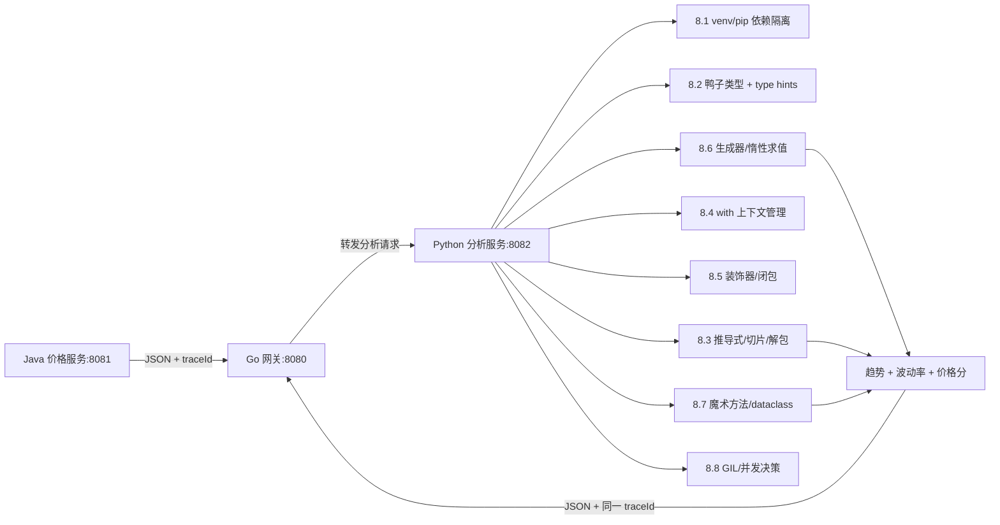

# 第 8 章 Python 基础语法：与 Java 的核心差异映射

> 所属篇章：第三篇 Java 眼中的 Python 世界

**本章技术占比**：技术 50% + 引导 20% + 案例 30%

**前置 Java 知识映射**：Java 类型系统与泛型、集合框架与 Stream、注解与 Spring AOP、受检异常与 try-with-resources、`record`/Lombok、JUC 线程模型、Jackson JSON 处理

## 本章导读

这一章不打算教你 Python 的 `if`、`for`、`while`。作为资深 Java 工程师，你对分支和循环的心智模型早已成型，把 `for (int i = 0; ...)` 翻译成 `for i in range(...)` 是几分钟就能完成的机械动作，读一本书来学这些是浪费时间。

真正值得投入的，是 Python 里 Java 没有、或者做法差异极大的那批特性：装饰器、生成器、推导式、上下文管理器、魔术方法、GIL 并发模型。这些不是语法糖，而是一整套不同的设计哲学——Java 用类型系统和编译期在前置阶段拦截错误，Python 用运行时协议和「约定优于强制」把灵活性交还给开发者。理解这种哲学差异，你才能判断某段业务逻辑该留在 Java，还是交给 Python 更划算。

因此本章的每个小节都用同一套四段式展开：先看「Java 中我们通常怎么做」，再看「Python 的对应设计」，然后回答「全栈选型逻辑」，最后列出「Java 开发者容易踩的坑」。全书的落地场景始终是那条电商价格链路：Go 网关 `:8080` 负责入口治理与限流，Java 价格服务 `:8081` 负责核心交易规则，Python 分析服务 `:8082` 负责历史数据处理与评分，三方通过统一响应壳和 `traceId` 契约串联。本章你会看到，Python 的这些独特特性恰好让它在 `:8082` 这个数据处理节点上事半功倍。

## 技术地图



## 知识点拆解

| 小节 | 技术内容 | Java 视角切入 | 落地案例 |
| --- | --- | --- | --- |
| 8.1 | venv/pip/pyproject.toml 依赖隔离，无编译期依赖检查 | 对标 Maven/Gradle 传递依赖与编译期保障 | 分析服务 `:8082` 的依赖锁定 |
| 8.2 | 动态类型、鸭子类型、type hints、`typing.Protocol`、mypy | 对标静态类型、接口与 `implements` | 解析价格 JSON 时的结构契约 |
| 8.3 | list/dict/set/tuple、推导式、切片、解包 | 对标集合框架与 Stream 链式 | 批量清洗历史价格样本 |
| 8.4 | try/except/else/finally、EAFP、`with` 协议、contextlib | 对标 try-with-resources 与受检异常 | 读取大文件、管理数据库连接 |
| 8.5 | 一等函数、闭包、`*args/**kwargs`、装饰器、`functools.wraps` | 对标函数式接口与 Spring AOP | 给分析接口加计时/重试/鉴权 |
| 8.6 | yield、惰性求值、生成器表达式、iter/next 协议 | 对标 Iterator 与 Stream 惰性 | 流式处理超大历史价格文件 |
| 8.7 | dunder 方法、运算符重载、dataclass(frozen/field) | 对标 `record`/Lombok/equals-hashCode | 定义不可变的价格样本值对象 |
| 8.8 | GIL、CPU/IO 密集边界、threading/multiprocessing/asyncio | 对标 Java 真并行线程与虚拟线程 | 并发拉取多 SKU 历史数据 |

## 8.1 工程化差异：venv 与 pip vs Maven/Gradle

### Java 中我们通常怎么做

Java 的依赖管理由构建工具全程托管。我们在 `pom.xml` 或 `build.gradle` 里声明坐标，Maven 自动解析传递依赖、构建依赖树、执行版本仲裁（最近路径优先），并把产物缓存到本地 `~/.m2`。整个过程的关键在于：依赖信息在编译期就参与验证——如果某个方法签名不存在，`javac` 直接报错，产物根本编译不出来。

```java
// pom.xml 片段：坐标 + 版本由 Maven 统一仲裁
// <dependency>
//   <groupId>com.fasterxml.jackson.core</groupId>
//   <artifactId>jackson-databind</artifactId>
//   <version>2.17.1</version>
// </dependency>

// 编译期即校验：字段名写错、类型不匹配都编译不过
ObjectMapper mapper = new ObjectMapper();
PriceAnalysisRequest req = mapper.readValue(json, PriceAnalysisRequest.class);
```

这套机制的优点是确定性强：CI 里编译通过，基本可以确信类路径是自洽的。缺点是重，一个空项目也要拉一堆传递依赖。

### Python 的对应设计

Python 没有编译期，依赖管理靠「虚拟环境 + 包索引」。`venv` 为每个项目创建独立的解释器和 `site-packages` 目录，`pip` 从 PyPI 下载安装。依赖清单传统上写在 `requirements.txt`，现代项目更推荐 `pyproject.toml`（PEP 621）声明元数据和依赖。

```bash
# 为分析服务 :8082 创建隔离环境
python -m venv .venv
.venv\Scripts\activate          # Windows;  Linux/macOS 用 source .venv/bin/activate
pip install -r requirements.txt
```

```toml
# pyproject.toml：现代 Python 项目的依赖与元数据声明
[project]
name = "price-analysis"
version = "0.3.0"
requires-python = ">=3.11"
dependencies = [
    "httpx>=0.27",        # 拉取上游历史数据
    "pydantic>=2.7",      # 运行时数据校验
]
```

关键差异在于：`pip install` 只在运行到 `import` 那一行时才知道包在不在、版本对不对。依赖没有编译期检查，`requirements.txt` 里写错版本、漏装一个包，都要等到进程跑起来才暴露。因此 Python 工程化的第一要务是「锁定」——用 `pip freeze > requirements.lock` 或 `uv`/`poetry` 生成带哈希的锁文件，把「能跑」的那一刻的完整依赖图固化下来。

### 全栈选型逻辑

分析服务 `:8082` 的依赖面天然偏「数据 + 网络客户端」（httpx、pydantic、numpy 之类），迭代快、更换库频繁，Python 的轻量隔离比 Maven 的重构建更贴合它的节奏。而 Java 价格服务 `:8081` 处在核心交易链路，需要编译期保障和稳定的依赖树来支撑长期演进，留在 Maven 体系更稳。这正是「入口治理 / 核心交易 / 数据辅助」三类职责分栈的一个具体投影：把易变的、以数据为中心的部分放到 Python，把强规则、强一致的部分锁在 Java。

### Java 开发者容易踩的坑

1. **不建虚拟环境，直接往全局装包**。多个项目共用系统解释器，很快出现版本互相打架（A 项目要 pydantic 1.x、B 项目要 2.x）。规则：一个项目一个 `.venv`，永远不 `pip install` 到全局。
2. **只提交 `requirements.txt` 不锁版本**。写 `httpx` 不写版本，今天装到 0.27、下周 CI 装到 0.30，行为漂移却无人察觉。至少写 `httpx>=0.27,<0.28`，生产用锁文件。
3. **误以为 `import` 失败像 Java 一样在启动前就能全量发现**。Python 的 `import` 是运行时按需执行的，某个只在异常分支才 import 的模块缺失，可能上线数天后才在特定请求上崩溃。用一次完整的冒烟测试覆盖所有 import 路径。

## 8.2 动态类型、鸭子类型与类型提示

### Java 中我们通常怎么做

Java 是静态强类型：每个变量、每个参数、每个返回值都有编译期确定的类型。多态通过显式的 `implements`/`extends` 建立——一个类只有声明了 `implements PriceSource`，才能被当作 `PriceSource` 使用。类型契约是名义（nominal）的：名字对上了才算数。

```java
public interface PriceSource {
    long currentPriceCents(String sku);
}

// 必须显式 implements，编译器才认这是一个 PriceSource
public class DbPriceSource implements PriceSource {
    public long currentPriceCents(String sku) { /* 查库 */ return 0L; }
}

void quote(PriceSource src) { /* 编译期就保证 src 一定有 currentPriceCents */ }
```

优点显而易见：重构安全、IDE 补全精准、契约违约在编译期暴露。

### Python 的对应设计

Python 是动态强类型：变量本身没有类型，类型附着在对象上，绑定发生在运行时。多态靠「鸭子类型」——不看你声明了什么，只看你运行时有没有那个方法。「如果它走起来像鸭子、叫起来像鸭子，那它就是鸭子」。

```python
class DbPriceSource:
    def current_price_cents(self, sku: str) -> int:
        ...  # 查库

def quote(src) -> int:
    # 不要求 src 是任何特定类型，只要它有 current_price_cents 即可
    return src.current_price_cents("SKU-1")
```

为了在不牺牲灵活性的前提下找回一部分静态保障，Python 3.5 起引入了 type hints，3.11 的现代写法已经很简洁：内置容器直接下标 `list[str]`、`dict[str, int]`，可空用 `X | None` 而不再是 `Optional[X]`。更重要的是 `typing.Protocol`——它把鸭子类型「结构化」了：一个类不需要显式继承 Protocol，只要方法签名匹配，静态检查器 mypy 就认它是该 Protocol 的子类型（结构化子类型 / structural subtyping）。

```python
from typing import Protocol

class PriceSource(Protocol):
    def current_price_cents(self, sku: str) -> int: ...

# DbPriceSource 没有 implements 任何东西，但结构匹配即可被 mypy 接受
def quote(src: PriceSource) -> int:
    return src.current_price_cents("SKU-1")
```

设计动机很清楚：type hints 是给人和工具看的，解释器**运行时不强制**。`mypy` 在 CI 里做静态检查，把「运行时才炸」的一部分错误提前到提交阶段，但它是可选的、渐进的——你可以只给关键边界加标注，内部细节保持动态。

### 全栈选型逻辑

分析服务 `:8082` 接收 Java 传来的价格 JSON，字段结构由跨语言契约固定。这里恰恰要把 type hints 用足：入参用 `pydantic` 模型或 `dataclass` 声明字段类型，出参用 Protocol 约束，再配 mypy 卡在 CI。这样即便语言是动态的，跨语言边界仍然是「强契约」的——`traceId` 是不是 `str`、`base_price_cents` 是不是 `int`，都在提交时就被校验，不必等到线上解析失败。

### Java 开发者容易踩的坑

1. **把 type hints 当成运行时约束**。`def f(x: int)` 传字符串进去，解释器一声不吭照跑，直到 `x + 1` 才可能报 `TypeError`。类型标注不做运行时校验；要运行时校验请用 pydantic 或手动 `isinstance`。
2. **用 `==` 比较类型或用继承思维套 Protocol**。Java 里习惯 `instanceof`，Python 里对 Protocol 用 `isinstance` 需要给它加 `@runtime_checkable`，且只检查方法名存在、不检查签名。别指望它等价于 Java 的编译期接口校验。
3. **以为不写类型就没事**。动态类型下一个拼错的属性名（`req.trace_id` vs `req.traceId`）不会有任何编译告警，直到那行代码被执行。关键路径务必上 mypy，否则「重构 5 分钟、线上排查 2 小时」。

## 8.3 集合类型与推导式

### Java 中我们通常怎么做

Java 用集合框架 + 泛型表达数据结构：`List`/`Map`/`Set`，配合 Stream 做链式转换。构造和转换往往要显式声明类型、调用 `stream()`、`collect()`。

```java
// 从历史样本里筛出打折超过 15% 的价格，收集成列表
List<Long> deepDiscounts = samples.stream()
        .filter(s -> s.finalCents() * 100L / s.baseCents() <= 85)
        .map(PriceSample::finalCents)
        .toList();
```

Stream 的优点是惰性、可并行、语义清晰，但语法上偏重，简单场景也要一串方法调用。

### Python 的对应设计

Python 内置四种核心容器：`list`（有序可变）、`dict`（键值映射，3.7+ 保持插入序）、`set`（去重集合）、`tuple`（不可变序列，常用于「固定字段的轻量记录」）。真正体现设计哲学的是**推导式**——用一行声明式表达「从可迭代对象构造新容器」：

```python
samples: list[PriceSample] = load_samples()

# 列表推导式：筛选 + 变换一步到位，比 Stream 更紧凑
deep_discounts: list[int] = [
    s.final_cents for s in samples
    if s.final_cents * 100 // s.base_cents <= 85
]

# 字典推导式：以 sku 为键建索引
by_sku: dict[str, PriceSample] = {s.sku: s for s in samples}

# 集合推导式：所有出现过的 sku 去重
seen_skus: set[str] = {s.sku for s in samples}
```

再叠加两个 Java 没有的利器。**切片**：`prices[-5:]` 取最后 5 个、`prices[::2]` 隔一个取一个、`prices[::-1]` 反转，全部零样板。**解包**：`first, *rest = prices` 把首元素和剩余分开，`a, b = b, a` 一行交换，函数返回多值时 `trend, volatility = analyze(...)` 直接拆。这些让「数据搬运」代码的信噪比远高于 Java。

设计动机是：Python 面向数据处理场景，把最高频的「过滤—映射—构造」下沉成语言级语法，而不是库级方法链，读起来更接近数学集合记号。

### 全栈选型逻辑

`:8082` 的核心工作就是把 Java 传来的原始价格数组清洗、分组、聚合成趋势和分数。推导式 + 切片让这类代码短小且贴近业务语义，评审时一眼能看懂「筛什么、变成什么」。相比之下同样的清洗逻辑放在 Java 价格服务里会显得笨重，这也是把数据辅助职责放到 Python 的现实收益之一。

### Java 开发者容易踩的坑

1. **在推导式里堆太多逻辑，写成「一行天书」**。嵌套三层循环 + 多个条件的推导式可读性极差。复杂逻辑该退回普通 `for` 循环或抽成函数，推导式只留「简单过滤 + 简单映射」。
2. **混淆 `{}` 到底是 dict 还是 set**。`{}` 是空 dict，不是空 set；空 set 只能写 `set()`。`{s.sku for s in samples}` 是集合推导，`{s.sku: s for ...}` 才是字典推导，少个冒号语义全变。
3. **以为 tuple 元素不可变就等于「深不可变」**。`tuple` 的长度和绑定不可变，但如果元素是 `list`，那个 list 内部照样能改。需要真正的不可变值对象，见 8.7 的 `frozen dataclass`。
4. **切片越界不报错**。Java 里 `list.get(100)` 抛 `IndexOutOfBoundsException`，但 Python 的 `prices[100:200]` 越界只返回空列表、不报错。依赖「越界即异常」做校验的逻辑会静默失效。

## 8.4 异常处理与上下文管理器

### Java 中我们通常怎么做

Java 区分受检异常和运行时异常，受检异常必须 `throws` 或就地 `catch`，编译器强制你面对它。资源清理用 try-with-resources：实现了 `AutoCloseable` 的资源在 `try (...)` 块结束时自动 `close()`。

```java
// try-with-resources：无论正常还是异常，reader 都会被关闭
try (BufferedReader reader = Files.newBufferedReader(path)) {
    return reader.lines().count();
} catch (IOException e) {
    log.warn("读取历史文件失败 traceId={}", traceId, e);
    throw new AnalysisException("history unavailable", e);
}
```

风格上 Java 偏 LBYL（Look Before You Leap）：先检查条件再动手，配合受检异常把「可能失败」写进签名。

### Python 的对应设计

Python 的异常都是「非受检」的——没有 `throws` 声明，谁想处理谁 `try`。它推崇 EAFP（Easier to Ask Forgiveness than Permission）：先干，出错了再 `except`，而不是前置一堆 `if` 检查。`try/except/else/finally` 四段各司其职：`else` 在**没有异常时**执行，`finally` 无论如何都执行。

```python
try:
    price = cache[sku]          # 先假设命中
except KeyError:                # 没命中再补
    price = load_from_db(sku)
else:
    hits.append(sku)            # 仅当 try 成功时记录命中
finally:
    metrics.incr("cache.access")
```

资源清理靠**上下文管理器**——`with` 语句背后是 `__enter__`/`__exit__` 两个魔术方法组成的协议。进入 `with` 时调 `__enter__`，退出时（无论正常还是异常）调 `__exit__`，等价于 Java 的 try-with-resources，但可以由任意对象实现：

```python
class DbConnection:
    def __enter__(self) -> "DbConnection":
        self.conn = connect()
        return self
    def __exit__(self, exc_type, exc, tb) -> bool:
        self.conn.close()       # 异常与否都关闭
        return False            # 返回 False 表示不吞掉异常，继续向上抛

with DbConnection() as db:      # 退出时自动关闭连接
    rows = db.query(sku)
```

要给函数临时加上下文行为，不必写整个类，`contextlib.contextmanager` 装饰器让你用一个 `yield` 就分出「进入前 / 退出后」：

```python
from contextlib import contextmanager

@contextmanager
def timed(label: str):
    start = time.perf_counter()
    try:
        yield                    # yield 之前是 __enter__，之后是 __exit__
    finally:
        print(f"{label} 耗时 {time.perf_counter() - start:.3f}s")

with timed("清洗历史价格"):
    clean(samples)
```

设计动机：把「成对出现的 setup/teardown」从散落的 `finally` 里收敛成可复用的对象或生成器，谁需要谁 `with`。

### 全栈选型逻辑

`:8082` 处理历史文件和数据库连接时，`with` 保证连接、文件句柄不泄漏，这是 Python 承担 IO 密集数据处理的基本卫生。而 EAFP 风格特别适合解析 Java 传来的 JSON：字段缺失直接 `except KeyError` 兜底，而不是层层 `if 'x' in data`，让解析代码更聚焦主流程。跨语言错误仍要翻译成统一响应壳的错误码，`except` 块里别忘了带上 `traceId` 落日志。

### Java 开发者容易踩的坑

1. **用裸 `except:` 吞掉一切**。`except:` 或 `except Exception:` 会连 `KeyboardInterrupt`、编程错误一起吞掉，故障被掩盖。永远只捕获你能处理的具体异常，如 `except KeyError`。
2. **忘了 `with`，手动 `open` 不 `close`**。`f = open(path)` 后如果中间抛异常，文件句柄泄漏。凡是打开资源一律 `with open(path) as f:`。
3. **`__exit__` 返回值理解错**。`__exit__` 返回 `True` 会**吞掉**异常（相当于 catch 后不 rethrow），返回 `False`/`None` 才让异常继续传播。不小心 `return True` 会让本该上报的错误凭空消失。
4. **把受检异常思维带过来，到处 `try` 包一层**。Python 不强制处理异常，能让它自然向上抛到统一处理层往往更清晰，不要每个调用点都 `try/except` 一遍。

## 8.5 一等函数、lambda 与装饰器

### Java 中我们通常怎么做

Java 8 后有了函数式接口和 Lambda，但函数本身不是一等公民——Lambda 本质是某个 `@FunctionalInterface` 的匿名实现。横切关注点（计时、鉴权、事务）通常交给 Spring AOP，用注解 + 动态代理在方法前后织入逻辑。

```java
@Timed                      // Spring AOP：切面在方法前后插入计时
@PreAuthorize("hasRole('ANALYST')")
public PriceReport analyze(String sku, String traceId) {
    return doAnalyze(sku);
}
```

优点是声明式、和框架深度整合；代价是 AOP 依赖代理机制，自调用不生效、调试栈变深。

### Python 的对应设计

Python 里函数是彻头彻尾的对象：能赋值给变量、当参数传、作返回值、塞进容器。闭包让内层函数捕获外层变量。`*args`/`**kwargs` 让函数接收任意位置参数和关键字参数——这正是写通用包装器的基础。

**装饰器**就是「接收一个函数、返回一个新函数」的高阶函数，`@` 只是语法糖：`@deco` 等价于 `func = deco(func)`。它是 Python 版的「AOP」，但纯语言级、无框架、无代理。

```python
import functools, time

def timed(func):
    @functools.wraps(func)                  # 关键：保留原函数名/docstring/签名
    def wrapper(*args, **kwargs):           # 接收任意参数，透明转发
        start = time.perf_counter()
        try:
            return func(*args, **kwargs)
        finally:
            print(f"{func.__name__} 耗时 {time.perf_counter() - start:.3f}s")
    return wrapper

@timed                                      # analyze = timed(analyze)
def analyze(sku: str, trace_id: str) -> dict:
    ...
```

需要**带参数的装饰器**（如重试 3 次），就再套一层——外层接收参数、返回真正的装饰器：

```python
def retry(times: int):
    def decorator(func):
        @functools.wraps(func)
        def wrapper(*args, **kwargs):
            last = None
            for _ in range(times):
                try:
                    return func(*args, **kwargs)
                except Exception as e:      # 生产中应缩小到具体异常
                    last = e
            raise last
        return wrapper
    return decorator

@retry(times=3)                             # 拉取上游历史数据失败自动重试
def fetch_history(sku: str) -> list[dict]:
    ...
```

常用场景：计时、重试、缓存（`functools.lru_cache`）、鉴权、参数校验、注册路由（FastAPI 的 `@app.get` 就是装饰器）。设计动机是把横切逻辑做成可组合、可读、就地可见的包装，而不需要引入运行时代理框架。

### 全栈选型逻辑

`:8082` 的每个分析端点都要计时、要在失败时对上游重试、要校验 `traceId`。用装饰器把这些横切逻辑收敛成 `@timed`、`@retry(3)`、`@require_trace`，端点函数只留纯业务，既避免了 Spring AOP 那样的框架重量，又比在每个函数里手写 try/finally 干净得多。这是 Python 在「轻量数据服务」上开发效率高的直接原因之一。

### Java 开发者容易踩的坑

1. **忘了 `@functools.wraps`**。不加它，被装饰后的函数 `__name__` 会变成 `'wrapper'`，docstring 丢失，依赖函数名的日志、注册、文档全乱。装饰器内层务必 `@functools.wraps(func)`。
2. **分不清带参和不带参装饰器的层数**。`@retry` 和 `@retry(3)` 结构差一层：前者 `retry` 直接收函数，后者 `retry(3)` 先收参数再返回装饰器。写 `@retry`（漏括号）会把被装饰函数当成 `times` 参数传进去，行为诡异。
3. **装饰器把有用信息藏起来**。多个装饰器叠加后异常栈变长、`inspect.signature` 可能失真。调试时记得用 `func.__wrapped__` 拿回原函数。
4. **在装饰器里持有可变状态却不考虑并发**。用闭包里的 dict 做缓存时，多线程访问需要加锁，否则和 8.8 的 GIL 边界情况叠加会出竞态。

## 8.6 生成器与迭代协议

### Java 中我们通常怎么做

Java 用 `Iterator`/`Iterable` 表达「可逐个取出」，用 Stream 表达惰性流水线。要处理超大文件不爆内存，通常 `Files.lines()` 返回惰性 Stream，逐行拉取。

```java
// 惰性逐行处理，不把整个文件读进内存
try (Stream<String> lines = Files.lines(bigFile)) {
    long anomalies = lines.filter(this::isAnomaly).count();
}
```

Stream 的惰性是「中间操作不执行、终端操作才触发」，但要自己实现一个自定义惰性序列（不借助 Stream），得手写 `Iterator` 的 `hasNext`/`next`，样板不少。

### Python 的对应设计

Python 用 `yield` 把「写一个惰性序列」变成写一个普通函数。含 `yield` 的函数叫生成器函数，调用它不执行函数体，而是返回一个生成器对象；每次 `next()` 才执行到下一个 `yield`、产出一个值就地「暂停」，下次从暂停处继续。这就是惰性求值：值按需生成，内存里同时只有一个元素。

```python
def read_prices(path: str):
    """逐行产出价格，几百 MB 文件也只占一行内存"""
    with open(path, encoding="utf-8") as f:
        for line in f:
            yield int(line.strip())         # 产出后暂停，不缓存整个文件

# 生成器表达式：把推导式的 [] 换成 ()，得到惰性版本
total = sum(p for p in read_prices("history.csv") if p > 0)
```

底层是**迭代协议**：可迭代对象实现 `__iter__` 返回迭代器，迭代器实现 `__next__` 逐个产出、耗尽时抛 `StopIteration`。`for`、`sum`、推导式全部建立在这个协议上。生成器则是「用 `yield` 自动实现了该协议」的语法糖，省掉手写 `__iter__`/`__next__`。

设计动机：让「流式、惰性、常量内存」成为默认可达的写法，而不是需要专门设计的数据结构。处理超大历史价格文件、拼接多个数据源、做无限序列，都因此变得自然。

### 全栈选型逻辑

`:8082` 常要处理动辄几百 MB 的历史价格导出文件来算波动率。生成器让它「边读边算」，内存占用与文件大小解耦，一台小内存机器也能扛。这正是把重数据处理放到 Python 的另一现实理由——Java 当然也能惰性处理，但生成器让这类代码的编写成本低到几乎无感。

### Java 开发者容易踩的坑

1. **生成器只能消费一次**。这是最常见的坑：`gen = read_prices(...)` 后 `sum(gen)` 一次，再 `max(gen)` 得到的是空（已耗尽）。Stream 也有「只能用一次」的约束，但 Python 里更隐蔽。需要多次遍历就转成 `list(gen)`，或每次重新调用生成器函数。
2. **以为调用生成器函数就执行了函数体**。`g = read_prices(path)` 这行**什么都没读**，函数体要等第一次 `next()`/`for` 才跑。若靠调用它来「触发副作用」（比如打开文件校验），会发现副作用被延迟。
3. **在生成器里持有 `with` 资源，却提前不迭代完**。生成器里 `with open(...)` 打开的文件，只有迭代到结束或生成器被关闭时才释放；提前 `break` 又不 `close()` 生成器，句柄可能悬挂。必要时显式 `gen.close()` 或让它自然耗尽。
4. **把生成器传给需要 `len()` 的地方**。生成器没有长度，`len(gen)` 直接 `TypeError`。要计数得 `sum(1 for _ in gen)`（且会耗尽它）。

## 8.7 魔术方法与数据模型

### Java 中我们通常怎么做

Java 用 `record` 或 Lombok 生成值对象，`record` 自动给出构造器、`equals`/`hashCode`/`toString` 和不可变字段。相等性遵循「`equals` 相等则 `hashCode` 必须相等」的约定，否则放进 `HashMap`/`HashSet` 会出错。

```java
// record：不可变、自动 equals/hashCode/toString
public record PriceSample(String sku, long baseCents, long finalCents) {}
```

优点是约定统一、样板归零；表达能力止步于「数据载体」，想自定义相等语义或运算符行为就得回退到普通类。

### Python 的对应设计

Python 的对象行为由一组**魔术方法**（dunder，双下划线）定义，它们是语言与对象交互的协议钩子：`__init__` 构造、`__repr__` 调试字符串、`__eq__` 相等、`__hash__` 哈希、`__len__` 长度、`__getitem__` 下标、`__iter__` 迭代……你实现哪个，对象就获得哪种能力。连运算符都能重载——实现 `__add__`，对象就支持 `+`。

手写这些很繁琐，`dataclass` 装饰器把最常见的一批自动生成，对标 Java 的 `record`：

```python
from dataclasses import dataclass, field

@dataclass(frozen=True)                     # frozen=True → 不可变 + 自动生成 __hash__
class PriceSample:
    sku: str
    base_cents: int
    final_cents: int
    tags: list[str] = field(default_factory=list)   # 可变默认值必须用 field

    def discount_ratio(self) -> float:
        return self.final_cents / self.base_cents
```

要点必须说准：`@dataclass` 默认生成 `__init__`/`__repr__`/`__eq__`；**`eq=True`（默认）时按字段值比较相等**。`__hash__` 的行为取决于 `eq` 和 `frozen`：默认 `eq=True, frozen=False` 时，dataclass 会把 `__hash__` 设为 `None`——即实例**不可哈希**，不能放进 set/dict 键，这是为了避免「可变对象被哈希后又被改」的隐患；只有 `frozen=True`（同时 `eq=True`）时才自动生成 `__hash__`，实例既不可变又可哈希。字段若要用可变类型作默认值（list/dict），必须写 `field(default_factory=list)`，直接写 `= []` 会触发下面的经典坑。

设计动机：把「对象如何参与语言内置操作」显式化为可实现的协议，既能像 record 一样零样板出值对象，也能在需要时精细定制相等、哈希、运算符语义。

### 全栈选型逻辑

`:8082` 解析出来的每个价格样本、每份分析结果，都用 `frozen dataclass` 建成不可变值对象：既能安全地放进 set 去重、当 dict 键做分组，又保证数据在流水线里传递时不被意外篡改。这与 Java 价格服务用 `record` 传 DTO 是同一套「值对象 + 强契约」思路，跨语言时字段名对齐即可无缝映射到 JSON。

### Java 开发者容易踩的坑

1. **可变默认参数——最著名的 Python 陷阱**。`def add_tag(tag, acc=[])` 里的 `acc=[]` 只在函数定义时求值一次，所有调用共享同一个 list，第二次调用会看到第一次留下的元素。dataclass 里同理，`tags: list[str] = []` 会被所有实例共享。正确写法：函数用 `acc=None` 再在体内 `acc = acc or []`；dataclass 用 `field(default_factory=list)`。
2. **给可变 dataclass 当 dict 键却发现不可哈希**。默认 `frozen=False` 的 dataclass 实例放进 set 会 `TypeError: unhashable type`。要作键就加 `frozen=True`。
3. **误以为 `frozen=True` 是深度不可变**。`frozen` 只拦截「重新赋值实例属性」，属性内部的 list 照样能 `append`。要真不可变，字段也得用不可变类型（`tuple` 而非 `list`）。
4. **同时自定义 `__eq__` 却忘了 `__hash__`**。和 Java「改 equals 必改 hashCode」同理：手写 `__eq__` 会让 Python 自动把 `__hash__` 置 `None`，对象变不可哈希。需要可哈希就一并实现 `__hash__`。

## 8.8 GIL 与并发模型

### Java 中我们通常怎么做

Java 是真并行多线程：多个线程可以同时在多个 CPU 核心上执行字节码，靠 `synchronized`、`java.util.concurrent`、线程池管理共享状态。CPU 密集任务能通过多线程线性提速；Java 21 又加入虚拟线程（Project Loom），让海量 IO 阻塞任务以极低成本挂起，不再受平台线程数限制。

```java
// Java 21 虚拟线程：一个任务一线程，IO 阻塞也不占平台线程
try (var executor = Executors.newVirtualThreadPerTaskExecutor()) {
    List<Future<History>> futures = skus.stream()
            .map(sku -> executor.submit(() -> fetchHistory(sku)))
            .toList();
}
```

### Python 的对应设计

CPython 有一把**全局解释器锁（GIL）**：任一时刻，只有一个线程能执行 Python 字节码。这意味着即便开 8 个线程、机器有 8 核，CPU 密集的纯 Python 计算也**无法真并行**——它们在轮流持锁。但关键补充是：**执行 IO（网络、磁盘）时会释放 GIL**，等待期间别的线程可以跑。所以 GIL 卡的是「CPU 密集」，几乎不影响「IO 密集」。

由此得出清晰的三选一决策：

```python
# IO 密集（拉多个 SKU 的上游历史数据）→ threading 或 asyncio
# 线程在等网络时释放 GIL，并发有效
import concurrent.futures
with concurrent.futures.ThreadPoolExecutor(max_workers=16) as pool:
    histories = list(pool.map(fetch_history, skus))
```

```python
# CPU 密集（大规模数值计算）→ multiprocessing，每进程独立解释器与 GIL
import multiprocessing as mp
with mp.Pool() as pool:
    scores = pool.map(compute_volatility, chunks)   # 真正吃满多核
```

- **IO 密集**（等网络、等磁盘）：用 `threading` 或 `asyncio`。前者用线程池，后者用单线程事件循环 + `async/await`，都能在等待时切走。
- **CPU 密集**（纯计算、大循环）：用 `multiprocessing`，每个进程有自己的解释器和 GIL，绕开限制吃满多核，代价是进程间通信要序列化。
- **asyncio** 适合海量并发连接（成千上万的 IO 等待），协作式调度，不是用来加速计算的。

（Python 3.13 起提供了可选的 free-threading 构建以逐步移除 GIL，但当前生态与默认发行版仍以有 GIL 为准，此处仅作一句提及。）

设计动机：GIL 用一把大锁换来了 CPython 内存管理和 C 扩展的实现简单与单线程高性能，代价是牺牲了纯 Python 的多核并行。理解「它释放于 IO」是用对 Python 并发的关键。

### 全栈选型逻辑

`:8082` 的典型负载是「并发向多个上游拉历史数据」——这是 IO 密集，用线程池或 asyncio 就能有效并发，GIL 不构成瓶颈。而真正吃 CPU 的波动率计算，要么用 `multiprocessing` 拆核，要么下沉到 numpy（其底层 C 计算会释放 GIL）。反过来，如果某个环节是重 CPU、要求线性多核扩展且延迟敏感，那它更适合留在 Java `:8081` 用真并行线程处理——这又是一次「用选型逻辑而非语言偏好」划分职责的具体判断。

### Java 开发者容易踩的坑

1. **以为多线程能加速 CPU 密集的纯 Python 计算**。开 8 个线程跑纯计算，因 GIL 反而可能比单线程更慢（多了锁竞争和上下文切换）。CPU 密集要用 `multiprocessing` 或 numpy，不是 `threading`。
2. **把「有 GIL」误读成「Python 线程无并发价值」**。IO 密集场景线程完全有效，因为等 IO 时 GIL 被释放。别因为听说过 GIL 就一律弃用线程。
3. **在 `multiprocessing` 里传递不可序列化对象**。进程间通信靠 pickle，传一个带锁、带打开文件句柄的对象会直接报错。传给子进程的参数要保证可 pickle。
4. **误以为有了 GIL 就不需要加锁**。GIL 只保证单条字节码原子，`counter += 1` 是「读—改—写」多条字节码，多线程下仍会丢更新。共享可变状态该加 `threading.Lock` 还得加。

## 对比代码示例

下面用同一个场景——「从历史价格样本里挑出深度打折项、按 SKU 建索引、并测量耗时」——把本章特性在 Java 和 Python 里做对照。

```java
// Java (JDK 21)：Stream + record + try-with-resources 风格
public record PriceSample(String sku, long baseCents, long finalCents) {
    double discountRatio() { return (double) finalCents / baseCents; }
}

Map<String, PriceSample> deepDiscountBySku(List<PriceSample> samples) {
    long start = System.nanoTime();
    try {
        return samples.stream()
                .filter(s -> s.discountRatio() <= 0.85)   // 深度打折
                .collect(Collectors.toMap(PriceSample::sku, s -> s, (a, b) -> a));
    } finally {
        System.out.printf("耗时 %.3f ms%n", (System.nanoTime() - start) / 1e6);
    }
}
```

```python
# Python (3.11+)：frozen dataclass + 字典推导式 + 装饰器计时
from dataclasses import dataclass
import functools, time

@dataclass(frozen=True)                       # 不可变值对象，可作 dict 键
class PriceSample:
    sku: str
    base_cents: int
    final_cents: int
    def discount_ratio(self) -> float:
        return self.final_cents / self.base_cents

def timed(func):
    @functools.wraps(func)                    # 保留原函数元信息
    def wrapper(*args, **kwargs):
        start = time.perf_counter()
        try:
            return func(*args, **kwargs)
        finally:
            print(f"耗时 {(time.perf_counter() - start) * 1000:.3f} ms")
    return wrapper

@timed
def deep_discount_by_sku(samples: list[PriceSample]) -> dict[str, PriceSample]:
    # 字典推导式：一行完成「过滤 + 建索引」
    return {s.sku: s for s in samples if s.discount_ratio() <= 0.85}
```

同一意图，Java 用 Stream 方法链 + 显式 `Collectors`，Python 用一行字典推导式 + 装饰器把计时织进去。差别不在优劣，而在「样板密度」和「横切逻辑的表达方式」：这正是决定某段数据处理该放哪一栈的现实考量。跨语言时真正要统一的仍是字段名、错误码语义和 `traceId` 传递。

## 章节综合案例：JSON 数据处理工具（Java 代码 vs Python 代码）

分析服务 `:8082` 收到 Go 网关转发来的一批历史价格 JSON，需要清洗、聚合出趋势与价格分，再按统一响应壳返回。下面这段可运行的 Python 把本章的推导式、生成器、`with`、`dataclass` 串在一起。

### 场景输入

网关 `:8080` 把用户对某 SKU 的分析请求转给 `:8082`，请求带 `traceId`；`:8082` 从本地历史文件（可能几百 MB）逐行读取该 SKU 的历史成交价，算出趋势方向、波动率和价格分，返回给网关，再回到 Java 价格服务 `:8081` 合并进最终报价。

### 可运行实现

```python
# analysis.py —— Python 3.11+ ，串联 dataclass / 生成器 / with / 推导式
from dataclasses import dataclass, asdict
import json, statistics

@dataclass(frozen=True)                        # 不可变值对象，安全传递
class PriceReport:
    sku: str
    trace_id: str
    trend: str                                 # "up" | "down" | "flat"
    volatility: float
    score: int

def iter_prices(path: str, sku: str):
    """生成器：逐行惰性读取指定 SKU 的历史价，几百 MB 也不爆内存"""
    with open(path, encoding="utf-8") as f:    # with 保证文件句柄释放
        for line in f:
            row = json.loads(line)
            if row["sku"] == sku:              # EAFP 之外这里用简单过滤
                yield int(row["final_cents"])  # 产出后暂停

def build_report(path: str, sku: str, trace_id: str) -> PriceReport:
    prices = list(iter_prices(path, sku))      # 需多次统计，物化一次
    if not prices:
        # 数据缺失也返回结构化结果，错误语义交给上层映射成响应壳错误码
        return PriceReport(sku, trace_id, "flat", 0.0, 0)

    # 切片 + 推导式：用后 20% 的样本判断近期趋势方向
    recent = prices[-max(1, len(prices) // 5):]
    trend = "up" if recent[-1] > recent[0] else "down" if recent[-1] < recent[0] else "flat"

    # 波动率 = 标准差 / 均值（变异系数），生成器表达式喂给统计函数
    mean = statistics.fmean(prices)
    volatility = (statistics.pstdev(prices) / mean) if mean else 0.0

    # 价格分：越低于历史中位数越高分
    median = statistics.median(prices)
    ratio = recent[-1] / median if median else 1.0
    score = 92 if ratio <= 0.85 else 84 if ratio <= 0.95 else 70

    return PriceReport(sku, trace_id, trend, round(volatility, 4), score)

def to_response(report: PriceReport) -> str:
    # 统一响应壳：code/message/data/traceId 与 Java、Go 对齐
    envelope = {"code": 0, "message": "OK",
                "data": asdict(report), "traceId": report.trace_id}
    return json.dumps(envelope, ensure_ascii=False)

if __name__ == "__main__":
    print(to_response(build_report("history.jsonl", "SKU-1", "trace-abc-123")))
```

### 本章落地点

这段代码里，`iter_prices` 用生成器 + `with` 做常量内存的流式读取，`build_report` 用切片和推导式做清洗聚合，`PriceReport` 用 `frozen dataclass` 做不可变值对象，`to_response` 把结果装进和 Java `ApiResponse`、Go `ApiResponse` 字段一致的响应壳并透传 `traceId`。它演示的正是把 Python 当作「边界清晰的数据辅助层」：输入是网关转发的 JSON，输出是结构化报告，核心交易规则仍留在 Java `:8081`。跨语言协同要补的工程治理——超时、错误码映射、`traceId` 贯穿、字段版本兼容——在返回响应壳的那一步集中体现。

## 本章小结

1. 对资深 Java 工程师，Python 的价值不在基础语法，而在 Java 没有的那批特性：装饰器、生成器、推导式、`with`、dunder/dataclass、GIL 并发模型。
2. 设计哲学的根本差异是「编译期强制 vs 运行时协议 + 约定」：type hints 不强制、鸭子类型靠结构匹配、异常不受检、并发受 GIL 约束，灵活性和风险都交回给开发者。
3. 这些特性让 Python 在数据处理节点 `:8082` 上表达力强、样板少：推导式清洗、生成器扛大文件、装饰器织横切、dataclass 出值对象。
4. 选型仍以业务链路为准绳：入口治理归 Go `:8080`、核心交易归 Java `:8081`、数据辅助归 Python `:8082`，跨栈时统一响应壳、错误码与 `traceId`。
5. 本章的每个特性都会在第 13 章的电商价格计算平台里再次出现，届时它们不再是孤立语法，而是链路里的具体职责。

## 选型思考题

1. `:8082` 里一段「并发拉取 20 个 SKU 的历史数据后逐个算波动率」的逻辑，前半段和后半段分别是 IO 密集还是 CPU 密集？你会分别用 `threading`、`asyncio` 还是 `multiprocessing`，为什么不能用同一种？
2. 团队想把 Python 分析结果的值对象也做成「强契约、可放进缓存做 dict 键」。用 `dataclass` 时你会怎么设置 `frozen`/`eq`，又如何避免可变默认字段的共享陷阱？把这套约定和 Java 的 `record` 对比，跨语言 JSON 映射上还差哪一步？
3. 有人主张「Python 动态类型不适合工程化，`:8082` 应该也用 Java 重写」。结合 type hints + mypy、装饰器织横切、生成器扛大文件这三点，你会用什么论据支持或反驳，边界应该划在哪里？

## 延伸阅读资源

1. 《Fluent Python》（Luciano Ramalho，第 2 版）：深入讲解数据模型、dunder 方法、生成器与一等函数，是 Java 背景读者理解 Python 设计哲学的首选。
2. Python 官方 `typing` 文档（docs.python.org/3/library/typing.html）：type hints、`Protocol`、泛型标注的权威参考。
3. Real Python 装饰器教程（realpython.com/primer-on-python-decorators/）：从闭包到带参装饰器、`functools.wraps` 的系统讲解。
4. PEP 484（Type Hints）与 PEP 557（Data Classes）：type hints 与 dataclass 的设计动机原始文档；配合 PEP 621（pyproject.toml 项目元数据）理解现代工程化。
5. Python 官方 `contextlib`、`itertools`、`functools` 标准库文档：上下文管理器、惰性迭代工具与高阶函数工具的实战武器库。

## 第 8 章 Python 数据处理范式

Java 开发者看到 Python 的动态类型时，容易误判它「不适合工程化」。更准确的理解是：Python 适合在**边界清楚的输入输出内**快速处理数据，而工程化程度取决于你是否在这些边界上补齐类型标注与契约。落到实践，最低标准是两件事：type hints + dataclass。

```python
from dataclasses import dataclass

@dataclass(frozen=True)
class PriceScoreInput:
    base_price_cents: int
    final_price_cents: int

def score_price(inp: PriceScoreInput) -> int:
    # 参数与返回都带类型标注：IDE 补全、mypy 校验、评审都受益
    discount = inp.final_price_cents / inp.base_price_cents
    if discount <= 0.85:
        return 92
    if discount <= 0.95:
        return 84
    return 70
```

type hints 不是运行时约束，但它把「隐性契约」写成「显性签名」：`score_price` 明确要求一个 `PriceScoreInput`、返回 `int`，mypy 会在 CI 拦下传错类型的调用，`frozen dataclass` 保证入参在计算过程中不被篡改。面向 Java 团队交付 Python 服务时，把 **type hints、dataclass 值对象、mypy 静态检查、单元测试、统一响应壳契约**作为最低工程标准，Python 的动态灵活性就不会变成线上不可控的风险，而是数据辅助层的开发效率红利。
