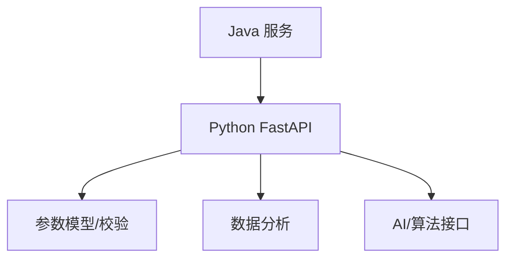

# 第 9 章 Python Web 框架：对标 Spring Boot 的技术映射

> 所属篇章：第三篇 Java 眼中的 Python 世界

**本章技术占比**：技术 50% + 引导 20% + 案例 30%

**前置 Java 知识映射**：Spring Boot 自动配置、Spring MVC 参数校验、JPA、第三方 SDK 集成

## 本章导读

本章仍然从 Java 开发者熟悉的工程经验切入。你不需要把 Python 当作一门完全陌生的语言重新背语法，而是先回答三个问题：Java 中这件事通常怎么做，Python 为什么采用不同设计，这个差异在全栈协同场景下能带来什么收益或风险。

学习多语言不是为了增加技术栈标签，而是为了获得更细的架构分工能力。Java 继续承担复杂业务、一致性和团队协作沉淀；Go 更适合高并发入口、轻量网关和云原生组件；Python 更适合数据处理、自动化脚本和 AI 生态适配。判断标准始终是业务链路，而不是语言偏好。

## 技术地图



## 知识点拆解

| 小节 | 技术内容 | Java 视角切入 | 落地案例 |
| --- | --- | --- | --- |
| 9.1 | 轻量级框架选择：Flask/FastAPI 核心设计 vs Spring Boot 自动配置 | 对标 Java 既有实践，解释设计差异 | 价格计算平台中的对应环节 |
| 9.2 | 请求/响应处理：参数校验、统一响应封装 vs Spring MVC 注解 | 对标 Java 既有实践，解释设计差异 | 价格计算平台中的对应环节 |
| 9.3 | 数据访问层：SQLAlchemy CRUD、关联查询 vs Spring Data JPA | 对标 Java 既有实践，解释设计差异 | 价格计算平台中的对应环节 |
| 9.4 | 生态集成：数据分析库、AI 模型接口 vs Java 第三方库 | 对标 Java 既有实践，解释设计差异 | 价格计算平台中的对应环节 |

## 9.1 轻量级框架选择：Flask/FastAPI 核心设计 vs Spring Boot 自动配置

### Java 中我们通常怎么做

在 Java 技术体系里，这类问题往往通过成熟框架和约定解决：Spring Boot 提供自动配置，Spring MVC 提供注解式入口，Maven/Gradle 统一依赖管理，JUC 和线程池负责并发治理，Bean Validation 与统一异常处理负责边界校验。它的优势是团队认知稳定、生态完整、复杂业务建模能力强。

### Python 的对应设计

Python 的设计目标不完全等价于 Java。它更强调在特定场景下减少样板、降低运行时负担或提升反馈速度。学习时要把“语法差异”翻译成“工程边界差异”：谁负责启动，谁负责依赖，谁暴露错误，谁管理并发，谁承接接口契约。

### 全栈选型逻辑

如果该环节处在核心交易链路、需要复杂领域规则和强团队约束，优先留在 Java。如果该环节更接近流量入口、并发聚合、数据清洗、自动化或算法适配，就可以考虑由 Python 承担。真正的架构能力，是知道边界在哪里，而不是把所有能力塞进一种语言。

### Java 开发者容易踩的坑

1. 只按语法相似度迁移，不重新设计错误边界。
2. 把 Java 的分层模式机械搬过去，导致新语言项目也变得臃肿。
3. 忽略跨语言调用的超时、错误码、日志字段和版本兼容。
4. 学完语言特性却没有落到真实链路，无法形成可复用经验。

## 9.2 请求/响应处理：参数校验、统一响应封装 vs Spring MVC 注解

### Java 中我们通常怎么做

在 Java 技术体系里，这类问题往往通过成熟框架和约定解决：Spring Boot 提供自动配置，Spring MVC 提供注解式入口，Maven/Gradle 统一依赖管理，JUC 和线程池负责并发治理，Bean Validation 与统一异常处理负责边界校验。它的优势是团队认知稳定、生态完整、复杂业务建模能力强。

### Python 的对应设计

Python 的设计目标不完全等价于 Java。它更强调在特定场景下减少样板、降低运行时负担或提升反馈速度。学习时要把“语法差异”翻译成“工程边界差异”：谁负责启动，谁负责依赖，谁暴露错误，谁管理并发，谁承接接口契约。

### 全栈选型逻辑

如果该环节处在核心交易链路、需要复杂领域规则和强团队约束，优先留在 Java。如果该环节更接近流量入口、并发聚合、数据清洗、自动化或算法适配，就可以考虑由 Python 承担。真正的架构能力，是知道边界在哪里，而不是把所有能力塞进一种语言。

### Java 开发者容易踩的坑

1. 只按语法相似度迁移，不重新设计错误边界。
2. 把 Java 的分层模式机械搬过去，导致新语言项目也变得臃肿。
3. 忽略跨语言调用的超时、错误码、日志字段和版本兼容。
4. 学完语言特性却没有落到真实链路，无法形成可复用经验。

## 9.3 数据访问层：SQLAlchemy CRUD、关联查询 vs Spring Data JPA

### Java 中我们通常怎么做

在 Java 技术体系里，这类问题往往通过成熟框架和约定解决：Spring Boot 提供自动配置，Spring MVC 提供注解式入口，Maven/Gradle 统一依赖管理，JUC 和线程池负责并发治理，Bean Validation 与统一异常处理负责边界校验。它的优势是团队认知稳定、生态完整、复杂业务建模能力强。

### Python 的对应设计

Python 的设计目标不完全等价于 Java。它更强调在特定场景下减少样板、降低运行时负担或提升反馈速度。学习时要把“语法差异”翻译成“工程边界差异”：谁负责启动，谁负责依赖，谁暴露错误，谁管理并发，谁承接接口契约。

### 全栈选型逻辑

如果该环节处在核心交易链路、需要复杂领域规则和强团队约束，优先留在 Java。如果该环节更接近流量入口、并发聚合、数据清洗、自动化或算法适配，就可以考虑由 Python 承担。真正的架构能力，是知道边界在哪里，而不是把所有能力塞进一种语言。

### Java 开发者容易踩的坑

1. 只按语法相似度迁移，不重新设计错误边界。
2. 把 Java 的分层模式机械搬过去，导致新语言项目也变得臃肿。
3. 忽略跨语言调用的超时、错误码、日志字段和版本兼容。
4. 学完语言特性却没有落到真实链路，无法形成可复用经验。

## 9.4 生态集成：数据分析库、AI 模型接口 vs Java 第三方库

### Java 中我们通常怎么做

在 Java 技术体系里，这类问题往往通过成熟框架和约定解决：Spring Boot 提供自动配置，Spring MVC 提供注解式入口，Maven/Gradle 统一依赖管理，JUC 和线程池负责并发治理，Bean Validation 与统一异常处理负责边界校验。它的优势是团队认知稳定、生态完整、复杂业务建模能力强。

### Python 的对应设计

Python 的设计目标不完全等价于 Java。它更强调在特定场景下减少样板、降低运行时负担或提升反馈速度。学习时要把“语法差异”翻译成“工程边界差异”：谁负责启动，谁负责依赖，谁暴露错误，谁管理并发，谁承接接口契约。

### 全栈选型逻辑

如果该环节处在核心交易链路、需要复杂领域规则和强团队约束，优先留在 Java。如果该环节更接近流量入口、并发聚合、数据清洗、自动化或算法适配，就可以考虑由 Python 承担。真正的架构能力，是知道边界在哪里，而不是把所有能力塞进一种语言。

### Java 开发者容易踩的坑

1. 只按语法相似度迁移，不重新设计错误边界。
2. 把 Java 的分层模式机械搬过去，导致新语言项目也变得臃肿。
3. 忽略跨语言调用的超时、错误码、日志字段和版本兼容。
4. 学完语言特性却没有落到真实链路，无法形成可复用经验。


## 对比代码示例

```java
// Java: Spring MVC 风格的统一响应
public record ApiResponse<T>(int code, String message, T data, String traceId) {
    public static <T> ApiResponse<T> ok(T data, String traceId) {
        return new ApiResponse<>(0, "OK", data, traceId);
    }
}
```

```go
// Go: 与 Java ApiResponse 对齐的响应壳
type ApiResponse struct {
    Code    int         `json:"code"`
    Message string      `json:"message"`
    Data    interface{} `json:"data,omitempty"`
    TraceID string      `json:"traceId"`
}
```

```python
# Python: 与 Java DTO 对齐的分析入参
from dataclasses import dataclass

@dataclass
class PriceAnalysisRequest:
    sku: str
    base_price: float
    member_level: str
```

这三段代码共同表达同一件事：跨语言协同首先要统一契约。Java 的 record、Go 的 struct、Python 的 dataclass 都只是承载结构的方式，真正需要团队统一的是字段名称、错误码语义、traceId 传递方式和版本兼容策略。

## 章节综合案例：FastAPI 搭建商品价格分析接口

FastAPI 的模型校验对标 Spring MVC + Bean Validation，但它更适合表达数据计算接口。Java 服务只需要按契约调用，不需要知道 Python 内部使用 Pandas、NumPy 还是模型 SDK。

### 场景输入

用户请求某个 SKU 的实时价格，系统需要读取商品基础价、计算会员优惠、调用分析服务返回历史价格趋势与价格分数，最终对前端返回统一响应。

### 关键流程

1. 网关层校验请求头、生成 traceId、执行限流。
2. Java 核心服务计算价格，保证业务规则集中管理。
3. Python 分析服务处理历史数据，返回趋势、波动率、推荐分。
4. 所有服务按同一响应壳返回，日志中携带相同 traceId。

### 本章落地点

读者完成本章后，应能把 Python Web 框架：对标 Spring Boot 的技术映射 中的知识点放回企业项目链路里解释：这个能力解决什么问题，为什么不是 Java 独自承担，跨语言后要补上哪些工程治理。

## 本章小结

1. 本章的核心不是记住 Python 的单点语法，而是建立 Java 到 Python 的工程映射。
2. 多语言协同必须先统一接口契约、错误码、日志和超时策略。
3. 技术选型要跟业务链路绑定：入口治理、核心交易、数据辅助三类职责不能混在一起。
4. 所有章节案例最终都会汇入第 13 章的电商价格计算平台。

## 选型思考题

1. 如果把本章场景全部留在 Java，会获得什么稳定性，又会损失什么效率？
2. 如果把核心业务过度迁移到 Python，团队协作和故障排查会出现什么风险？
3. 你所在团队目前最适合先引入哪一个跨语言边界：网关、数据辅助，还是自动化脚本？

## 延伸阅读资源

1. Java 官方文档与 Spring Boot 参考文档：用于确认 Java 侧基础能力边界。
2. Go 官方文档或 Python 官方文档：用于校准语言基础概念。
3. OpenAPI 与 Protocol Buffers 文档：用于统一跨语言接口契约。
4. Docker Compose 文档：用于本地多服务联调。

## 第 9 章 FastAPI 对标 Spring Boot

FastAPI 的自动 OpenAPI 文档，对 Java 团队很友好，因为它让 Python 服务不再是“脚本接口黑盒”。Pydantic 模型相当于 DTO + Bean Validation 的组合。

```python
from pydantic import BaseModel, Field

class AnalyzeRequest(BaseModel):
    sku: str = Field(min_length=1)
    basePriceCents: int = Field(gt=0)
    finalPriceCents: int = Field(gt=0)
```

生产落地时，Python 服务仍需统一响应壳、traceId、超时、缓存和降级，不要因为框架轻量就省掉工程治理。
