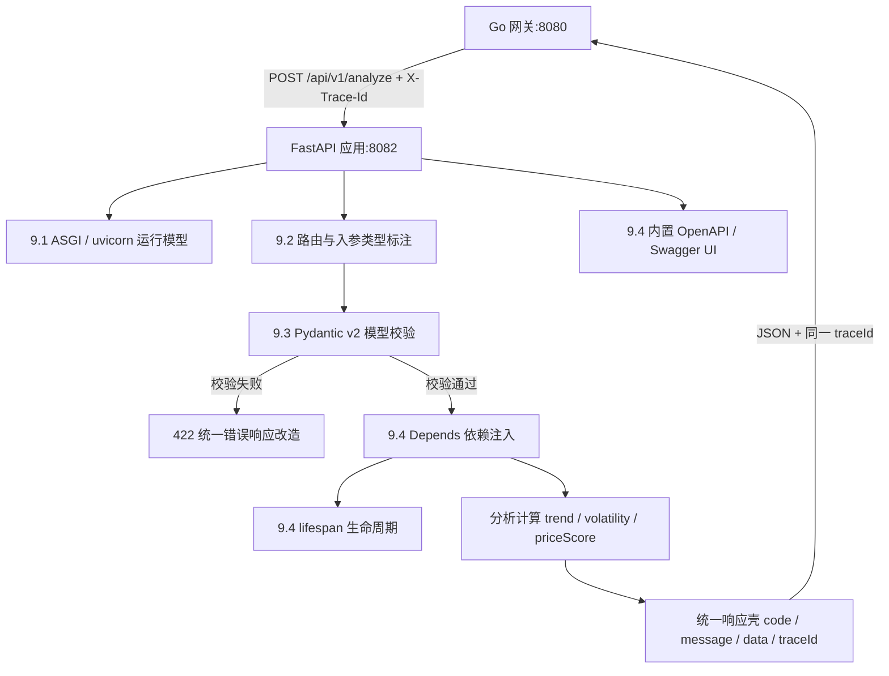

# 第 9 章 Python Web 框架：对标 Spring Boot 的技术映射

> 所属篇章：第三篇 Java 眼中的 Python 世界

**本章技术占比**：技术 50% + 引导 20% + 案例 30%

**前置 Java 知识映射**：Spring Boot 自动配置与起步依赖、Spring MVC 注解式入口（`@RestController`/`@RequestParam`/`@PathVariable`）、Bean Validation（`@Valid`/`@NotNull`）、`@ControllerAdvice` 统一异常处理、Spring 依赖注入与 `@PostConstruct`、Tomcat 线程模型与 JDK 21 虚拟线程、springdoc 生成 OpenAPI

## 本章导读

上一章我们逐个拆解了 Python 与 Java 差异极大的语言特性。这一章往上走一层，回答一个更工程化的问题：当你要在 `:8082` 这个数据处理节点上暴露一个 HTTP 接口，Python 该用什么框架，它和你手里的 Spring Boot 到底差在哪里？

Python 的 Web 框架谱系很长，但对 Java 开发者真正值得认真学的只有两个：Flask 和 FastAPI。Flask 是老牌的极简框架，一个装饰器加一个函数就能起服务，但它把类型校验、异步、文档生成全部留给你自己拼。FastAPI 则把「类型标注」抬成了框架的一等公民——请求参数、请求体、响应模型全部用 Python 的 type hints 声明，框架据此自动完成校验、序列化和 OpenAPI 文档生成。对一个刚从 Spring Boot 过来的人来说，FastAPI 的心智模型几乎是「无缝迁移」：Pydantic 模型就是 DTO + Bean Validation，`Depends()` 就是构造器注入，内置的 `/docs` 就是 springdoc 的 Swagger UI。**所以本章以 FastAPI 为主对标 Spring Boot，Flask 只在选型时一带而过。** 选 FastAPI 不是因为它更时髦，而是因为它的设计哲学（类型驱动、契约先行）离 Java 开发者的心智最近，迁移成本最低。

本章仍沿用那条电商价格链路：Go 网关 `:8080` 负责入口治理与限流，Java 价格服务 `:8081` 负责核心交易规则，Python 分析服务 `:8082` 负责历史数据处理与评分，三方通过统一响应壳 `{code, message, data, traceId}` 和 `X-Trace-Id` 契约串联。每个小节都用同一套四段式展开：先看「Java 中我们通常怎么做」，再看「Python 的对应设计」，然后回答「全栈选型逻辑」，最后列出「Java 开发者容易踩的坑」。

需要提前说明一件事：本书配套仓库里的 `python-analysis-service` 是一份**教学用的零依赖实现**——它直接用标准库 `http.server` 手写了路由和响应，目的是让你在不安装任何第三方包的情况下就能跑通跨语言联调。而本章讲的 FastAPI 才是**生产环境的推荐做法**。本章的综合案例会把这份零依赖服务原样升级为 FastAPI 版本，端口、路由、响应字段一个不改，让你直观看到「手写 HTTP」和「框架驱动」之间的工程差距。

## 技术地图



## 知识点拆解

| 小节 | 技术内容 | Java 视角切入 | 落地案例 |
| --- | --- | --- | --- |
| 9.1 | 框架选型与运行模型：FastAPI/Flask 设计取舍、ASGI/uvicorn、`async def` 与 GIL | 对标 Spring Boot 自动配置、Tomcat 线程模型与虚拟线程 | 分析服务 `:8082` 为何选 FastAPI |
| 9.2 | 路由与请求入参：路径/查询参数类型标注自动校验、请求体绑定 | 对标 `@RestController` + `@RequestParam`/`@PathVariable` | 接收 SKU 分析请求 |
| 9.3 | 数据校验与统一响应封装：Pydantic v2（`Field`/`model_validate`）、422 改造 | 对标 Bean Validation（`@Valid`/`@NotNull`）与 `@ControllerAdvice` | 校验价格入参并对齐响应壳 |
| 9.4 | 依赖注入、生命周期与自动文档：`Depends()`、`lifespan`、内置 OpenAPI | 对标 Spring DI、`@PostConstruct`、springdoc | 注入配置/客户端并契约先行 |

## 9.1 框架选型与运行模型：FastAPI/Flask vs Spring Boot 自动配置

### Java 中我们通常怎么做

Spring Boot 把「起一个 Web 服务」这件事收敛成了一条约定链。你在 `pom.xml` 里引入 `spring-boot-starter-web`，`@SpringBootApplication` 触发自动配置，内嵌 Tomcat 被拉起，Jackson 负责 JSON 序列化，`DispatcherServlet` 负责把请求分发到 `@RestController`。整套东西是「约定优于配置」：你几乎不用写 XML，框架根据类路径上有什么起步依赖，自动决定装配哪些 Bean。

```java
// Spring Boot：一个类就能起 Web 服务，自动配置内嵌 Tomcat + Jackson
@SpringBootApplication
public class AnalysisApplication {
    public static void main(String[] args) {
        SpringApplication.run(AnalysisApplication.class, args);
    }
}
```

运行模型是关键。传统 Spring MVC 跑在 Tomcat 的**线程池**上：每个进来的请求占用一个平台线程，处理完才归还。默认线程池 200 个线程，意味着并发上限受线程数约束；一旦某个请求在 I/O 上阻塞（比如调下游 HTTP、查库），这个线程就被占着空等。JDK 21 的**虚拟线程**（`spring.threads.virtual.enabled=true`）改善了这一点——把「一请求一线程」的阻塞式代码跑在轻量的虚拟线程上，用极低成本承载高并发 I/O，但编程模型仍然是熟悉的同步写法。

### Python 的对应设计

Python 侧没有一个「自动配置」层，你需要显式选框架、显式装配。两个候选：

- **Flask**：极简，一个装饰器一个函数就是一个路由。但它是 **WSGI**（同步网关接口），没有内置类型校验、没有异步一等支持，参数解析要自己从 `request.args` 掏，文档要额外插件。适合小工具、内部脚本。
- **FastAPI**：构建在 **ASGI**（异步网关接口）之上，用 `uvicorn` 作为运行器。它把 type hints 抬成框架契约：函数签名声明的类型，框架用来做校验、序列化和文档生成。这正是 Java 开发者最熟悉的「声明式契约」思路。

```python
# FastAPI：类型标注即契约，uvicorn 作为 ASGI 运行器拉起
from fastapi import FastAPI

app = FastAPI(title="价格分析服务", version="0.4.0")

@app.get("/health")
def health() -> dict:
    return {"status": "UP"}

# 启动：uvicorn main:app --host 0.0.0.0 --port 8082
# 生产可加 --workers 4 起多进程绕开单进程 GIL 限制
```

运行模型对标 Tomcat：uvicorn 跑的是**单进程事件循环**。当路由声明为 `async def`，框架在遇到 `await`（如异步 HTTP 调用）时会把控制权交还事件循环去处理别的请求——这套「协作式并发」在 **I/O 密集**场景下用一个线程就能扛住大量并发连接，因为线程大部分时间本来就在等网络。这正好呼应第 8.8 节讲的 GIL：Python 的 GIL 让多线程无法真正并行执行 CPU 计算，但对 I/O 密集任务毫无影响——`asyncio` 事件循环恰恰是为 I/O 等待而生。反过来，如果路由里塞了纯 CPU 的重计算（大矩阵、复杂评分循环），单进程事件循环会被卡死，此时要靠 `--workers N` 起多进程，或把计算丢进 `run_in_executor` 的进程池。

### 全栈选型逻辑

分析服务 `:8082` 的典型工作是「拉上游历史数据 → 清洗 → 算趋势/波动率/评分 → 返回」。其中「拉上游数据」是 I/O 密集，天然适合 `async def` + 异步 HTTP 客户端；「算评分」如果只是轻量统计，单进程也够，真到重计算就上 `--workers`。这套模型和 Java 价格服务 `:8081` 形成互补：`:8081` 处在核心交易链路，需要强类型、强事务、成熟的团队协作沉淀，留在 Spring Boot + 虚拟线程最稳；`:8082` 迭代快、以数据和网络客户端为中心，FastAPI 的类型驱动 + ASGI 异步既贴合它的节奏，又让 Java 团队几乎零成本读懂它的接口契约。选 FastAPI 而非 Flask 的核心理由就一句：**它让 Python 服务不再是「脚本接口黑盒」，而是和 Spring Boot 一样契约清晰、文档自带的正规军。**

### Java 开发者容易踩的坑

1. **以为 `async def` 天生更快，于是所有路由都写成异步**。实际上，如果 `async def` 里调用的是**同步阻塞**代码（比如同步的 `requests.get`、同步数据库驱动、`time.sleep`），事件循环会被这一行整个卡住，把本该并发的其他请求全部拖慢，结果比同步路由还糟：

   ```python
   import requests, asyncio

   @app.get("/bad")
   async def bad():
       # 错误：在事件循环里调同步阻塞 I/O，会阻塞整个 worker
       return requests.get("https://upstream/data").json()

   @app.get("/good")
   async def good():
       # 正确：异步客户端 + await，等待期间事件循环去服务别的请求
       import httpx
       async with httpx.AsyncClient() as client:
           r = await client.get("https://upstream/data")
       return r.json()
   ```
   规则：`async def` 里只能出现 `await` 的非阻塞调用；实在要跑同步代码，用普通 `def`（FastAPI 会自动把它丢到线程池），或用 `run_in_executor`。

2. **把 uvicorn 单进程当成 Tomcat 线程池，指望它自动吃满多核**。单进程事件循环受 GIL 约束，CPU 密集任务无法并行。生产环境要显式 `--workers 4`（或用 gunicorn 管理 uvicorn worker）才能利用多核，这一步没有「自动配置」替你做。

3. **开发时用 `--reload`，上生产也带着它**。`--reload` 会起文件监听、每次改动重启，性能和稳定性都不适合生产。它对标的是开发期热部署，不是运行时特性。

## 9.2 路由与请求入参：类型标注自动校验 vs @RestController

### Java 中我们通常怎么做

Spring MVC 用注解把 HTTP 语义绑到方法参数上：`@GetMapping`/`@PostMapping` 定义路由，`@PathVariable` 取路径段，`@RequestParam` 取查询参数，`@RequestBody` 绑请求体。类型转换由框架完成——路径里的 `123` 自动转成 `long`，转不动就抛 `MethodArgumentTypeMismatchException`。

```java
@RestController
@RequestMapping("/api/v1")
public class AnalysisController {

    // GET /api/v1/analyze/SKU-1001?window=30
    @GetMapping("/analyze/{sku}")
    public ApiResponse<PriceTrend> trend(
            @PathVariable String sku,
            @RequestParam(defaultValue = "30") int window) {
        // window 收到 "abc" 时框架直接 400，方法体拿到的一定是合法 int
        return ApiResponse.ok(service.trend(sku, window), MDC.get("traceId"));
    }
}
```

要点：参数从哪来（路径/查询/请求体）由注解显式声明，类型由方法签名声明，非法输入在进入方法体之前就被框架拦下。

### Python 的对应设计

FastAPI 把这套映射做得更「隐式而自然」：**参数从哪来，靠它在函数签名里的位置和类型推断**。出现在路径模板 `{sku}` 里的同名参数就是路径参数；其余的基础类型参数默认是查询参数；Pydantic 模型类型的参数默认是请求体。类型标注同时承担了「声明类型」和「自动校验」两个职责。

```python
from fastapi import FastAPI, Path, Query

app = FastAPI()

# GET /api/v1/analyze/SKU-1001?window=30
@app.get("/api/v1/analyze/{sku}")
def trend(
    sku: str = Path(min_length=1, description="商品 SKU"),
    window: int = Query(30, ge=1, le=365, description="回溯天数"),
):
    # window 收到 "abc" 时 FastAPI 自动返回 422，函数体拿到的一定是合法 int
    # ge/le 相当于 Bean Validation 的 @Min/@Max，越界同样 422
    return service.trend(sku, window)
```

对照着看：`@PathVariable String sku` 对应 `sku: str = Path(...)`，`@RequestParam(defaultValue="30") int window` 对应 `window: int = Query(30, ...)`。`Path`/`Query` 里还能塞约束（`min_length`、`ge`、`le`），这部分能力相当于把 Bean Validation 的 `@Size`/`@Min`/`@Max` 直接写进了参数声明。请求体则更直接——把参数类型声明成一个 Pydantic 模型即可：

```python
from pydantic import BaseModel, Field

class AnalyzeRequest(BaseModel):
    sku: str = Field(min_length=1)
    base_price_cents: int = Field(gt=0, alias="basePriceCents")
    member_level: str = Field(default="NORMAL", alias="memberLevel")

@app.post("/api/v1/analyze")
def analyze(req: AnalyzeRequest):
    # req 一定是校验通过的合法对象，等价于 Spring 的 @Valid @RequestBody
    return service.analyze(req)
```

这里 `alias="basePriceCents"` 解决了跨语言字段命名差异：Java/Go 传来的 JSON 是驼峰 `basePriceCents`，Python 内部习惯用蛇形 `base_price_cents`，`alias` 让两边各写各的命名习惯却映射到同一字段。

### 全栈选型逻辑

分析服务 `:8082` 的入口只有一两个路由，但入参结构由跨语言契约固定死了。这正是 FastAPI 的甜区：把契约用 Pydantic 模型写一遍，路由签名就同时完成了「参数解析 + 类型校验 + 命名映射 + 文档生成」四件事，不需要像 Flask 那样从 `request.get_json()` 里手动掏字段再逐个 `if` 判空。Java 团队看这份路由定义时，`Path`/`Query`/`BaseModel` 的语义和 `@PathVariable`/`@RequestParam`/`@RequestBody` 一一对得上，读接口就像读一份带类型的契约文档。

### Java 开发者容易踩的坑

1. **以为不写默认值的参数会像 Spring 那样「有就取、没有就 null」**。FastAPI 里，一个没给默认值的查询参数是**必填**的，缺了直接 422。想要可选，必须显式给默认值或声明为 `X | None = None`：

   ```python
   # 必填：缺 window 就 422
   def f(window: int): ...
   # 可选：缺了就是 None
   def g(window: int | None = None): ...
   ```

2. **把请求体字段的驼峰/蛇形命名想当然**。不加 `alias`，Java 传 `basePriceCents`、Python 模型字段叫 `base_price_cents`，框架匹配不上，要么 422 要么静默变默认值。跨语言边界务必用 `Field(alias=...)`，并考虑 `model_config = ConfigDict(populate_by_name=True)` 让两种命名都能接受。

3. **在路由函数里再手写一遍 `if not sku: raise ...` 的校验**。这是把 Spring 里「Controller 不做校验、交给 `@Valid`」的好习惯丢了。约束应该声明在 `Field`/`Path`/`Query` 上，让框架统一在入口拦截，而不是散落在函数体里重复判断。

## 9.3 数据校验与统一响应封装：Pydantic v2 vs Bean Validation

### Java 中我们通常怎么做

Java 的校验分两层：结构由 DTO 类型系统保证，业务约束由 Bean Validation 注解声明，`@Valid` 触发校验，`@ControllerAdvice` 兜底把校验异常转成统一错误响应。

```java
public record AnalyzeRequest(
        @NotBlank String sku,
        @Positive long basePriceCents,
        @Positive long finalPriceCents) {}

@ControllerAdvice
public class ApiExceptionHandler {
    @ExceptionHandler(MethodArgumentNotValidException.class)
    public ResponseEntity<ApiResponse<Void>> onInvalid(MethodArgumentNotValidException e) {
        String msg = e.getBindingResult().getFieldErrors().stream()
                .map(f -> f.getField() + " " + f.getDefaultMessage())
                .collect(Collectors.joining("; "));
        // 把 Spring 默认的错误结构改造成团队统一的响应壳
        return ResponseEntity.badRequest()
                .body(new ApiResponse<>(4001, msg, null, MDC.get("traceId")));
    }
}
```

关键在最后一步：Spring 校验失败默认返回 400 加一坨它自己的错误结构，团队几乎都会用 `@ControllerAdvice` 把它**改造成自家的响应壳**，让成功和失败返回同一种外壳。

### Python 的对应设计

Pydantic v2 是 FastAPI 校验能力的引擎，它的 `BaseModel` 一个类同时扮演了「DTO + Bean Validation」两个角色。字段类型即结构约束，`Field(...)` 承载业务约束，越界时抛 `ValidationError`。

```python
from pydantic import BaseModel, Field, field_validator

class AnalyzeRequest(BaseModel):
    sku: str = Field(min_length=1)
    base_price_cents: int = Field(gt=0, alias="basePriceCents")
    final_price_cents: int = Field(gt=0, alias="finalPriceCents")

    # 对标 Bean Validation 的类级约束（@AssertTrue）：折后价不得高于原价
    @field_validator("final_price_cents")
    @classmethod
    def not_above_base(cls, v: int, info):
        base = info.data.get("base_price_cents")
        if base is not None and v > base:
            raise ValueError("finalPriceCents 不得高于 basePriceCents")
        return v
```

v2 的两个高频入口值得记牢，它们对标 Jackson 的反序列化：

- `AnalyzeRequest.model_validate(data)`：从字典/对象构造并校验（v1 的 `parse_obj`，已废弃）。
- `AnalyzeRequest.model_validate_json(raw)`：直接从 JSON 字节校验。
- 反向序列化用 `req.model_dump()`（v1 的 `.dict()`）、`req.model_dump_json()`；`by_alias=True` 时按驼峰输出，回传给 Java/Go 时命名对齐。

FastAPI 里你通常不用手动调 `model_validate`——把参数声明成模型，框架在进入路由前替你调好了。校验失败时，FastAPI **默认返回 422**（Unprocessable Entity），响应体是它内置的错误结构（`{"detail": [{"loc": ..., "msg": ..., "type": ...}]}`）。但这和团队统一响应壳不一致，需要改造——对标 `@ControllerAdvice`，FastAPI 用 `exception_handler` 全局接管 `RequestValidationError`：

```python
from fastapi import Request
from fastapi.exceptions import RequestValidationError
from fastapi.responses import JSONResponse

@app.exception_handler(RequestValidationError)
async def on_invalid(request: Request, exc: RequestValidationError):
    # 把 422 的 detail 拍平成一句话，套进统一响应壳
    msg = "; ".join(f"{'.'.join(map(str, e['loc']))} {e['msg']}" for e in exc.errors())
    trace_id = request.headers.get("X-Trace-Id", "-")
    return JSONResponse(
        status_code=422,
        content={"code": 4001, "message": msg, "data": None, "traceId": trace_id},
    )
```

这样，无论成功还是校验失败，`:8082` 对外都是同一个响应壳 `{code, message, data, traceId}`，Go 网关和 Java 服务解析时不必区分两套结构。

### 全栈选型逻辑

跨语言协同最怕「每个服务的错误结构各长各样」。Java 用 `@ControllerAdvice`、Go 用中间件、Python 用 `exception_handler`，三者手段不同，但目标必须一致：**成功和失败共用一个响应壳，错误码语义全链路统一，`traceId` 从头传到尾。** Pydantic 的校验能力让 `:8082` 把「结构 + 约束 + 跨语言业务规则（如折后价不高于原价）」集中在一个模型类里声明，而不是散在路由函数里手写 `if`。这份模型既是运行时校验器，又是 OpenAPI 文档的数据来源，一处声明多处复用——这正是它比 Flask 手写校验强的地方。

### Java 开发者容易踩的坑

1. **拿 Pydantic v1 的 API 写 v2**。`.dict()`、`.parse_obj()`、`@validator`、`class Config` 在 v2 里要么废弃要么改名：分别换成 `.model_dump()`、`.model_validate()`、`@field_validator`、`model_config = ConfigDict(...)`。照着老教程写，运行时会报 `PydanticDeprecatedSince20` 警告甚至直接报错。

2. **忘了改造 422，让上游拿到两套不一致的结构**。校验成功走 `{code,message,data,traceId}`、校验失败走 FastAPI 默认的 `{detail:[...]}`，Go 网关解析时 `data` 字段忽然消失，排查半天。必须显式注册 `RequestValidationError` 处理器统一外壳。

3. **以为类型标注等于运行时校验，于是不用 Pydantic 也放心**。这是第 8.2 节坑的延续：普通 `def f(x: int)` 的 `int` 不做运行时检查，只有 Pydantic 模型字段才真正在运行时校验。跨语言边界的入参，一定要过 `BaseModel`，不能只靠裸 type hint。

## 9.4 依赖注入、生命周期与自动文档：Depends()/lifespan vs Spring DI

### Java 中我们通常怎么做

Spring 的依赖注入是它的核心。你用 `@Component`/`@Service` 声明 Bean，用构造器注入把依赖传进来，容器负责实例化和装配。需要在 Bean 就绪后做初始化（建连接池、加载配置），用 `@PostConstruct`；关闭前清理用 `@PreDestroy`。接口文档则交给 springdoc，它扫描 Controller 和 DTO 自动生成 OpenAPI 和 Swagger UI。

```java
@Service
public class AnalysisService {
    private final UpstreamClient client;      // 构造器注入，容器自动装配
    public AnalysisService(UpstreamClient client) { this.client = client; }

    @PostConstruct
    void warmUp() { client.ping(); }          // Bean 就绪后预热连接
}
```

这套机制让「怎么创建对象」和「怎么使用对象」彻底解耦，也让单元测试可以轻松塞入 mock 依赖。

### Python 的对应设计

FastAPI 的依赖注入是 `Depends()`。你写一个「依赖函数」（返回所需资源），在路由参数里用 `Depends(那个函数)` 声明，框架在处理请求时自动调用它并把结果注入进来。它对标构造器注入的「声明依赖、由框架装配」，且天然支持嵌套依赖和请求级作用域。

```python
from fastapi import Depends
import httpx

# 依赖函数：相当于一个可注入的 Bean 工厂
def get_settings() -> "Settings":
    return Settings()  # 生产可加 lru_cache 缓存为单例

async def get_client(settings: "Settings" = Depends(get_settings)) -> httpx.AsyncClient:
    # 依赖可以嵌套依赖：get_client 依赖 get_settings
    return httpx.AsyncClient(base_url=settings.upstream_url, timeout=3.0)

@app.post("/api/v1/analyze")
async def analyze(req: AnalyzeRequest, client: httpx.AsyncClient = Depends(get_client)):
    # client 由框架注入，路由函数不关心它怎么建出来的——便于测试时替换
    ...
```

至于 `@PostConstruct`/`@PreDestroy` 那种「启动时初始化、关闭时清理」的生命周期钩子，FastAPI 用 **`lifespan`** 上下文管理器统一表达（这正是第 8.4 节 `with`/`yield` 协议的应用）：`yield` 之前是启动逻辑，`yield` 之后是关闭逻辑。

```python
from contextlib import asynccontextmanager

@asynccontextmanager
async def lifespan(app: FastAPI):
    # 启动：对标 @PostConstruct，建长连接客户端并预热
    app.state.client = httpx.AsyncClient(timeout=3.0)
    print("分析服务启动，连接池就绪")
    yield
    # 关闭：对标 @PreDestroy，优雅释放资源
    await app.state.client.aclose()
    print("分析服务关闭，连接池已释放")

app = FastAPI(lifespan=lifespan)
```

最后是自动文档——这是 FastAPI 相对 Flask 最有存在感的优势，也是它对 Java 团队最友好的地方。因为路由的入参、请求体、响应模型全都用类型声明过了，FastAPI **无需任何额外注解**就能生成完整的 OpenAPI 3.x 规范，并内置两套交互式文档：`/docs`（Swagger UI）和 `/redoc`（ReDoc）。这等价于 springdoc 干的事，但你什么都不用配。给路由加上 `response_model` 后，连响应结构也进文档：

```python
class AnalyzeData(BaseModel):
    sku: str
    trend: str
    volatility: float
    price_score: int = Field(alias="priceScore")

class AnalyzeResponse(BaseModel):
    code: int
    message: str
    data: AnalyzeData | None
    trace_id: str = Field(alias="traceId")

@app.post("/api/v1/analyze", response_model=AnalyzeResponse)
async def analyze(req: AnalyzeRequest):
    ...   # 响应结构自动出现在 /docs，Java 团队直接照着对接
```

### 全栈选型逻辑

跨语言协同的一个隐形成本是「对接靠口头和聊天记录」。FastAPI 的内置 OpenAPI 让 `:8082` 天生具备**契约先行**能力：Python 侧写好 Pydantic 模型和路由，`/docs` 立刻生成可交互的接口文档，Java/Go 团队可以直接下载 `openapi.json` 生成客户端代码，甚至在联调前就用 Swagger UI 试打请求。这把「接口契约」从聊天记录里的口头约定，变成了一份自动同步、永不过时的机器可读文档——和 Java 团队用 springdoc 的体验完全一致。而 `Depends()` + `lifespan` 让 `:8082` 的资源管理（连接池、配置、客户端）像 Spring Bean 一样可注入、可替换、可测试，避免了 Flask 里常见的「全局变量满天飞」。

### Java 开发者容易踩的坑

1. **用模块级全局变量代替 `Depends()`，把 Spring 的「容器管理」丢了**。图省事在模块顶部 `client = httpx.AsyncClient()`，测试时无法替换 mock，多 worker 下还可能共享出问题。依赖应通过 `Depends()` 声明，让框架管理作用域，测试时用 `app.dependency_overrides` 一键替换。

2. **还在用已废弃的 `@app.on_event("startup")`**。老 FastAPI 教程里的 `@app.on_event("startup")`/`"shutdown"` 已被 `lifespan` 取代并标记废弃。新项目一律用 `lifespan` 上下文管理器，启动清理逻辑放同一处，更符合第 8.4 节的资源管理心智。

3. **在启动的 `lifespan` 里跑重阻塞初始化却不 `await`**。启动逻辑若包含同步阻塞调用（同步建连、加载大模型），会拖慢甚至卡住整个应用启动。I/O 类初始化用异步客户端并 `await`；纯 CPU 的重加载考虑放到首个请求懒加载或独立进程，别把服务启动阻塞在那里。

## 对比代码示例

同一件事——「声明分析入参并统一响应壳」——三种语言各自的表达：

```java
// Java: Spring 风格的入参 DTO + 统一响应壳
public record AnalyzeRequest(
        @NotBlank String sku,
        @Positive long basePriceCents) {}

public record ApiResponse<T>(int code, String message, T data, String traceId) {
    public static <T> ApiResponse<T> ok(T data, String traceId) {
        return new ApiResponse<>(0, "OK", data, traceId);
    }
}
```

```go
// Go: 与 Java ApiResponse 对齐的响应壳
type ApiResponse struct {
    Code    int         `json:"code"`
    Message string      `json:"message"`
    Data    interface{} `json:"data,omitempty"`
    TraceID string      `json:"traceId"`
}
```

```python
# Python: FastAPI + Pydantic v2，一个模型同时做 DTO 和 Bean Validation
from pydantic import BaseModel, Field

class AnalyzeRequest(BaseModel):
    sku: str = Field(min_length=1)                       # 对标 @NotBlank
    base_price_cents: int = Field(gt=0, alias="basePriceCents")  # 对标 @Positive

class ApiResponse(BaseModel):
    code: int
    message: str
    data: dict | None = None
    trace_id: str = Field(alias="traceId")               # 跨语言命名对齐
```

三段代码表达同一件事：跨语言协同首先要统一契约。Java 的 `record` + Bean Validation、Go 的 struct tag、Python 的 Pydantic 模型只是承载结构的不同方式，真正需要团队统一的是字段名称、错误码语义、`traceId` 传递方式和 422/400 的边界约定。FastAPI 的价值在于——它让 Python 侧这份契约既能运行时校验，又能自动变成 OpenAPI 文档，和 Java 的 springdoc 无缝对接。

## 章节综合案例：把仓库分析服务升级为 FastAPI 版

本书配套仓库里的 `python-analysis-service/app.py` 是一份零依赖实现——直接用标准库 `http.server` 手写路由、手写响应。它的好处是不装任何包就能跑通联调，坏处是所有工程能力（校验、文档、生命周期、统一错误）都得手写。本节把它**原样升级为 FastAPI 生产版**：端口仍是 `:8082`，路由仍是 `POST /api/v1/analyze` 和 `GET /health`，仍读 `X-Trace-Id`，响应壳 `{code, message, data, traceId}` 与字段 `sku/trend/volatility/priceScore` 一个不改，评分逻辑（`base_price_cents < 100000` 给 88，否则 76）保持一致。目的是让你直观对比「手写 HTTP」和「框架驱动」的工程差距。

### 原始零依赖实现（教学用，回顾）

```python
# 仓库现状：http.server 手写，校验/文档/错误全靠自己拼
from http.server import BaseHTTPRequestHandler, HTTPServer
import json, time

class Handler(BaseHTTPRequestHandler):
    def do_POST(self):
        length = int(self.headers.get("Content-Length", "0"))
        payload = json.loads(self.rfile.read(length) or b"{}")   # 无校验，脏数据直接进
        trace_id = self.headers.get("X-Trace-Id", f"trace-python-{int(time.time())}")
        base_price = int(payload.get("basePriceCents", 0))       # 手动取字段、手动兜底
        score = 88 if base_price < 100000 else 76
        self.reply({"code": 0, "message": "OK",
                    "data": {"sku": payload.get("sku", "UNKNOWN"), "trend": "STABLE",
                             "volatility": 0.07, "priceScore": score},
                    "traceId": trace_id})
```

问题一目了然：没有入参校验（`basePriceCents` 传字符串会崩）、没有接口文档、`traceId` 生成逻辑和错误处理散落各处、路由匹配靠 `if self.path == ...` 硬编码。

### FastAPI 生产版（本章推荐）

```python
# main.py —— 分析服务 :8082 的 FastAPI 生产实现
# 依赖：fastapi==0.115.x, pydantic==2.x, uvicorn==0.30.x
import time
from contextlib import asynccontextmanager

from fastapi import FastAPI, Header, Request
from fastapi.exceptions import RequestValidationError
from fastapi.responses import JSONResponse
from pydantic import BaseModel, ConfigDict, Field


# ---- 契约模型：入参与响应，一处声明多处复用（含 OpenAPI 文档）----
class AnalyzeRequest(BaseModel):
    # 允许驼峰(来自 Java/Go)与蛇形(Python 内部)两种命名
    model_config = ConfigDict(populate_by_name=True)
    sku: str = Field(min_length=1)
    base_price_cents: int = Field(gt=0, alias="basePriceCents")


class AnalyzeData(BaseModel):
    model_config = ConfigDict(populate_by_name=True)
    sku: str
    trend: str
    volatility: float
    price_score: int = Field(alias="priceScore")


class ApiResponse(BaseModel):
    model_config = ConfigDict(populate_by_name=True)
    code: int
    message: str
    data: AnalyzeData | None = None
    trace_id: str = Field(alias="traceId")


# ---- 生命周期：对标 @PostConstruct / @PreDestroy ----
@asynccontextmanager
async def lifespan(app: FastAPI):
    print("python-analysis-service (FastAPI) started on http://localhost:8082")
    yield
    print("python-analysis-service (FastAPI) shutting down")


app = FastAPI(title="价格分析服务", version="0.4.0", lifespan=lifespan)


# ---- 统一 422 错误响应：对标 @ControllerAdvice，套进同一响应壳 ----
@app.exception_handler(RequestValidationError)
async def on_invalid(request: Request, exc: RequestValidationError):
    msg = "; ".join(f"{'.'.join(map(str, e['loc']))} {e['msg']}" for e in exc.errors())
    trace_id = request.headers.get("X-Trace-Id", f"trace-python-{int(time.time())}")
    return JSONResponse(
        status_code=422,
        content={"code": 4001, "message": msg, "data": None, "traceId": trace_id},
    )


# ---- 健康检查：路由与响应字段与仓库版完全一致 ----
@app.get("/health")
def health() -> dict:
    return {"code": 0, "message": "OK", "data": {"status": "UP"}, "traceId": "health"}


# ---- 分析接口：POST /api/v1/analyze，逻辑与仓库版一致 ----
@app.post("/api/v1/analyze", response_model=ApiResponse)
def analyze(req: AnalyzeRequest, x_trace_id: str | None = Header(default=None)):
    trace_id = x_trace_id or f"trace-python-{int(time.time())}"
    score = 88 if req.base_price_cents < 100000 else 76   # 与仓库版评分规则一致
    data = AnalyzeData(sku=req.sku, trend="STABLE", volatility=0.07, price_score=score)
    # by_alias=True 让响应按 priceScore/traceId 驼峰输出，回传给 Java/Go
    return ApiResponse(code=0, message="OK", data=data, trace_id=trace_id).model_dump(by_alias=True)


# 启动：uvicorn main:app --host 0.0.0.0 --port 8082
# 生产：uvicorn main:app --host 0.0.0.0 --port 8082 --workers 4
```

### 升级前后对照

| 维度 | 零依赖 `http.server` 版 | FastAPI 生产版 |
| --- | --- | --- |
| 入参校验 | 无，脏数据直接进业务逻辑 | Pydantic 自动校验，非法入参统一 422 |
| 接口文档 | 无 | 内置 `/docs` Swagger UI + `/redoc`，OpenAPI 自动生成 |
| 路由匹配 | `if self.path == ...` 硬编码 | 装饰器声明式路由 |
| 命名映射 | 手动 `payload.get("basePriceCents")` | `Field(alias=...)` 声明式对齐 |
| 生命周期 | 无 | `lifespan` 统一管理启动/关闭 |
| 契约对接 | 靠口头/文档 | 契约先行，Java/Go 可从 `openapi.json` 生成客户端 |

对 Go 网关 `:8080` 和 Java 价格服务 `:8081` 而言，升级是**完全透明**的：端口、路由、请求头、响应壳、字段名全部不变，它们发出的请求和解析的响应一字不改。变化只发生在 `:8082` 内部——从「手写 HTTP 黑盒」变成了「契约清晰、文档自带、校验完备」的正规 Web 服务。这就是本章想让你看见的东西：FastAPI 不是让 Python 服务变复杂，而是把你在 Spring Boot 里习以为常的工程能力（自动校验、统一异常、依赖注入、内置文档）用最贴近 Java 心智的方式补齐。

## 本章小结

1. Python Web 框架里，对 Java 开发者最值得学的是 FastAPI——它把 type hints 抬成框架契约，Pydantic 模型对应 DTO + Bean Validation，`Depends()` 对应构造器注入，内置 `/docs` 对应 springdoc，迁移心智成本最低；Flask 适合小工具，生产接口优先 FastAPI。
2. 运行模型上，uvicorn 单进程事件循环对标 Tomcat 线程池：`async def` + `await` 在 I/O 密集场景用一个线程扛住高并发（呼应第 8.8 节 GIL 对 I/O 无影响），但 CPU 密集要靠 `--workers` 起多进程，且 `async def` 里绝不能混入同步阻塞调用。
3. 校验与响应必须集中治理：Pydantic v2（`Field`/`model_validate`/`model_dump`）在入口做结构与业务校验，`RequestValidationError` 处理器把默认 422 改造成团队统一响应壳，让成功和失败共用 `{code, message, data, traceId}`。
4. 依赖注入用 `Depends()`、生命周期用 `lifespan`、文档靠内置 OpenAPI，三者让 `:8082` 具备可注入、可测试、契约先行的工程能力。
5. 配套仓库的零依赖 `http.server` 实现是教学脚手架，生产推荐 FastAPI；升级对上游完全透明，端口 `:8082`、路由、响应字段一律不变。所有章节案例最终都会汇入第 13 章的电商价格计算平台。

## 选型思考题

1. 分析服务 `:8082` 目前只有一两个 I/O 密集路由。如果未来要加一个纯 CPU 的重评分模型（单次计算耗时几百毫秒），你会继续用单进程 `async def`、改用 `--workers` 多进程，还是把计算下沉到独立服务？各自对延迟和吞吐的影响是什么？
2. 团队希望「一份接口契约，Java/Go/Python 三端都不手写客户端」。基于 FastAPI 的内置 OpenAPI，你会怎么设计契约先行的协作流程？它和 Java 侧用 springdoc 生成文档相比，谁作为契约源头更合适？
3. 如果把 `:8082` 的入参校验完全依赖 Pydantic，Java 价格服务 `:8081` 侧还需不需要对同样的字段再校验一遍？在「跨语言边界重复校验」和「信任上游契约」之间，你的团队应该在哪一层设防线？

## 延伸阅读资源

1. FastAPI 官方文档（<https://fastapi.tiangolo.com>）：路由、依赖注入、请求体、`lifespan`、OpenAPI 的权威说明与教程。
2. Pydantic v2 官方文档（<https://docs.pydantic.dev/latest/>）：`BaseModel`、`Field`、`model_validate`/`model_dump`、`ConfigDict` 与从 v1 迁移指南。
3. Starlette 文档（<https://www.starlette.io>）：FastAPI 底层的 ASGI 框架，理解请求生命周期、中间件与异常处理机制。
4. uvicorn 官方文档（<https://www.uvicorn.org>）：ASGI 运行器的部署参数（`--workers`、`--reload`）与生产建议。
5. Spring Boot 与 springdoc-openapi 参考文档：用于对照 Java 侧的自动配置、Bean Validation 与 OpenAPI 生成，确认跨语言契约两端一致。

## 第 9 章拓展：FastAPI 与 Spring Boot 的契约对接清单

当 `:8082` 从零依赖版升级到 FastAPI 后，它和 Java 团队的对接不再靠聊天记录，而是靠一份机器可读的 OpenAPI。落地时按这份清单核对，能避免大多数跨语言联调的返工：

```python
# 导出 OpenAPI 规范，交给 Java/Go 团队生成客户端
import json
from main import app

with open("openapi.json", "w", encoding="utf-8") as f:
    json.dump(app.openapi(), f, ensure_ascii=False, indent=2)
# Java 侧可用 openapi-generator 从这份 JSON 生成 Feign/RestClient 客户端
```

- **字段命名**：响应统一 `by_alias=True` 输出驼峰，与 Java DTO 字段对齐；入参 `populate_by_name=True` 同时接受两种命名，容忍上游差异。
- **错误码语义**：`code=0` 成功、`4001` 参数校验失败，与 Java `ApiResponse` 的约定一致；HTTP 状态码（200/422）和业务 `code` 各司其职，不要混用。
- **`traceId` 全链路**：`:8082` 优先透传上游 `X-Trace-Id`，缺失才自生成，保证一次请求在 Go/Java/Python 三端日志里能用同一个 `traceId` 串起来。
- **文档即契约**：把 `/docs` 或导出的 `openapi.json` 作为对接的唯一事实来源，接口变更先改模型、再同步文档，杜绝「代码改了文档没改」。

生产落地时记住一句话：框架轻量不等于可以省掉工程治理。FastAPI 帮你自动完成了校验、序列化和文档，但超时、缓存、降级、限流、可观测性这些跨语言协同的必修课，仍然需要你在 `:8082` 上一项项补齐——这正是把 Python 服务从「能跑的脚本」做成「可靠的服务」的分水岭。
