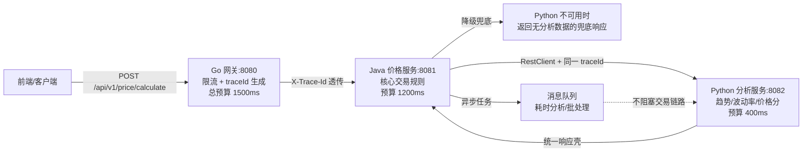

# 第 10 章 Python 与 Java 的协同通信机制

> 所属篇章：第三篇 Java 眼中的 Python 世界

**本章技术占比**：技术 50% + 引导 20% + 案例 30%

**前置 Java 知识映射**：Java HTTP 客户端（RestClient/RestTemplate/OpenFeign）、`BigDecimal` 精度处理、Jackson 序列化与命名策略、SLF4J MDC 链路追踪、线程池隔离与服务降级（Resilience4j/Sentinel）

## 本章导读

前面几章我们把 Python 的语法特性、依赖管理、并发模型逐一映射回了 Java 的心智模型。但只要项目里出现第二种语言，真正的难题就从"这门语言怎么写"变成了"两门语言怎么对话"。本章不再讲某一侧的语法，而是聚焦那条横在 Java 价格服务 `:8081` 与 Python 分析服务 `:8082` 之间的通信边界：一个 HTTP 请求跨过语言边界时，金额字段会不会丢精度，`traceId` 会不会断链，Python 服务挂了会不会把整条交易链路拖垮。

作为 Java 工程师，你对服务间调用并不陌生——RestClient 发请求、Feign 声明式调用、MDC 透传链路、Resilience4j 兜底降级，这些都是熟练动作。本章要做的，是把这些熟悉的治理手段"翻译"到跨语言场景，并指出哪些在同构 Java 集群里从不出问题的默认约定，一旦跨到 Python 就会变成线上事故。我们仍然用同一条真实链路贯穿全章：Go 网关 `:8080` 负责入口治理与限流，Java 价格服务 `:8081` 负责核心交易规则，Python 分析服务 `:8082` 负责历史数据处理与评分，三方通过统一响应壳 `{code, message, data, traceId}` 和 `X-Trace-Id` 头串联。

记住一条贯穿全章的红线：**Python 分析服务只出建议、不写核心状态**。价格趋势、波动率、价格分是"增强能力"，不是交易的前置条件。想清楚这一点，本章后面所有的超时、降级、异步化设计才有统一的判断基准。

## 技术地图



## 知识点拆解

| 小节 | 技术内容 | Java 视角切入 | 落地案例 |
| --- | --- | --- | --- |
| 10.1 | REST + JSON 同步调用、统一响应壳、双向超时对齐 | 对标 RestClient/Feign 与超时预算逐级递减 | Java 调 Python `/api/v1/analyze` |
| 10.2 | 序列化边界：整数分、`BigDecimal` vs `float`、ISO-8601、`None`/`null`、命名风格 | 对标 Jackson 序列化与 `BigDecimal` 金额处理 | 金额与时间字段的跨语言传递 |
| 10.3 | `traceId` 透传、`logging` 注入 vs MDC、日志字段统一 | 对标 SLF4J MDC 与拦截器链路追踪 | `X-Trace-Id` 头的读取/生成/写回 |
| 10.4 | 异步协同：消息队列与批处理文件交换的适用边界 | 对标线程池隔离与 `@Async`/MQ 解耦 | 耗时分析任务与 CSV/Parquet 批处理 |
| 10.5 | 容错与降级：健康检查、Python 不可用时的兜底 | 对标 Resilience4j 熔断降级与探活 | `/health` 契约与降级响应 |

## 10.1 同步调用与统一响应壳：REST + JSON 与双向超时对齐

### Java 中我们通常怎么做

在 Java 微服务里，服务间同步调用是最常见的形态。JDK 21 项目通常用 Spring 6.1 引入的 `RestClient`（同步、链式、比 `RestTemplate` 更现代），或者声明式的 OpenFeign。无论哪种，我们都会做三件标准动作：统一响应壳、统一超时、统一错误码翻译。

响应壳是团队约定俗成的第一层契约——所有接口都返回 `{code, message, data, traceId}`，业务码 `0` 表示成功，非零表示各类失败。调用方拿到响应先看 `code`，再决定要不要读 `data`：

```java
// 统一响应壳：与 docs/protocols/api-contract.md 对齐
public record ApiResponse<T>(int code, String message, T data, String traceId) {
    public boolean ok() { return code == 0; }
}

// 分析结果 DTO：字段名与契约严格一致（camelCase）
public record AnalysisData(String sku, String trend, BigDecimal volatility, int priceScore) {}

// 用 RestClient 调 Python 分析服务 :8082
@Service
public class AnalysisClient {
    private final RestClient rest = RestClient.builder()
            .baseUrl("http://localhost:8082")
            .requestFactory(clientRequestFactory())  // 在这里设置连接/读取超时
            .build();

    private ClientHttpRequestFactory clientRequestFactory() {
        var factory = new SimpleClientHttpRequestFactory();
        factory.setConnectTimeout(Duration.ofMillis(200));   // 建连超时
        factory.setReadTimeout(Duration.ofMillis(400));      // 读超时 = 给 Python 的预算
        return factory;
    }

    public ApiResponse<AnalysisData> analyze(String sku, long basePriceCents, String traceId) {
        return rest.post()
                .uri("/api/v1/analyze")
                .header("X-Trace-Id", traceId)               // 透传链路 ID
                .contentType(MediaType.APPLICATION_JSON)
                .body(Map.of("sku", sku, "basePriceCents", basePriceCents))
                .retrieve()
                .body(new ParameterizedTypeReference<>() {});
    }
}
```

关键在 `setReadTimeout(400ms)`：这不是随手写的数字，而是从整条链路的**超时预算**倒推出来的。

### Python 的对应设计

Python 侧被调方在仓库里就是一个极简的标准库实现 `python-analysis-service/app.py`，用 `http.server` 直接起了 `:8082`。它读取 `basePriceCents`，按阈值给出价格分，再套上同一个响应壳返回：

```python
# 摘自 python-analysis-service/app.py（真实仓库实现）
def do_POST(self):
    if self.path != "/api/v1/analyze":
        self.send_error(404)
        return
    length = int(self.headers.get("Content-Length", "0"))
    payload = json.loads(self.rfile.read(length) or b"{}")
    trace_id = self.headers.get("X-Trace-Id", f"trace-python-{int(time.time())}")
    base_price = int(payload.get("basePriceCents", 0))       # 整数分，不用 float
    score = 88 if base_price < 100000 else 76                # 100000 分 = 1000 元
    self.reply({
        "code": 0, "message": "OK",
        "data": {"sku": payload.get("sku", "UNKNOWN"),
                 "trend": "STABLE", "volatility": 0.07, "priceScore": score},
        "traceId": trace_id,
    })
```

生产环境更常见的是用 FastAPI 或 Flask，但契约完全一致。作为调用方，Python 服务如果要反向调 Java `:8081`，主流选择是 `requests`（同步、简单）或 `httpx`（同步/异步双栈，推荐新项目用）。它们的超时语义和 Java 一样要显式设定：

```python
import httpx

# httpx 的 timeout 可以拆成 connect / read / write / pool 四段，粒度比 requests 更细
_timeout = httpx.Timeout(connect=0.2, read=0.4, write=0.2, pool=0.2)
_client = httpx.Client(base_url="http://localhost:8081", timeout=_timeout)

def calc_price(sku: str, member_level: str, trace_id: str) -> dict:
    resp = _client.post(
        "/api/v1/price/calculate",
        json={"sku": sku, "memberLevel": member_level},
        headers={"X-Trace-Id": trace_id},   # 反向调用同样透传 traceId
    )
    resp.raise_for_status()
    return resp.json()
```

注意 `requests` 有个经典坑：如果只写 `timeout=0.4`，它指的是"连接超时"和"两次读之间的最长间隔"，**不是整个请求的墙钟上限**。真要限制总耗时，得靠 `httpx` 的分段 `Timeout` 或在外层加超时控制。

### 全栈选型逻辑

跨语言同步调用最容易被忽视的治理点是**超时预算逐级递减**。同构 Java 集群里大家凭经验也能对齐，但一旦跨语言、跨团队，超时如果各写各的，就会出现"网关已经给客户端返回 504、Java 还在傻等 Python"的资源泄漏。

正确做法是从入口开始分配一个总预算，逐级扣减：

| 层级 | 分配预算 | 说明 |
| --- | --- | --- |
| Go 网关 `:8080` | 1500ms（总预算） | 面向客户端承诺的 SLA 上限 |
| Java 价格服务 `:8081` | 1200ms | 扣除网关自身处理与网络往返 |
| Python 分析服务 `:8082` | 400ms | 只是增强能力，预算最小；超了就降级 |

每一层都要保证：**自己给下游的超时，小于上游给自己的剩余预算**。Java 给 Python 400ms，意味着即使 Python 卡满 400ms 超时返回，Java 还剩 800ms 走降级逻辑并向网关应答，不会击穿网关的 1500ms。这条链路上的分析节点预算最小，正是因为它"只出建议不写状态"——快返回比返回得全更重要。

### Java 开发者容易踩的坑

1. **不设读超时，用客户端默认值**。`RestTemplate`/`RestClient` 若不显式配 `readTimeout`，底层默认可能是无限等待。Python 分析服务偶尔因 GC 或数据加载卡住 10 秒，会把 Java 的调用线程一并挂住，线程池被拖垮后核心交易也跟着雪崩。永远显式设超时。
2. **把 `connect` 超时和 `read` 超时混为一谈**。建连快不代表读得快。Python 服务能瞬间 accept 连接，但计算价格分要 2 秒——只配 `connectTimeout` 根本拦不住慢响应，必须同时配 `readTimeout`。
3. **超时预算不递减，各层写同一个值**。下面这种写法在跨语言链路里很危险：

   ```java
   // 反例：三层都写 1500ms，下游超时 = 上游超时
   factory.setReadTimeout(Duration.ofMillis(1500));  // Java 给 Python 也是 1500ms
   // 结果：Python 卡到 1499ms 才超时，Java 已无剩余预算走降级，
   //       网关这边也早已把 1500ms 耗尽 → 客户端拿到 504，资源却仍在空转
   ```

   正确的做法是下游预算严格小于上游剩余预算，给自己留出降级和应答的时间。

## 10.2 序列化边界：金额、时间、空值与命名风格

### Java 中我们通常怎么做

这一节是 Java↔Python 协同里"坑最密集"的地方，值得单独重点讲。Java 侧对序列化有一套根深蒂固的强约束，靠 Jackson 全程托管。

**金额永远不用 `float`/`double`**。Java 工程师的肌肉记忆是：钱用 `BigDecimal`，或者在传输层用"整数分"（`long`，单位：分）。`0.1 + 0.2 != 0.3` 这种浮点误差在金融场景是绝对不能容忍的：

```java
// Java 侧：金额一律整数分，DTO 里就是 long
public record PriceCalcResult(String sku, long finalPriceCents, String currency) {}

// 若需要做乘除百分比运算，落到 BigDecimal，最后再转回分
BigDecimal price = BigDecimal.valueOf(finalPriceCents).movePointLeft(2); // 分 → 元
BigDecimal discounted = price.multiply(new BigDecimal("0.85"))
        .setScale(2, RoundingMode.HALF_UP);
long resultCents = discounted.movePointRight(2).longValueExact();        // 元 → 分
```

**时间用 ISO-8601**。`java.time` 的 `OffsetDateTime` 序列化成 `2026-07-31T14:03:00+08:00`，Jackson 配好 `JavaTimeModule` 即可。**空值语义清晰**：Jackson 默认把 Java `null` 序列化成 JSON `null`，字段缺省可用 `@JsonInclude(NON_NULL)` 控制。

### Python 的对应设计

Python 这一侧的每个默认行为，几乎都和 Java 的约定错位，必须逐条对齐。

**金额：Python 的 `float` 是 IEEE 754 双精度，同样有精度问题**。所以跨语言契约里坚持用整数分 `basePriceCents`（仓库 `app.py` 里就是 `int(payload.get("basePriceCents", 0))`）。如果 Python 侧要做金额运算，对应 Java `BigDecimal` 的是 `decimal.Decimal`，绝不能用 `float`：

```python
from decimal import Decimal, ROUND_HALF_UP

# 对标 Java BigDecimal：字符串构造，避免 float 污染
price = Decimal(base_price_cents) / Decimal(100)          # 分 → 元
discounted = (price * Decimal("0.85")).quantize(Decimal("0.01"), ROUND_HALF_UP)
result_cents = int((discounted * 100).to_integral_value())  # 元 → 分
# 反例：Decimal(0.85) 会把 float 的误差带进来，务必用 Decimal("0.85")
```

**时间：统一序列化成 ISO-8601 字符串**。`datetime.isoformat()` 产出 `2026-07-31T14:03:00+08:00`，与 Java `OffsetDateTime` 完美对齐。但要注意 Python 的 `datetime` 默认是"naive"（无时区）的，跨服务传递必须带时区（`datetime.now(timezone.utc)`），否则两端对同一时刻的理解会差 8 小时。

**空值：`None` 序列化成 JSON `null`**，这点和 Java 一致。但有个隐蔽差异——Python 的 `dict.get("x")` 缺键返回 `None`，`json.dumps` 会把它写成 `null`；而字段根本没放进 dict 则是"字段缺省"。调用方要能区分"字段是 null"和"字段不存在"这两种语义。

**命名风格：这是最容易被低估的坑**。契约（OpenAPI、响应壳）统一用 `camelCase`（`basePriceCents`、`priceScore`、`traceId`），但 Python 的圈内习惯是 `snake_case`（`base_price_cents`）。两种风格必须在**边界层显式转换**，不能让 Python 的内部命名习惯泄漏到线上 JSON：

```python
# 边界转换：内部用 snake_case，出口转成契约的 camelCase
def to_wire(data: dict) -> dict:
    mapping = {"price_score": "priceScore", "base_price_cents": "basePriceCents"}
    return {mapping.get(k, k): v for k, v in data.items()}
```

工程上更省心的做法是用 pydantic v2 的 `alias_generator=to_camel` + `populate_by_name=True`，让模型内部字段保持 `snake_case`，序列化/反序列化时自动走 `camelCase` 别名，一次配置全局生效。

### 全栈选型逻辑

序列化边界的治理原则是"契约优先，两端适配"。契约文件（OpenAPI）是唯一事实来源，它规定了字段名（`camelCase`）、金额单位（整数分）、时间格式（ISO-8601）。Java 和 Python 谁的语言习惯与契约不符，谁就在自己的边界层做转换，而不是去改契约迁就某一门语言。

为什么把这套约束的重量压在序列化边界，而不是靠双方"小心一点"？因为跨语言的类型系统无法互相约束——Java 的 `BigDecimal` 到了 JSON 里只是个数字字面量，Python 拿到后用 `float` 还是 `Decimal` 解析，编译器管不着。唯一能兜底的就是把这些规则写进契约、写进边界层代码、写进契约测试，让"精度""时区""命名"这些跨语言最易错的点在 CI 阶段就被拦下。

### Java 开发者容易踩的坑

1. **默认 Python 会像 Jackson 一样帮你处理好一切**。Jackson 生态成熟到我们几乎忘了序列化的存在，但 Python 标准库 `json` 相当"素"——它不认识 `Decimal`（`json.dumps(Decimal("1.5"))` 直接抛 `TypeError`）、不认识 `datetime`（同样报错）。跨语言时这些都要手动 `default=` 处理或换 pydantic。
2. **金额用 `float` 传输，两端各自舍入，对不上账**。看这个反例：

   ```python
   # 反例：用元为单位的 float 传金额
   payload = {"price": 19.99}          # 看似没问题
   # Java 侧 new BigDecimal(19.99) → 19.989999999999998... 
   # 累加几千笔后，对账差几分钱，财务追一整天
   ```

   坚持整数分 `basePriceCents`（`int`/`long`），从根上消除浮点误差。
3. **时间不带时区，跨服务差 8 小时**。Python `datetime.now()` 产出 naive 时间，序列化后没有 `+08:00` 后缀，Java 按 UTC 解析就会偏移。约定：所有跨服务时间字段一律 UTC + ISO-8601 带偏移量。
4. **命名风格泄漏，字段对不上直接读到 null**。Python 返回 `{"price_score": 88}`，Java DTO 声明的是 `priceScore`，Jackson 匹配不上，`priceScore` 静默变成 0/null——不报错，只是数据悄悄丢了。边界层必须强制 `camelCase`。

## 10.3 traceId 透传与跨语言日志统一

### Java 中我们通常怎么做

在 Java 里，链路追踪靠 SLF4J 的 MDC（Mapped Diagnostic Context）。它本质是一个绑定到线程的 `ThreadLocal<Map>`，请求进来时在拦截器/过滤器里把 `traceId` 放进 MDC，之后同一线程内所有日志都能通过 `%X{traceId}` 自动带上它，业务代码完全无感：

```java
// 入口过滤器：读取或生成 traceId，塞进 MDC
public class TraceFilter implements Filter {
    public void doFilter(ServletRequest req, ServletResponse res, FilterChain chain)
            throws IOException, ServletException {
        var request = (HttpServletRequest) req;
        String traceId = Optional.ofNullable(request.getHeader("X-Trace-Id"))
                .orElse("trace-" + UUID.randomUUID());
        MDC.put("traceId", traceId);
        try {
            ((HttpServletResponse) res).setHeader("X-Trace-Id", traceId); // 写回响应
            chain.doFilter(req, res);
        } finally {
            MDC.clear();   // 线程复用前必须清理，否则串号
        }
    }
}
```

日志格式里配 `[%X{traceId}]`，一行日志就带上了链路 ID。调用下游时，再从 MDC 取出 `traceId` 放进 `X-Trace-Id` 请求头（就是 10.1 里 `AnalysisClient` 那行 `.header("X-Trace-Id", traceId)`），链路就串起来了。

### Python 的对应设计

Python 没有 MDC，但仓库 `app.py` 已经实现了 `traceId` 透传的核心逻辑——读取请求头，缺失则生成，最后写回响应体：

```python
# 摘自 app.py：读取 X-Trace-Id，缺失则生成一个 python 侧的 ID
trace_id = self.headers.get("X-Trace-Id", f"trace-python-{int(time.time())}")
# ...最终 reply 里 "traceId": trace_id，把它写回响应壳
```

要把 `traceId` 像 Java MDC 那样自动注入到每一行日志，Python 的对应机制是 `logging.Filter` + `contextvars`（`contextvars` 是 Python 3.7+ 的标准库，天然支持异步，比 `threading.local` 更适合 `asyncio`）：

```python
import logging, contextvars

trace_ctx = contextvars.ContextVar("trace_id", default="-")

class TraceFilter(logging.Filter):
    def filter(self, record: logging.LogRecord) -> bool:
        record.trace_id = trace_ctx.get()   # 注入到每条日志记录
        return True

# 日志格式里引用 %(trace_id)s，等价于 Java 的 %X{traceId}
handler = logging.StreamHandler()
handler.setFormatter(logging.Formatter(
    '{"traceId":"%(trace_id)s","service":"analysis","level":"%(levelname)s","message":"%(message)s"}'
))
handler.addFilter(TraceFilter())

# 请求进来时：trace_ctx.set(trace_id)，本次请求内所有日志自动带上
```

`contextvars` 和 MDC 的语义几乎一一对应：`set` 对应 `MDC.put`，`ContextVar` 的自动隔离对应 MDC 的 `ThreadLocal`。区别是 `contextvars` 在 `asyncio` 里能正确随协程切换传播，而 `threading.local` 在异步下会串号。

### 全栈选型逻辑

跨语言链路追踪的关键，是让**日志字段在两端保持同名同义**。仓库的 `api-contract.md` 已经把日志字段标准化了：`traceId`、`service`、`endpoint`、`latencyMs`、`code`、`message`。无论 Java 用 MDC 还是 Python 用 `contextvars`，最终吐到日志系统（ELK/Loki）里的 JSON 字段名必须一致——否则用同一个 `traceId` 在 Kibana 里搜索时，Java 日志和 Python 日志因为字段名不同（`trace_id` vs `traceId`）而无法关联，跨语言排障就失去了意义。

统一 `X-Trace-Id` 作为传输载体、统一响应壳里的 `traceId` 字段、统一日志里的字段名，这三者对齐了，一条请求从网关到 Java 到 Python 的完整轨迹才能在日志平台里一键串联。这也是"契约优先"原则在可观测性上的延伸。

### Java 开发者容易踩的坑

1. **异步/线程池切换后 MDC 丢失**。MDC 绑定当前线程，一旦把任务提交到线程池（`@Async`、`CompletableFuture.supplyAsync`），子线程拿不到父线程的 MDC，`traceId` 变空。这不是 Python 的坑，但跨语言链路里一旦断在 Java 异步这一环，整条链就查不通。用 `TaskDecorator` 或手动 `MDC.getCopyOfContextMap()` 传递。
2. **调下游时忘了把 `traceId` 放进请求头**。MDC 里有 `traceId` 不等于自动透传，必须显式从 `MDC.get("traceId")` 取出塞进 `X-Trace-Id`。忘了这一步，Python 侧 `app.py` 就走到 `else` 分支自己生成一个 `trace-python-xxx`，链路从此断成两截。
3. **两端字段名不统一，日志关联失败**。看这个现象：

   ```
   # Java 日志：{"traceId":"trace-abc","service":"pricing"}
   # Python 日志（字段名写成了 snake_case）：{"trace_id":"trace-abc","service":"analysis"}
   # 后果：Kibana 里按 traceId:"trace-abc" 搜索，只出 Java 的日志，Python 的漏掉
   ```

   日志字段名以 `api-contract.md` 为准，两端都用 `traceId`。

## 10.4 异步协同：消息队列与批处理文件交换

### Java 中我们通常怎么做

Java 工程师对"什么时候该异步"有清晰的判断：短平快的读操作走同步 RPC，耗时长、不需要实时结果、或需要削峰的操作走消息队列。我们用 `@Async` 做进程内异步，用 Kafka/RabbitMQ 做跨服务解耦，用线程池隔离防止慢任务拖垮快链路。核心原则是——**不要让一个耗时操作阻塞在用户请求的关键路径上**。

```java
// 交易主链路：只做同步的核心价格计算，快速返回
long finalPrice = pricingService.calculate(sku, memberLevel);
// 耗时的深度分析（如全量历史回归）丢进 MQ，异步处理，不阻塞响应
analysisQueue.send(new AnalysisJob(sku, finalPrice, traceId));
return ApiResponse.ok(new PriceResult(sku, finalPrice), traceId);
```

### Python 的对应设计

Python 生态里做异步任务的主力是 Celery（配 Redis/RabbitMQ 做 broker），或者更轻量的 RQ（Redis Queue）。分析服务 `:8082` 里，快速评分（趋势/波动率/价格分）适合走 10.1 那样的同步 REST；但如果要做一次跨全量历史数据的深度回归分析，动辄几十秒，就绝不能让它挂在交易请求上：

```python
# 概念级示例：耗时分析任务丢给 Celery，交易链路立即返回
from celery import Celery

app = Celery("analysis", broker="redis://localhost:6379/0")

@app.task
def deep_analyze(sku: str, base_price_cents: int, trace_id: str):
    # 几十秒级的历史回归，结果写入分析结果库供后续查询
    # 注意：只写"分析结果"，绝不回写价格、库存等核心交易状态
    ...
```

**批处理文件交换**是另一类常见场景。当分析要吃的不是单个 SKU 而是每日全量数据时，用 CSV 或 Parquet 做批量交换比逐条 RPC 高效得多。Java 侧每天导出一份价格快照，Python 侧用 pandas 读进来批量分析：

```python
import pandas as pd

# Parquet 比 CSV 更适合大数据量：列式存储、带 schema、体积小、读取快
df = pd.read_parquet("s3://pricing/daily/2026-07-31/prices.parquet")
# 金额列约定为整数分（int64），避免 CSV 里 float 精度问题
result = df.groupby("sku")["base_price_cents"].agg(["mean", "std"])
result.to_parquet("s3://pricing/daily/2026-07-31/analysis.parquet")
```

CSV 通用但弱类型（金额容易被读成 float、日期格式各异）；Parquet 带 schema、列式压缩，大数据量首选。选哪个取决于数据量和下游消费方。

### 全栈选型逻辑

这一节的判断基准，正是本章开头那条红线的直接应用：**分析服务只出建议、不写核心状态**。

- **同步 REST**：适合快速评分——调用方需要在本次交易内拿到 `priceScore`，且分析计算能压进 400ms 预算。就是 10.1 的链路。
- **消息队列**：适合耗时、不需要实时结果的深度分析。交易链路把任务丢进队列立即返回，分析异步跑完把结果写进"分析结果库"，供后续查询。**耗时分析绝不该阻塞交易链路**。
- **批处理文件交换**：适合离线、全量、周期性的分析。用 CSV/Parquet 交换，彻底和在线链路解耦。

三种方式的共同边界红线是：无论同步还是异步，Python 分析服务**只能写它自己的分析结果，绝不回写价格、库存、订单等核心交易状态**。核心状态的唯一写入方永远是 Java `:8081`。一旦 Python 通过消息队列去改了核心状态，就等于让一个"增强能力"节点获得了破坏交易一致性的能力，这是架构上必须堵死的口子。

### Java 开发者容易踩的坑

1. **把该异步的耗时分析写成同步阻塞**。全量历史回归要 30 秒，却用同步 REST 调，把交易请求线程卡满 30 秒——线程池瞬间耗尽，核心交易 502。凡是"不需要在本次请求内拿到结果"的分析，一律异步化。
2. **让 Python 通过 MQ 回写核心状态，突破边界红线**。比如让 Python 分析完直接发消息去改商品价格。看似"闭环自动化"，实则把价格的写入权分给了分析服务，一旦分析逻辑有 bug 就会污染核心数据，且责任边界彻底混乱。分析结果只入分析库，价格调整必须回到 Java 走完整的交易规则校验。
3. **CSV 批处理把金额读成 float，精度又崩了**。pandas 默认把数字列推断成 `float64`：

   ```python
   # 反例：金额列被自动推断成 float64
   df = pd.read_csv("prices.csv")          # base_price_cents → 99999.0
   # 大批量聚合后再转回分，尾数误差累积，和 Java 侧对不上账
   # 正解：显式指定 dtype，金额列锁死为整数
   df = pd.read_csv("prices.csv", dtype={"base_price_cents": "int64"})
   ```

## 10.5 容错与降级：健康检查与兜底策略

### Java 中我们通常怎么做

Java 微服务的容错是一套成熟工具链：Resilience4j/Sentinel 做熔断、限流、降级，Spring Boot Actuator 暴露 `/actuator/health` 供 K8s 探活。核心思想是"快速失败 + 优雅降级"——下游不可用时，不是把异常抛给用户，而是返回一个有损但可用的兜底结果：

```java
// 用 Resilience4j 给分析调用加熔断 + 降级
@CircuitBreaker(name = "analysis", fallbackMethod = "analyzeFallback")
public AnalysisData analyze(String sku, long basePriceCents, String traceId) {
    var resp = analysisClient.analyze(sku, basePriceCents, traceId);
    if (!resp.ok()) throw new AnalysisException(resp.code(), resp.message());
    return resp.data();
}

// 降级兜底：Python 挂了/超时/熔断打开时走这里，返回"无分析数据"的安全默认值
private AnalysisData analyzeFallback(String sku, long basePriceCents,
                                     String traceId, Throwable ex) {
    log.warn("分析服务降级 traceId={} cause={}", traceId, ex.toString());
    return new AnalysisData(sku, "UNKNOWN", BigDecimal.ZERO, -1); // priceScore=-1 表示无数据
}
```

关键点：降级返回的必须是**语义明确的"无数据"标记**（这里 `priceScore=-1`、`trend=UNKNOWN`），而不是伪造一个看起来正常的假分数——下游和前端要能识别"这次没有分析结果"，而不是被一个编造的 88 分误导。

### Python 的对应设计

Python 侧要做的是"让自己好被探活、好被降级"。仓库 `app.py` 已经提供了 `/health` 端点，返回契约一致的响应壳：

```python
# 摘自 app.py：健康检查端点
def do_GET(self):
    if self.path == "/health":
        self.reply({"code": 0, "message": "OK", "data": {"status": "UP"}, "traceId": "health"})
        return
    self.send_error(404)
```

`/health` 是网关和编排系统判断 Python 服务存活的契约入口。生产环境通常还会区分 liveness（进程活着吗）和 readiness（能接流量吗），但最小契约就是这个 `{"status": "UP"}`。Python 服务自身也要做好防御——即使内部分析逻辑抛异常，也要捕获后返回契约里的错误码 `50002`（Python 分析服务失败），而不是让连接直接断开或返回一个 500 的裸 HTML：

```python
# 分析逻辑异常也要套响应壳，返回契约错误码 50002
try:
    result = run_analysis(payload)
except Exception as e:
    self.reply({"code": 50002, "message": f"分析失败: {e}",
                "data": None, "traceId": trace_id})
    return
```

### 全栈选型逻辑

容错设计的判断基准，仍然是那条红线：**分析是增强能力，不是交易前置条件**。因为分析可降级，所以整条链路的容错策略就非常清晰：

| 风险 | 保护策略 | 契约依据 |
| --- | --- | --- |
| Python 分析慢 | Java 侧 400ms 超时，超时即降级 | 超时预算逐级递减（10.1） |
| Python 结果不稳定 | 缓存最近一次可用结果，短 TTL | 缓存兜底 |
| Python 服务不可用 | 返回无分析数据的兜底响应，不阻断交易 | `priceScore=-1` / `trend=UNKNOWN` |
| Python 内部异常 | 返回错误码 `50002`，Java 据此降级 | `api-contract.md` 错误码表 |
| 参数版本不一致 | OpenAPI 契约 + 兼容字段 | `contracts/openapi.yaml` |

网关和 Java 都要预设"Python 可能不在"这个前提。健康检查探到 Python DOWN，网关可以直接跳过分析调用；即使探活正常但单次请求超时，Java 也要能无缝降级。整条交易链路对"有没有分析数据"必须是容忍的。

### Java 开发者容易踩的坑

1. **降级方法里伪造一个"正常"的假分数**。降级返回 `priceScore=88` 看似让前端不报错，实则用编造数据欺骗了业务决策。降级必须返回可识别的"无数据"标记（`-1`/`UNKNOWN`），让下游明确知道"这次没有分析结果"。
2. **只做超时不做熔断，慢调用持续打崩自己**。Python 服务大面积慢的时候，每个请求都要傻等 400ms 才超时降级，线程被慢调用占满。要用熔断器：连续失败达阈值就直接快速降级，不再真发请求，给 Python 恢复的窗口。
3. **健康检查只探端口通不通，不看响应内容**。TCP 探活只能知道端口在监听，但 Python 进程可能已经"假死"（能 accept 但处理不了请求）。要按 `/health` 契约做应用层探活，校验返回的 `code==0` 和 `data.status=="UP"`，才能探出真正的健康状态。

## 对比代码示例

下面把一次完整的跨语言调用两端对照展开：Java 作为调用方（RestClient + 降级），Python 作为被调方（读 `traceId` + 套响应壳），基于真实链路 `POST /api/v1/analyze`。

```java
// ============ Java 调用方（:8081 调 :8082）============
@Service
public class PricingFacade {
    private final AnalysisClient analysisClient;   // 见 10.1
    private final CircuitBreaker breaker;          // Resilience4j

    public ApiResponse<PriceResult> quote(String sku, String memberLevel, String traceId) {
        long basePriceCents = pricing.basePrice(sku);      // Java 核心：算基础价（整数分）
        long finalCents = pricing.applyMember(basePriceCents, memberLevel); // 会员优惠

        AnalysisData analysis;
        try {
            analysis = breaker.executeSupplier(() -> {
                var resp = analysisClient.analyze(sku, basePriceCents, traceId);
                if (!resp.ok()) throw new AnalysisException(resp.code(), resp.message());
                return resp.data();                        // {sku, trend, volatility, priceScore}
            });
        } catch (Exception ex) {
            // Python 超时/挂掉/熔断：降级为"无分析数据"，交易照常返回
            log.warn("分析降级 traceId={} cause={}", traceId, ex.toString());
            analysis = new AnalysisData(sku, "UNKNOWN", BigDecimal.ZERO, -1);
        }
        return new ApiResponse<>(0, "OK",
                new PriceResult(sku, finalCents, analysis), traceId);
    }
}
```

```python
# ============ Python 被调方（:8082，源自仓库 app.py）============
def do_POST(self):
    if self.path != "/api/v1/analyze":
        self.send_error(404)
        return
    length = int(self.headers.get("Content-Length", "0"))
    payload = json.loads(self.rfile.read(length) or b"{}")
    # 1) 读 traceId：有则透传，无则生成——链路不断
    trace_id = self.headers.get("X-Trace-Id", f"trace-python-{int(time.time())}")
    # 2) 金额用整数分，绝不 float
    base_price = int(payload.get("basePriceCents", 0))
    # 3) 核心分析（此处为规则示意；真实场景是历史数据回归）
    score = 88 if base_price < 100000 else 76
    # 4) 套统一响应壳，camelCase 字段，写回同一 traceId
    self.reply({
        "code": 0, "message": "OK",
        "data": {"sku": payload.get("sku", "UNKNOWN"),
                 "trend": "STABLE", "volatility": 0.07, "priceScore": score},
        "traceId": trace_id,
    })
```

两段代码把本章的治理点全串起来了：统一响应壳、整数分金额、`traceId` 透传、超时降级。Java 侧的 `catch` 块和 Python 侧的响应壳，共同保证了"分析可有可无，但交易永远能返回"。

## 章节综合案例：一次带降级的实时价格查询

把前面所有小节的知识点放回一条真实链路，走一遍"用户查某 SKU 实时价格"的完整流程。

### 场景输入

前端请求 `POST /api/v1/price/calculate`，body 为 `{"sku": "SKU-1001", "memberLevel": "GOLD"}`。系统要返回该 SKU 的最终价格，并附带价格趋势与价格分作为增强信息。

### 关键流程

1. **Go 网关 `:8080`**：校验请求、限流、生成 `traceId`（如 `trace-20260731-001`）放进 `X-Trace-Id` 头、分配 1500ms 总预算，转发给 Java。
2. **Java 价格服务 `:8081`**：从 MDC 取 `traceId`，计算基础价 `basePriceCents`、套用 GOLD 会员优惠得最终价（整数分，`BigDecimal` 运算）。这一步是核心交易，必须成功。
3. **Java 调 Python `:8082`**：用 RestClient 带 400ms 读超时、透传 `X-Trace-Id`，请求体 `{"sku":"SKU-1001","basePriceCents":99900}`。
4. **两种走向**：
   - Python 正常：返回 `{"code":0,"data":{"sku":"SKU-1001","trend":"STABLE","volatility":0.07,"priceScore":88},"traceId":"trace-20260731-001"}`（`basePriceCents=99900 < 100000`，得 88 分）。Java 合并进最终响应。
   - Python 超时/挂掉：熔断器降级，`analysis` 置为 `trend=UNKNOWN`、`priceScore=-1`，交易照常返回最终价，只是没有分析增强。
5. **统一返回**：无论哪种走向，Java 都按响应壳返回，`traceId` 全程一致，网关、Java、Python 三方日志都能用 `trace-20260731-001` 串联。

### 本章落地点

读者完成本章后，应能把这条链路里的每个治理决策讲清楚：为什么金额是整数分（10.2 精度），为什么 Python 预算只有 400ms（10.1 预算递减），为什么 Python 挂了交易还能返回（10.5 降级红线），为什么日志能跨语言串联（10.3 `traceId` 统一）。这些能力最终都会汇入第 13 章的电商价格计算平台。

## 本章小结

1. 跨语言同步调用的第一治理点是**超时预算逐级递减**：网关 1500ms → Java 1200ms → Python 400ms，下游预算严格小于上游剩余，给降级留出空间。
2. **序列化边界是 Java↔Python 最密集的坑区**：金额用整数分、`Decimal` 对标 `BigDecimal`、时间统一 ISO-8601 带时区、命名在边界层做 `camelCase`↔`snake_case` 转换。契约优先，两端适配。
3. **`traceId` 透传靠 `X-Trace-Id` 头**：Python 用 `contextvars` 对标 Java MDC，日志字段以 `api-contract.md` 为准两端同名，链路才能在日志平台一键串联。
4. **异步协同与容错的共同红线是"分析只出建议、不写核心状态"**：耗时分析走 MQ/批处理不阻塞交易，Python 不可用时 Java 返回可识别的"无分析数据"兜底，交易链路对分析结果的有无必须容忍。
5. 所有治理手段最终都指向一句话：Python 分析服务是价格链路的增强能力，不是前置条件——本章的超时、降级、异步设计都由这条边界推导而来。

## 选型思考题

1. 如果 Python 分析服务的响应时间从稳定的 200ms 恶化到偶发 2 秒，在不改动 Java 超时（400ms）的前提下，你会用熔断、缓存、异步化中的哪一种组合来保护交易链路？各自的代价是什么？
2. 团队提议"让 Python 分析完直接把优化后的价格写回商品库，实现自动调价"。基于本章的边界红线，你会同意吗？如果业务确实需要自动调价，正确的架构应该怎么设计？
3. 你所在项目里，Java 和 Python 之间的金额、时间、空值三类字段，目前是靠"约定"还是靠"契约测试"来保证一致？如果要在 CI 里加一道跨语言契约校验，你会先卡住哪一类字段？

## 延伸阅读资源

1. **Spring Framework 官方文档 · RestClient**（docs.spring.io/spring-framework/reference/integration/rest-clients.html）：JDK 21 项目里同步调用下游的现代客户端，含超时与错误处理配置。
2. **httpx 官方文档 · Timeouts & Async**（www.python-httpx.org/advanced/timeouts/）：Python 侧分段超时（connect/read/write/pool）与同步/异步双栈用法，对齐本章超时预算。
3. **Resilience4j 官方文档 · CircuitBreaker**（resilience4j.readme.io）：熔断、降级、限流的标准实现，对应 10.5 的兜底策略。
4. **Python 官方文档 · `decimal` 与 `contextvars`**（docs.python.org/3/library/decimal.html、docs.python.org/3/library/contextvars.html）：分别对标 Java `BigDecimal` 与 MDC，是 10.2、10.3 两节的语言级基础。
5. **本仓库 `docs/protocols/api-contract.md` 与 `contracts/openapi.yaml`**：响应壳、错误码、日志字段与接口契约的唯一事实来源，动手实验前先读它。

## 第 10 章 Java 调 Python 的保护策略

| 风险 | 保护策略 | 本章依据 |
| --- | --- | --- |
| Python 分析慢 | Java 侧 400ms 读超时，超时即降级 | 10.1 超时预算递减 |
| Python 结果不稳定 | 缓存最近一次可用结果（短 TTL） | 10.5 缓存兜底 |
| Python 服务不可用 | 返回 `priceScore=-1`/`trend=UNKNOWN` 兜底，不阻断交易 | 10.5 降级红线 |
| 金额精度错乱 | 全链路整数分 `basePriceCents`，运算用 `BigDecimal`/`Decimal` | 10.2 序列化边界 |
| 链路断链无法排障 | `X-Trace-Id` 全程透传，日志字段两端同名 | 10.3 traceId 统一 |
| 参数版本不一致 | OpenAPI 契约 + 兼容字段 + 契约测试 | 10.4/契约优先 |

Java 调 Python 时始终牢记一条边界红线：**价格分析是增强能力，不是交易前置条件**。只要业务允许，Python 调用就必须设计成可超时、可熔断、可降级；分析服务只出建议、不写核心状态，核心交易状态的唯一写入方永远是 Java `:8081`。
