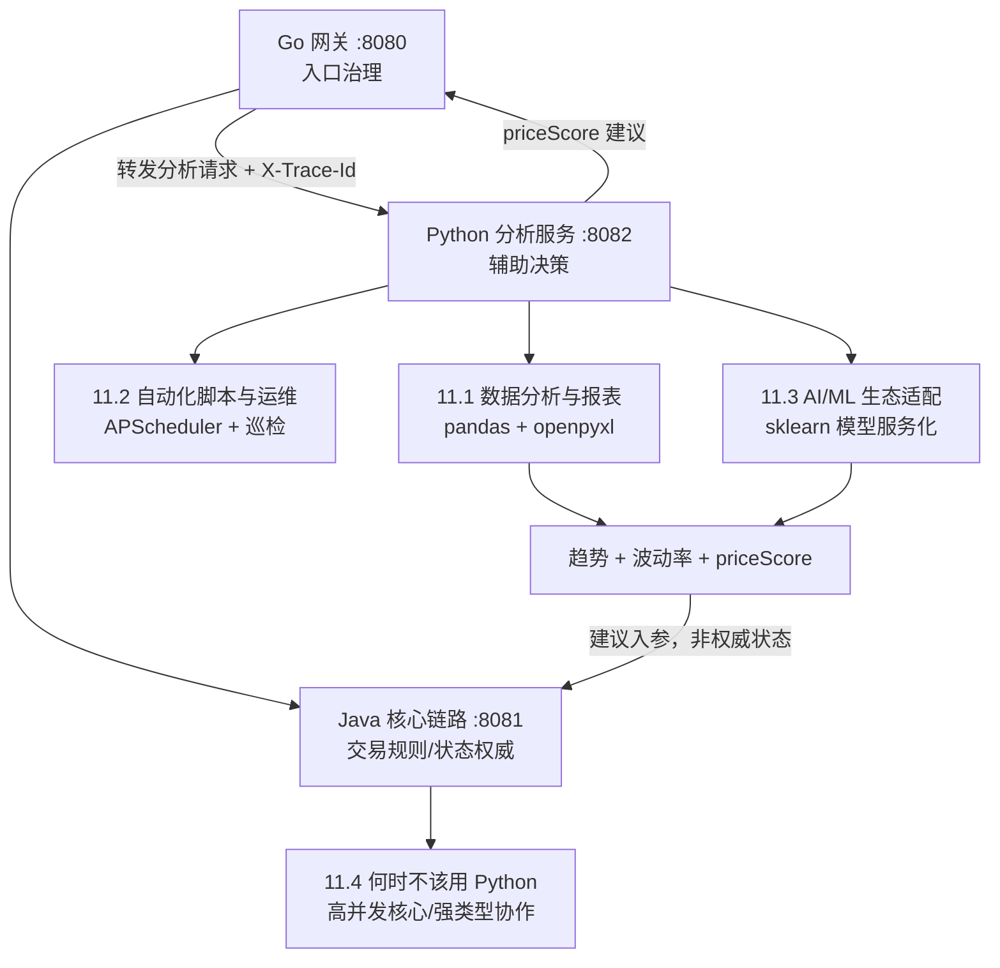

# 第 11 章 Python 在全栈架构下的落地场景实战

> 所属篇章：第三篇 Java 眼中的 Python 世界

**本章技术占比**：技术 50% + 引导 20% + 案例 30%

**前置 Java 知识映射**：Java 批处理与 Stream 统计、Apache POI 报表、Quartz/Spring Scheduling 定时任务、运维脚本工程化、模型服务集成（DJL/ONNX/REST 调用）、JUC 真并行

## 本章导读

前面几章讲清楚了 Python 的语法哲学和它在数据节点上的独特表达力。这一章要回答一个更实际、也更容易被误判的问题：在一套已经以 Java 为核心的企业全栈架构里，Python 到底值不值得引入，引入了该放在哪儿，又有哪些地方碰都不该碰。

作为资深 Java 工程师，你大概率经历过两种极端。一种是「Java 全能论」：报表、脚本、定时任务、模型集成全用 Java 写，结果一个导个 Excel 的小工具也拖着半个 Spring 上下文，一个每天跑一次的巡检脚本要打成 jar、配 CI、上发布流水线，重得不成比例。另一种是「Python 万能论」：看到 Python 写数据分析爽，就想把在线核心链路也迁过去，最后在 GIL 和动态类型上栽跟头。这两种都不是架构判断，而是语言偏好。

本章仍用同一套四段式展开每个场景：先看「Java 中我们通常怎么做」，再看「Python 的对应设计」，然后回答「全栈选型逻辑」，最后列出「Java 开发者容易踩的坑」。落地背景依旧是那条电商价格链路——Go 网关 `:8080` 负责入口治理，Java 价格服务 `:8081` 负责核心交易规则，Python 分析服务 `:8082` 负责历史数据处理与评分，三方靠统一响应壳和 `X-Trace-Id` 契约串联。你会看到，Python 真正的价值集中在数据分析、自动化运维、AI/ML 适配这三类「围绕核心、辅助决策」的职责上；而一旦越过「只出建议、不写核心状态」这条红线，它带来的就不是效率，而是风险。

## 技术地图



## 知识点拆解

| 小节 | 技术内容 | Java 视角切入 | 落地案例 |
| --- | --- | --- | --- |
| 11.1 | pandas 做历史价格分析、openpyxl/CSV 出报表 | 对标 POI + 手写流式统计的样板量 | 价格历史趋势/波动率/priceScore 报表 |
| 11.2 | APScheduler/cron 定时任务、批量文件、API 巡检、脚本工程化底线 | 对标 Quartz/Spring Scheduling 与 jar 化运维工具 | 每日巡检 `:8081`/`:8082` 健康与数据 |
| 11.3 | scikit-learn/PyTorch 生态、模型推理服务化供 Java/Go 调用 | 对标 DJL/ONNX 内嵌或直接调云 API | 价格评分模型包一层 REST |
| 11.4 | 高并发核心、强类型大型协作的边界，「只出建议不写核心状态」红线 | 对标 Java 真并行与编译期强契约 | `:8082` 越界写核心状态的反例 |

## 11.1 数据分析与报表：用 pandas 把价格历史变成决策

### Java 中我们通常怎么做

价格团队常有这类需求：把过去 90 天的成交价拉出来，按 SKU 分组，算出趋势方向、波动率、和历史中位数的偏离，再导出一份 Excel 给运营看。用 Java 做，数据结构和统计逻辑都要手写。读 CSV 得用 OpenCSV 或自己 split，聚合要写一串 Stream 的 `groupingBy` + `Collectors`，标准差没有现成 API 还得自己实现或引 commons-math，导 Excel 要用 Apache POI 一个单元格一个单元格地 `createCell`、`setCellValue`、再单独设样式。

```java
// Java：按 SKU 分组算均值，只是「均值」这一步就已经这么长
Map<String, Double> avgBySku = samples.stream()
        .collect(Collectors.groupingBy(
                PriceSample::sku,
                Collectors.averagingLong(PriceSample::finalCents)));

// POI 导出：每个单元格都要手动写
Workbook wb = new XSSFWorkbook();
Sheet sheet = wb.createSheet("价格分析");
Row header = sheet.createRow(0);
header.createCell(0).setCellValue("SKU");
header.createCell(1).setCellValue("均价(分)");
// ……趋势、波动率、评分列继续手写，还要管样式、宽度、公式
```

这套代码的每一行都在「搬运数据」，真正的业务判断（趋势怎么定义、波动率怎么算）被淹没在样板里。Java 的强项是长期演进的核心业务建模，而不是这种探索性、一次性、以数据形状为中心的分析。

### Python 的对应设计

pandas 把「表格数据」做成了语言级的一等抽象。整张表是一个 `DataFrame`，一列是一个 `Series`，读文件、分组、聚合、滚动窗口、透视全是内置方法链，标准差、中位数、分位数都是一次调用。同样的「按 SKU 分组算均值」在 pandas 里是一行：

```python
import pandas as pd

df = pd.read_csv("price_history.csv")          # 一行读入，自动推断列类型
avg_by_sku = df.groupby("sku")["final_cents"].mean()   # 分组聚合一行搞定
```

把完整的价格分析写出来，逻辑密度和业务语义的比值远高于 Java：

```python
import pandas as pd

def analyze_history(csv_path: str) -> pd.DataFrame:
    """读历史成交价，按 SKU 算趋势、波动率、priceScore"""
    df = pd.read_csv(
        csv_path,
        dtype={"sku": str},                    # 关键：SKU 强制当字符串，别丢前导零
        parse_dates=["traded_at"],
    )

    def score_group(g: pd.DataFrame) -> pd.Series:
        g = g.sort_values("traded_at")
        prices = g["final_cents"]
        recent = prices.tail(max(1, len(prices) // 5))     # 近 20% 样本判趋势
        first, last = recent.iloc[0], recent.iloc[-1]
        trend = "UP" if last > first else "DOWN" if last < first else "STABLE"

        mean = prices.mean()
        volatility = prices.std(ddof=0) / mean if mean else 0.0   # 变异系数
        median = prices.median()
        ratio = last / median if median else 1.0
        price_score = 92 if ratio <= 0.85 else 84 if ratio <= 0.95 else 70

        return pd.Series({
            "trend": trend,
            "volatility": round(float(volatility), 4),
            "priceScore": int(price_score),
            "samples": len(prices),
        })

    return df.groupby("sku", group_keys=True).apply(score_group).reset_index()
```

导出报表同样轻。`df.to_excel` 底层就是 openpyxl，一行把 DataFrame 落成带表头的工作表；需要精细控制样式、公式、多 sheet 时再直接用 openpyxl 补：

```python
with pd.ExcelWriter("price_report.xlsx", engine="openpyxl") as writer:
    report = analyze_history("price_history.csv")
    report.to_excel(writer, sheet_name="价格分析", index=False)
    # 需要冻结首行、加条件格式时，用 writer.book / writer.sheets 拿到 openpyxl 对象再改
```

设计动机很清楚：pandas 面向的就是「表在内存里、快速试各种切法」的分析工作流，它把最高频的读入、清洗、分组、聚合、导出全部下沉成方法，让分析师和工程师把注意力留给「怎么定义指标」而非「怎么遍历数组」。

### 全栈选型逻辑

价格历史趋势、波动率、priceScore 这些指标，本质是「围绕核心交易的辅助分析」——它们喂给 Java `:8081` 做最终报价参考，但不是报价本身。这类需求的特点是迭代快、口径常变、还经常要临时出一份 Excel 给业务方。放在 Python `:8082` 里，pandas 让改一个指标定义只需动几行、导报表只需一行，反馈速度是 Java + POI 的样板代码给不了的。反过来，「一次最终成交价到底是多少」这种要落库、要对账、要长期一致的逻辑，必须留在 Java 核心服务，pandas 的产物只是它的输入之一。这正是「核心交易 / 数据辅助」分栈的具体投影。

### Java 开发者容易踩的坑

1. **SKU 被 pandas 当数字读，前导零和长编码全毁**。`read_csv` 默认推断列类型，`"0012"` 会变成整数 `12`，`"1234567890123456"`（长条码）会被转成科学计数法丢精度。现象是导出的报表里 SKU 对不上库里的真实值。规则：所有编码类字段一律 `dtype={"sku": str}` 显式声明为字符串，别信自动推断。
2. **一次性 `read_csv` 把几百 MB 文件全读进内存**。pandas 默认把整张表物化到内存，几百万行的历史导出很容易吃满。数据大到扛不住时用 `chunksize=100000` 分块迭代，或只读需要的列 `usecols=[...]`，别等 `MemoryError` 才发现。
3. **`SettingWithCopyWarning` 背后的静默不生效**。对 `df[df.sku == "X"]["price"] = 0` 这种「链式索引后赋值」，pandas 可能改的是一份副本而非原表，值根本没写进去却只给个 warning。要改值用 `df.loc[mask, "price"] = 0` 一步定位，别把过滤和赋值拆成两次下标。
4. **忘了 `std(ddof=0)` 与 Java 口径不一致**。pandas 的 `std()` 默认 `ddof=1`（样本标准差，除以 n-1），如果 Java 侧用的是总体标准差（除以 n），两边算出的波动率会对不上，跨语言核对指标时会误以为有 bug。定义指标时把 `ddof` 说清楚并两栈对齐。

## 11.2 自动化脚本与运维：定时巡检与批量处理

### Java 中我们通常怎么做

写一个「每天凌晨拉一次各服务健康状态、检查昨天的价格数据有没有异常、有问题就告警」的运维工具，用 Java 的成本是结构性的重。要么塞进现有 Spring 应用挂个 `@Scheduled`，让一个在线服务承担了本不该有的定时职责；要么单独建一个 Maven 工程，配 Quartz 或 Spring Scheduling，写 main、打 fat jar、上发布流水线、申请一台机器跑。对一个几十行逻辑的巡检脚本来说，从写完到跑起来的工程摩擦力过大，改一行还要重新构建发布。

```java
// Spring Scheduling：为了一个巡检任务，要拖着整个 Spring 上下文
@Component
public class InspectionJob {
    @Scheduled(cron = "0 0 3 * * ?")   // 每天 3 点
    public void inspect() {
        // HttpClient 调各服务 /health、解析、判断、告警……
        // 逻辑不复杂，但承载它的工程外壳很重
    }
}
```

### Python 的对应设计

Python 天生适合「脚本即工具」。一个 `.py` 文件、几个标准库或轻依赖，直接 `python inspect.py` 就能跑；要定时，交给系统 `cron`（Linux）/计划任务（Windows），或在进程内用 `APScheduler`。调内部 API 用 `httpx`/`requests` 一行，处理批量文件用 `pathlib` + `glob`，从写完到跑起来几乎没有工程摩擦。

进程内定时用 APScheduler，声明式地挂任务：

```python
# inspect_service.py —— 常驻进程内调度巡检
from apscheduler.schedulers.blocking import BlockingScheduler
import httpx, logging, sys

logging.basicConfig(
    level=logging.INFO,
    format="%(asctime)s %(levelname)s %(name)s - %(message)s",
    handlers=[logging.StreamHandler(sys.stdout)],   # 交给容器/journald 收集
)
log = logging.getLogger("inspection")

TARGETS = {"price": "http://localhost:8081/health",
           "analysis": "http://localhost:8082/health"}

def check_health() -> None:
    for name, url in TARGETS.items():
        try:
            # 底线一：一定要设超时，否则某个服务假死会把巡检拖挂
            resp = httpx.get(url, timeout=3.0)
            resp.raise_for_status()
            log.info("巡检正常 service=%s status=%s", name, resp.status_code)
        except httpx.HTTPError as e:
            # 底线二：异常要落结构化日志，而不是 print 到黑洞
            log.error("巡检失败 service=%s error=%s", name, e)

scheduler = BlockingScheduler(timezone="Asia/Shanghai")   # 底线三：显式时区
scheduler.add_job(check_health, "cron", hour=3, minute=0, id="daily_health")

if __name__ == "__main__":
    log.info("巡检调度启动")
    scheduler.start()
```

如果不想常驻进程，就把逻辑写成一个「跑完即退」的脚本交给系统 cron，这时**退出码**是和监控对接的关键：

```python
# nightly_check.py —— cron 每天 3 点：0 5 3 * * * /path/.venv/bin/python nightly_check.py
import sys
from pathlib import Path
import httpx, logging

log = logging.getLogger("nightly")

def main() -> int:
    failed = 0
    # 批量处理：昨天导出的价格文件是否都到齐
    files = list(Path("/data/price/exports").glob("*.csv"))
    if not files:
        log.error("未发现任何价格导出文件")
        failed += 1

    try:
        httpx.get("http://localhost:8082/health", timeout=3.0).raise_for_status()
    except httpx.HTTPError as e:
        log.error("分析服务不可用 error=%s", e)
        failed += 1

    return 1 if failed else 0     # 底线四：用退出码告诉调度器成败

if __name__ == "__main__":
    sys.exit(main())             # 非 0 退出码让 cron/监控能感知失败
```

设计动机是把「小工具的开发成本压到接近零」。运维和数据清洗类需求往往生命周期短、变化快，Python 让它们不必背负一整套 Java 工程外壳。

### 全栈选型逻辑

巡检、批量文件处理、临时数据修复这类任务的共同点是：逻辑轻、变化频繁、不进核心交易链路。把它们从 Java 在线服务里剥出来放成 Python 脚本，既让在线服务专注承载业务、不被定时任务污染，又让运维工具的迭代快到「改完直接跑」。但「脚本轻」不等于「可以不工程化」——venv 隔离依赖、logging 而非 print、显式超时、正确的退出码，是脚本能进生产的最低门槛，缺一个都会在半夜出事时让你抓瞎。

### Java 开发者容易踩的坑

1. **cron 环境和你手动执行时完全不同**。你在终端 `python inspect.py` 能跑，是因为激活了 venv、有一堆环境变量、工作目录也对。cron 拉起时是极简环境：没激活 venv（得写全路径 `/path/.venv/bin/python`）、`PATH` 更短、工作目录是家目录导致相对路径全错。现象是「手动能跑、cron 里静默失败」。规则：cron 里一律用绝对路径的解释器和文件，脚本内 `os.chdir` 或用绝对路径读写。
2. **不设超时，一个假死服务拖垮整个巡检**。`httpx.get(url)` 不带 `timeout` 时默认可能长时间挂起，某个被巡检服务 TCP 连上却不回包，脚本就永远卡在那，定时任务再也不触发。所有网络调用强制 `timeout=`。
3. **用 `print` 当日志，出问题无迹可查**。`print` 到 stdout 在 cron 环境里可能直接进黑洞，也没有级别、时间戳、轮转。生产脚本一律 `logging`，配好格式和 handler，让容器或 journald 能收集。
4. **脚本永远返回 0，监控以为一切正常**。Python 脚本正常结束默认退出码 0，即使内部逻辑判断出「数据缺失」也一样。若不显式 `sys.exit(非0)`，cron 和外层监控无法感知失败，告警形同虚设。凡是有「成功/失败」语义的脚本，必须用退出码表达。

## 11.3 AI/ML 生态适配：让模型服务化，而不是让 Java 硬啃模型

### Java 中我们通常怎么做

当业务想给价格评分引入一个机器学习模型时，Java 侧的选择大多不理想。要么用 DJL、ONNX Runtime 的 Java 绑定在 JVM 里加载模型推理，能跑但生态薄、算子支持滞后、和数据科学家的训练环境割裂；要么直接调云厂商的模型 API，受限于对方接口。更根本的问题是：模型的**训练**几乎不可能在 Java 里做——特征工程、实验迭代、调参、评估这套工作流的工具链（pandas、numpy、scikit-learn、PyTorch、Jupyter）是围绕 Python 建起来的，Java 在这一环没有可比的生态。硬让 Java 团队去啃训练，等于放弃整个社区积累。

### Python 的对应设计

这一点上 Python 不是「更好的选择之一」，而是**事实上的独占**。scikit-learn 提供了从预处理、经典模型到评估的完整工具箱，PyTorch/TensorFlow 覆盖深度学习，numpy/pandas 打底特征工程，模型的训练侧几乎默认就是 Python。正确的协同模式不是把模型塞进 Java，而是**在 Python 里训练，把推理包一层 REST 对外供 Java/Go 调用**——模型服务化，让语言边界和网络边界重合。

训练侧（离线，产出一个模型文件）：

```python
# train.py —— 用 scikit-learn 训练一个价格评分模型（示意）
import pandas as pd
from sklearn.linear_model import LinearRegression
import joblib

df = pd.read_csv("training_features.csv")
X = df[["discount_ratio", "volatility", "sales_rank"]]   # 特征
y = df["target_score"]                                    # 标签

model = LinearRegression().fit(X, y)
joblib.dump(model, "price_score_model.joblib")            # 持久化，供推理服务加载
```

推理侧（在线，把模型包成 REST 服务）：

```python
# serve.py —— FastAPI 把推理包成 REST，Java/Go 用 HTTP 调用
from fastapi import FastAPI
from pydantic import BaseModel
import joblib

app = FastAPI()
model = joblib.load("price_score_model.joblib")   # 进程启动时加载一次

class Features(BaseModel):                          # 强契约入参，pydantic 运行时校验
    discount_ratio: float
    volatility: float
    sales_rank: int

@app.post("/api/v1/score")
def score(f: Features) -> dict:
    pred = model.predict([[f.discount_ratio, f.volatility, f.sales_rank]])[0]
    price_score = max(0, min(100, int(round(pred))))    # 裁剪到合法区间
    return {"code": 0, "message": "OK",
            "data": {"priceScore": price_score}, "traceId": "score-demo"}
```

Java 侧只需像调任何一个内部微服务那样发 HTTP 请求，拿回 `priceScore`，完全不必关心模型是线性回归还是神经网络、用的是 sklearn 还是 PyTorch。模型迭代、换算法、上新特征，都在 Python 服务内部完成，接口契约不变。

设计动机：把「模型」当成一个有明确输入输出契约的服务，而不是一个要嵌进宿主语言的库。这样数据科学家用 Python 全生态训练，工程侧用统一的 HTTP 契约集成，两边解耦。

### 全栈选型逻辑

「Java 调模型不如让模型服务化」是这一节的核心判断。价格评分模型属于「辅助决策」，它的产物 `priceScore` 和 `:8082` 的其他分析结果一样，是喂给 Java 核心报价的**建议**，不是权威状态。把它做成独立的 Python 推理服务，好处是三重：训练和推理共用一套 Python 环境不割裂；模型迭代不影响 Java 核心服务的发布节奏；接口用统一响应壳和 `traceId`，对 Java 而言和调 `:8082` 的其他端点没有区别。至于并发，推理服务要么靠多进程/多 worker 横向扩，要么让底层 numpy 计算释放 GIL，别期望单进程多线程加速——这是下一节要划的边界。

### Java 开发者容易踩的坑

1. **想把 sklearn 的 pickle/joblib 模型直接丢给 Java 反序列化**。`joblib.dump` 出来的是 Python 对象序列化，Java 根本读不了；即使换 ONNX 导出，算子兼容也常出问题。正确做法是让模型只在 Python 进程里被加载，Java 通过 HTTP 拿结果，绝不跨语言反序列化模型对象。
2. **训练环境和推理环境的库版本不一致，加载即崩**。`joblib` 加载模型对 numpy/sklearn 版本敏感，训练用 sklearn 1.4、部署用 1.2，可能直接反序列化失败或行为漂移。规则：训练和推理服务锁同一套依赖版本（锁文件 + 同一镜像），把模型文件和它的环境当成一个整体交付。
3. **推理服务没有版本化，模型一换线上行为突变还查不出**。模型是会迭代的，若接口不带模型版本、日志不记版本号，一次静默换模型导致评分整体偏移时无从溯源。给推理响应带上 `modelVersion`，日志里和 `traceId` 一起记。
4. **误以为加载大模型是「一次调用」的成本**。把 `joblib.load` 写进请求处理函数里，每个请求都重新从磁盘反序列化模型，延迟高得离谱。模型应在服务启动时加载一次、常驻内存复用（如上例 `serve.py` 在模块级加载）。

## 11.4 何时不该用 Python：核心链路的红线

### Java 中我们通常怎么做

Java 之所以稳坐企业核心，是因为它在两件事上无可替代：一是**真并行的高并发在线处理**——多线程能吃满多核，配合 JUC、线程池、Java 21 虚拟线程，撑起低延迟、高吞吐的交易入口和状态机；二是**强类型支撑的大型团队协作**——编译期把契约违约拦下来，重构有 IDE 兜底，几十上百人的代码库靠类型系统维持秩序。价格计算、订单状态、库存扣减这类「权威状态」逻辑放在 Java `:8081`，就是在用它的这两个强项。

### Python 的对应设计

Python 的设计取舍决定了它有两个「不该硬闯」的场景，这不是黑它，而是用对工具。

第一，**高并发在线核心链路**。CPython 的 GIL（详见 8.8）让纯 Python 的 CPU 密集计算无法真并行，任一时刻只有一个线程执行字节码。价格核心链路若是「高并发 + 计算密集 + 低延迟」，用 Python 单进程扛就是拿短板硬顶。虽然可以 `multiprocessing` 拆进程、可以下沉到 numpy/C 扩展，但这些手段是给「辅助计算」兜底的，不适合作为高并发在线核心的常态形态——那本就是 Java 真并行线程的主场。

```python
# 反例：想用多线程给「高并发在线定价计算」加速，GIL 下反而更慢
import threading
def price_core(req):        # 纯 Python 的 CPU 密集计算
    ...                     # 复杂规则、大循环
# 开 16 线程跑纯计算，因 GIL 轮流持锁 + 上下文切换，吞吐可能低于单线程
# 这类负载属于 Java :8081，不该用 Python 扛
```

第二，**强类型支撑的大型协作工程**。Python 的动态类型在小脚本、边界清晰的数据服务上是效率红利，但在几十人协作、长期演进的大型代码库里，缺少编译期契约会让重构和排错成本非线性上升——一个拼错的属性名、一处类型不匹配，可能上线数天后才在特定请求上炸。这类工程 Java 的名义类型系统更稳。

由此得到一条必须写死的红线：**分析服务只出建议，不写核心状态**。`:8082` 可以算趋势、算波动率、给 `priceScore`，但它的输出永远是「建议」，最终成交价、订单、库存的**权威写入**只发生在 Java `:8081`。

```python
# 红线反例：绝不能在 Python 分析服务里直接写核心状态
def analyze_and_commit(sku, trace_id):
    score = compute_score(sku)
    db.execute("UPDATE product SET final_price = ...")   # 越界！写了权威状态
    order_service.place_order(...)                        # 越界！触发了核心动作
# 正确做法：只返回建议，由 Java :8081 决定是否采纳、并独占状态写入
```

设计动机不是「Python 不行」，而是「让每种语言只做它擅长的事」。把权威状态和高并发核心锁在 Java，把辅助分析和建议交给 Python，边界清晰，故障可控。

### 全栈选型逻辑

判断一段逻辑该不该用 Python，问三个问题就够了：它是不是高并发、计算密集、延迟敏感的在线核心？它是不是要写权威状态（钱、订单、库存）？它是不是大团队长期协作、强依赖编译期契约的工程？任一为「是」，就留在 Java `:8081`。反过来，若它是围绕核心的分析、脚本、模型适配，且只产出建议、生命周期短、迭代快，Python `:8082` 才是合适的位置。架构能力体现在敢于说「这个不用 Python」，而不是把所有能力塞进一种语言。

### Java 开发者容易踩的坑

1. **图省事把权威写操作放进 Python 分析服务**。分析服务本该无状态、只读、只出建议，一旦让它直接 `UPDATE` 价格或下单，就把「辅助层」变成了「隐藏的核心」，一致性、事务、审计全失控，出事时排查链路彻底断裂。红线：`:8082` 永不写核心状态。
2. **用 `asyncio` 去救 CPU 密集**。有人一看并发不够就上 `async/await`，但 asyncio 是协作式单线程，解决的是「海量 IO 等待」，对纯计算毫无帮助——CPU 密集在事件循环里只会把循环阻塞死。CPU 密集要么 `multiprocessing`、要么下沉 C 扩展、要么就别用 Python。
3. **大型 Python 工程不上 mypy，靠动态类型裸奔**。小服务能容忍动态类型，但代码库一大、协作一多，没有静态检查的动态类型会累积成「重构 5 分钟、线上排查 2 小时」的技术债。若确实要在 Python 里做较大工程，type hints + mypy 卡 CI 是底线；若连这都撑不住，说明它本就该用 Java。
4. **把「Python 写得快」误当成「Python 处处更优」**。开发效率高只在合适场景成立。把高并发核心迁到 Python 图一时开发爽，换来的是 GIL 瓶颈和动态类型维护成本，得不偿失。选型看的是链路职责，不是写代码那一刻的手感。

## 对比代码示例

同一个需求——「读历史成交价 CSV，按 SKU 算均价与波动率，导出 Excel」——用 Java 和 Python 对照，样板密度的差距一目了然。

```java
// Java (JDK 21)：OpenCSV 读入 + Stream 聚合 + POI 导出，样板密集
Map<String, DoubleSummaryStatistics> stats = readSamples(csvPath).stream()
        .collect(Collectors.groupingBy(
                PriceSample::sku,
                Collectors.summarizingDouble(PriceSample::finalCents)));

Workbook wb = new XSSFWorkbook();
Sheet sheet = wb.createSheet("价格分析");
Row header = sheet.createRow(0);
header.createCell(0).setCellValue("SKU");
header.createCell(1).setCellValue("均价(分)");
header.createCell(2).setCellValue("样本数");
int r = 1;
for (var e : stats.entrySet()) {
    Row row = sheet.createRow(r++);
    row.createCell(0).setCellValue(e.getKey());
    row.createCell(1).setCellValue(e.getValue().getAverage());
    row.createCell(2).setCellValue(e.getValue().getCount());
    // 波动率没有现成 API，还得再遍历一遍算标准差……
}
try (var out = new FileOutputStream("report.xlsx")) { wb.write(out); }
```

```python
# Python (3.11+)：pandas 读入 + groupby 聚合 + to_excel 导出
import pandas as pd

df = pd.read_csv("price_history.csv", dtype={"sku": str})
report = df.groupby("sku")["final_cents"].agg(
    均价="mean",
    样本数="count",
    波动率=lambda s: s.std(ddof=0) / s.mean() if s.mean() else 0.0,   # 一行带出波动率
).reset_index()

report.to_excel("report.xlsx", index=False)      # 一行导出
```

同一意图，Java 从读入、聚合到导出每一步都要手写循环和单元格，标准差还得自己实现；pandas 把读入、分组、多指标聚合、导出压成几行。差别不在语言优劣，而在「这类以数据形状为中心、迭代频繁的分析任务，样板成本决定了它更适合哪一栈」。跨语言时真正要统一的仍是字段名、指标口径（比如 `ddof`）和 `traceId` 传递。

## 章节综合案例：为价格分析服务 :8082 增加「读 CSV → pandas 统计 → priceScore」端点

现有的 `python-analysis-service`（`app.py`，监听 `:8082`）目前用一个固定规则返回 `trend`/`volatility`/`priceScore`。本案例把它扩展成一个真正基于历史数据的分析：请求带 `sku` 和 `X-Trace-Id`，服务读取该 SKU 的历史成交价 CSV，用 pandas 算出趋势、波动率和价格分，按**与 `app.py` 完全一致的响应契约**（`data` 含 `sku`/`trend`/`volatility`/`priceScore`，顶层带 `traceId`）返回。

### 场景输入

Go 网关 `:8080` 把用户对某 SKU 的分析请求转给 `:8082`，请求头带 `X-Trace-Id`。`:8082` 从本地历史文件 `price_history.csv`（列：`sku,traded_at,final_cents`）里筛出该 SKU 的成交记录，算出趋势方向、波动率（变异系数）、priceScore，返回给网关，再回到 Java `:8081` 合并进最终报价。整个过程 `:8082` 只出建议，不写任何权威状态。

### 可运行实现

```python
# analyze.py —— 供 :8082 调用的分析核心，纯函数、无副作用、只出建议
import pandas as pd


def analyze_sku(csv_path: str, sku: str, trace_id: str) -> dict:
    """读历史 CSV，用 pandas 算 trend/volatility/priceScore，返回统一响应壳。

    返回结构与 app.py 一致：data 含 sku/trend/volatility/priceScore，顶层带 traceId。
    """
    # SKU 强制为字符串，避免前导零丢失；日期列解析成时间，便于排序
    df = pd.read_csv(csv_path, dtype={"sku": str}, parse_dates=["traded_at"])
    g = df[df["sku"] == sku].sort_values("traded_at")

    if g.empty:
        # 数据缺失也返回结构化结果，错误语义交给上层决定是否采纳
        return _envelope(sku, "STABLE", 0.0, 0, trace_id)

    prices = g["final_cents"]
    recent = prices.tail(max(1, len(prices) // 5))          # 近 20% 样本判趋势
    first, last = recent.iloc[0], recent.iloc[-1]
    trend = "UP" if last > first else "DOWN" if last < first else "STABLE"

    mean = prices.mean()
    volatility = round(float(prices.std(ddof=0) / mean), 4) if mean else 0.0   # 变异系数
    median = prices.median()
    ratio = last / median if median else 1.0
    price_score = 92 if ratio <= 0.85 else 84 if ratio <= 0.95 else 70

    return _envelope(sku, trend, volatility, int(price_score), trace_id)


def _envelope(sku, trend, volatility, price_score, trace_id) -> dict:
    # 统一响应壳：字段与 app.py、Java ApiResponse、Go ApiResponse 对齐
    return {
        "code": 0,
        "message": "OK",
        "data": {
            "sku": sku,
            "trend": trend,
            "volatility": volatility,
            "priceScore": price_score,
        },
        "traceId": trace_id,
    }
```

把它接进 `app.py` 现有的 HTTP 处理骨架，只需在 `do_POST` 里用真实分析替换固定值，`X-Trace-Id` 的透传逻辑保持不变：

```python
# 在 app.py 的 do_POST 中（示意增量）——契约不变，只把固定值换成 pandas 分析
def do_POST(self):
    if self.path != "/api/v1/analyze":
        self.send_error(404)
        return
    length = int(self.headers.get("Content-Length", "0"))
    payload = json.loads(self.rfile.read(length) or b"{}")
    trace_id = self.headers.get("X-Trace-Id", f"trace-python-{int(time.time())}")
    sku = payload.get("sku", "UNKNOWN")

    try:
        # 用历史数据算，而不是返回写死的 0.07 / 88
        body = analyze_sku("price_history.csv", sku, trace_id)
    except FileNotFoundError:
        # 数据源缺失：仍返回统一响应壳，用非 0 code 表达错误，traceId 照样透传
        body = {"code": 5001, "message": "history unavailable",
                "data": None, "traceId": trace_id}
    self.reply(body)
```

### 本章落地点

这个案例把本章的三条主线收在了一起：`analyze_sku` 用 pandas 做数据分析（11.1），它可以被 11.2 的巡检脚本定时调用来校验数据健康，也可以在需要时把评分逻辑替换成 11.3 的模型服务；而整段代码严守 11.4 的红线——`analyze_sku` 是纯函数、无副作用、只读 CSV、只返回建议，**从不写任何核心状态**。它对外的契约（`data` 含 `sku`/`trend`/`volatility`/`priceScore`，顶层 `traceId`，`X-Trace-Id` 透传）和现有 `app.py` 逐字段对齐，因此 Java `:8081` 和 Go `:8080` 无需任何改动就能消费这个更强的分析结果。这正是 Python 在全栈架构里最该待的位置：一个边界清晰、契约稳定、只出建议的数据辅助层。跨语言协同要补的工程治理——超时、错误码映射、`traceId` 贯穿、指标口径（`ddof`）对齐、字段版本兼容——都在返回响应壳的那一步集中体现。

## 本章小结

1. Python 在企业全栈架构里真正值得落地的，是「围绕核心、辅助决策」的三类职责：数据分析与报表、自动化脚本与运维、AI/ML 生态适配。它们的共同点是迭代快、以数据为中心、只出建议。
2. 数据分析上 pandas + openpyxl 把读入、分组、聚合、导出压成几行，样板密度远低于 Java 的 Stream + POI；但要守住 dtype 显式声明、内存分块、指标口径对齐这些工程细节。
3. 自动化运维上 Python 让「脚本即工具」的开发成本接近零，但 venv 隔离、logging、显式超时、正确退出码是进生产的最低门槛，缺一个都会在半夜出事时抓瞎。
4. AI/ML 是 Python 事实上的独占生态，正确模式是「Python 训练 + REST 服务化推理」，让 Java/Go 用 HTTP 调用，而不是把模型硬塞进 JVM 或跨语言反序列化。
5. 红线是「分析服务只出建议、不写核心状态」：高并发在线核心（GIL）、强类型大型协作工程留在 Java `:8081`，Python `:8082` 永不触碰权威状态写入。选型看链路职责，不看写代码的手感。

## 选型思考题

1. 你们团队现在有一个「每天导出全量成交价、算指标、发邮件报表」的需求，目前用 Java + POI 实现，改一个指标要重新发布。如果迁到 Python，你会用 pandas 重写分析、用 cron 还是 APScheduler 调度、报表用 `to_excel` 还是直接 openpyxl？迁移后哪些工程底线（venv/日志/超时/退出码）是你必须补上的？
2. 业务想给 `priceScore` 引入一个机器学习模型。有人主张用 DJL 在 Java `:8081` 里内嵌推理，避免多一个服务；你主张在 Python 里训练并把推理包成 REST 服务。结合「训练生态」「迭代节奏」「版本一致性」三点,你会怎么说服团队?这个推理服务在并发上要怎么扩,才不被 GIL 卡住?
3. 有人提议把「计算最终成交价并落库」的一段逻辑也迁到 Python 分析服务，理由是「pandas 算得快、Python 写得爽」。请用本章的红线和 8.8 的 GIL 知识，说明为什么这会越界，以及正确的边界应该划在哪里——`:8082` 能做到哪一步，哪一步必须回到 Java `:8081`？

## 延伸阅读资源

1. pandas 官方文档（pandas.pydata.org/docs）：`read_csv` 的 dtype/chunksize 参数、`groupby`/`agg`/`rolling` 聚合、`to_excel` 导出的权威参考，也是理解 `SettingWithCopyWarning` 的出处。
2. openpyxl 官方文档（openpyxl.readthedocs.io）：在 `to_excel` 之外精细控制样式、公式、多 sheet、条件格式时的直接武器库。
3. APScheduler 官方文档（apscheduler.readthedocs.io）：进程内定时任务的调度器类型、触发器（cron/interval/date）、时区与持久化 job store 配置。
4. scikit-learn 官方文档（scikit-learn.org/stable）与 FastAPI 官方文档（fastapi.tiangolo.com）：前者是经典机器学习的完整工具箱，后者是把推理包成强契约 REST 服务的现代框架。
5. Python 官方 `logging` 与 `subprocess`、`pathlib` 标准库文档：脚本工程化（结构化日志、批量文件处理、调用外部命令）的基础参考。

## 第 11 章 Python 落地场景的一句话判据

Java 开发者引入 Python 时，最容易在「能用」和「该用」之间摇摆。一句话判据可以收束全章：**Python 适合承担围绕核心、只出建议、迭代频繁的辅助职责，不适合承担高并发在线核心和写权威状态的核心链路。**

```python
def should_use_python(is_online_core: bool,
                      writes_authoritative_state: bool,
                      is_large_typed_collaboration: bool) -> bool:
    # 任一为真，就该留在 Java :8081，而不是迁到 Python
    if is_online_core or writes_authoritative_state or is_large_typed_collaboration:
        return False
    # 数据分析、自动化脚本、模型适配这类辅助职责，Python 才是效率红利
    return True
```

这段近乎伪代码的判断，是把前面所有场景压缩成的选型开关。它提醒的不是「Python 弱」，而是「让每种语言只做它擅长的事」：把辅助分析、运维脚本、模型服务交给 Python `:8082`，把高并发核心和权威状态锁在 Java `:8081`，跨栈时统一响应壳、错误码、指标口径与 `traceId`。这正是一个全栈团队从「语言偏好」走向「架构分工」的成熟标志。
