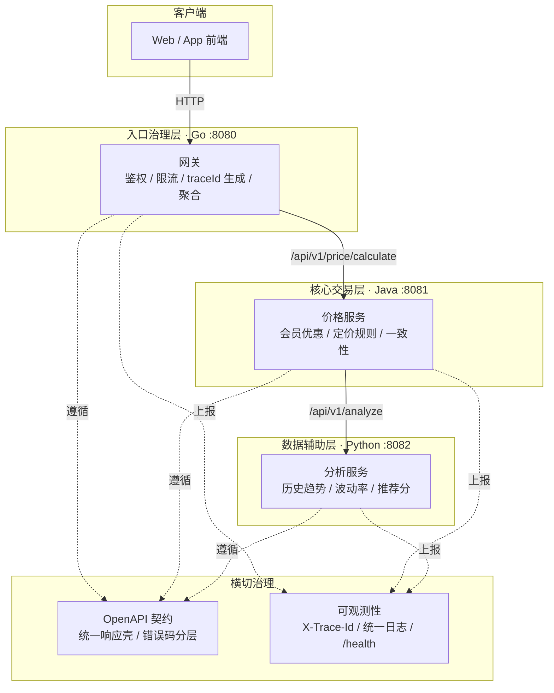

# 第 12 章 全栈架构设计：Java+Go+Python 技术栈整合

> 所属篇章：第四篇 整合篇

**本章技术占比**：技术 50% + 引导 20% + 案例 30%

**前置 Java 知识映射**：微服务分层与 DDD 限界上下文、Spring 接口版本治理、`@RestControllerAdvice` 统一异常与错误码、MDC 日志规范、Spring Cloud Gateway、Sleuth/Micrometer Tracing 链路追踪、Docker Compose 本地编排

## 本章导读

前面十一章我们逐个拆解了 Go 与 Python 的语言特性，并且总是带着同一个问题落地：这个能力放在全栈链路的哪个环节最合适。本章是整合篇的总纲，任务不再是学新语法，而是把散落的能力收拢成**一套可执行的多语言架构方法**——从服务边界怎么划，到契约怎么定，到链路怎么可观测，再到三个服务怎么一起跑起来、团队怎么协作治理。

对 Java 开发者来说，这里没有一个概念是全新的。限界上下文、接口版本、统一异常、MDC、网关、链路追踪、Compose 编排，你在单语言的 Spring 体系里全都实践过。真正变化的只有一件事：**这些治理手段过去由框架和同一套语言默认帮你兜住，现在要跨三种运行时手动对齐。** Java 的 `@RestControllerAdvice` 管不到 Go 网关的错误码，Sleuth 自动透传的 `traceId` 到了 Python 服务就断了，Bean Validation 的校验规则 Go 那端并不知道。多语言架构的全部难点，本质上是**把单进程内的隐式约定，变成跨进程的显式契约**。

所以本章的主线是「显式化」：把边界显式化（12.1）、把契约显式化（12.2）、把可观测性与协作规则显式化（12.3）、把部署编排显式化（12.4）。判断标准始终是业务链路的客观属性——变更频率、一致性要求、并发形态——而不是团队对某门语言的偏好。学完本章，你应该能独立走完一次真实的多语言架构决策，并知道每一步为什么这么定。

## 技术地图



## 知识点拆解

| 小节 | 技术内容 | Java 视角切入 | 落地案例 |
| --- | --- | --- | --- |
| 12.1 | 服务边界划分：入口治理/核心交易/数据辅助三层职责，按变更频率、一致性、并发形态划界，单体先行的演进路径 | 对标 DDD 限界上下文与微服务拆分时机 | 价格平台从单体到三服务的边界推演 |
| 12.2 | 契约先行工作流：openapi.yaml 单一事实源、统一响应壳、错误码分层、字段只增不改、契约评审 | 对标 Spring 接口版本治理与 `@RestControllerAdvice` 统一错误码 | 用 openapi.yaml 驱动三语言的 DTO 与错误码对齐 |
| 12.3 | 跨语言可观测性与协作治理：X-Trace-Id 透传、日志字段统一、/health 契约、超时预算级联、三语言代码规范与 review | 对标 Sleuth/MDC、健康检查、Hystrix 超时与团队规范 | 1500ms 超时预算逐级递减与跨语言 code review 清单 |
| 12.4 | 容器化部署与联调：docker-compose 三服务编排、8080/8081/8082 端口约定、本地联调顺序、CI 跨语言构建组织 | 对标 Spring Boot 的 Compose 本地栈与多模块 CI | 基于仓库真实 docker-compose.yml 补齐网关编排 |

## 12.1 服务边界划分：入口治理 / 核心交易 / 数据辅助

### Java 中我们通常怎么做

在 Java 单体里，我们靠**包结构和分层**来隔离职责：`controller` 收请求、`service` 写业务、`repository` 落库，跨模块调用是一次普通的方法调用，事务由 `@Transactional` 一把兜住，编译器保证类型一致，重构时 IDE 能跨整个调用链改名。当单体膨胀到需要拆分时，成熟团队会用 DDD 的**限界上下文（Bounded Context）**来找缝：订单、库存、定价各自是一个上下文，上下文之间通过明确的接口通信，而不是共享数据库表。拆微服务的经典判断是三条——这块业务是否有独立的变更节奏、是否需要独立伸缩、团队是否能独立负责。

这套方法论完全可以直接迁移到多语言场景，因为**限界上下文关心的是业务能力的边界，而不是用什么语言实现**。差别只在于，单体里越界了编译器会报错，跨服务越界了只会在生产环境里以超时和数据不一致的形式暴露。

### Go / Python 的对应设计

本书的价格平台把系统切成三层，每一层的语言选择都是边界属性推导出来的结果，而不是先选语言再塞业务：

- **入口治理层（Go，`:8080`）**：网关承担鉴权、限流、`traceId` 生成、请求校验、下游聚合。它的特征是**高并发、无状态、变更频繁、一致性要求低**——每天可能因为限流阈值、灰度规则调整而发版多次，但它不持有业务真相。Go 的 goroutine 让「一个请求扇出调用多个下游再聚合」写起来近乎同步代码的成本，单二进制加十几 MB 镜像让频繁滚动发布和弹性扩缩容几乎没有负担。这正是第 3、5、6 章反复强调的 Go 红利落点。
- **核心交易层（Java，`:8081`）**：价格服务承载会员分层、优惠叠加、定价规则、金额一致性。它的特征是**领域规则复杂、一致性要求强、变更需要严格评审**。这类逻辑最怕的是「算错一分钱」，最需要的是 Spring 生态的事务、校验、成熟测试体系和团队协作沉淀。它变更不频繁，但每次变更都必须正确。
- **数据辅助层（Python，`:8082`）**：分析服务处理历史价格趋势、波动率、推荐分。它的特征是**计算密集、算法多变、与数据科学生态强绑定、可用性要求可降级**。趋势分析短暂不可用不会阻断下单，Python 的 pandas/numpy 与算法迭代速度在这里价值最大。

一句话概括划界原则：**按「变更频率、一致性要求、并发形态」三个客观维度划界，而不是按谁喜欢哪门语言。** 变更频繁又无状态的推给入口层，一致性强又规则复杂的锁在核心层，计算密集又可降级的交给辅助层。

### 全栈选型逻辑

新项目**不要一上来就拆三个服务**。正确的演进路径是「单体先行，边界成熟再拆」：项目初期用 Java 单体把业务跑通，在包结构上先按未来的三层预留清晰的模块边界（`edge`/`core`/`analysis`），所有跨模块调用都走接口而非直接摸对方内部实现。当某一块的边界被真实需求反复验证——网关规则开始高频变更、分析逻辑开始拖慢主链路、某块需要独立伸缩——再把它剥离成独立语言的服务。这样拆分是由证据驱动的，而不是架构师拍脑袋。过早拆分的代价是：还没摸清边界就付出了跨进程调用、分布式事务、跨语言联调的全部成本，却没换来任何收益。

### Java 开发者容易踩的坑

1. **把语言偏好当成划界依据**。「我 Go 写得爽，网关和核心都用 Go」或「团队都是 Java，分析也用 Java 硬写」都是反模式。边界应该由业务属性决定：如果分析逻辑其实变更很少、一致性要求也不高，那它留在 Java 单体里可能比拆出去更省事。语言是划界的结果，不是原因。
2. **过早拆分，把单体的隐式一致性拆没了**。Java 单体里一次 `@Transactional` 覆盖的操作，拆成 Go 网关调 Java 核心调 Python 分析后，就变成了三次跨进程调用，任意一环失败都要处理部分成功。典型现象是：价格已扣减、分析记录却写失败，数据对不上。拆分前必须先想清楚哪些操作能接受最终一致、哪些必须在同一个服务内保持强一致——**强一致的操作绝不能跨服务边界切开**。
3. **按语言而不是按能力建仓库**。见到「go-repo / java-repo / python-repo」三个各按语言命名的仓库，往往意味着团队是在管理语言而不是管理业务能力。更健康的组织是按服务/领域命名（`gateway`/`price-service`/`analysis-service`），语言只是实现细节。

## 12.2 契约先行：openapi.yaml 作为单一事实源

### Java 中我们通常怎么做

在纯 Java 体系里，接口契约往往是**代码优先**的：先写 `@RestController` 和 DTO，再用 springdoc 从注解自动生成 OpenAPI 文档给调用方看。这在单语言内没问题，因为服务端和客户端共享同一份 DTO jar，字段改了双方一起编译，编译器就是契约的守卫。版本治理上我们用 URL 前缀 `/api/v1`，错误码用 `@RestControllerAdvice` 集中拦截异常并映射成统一的 `{code, message}` 结构，`code` 是团队约定的一套业务错误码。

问题在于，这套「代码即契约」的默契一旦跨出 Java 就失效了：Go 网关和 Python 分析服务拿不到你的 DTO jar，它们只能对着一份文档手写结构体和 dataclass。文档和代码一旦不同步，跨语言联调就会在运行时爆炸。

### Go / Python 的对应设计

多语言架构必须反过来——**契约先行（Contract-First）**，让契约脱离任何一门语言独立存在，成为三方共同遵守的**单一事实源**。在价格平台里，这个事实源就是仓库里的 `project/pricing-platform/contracts/openapi.yaml`：

```yaml
# openapi.yaml（仓库现有内容节选）：契约独立于实现语言
openapi: 3.0.3
info:
  title: Pricing Platform API
  version: 1.0.0
paths:
  /api/v1/price/calculate:
    post:
      summary: Calculate final product price
      requestBody:
        required: true
        content:
          application/json:
            schema:
              type: object
              required: [sku, memberLevel]
              properties:
                sku: { type: string }
                memberLevel: { type: string, enum: [NORMAL, SILVER, GOLD] }
  /api/v1/analyze:
    post:
      summary: Analyze price trend and score
```

围绕这份契约，团队需要落实四条规则。

**第一，统一响应壳。** 三个服务无论成功失败都返回同一层外壳，这在 `docs/protocols/api-contract.md` 里被定义为标准：

```json
{ "code": 0, "message": "OK", "data": {}, "traceId": "trace-20260730-001" }
```

`code=0` 表示成功，`data` 承载真正的业务负载，`traceId` 贯穿全链路。三种语言各自用最自然的方式承载这个结构（Java 的 `record`、Go 的 `struct`、Python 的 `dataclass`，见本章「对比代码示例」），但字段名、语义、大小写必须逐字一致。

**第二，错误码分层。** 直接引用 `api-contract.md` 定义的错误码表，它的分段本身就编码了「哪一层出的错」：

| 错误码 | 含义 | 建议 HTTP 状态 | 归属层 |
| ---: | --- | ---: | --- |
| 0 | 成功 | 200 | 全部 |
| 40001 | 请求参数非法 | 400 | 入口治理（Go） |
| 40101 | 鉴权失败 | 401 | 入口治理（Go） |
| 42901 | 网关限流 | 429 | 入口治理（Go） |
| 50001 | Java 核心服务失败 | 500 | 核心交易（Java） |
| 50002 | Python 分析服务失败 | 502 | 数据辅助（Python） |
| 50401 | 下游调用超时 | 504 | 入口治理（Go，代下游报） |

`4xxxx` 段是入口层能自己判定并拦截的（参数、鉴权、限流），`5xxxx` 段区分了核心服务失败、分析服务失败、下游超时。这种分段让运维只看 `code` 就能定位故障层，而不必翻三份日志。对应 Java 的 `@RestControllerAdvice`，就是把异常映射到 `50001`；对应 Go 网关，就是把 Java 侧的 5xx 或超时翻译成 `50001` / `50401` 再回给前端。

**第三，字段只增不改的兼容规则。** 契约演进只允许**新增可选字段**，绝不允许修改已有字段的名称、类型或语义，也不允许把可选字段改成必填。因为三个服务是独立部署、独立发版的，任何时刻都可能新旧版本并存。如果要做破坏性变更，必须走**新版本路径**（`/api/v2/...`）与旧版本并行，等所有调用方迁移完再下线旧版——这正是 Java 里 `/api/v1` 前缀治理在跨语言场景的延续。

**第四，契约评审流程。** `openapi.yaml` 的每次改动都必须走 PR 评审，评审人至少覆盖三端各一人。因为改一个字段会同时冲击 Go 结构体、Java DTO、Python dataclass，任何单方面「我先改了代码回头补文档」都会让事实源退化成谎言源。评审通过后，理想做法是用 openapi-generator 从契约生成三语言的模型骨架，让代码跟着契约走，而不是反过来。

### 全栈选型逻辑

契约先行的收益，随着语言数量增加而放大。单语言时代码即契约成本最低；一旦有第二门语言，共享 DTO jar 的默契就断了，此时把契约独立成 `openapi.yaml` 的一次性成本，会被后续每一次跨语言联调的顺畅所摊薄。选型判断很简单：**只要链路里超过一门语言，就必须契约先行。** 至于契约的载体，同步 HTTP 用 OpenAPI，若未来引入 gRPC 强类型内部调用则用 Protocol Buffers，二者都能脱离语言独立描述结构，区别只是文本契约还是二进制契约。

### Java 开发者容易踩的坑

1. **金额用浮点数在契约里传**。Java 里习惯 `BigDecimal`，但序列化成 JSON 浮点后，Go 的 `float64` 和 Python 的 `float` 会各自引入精度漂移，`0.1 + 0.2` 在三端算出的分位可能不同。铁律是**金额统一用整数分（`int64` 分）在契约里传输**，展示层再除以 100，把浮点彻底挡在跨语言边界之外。
2. **默默改字段语义，编译器帮不了你**。在单体里改个字段名 IDE 会跨全链路重构，跨语言时你改了 Java DTO 的 `memberLevel` 为 `level`，Go 和 Python 端不会有任何编译错误，只会在运行时收到一个永远为空的字段。现象是「联调时某个值莫名其妙全是零值/None」。杜绝办法只有一条：字段变更必须先改 `openapi.yaml` 并过评审，代码跟着契约走。
3. **把 traceId 当可选字段随手省略**。有人觉得成功响应里 `traceId` 没用就不返回，导致出错时前端拿不到可回溯的 ID。响应壳的四个字段是**恒定契约**，任何一个都不能按心情省略——`traceId` 尤其要在成功和失败时都返回，它是 12.3 全链路排查的唯一锚点。

## 12.3 跨语言可观测性与团队协作治理

### Java 中我们通常怎么做

Java 单体的可观测性几乎是「白送」的：引入 Spring Cloud Sleuth / Micrometer Tracing，一个 `traceId` 会自动注入 MDC，随着日志框架（Logback）打进每一行日志，跨线程通过 MDC 传播，跨 HTTP 调用通过拦截器自动透传到请求头。健康检查用 Spring Boot Actuator 的 `/actuator/health` 一行配置搞定。超时和降级用 Resilience4j / 历史上的 Hystrix，注解一加就有熔断和 fallback。团队规范则由 Checkstyle + Google Java Style + CI 门禁统一守着。

这套东西的舒适之处在于「同一个框架、同一门语言、自动传播」。跨语言之后，自动传播链条会在语言边界断掉，我们必须**手动把 Sleuth 帮我们做的事，用三方都认的显式协议重新实现一遍**。

### Go / Python 的对应设计

跨语言可观测性靠四条显式约定拉齐。

**一、X-Trace-Id 全链路透传。** Go 网关在入口处为每个请求生成一个 `traceId`（无则生成，有则沿用），放进 `X-Trace-Id` 请求头。往下调用 Java 时带上这个头，Java 调用 Python 时继续带上，最终写进响应壳的 `traceId` 字段。三端约定**只认 `X-Trace-Id` 这一个头名**，谁都不许自作主张换成 `Trace-Id` 或 `X-Request-Id`：

```go
// Go 网关：入口生成/沿用 traceId 并向下游透传
func TraceMiddleware(next http.Handler) http.Handler {
    return http.HandlerFunc(func(w http.ResponseWriter, r *http.Request) {
        traceID := r.Header.Get("X-Trace-Id")
        if traceID == "" {
            traceID = "trace-" + time.Now().Format("20060102") + "-" + randSuffix()
        }
        r.Header.Set("X-Trace-Id", traceID) // 调用 :8081 / :8082 时原样带上
        ctx := context.WithValue(r.Context(), traceKey{}, traceID)
        next.ServeHTTP(w, r.WithContext(ctx))
    })
}
```

Java 侧在过滤器里把 `X-Trace-Id` 读进 MDC，让 Sleuth 的自动传播接管本进程；Python 侧从请求头取出塞进 `contextvars` 或直接透传给下一跳。关键是**边界处手动接力**，进程内可以继续用各自语言的自动传播。

**二、三语言日志字段统一。** 无论哪门语言，日志都必须输出 `api-contract.md` 约定的同一组字段，且格式一致，这样才能用 `traceId` 在一个日志平台里把三段日志串成一条链：

| 字段 | 说明 | 三语言统一要求 |
| --- | --- | --- |
| traceId | 跨语言链路追踪 ID | 字段名一律 `traceId` |
| service | 服务名 | `gateway`/`price-service`/`analysis-service` |
| level | 日志级别 | 大写 `INFO`/`WARN`/`ERROR` |
| endpoint | 接口路径 | 与 openapi 的 path 一致 |
| latencyMs | 耗时毫秒 | 整数毫秒 |
| code | 业务错误码 | 复用 12.2 错误码表 |

时间戳统一用 **UTC 的 ISO-8601（`2026-07-31T09:12:33.482Z`）** 且统一输出 JSON 行日志。别让 Java 打 `yyyy-MM-dd HH:mm:ss`、Go 打 RFC3339、Python 打本地时区——三种时间格式会让日志平台无法正确排序和聚合。

**三、/health 健康检查契约。** 三个服务都暴露 `GET /health`，成功返回 `200` 且 body 为 `{"status":"UP"}`。这是 Compose 的 `healthcheck` 和 K8s 存活探针的统一入口，也让「网关先探测下游再放流量」成为可能。Java 可直接复用 Actuator 的 health 端点对齐这个契约，Go 和 Python 手写一个极简 handler 即可。

**四、超时预算级联。** 这是跨语言链路最容易被忽视、也最能防雪崩的一条。整条链路从前端进来给一个**总预算 1500ms**，然后逐级递减，每一跳都必须显式设置比上游更短的超时，为自己的处理和网络往返留出余量：

```
前端总预算           1500ms
└─ Go 网关自身处理 + 调用 Java 超时设为   1200ms
   └─ Java 核心自身处理 + 调用 Python 超时设为   800ms
      └─ Python 分析服务自身超时           500ms
```

这样任意一环变慢，都会在预算耗尽前被上游主动掐断并返回 `50401`（下游超时），而不是层层无限等待把线程/goroutine 全部堵死。**下游的超时永远要小于上游分配给它的预算**，否则上游先超时返回、下游还在傻算，白白浪费资源。这正是 Java Resilience4j 超时治理在跨语言链路里的手动版本。

### 全栈选型逻辑

可观测性和超时治理**不是等出了事故再补的功能，而是多语言架构的准入门槛**。单体里你可以偷懒，因为一份栈追踪就能定位问题；三服务链路里，没有 `traceId` 串联就意味着排查一个偶发超时要人肉比对三份时区不同、字段不同的日志，成本高到几乎不可行。所以选型上，任何跨语言链路上线前都必须先具备：统一 traceId、统一日志字段、统一健康检查、级联超时预算——这四样齐了才允许接真实流量。

在团队协作治理上，同样要显式化。三门语言各自遵循社区标准，不强求统一风格：**Java 用 Google Java Style（Checkstyle 守门），Go 用 gofmt/goimports（非风格问题而是硬约定），Python 用 black 或 ruff**。跨语言 code review 的关注点从「代码风格」上移到「契约与治理」：这次改动动了 `openapi.yaml` 吗？错误码用对分段了吗？`X-Trace-Id` 透传了吗？超时预算符合级联吗？金额是不是整数分？团队还要有明确的**语言准入约定**——引入一门新语言到生产链路，必须先具备该语言的日志规范、构建流水线、至少两名能 review 的工程师，避免「某人会写就直接上」导致的无人可维护的孤岛服务。

### Java 开发者容易踩的坑

1. **以为 Sleuth 的 traceId 会自动跨语言传播**。它只在 JVM 进程内和 Java-to-Java 的 HTTP 调用间自动传播；一旦请求来自 Go 网关或去往 Python，Java 只会生成一个**新的** traceId，链路就此断成两截。现象是：日志平台里同一个用户请求出现两三个互不关联的 traceId。必须在 Java 的入口过滤器里主动读取 `X-Trace-Id` 头写入 MDC，出口调用时主动把它写回请求头。
2. **超时设置方向搞反，下游比上游还长**。给 Java 调 Python 设了 2000ms，却在网关调 Java 设了 1200ms——网关早就超时返回 `50401` 了，Java 还在等 Python，线程和连接全被占着。级联超时的铁律是**层层递减**，上游预算永远大于下游超时之和的估算。
3. **日志时间戳各打各的时区**。Java 用服务器本地时区、Python 用 UTC、Go 用另一个偏移，结果同一条链路的三段日志按时间排序全乱，根本看不出调用先后。统一成 UTC ISO-8601 是跨语言日志能被聚合分析的前提，这一条没有商量余地。

## 12.4 容器化部署与本地联调编排

### Java 中我们通常怎么做

Spring 开发者对 Docker Compose 并不陌生：用一个 `docker-compose.yml` 把应用、MySQL、Redis 拉起来跑本地集成测试，`depends_on` 控制启动顺序，`healthcheck` 等依赖就绪。CI 里则是 Maven 多模块聚合构建，一次 `mvn verify` 跑完所有模块的测试再打镜像。整套东西的默契是「同一种构建工具、同一条流水线」。

跨语言之后，Compose 依然是本地联调的最佳载体，但编排里出现了三种完全不同的运行时和构建方式，CI 也要同时驱动 Maven、`go build`、pip，组织方式需要重新设计。

### Go / Python 的对应设计

先看仓库里的 `project/pricing-platform/docker-compose.yml`，它把三层架构完整编排了起来（节选网关部分，Java/Python 两个下游按同样风格各占 `8081`/`8082` 并各自定义了 `healthcheck`）：

```yaml
# 仓库真实内容（节选）：Go 网关占入口端口 8080，依赖两个下游就绪后再启动
services:
  go-gateway:
    image: golang:1.22
    working_dir: /app
    volumes:
      - ./go-gateway:/app
    command: go run main.go
    environment:
      JAVA_SERVICE_URL: http://java-price-service:8081
      PYTHON_SERVICE_URL: http://python-analysis-service:8082
    ports:
      - "8080:8080"
    depends_on:
      java-price-service:
        condition: service_healthy
      python-analysis-service:
        condition: service_healthy
```

它体现了本地联调编排的两个务实取舍：直接用官方基础镜像 + 挂载源码 + 容器内即时编译运行（`go run` / `javac && java` / `python app.py`），省去了每改一行都重新 `docker build` 的成本；端口按约定映射，端口即职责。

这里落实了三条编排约定。**端口约定**：`8080` 入口治理、`8081` 核心交易、`8082` 数据辅助，全书统一，端口即职责。**服务发现**：容器间用 Compose 的服务名（`java-price-service`）而非 `localhost` 互访，网关通过 `JAVA_SERVICE_URL`/`PYTHON_SERVICE_URL` 环境变量注入下游地址（`main.go` 里 `envOr` 读取、localhost 兜底），把地址与代码解耦。**启动顺序**：`depends_on` + `condition: service_healthy` 让网关等两个下游的健康探测通过再启动，避免网关起来时下游还没就绪导致的联调假故障——这正是 12.3 健康检查契约在编排层的价值兑现。

本地联调的推荐顺序是**从里到外、逐级验证**：先分别单独起 Java 核心与 Python 分析服务，各自直打 `:8081`/`:8082` 确认它们自己是对的；最后起 Go 网关，验证它对 Java 的必达调用、对 Python 的降级聚合，以及 `traceId` 从入口到底层的全链路透传。**不要三个一起 `up` 然后对着一坨交织的日志猜是哪层挂了**——逐级起、逐级验证，能把定位范围永远锁在一层之内。

CI 中的跨语言构建，组织原则是**按语言分作业、并行执行、契约作为共同前置**。一条合理的流水线是：先跑一个 `contract-check` 作业校验 `openapi.yaml` 合法且未做破坏性变更；然后三个并行作业分别执行 `mvn verify`（Java）、`go build ./... && go test ./...`（Go）、`ruff check && pytest`（Python）；最后一个 `integration` 作业用 `docker compose up` 拉起三服务跑一遍端到端冒烟。三门语言的构建互不阻塞，但都以契约校验通过为前提，把「契约先行」从约定变成流水线强制的门禁。

### 全栈选型逻辑

Compose 的定位要划清楚：**它是本地联调和 CI 集成测试的利器，不是生产部署方案**。生产环境的服务发现、密钥管理、弹性扩缩容、滚动发布应交给 Kubernetes，Compose 里挂源码即时编译的做法在生产上更是绝对禁止。选型上，本地和 CI 用 Compose 追求「一键起全栈、改代码即生效」的开发效率；生产用 K8s 追求弹性与稳定，二者各司其职。恰恰因为 Go 网关是单二进制小镜像（第 3 章），它在 K8s 里的弹性优势才最明显——这也回扣了 12.1 把高并发无状态入口交给 Go 的划界逻辑。

### Java 开发者容易踩的坑

1. **容器里用 `localhost` 访问其他服务**。把 Java 单体经验直接搬过来，在网关代码里写 `http://localhost:8081` 调 Java，结果容器内的 `localhost` 指向网关容器自己，连接被拒。容器网络里必须用 Compose 服务名（`http://java-price-service:8081`）互访，这是与本机开发最容易混淆的一处。
2. **忘了 depends_on 只保证「启动」不保证「就绪」**。裸写 `depends_on: [java-price-service]` 只等容器进程拉起，不等应用真正能服务，网关可能在 Java 还没监听端口时就发起调用而失败。必须配合 `condition: service_healthy` 和下游的 `/health`，让「就绪」而非「启动」成为放行条件。
3. **把 Compose 的即时编译方式带到生产**。仓库里 `javac && java`、`go run`、挂载源码是为本地开发的快速反馈服务的，生产必须换成多阶段构建产出的不可变镜像（Java 打 fat jar / Go 编译静态二进制 / Python 固定依赖版本），并接入正式的配置与密钥管理，绝不能让生产容器在启动时现场编译源码。

## 对比代码示例

三语言承载同一个响应壳，这是整章「契约先行」最直观的落地——结构一致、字段逐字对齐，语言只是不同的容器：

```java
// Java: Spring MVC 风格的统一响应壳（JDK 21 record）
public record ApiResponse<T>(int code, String message, T data, String traceId) {
    public static <T> ApiResponse<T> ok(T data, String traceId) {
        return new ApiResponse<>(0, "OK", data, traceId);
    }
    public static <T> ApiResponse<T> fail(int code, String message, String traceId) {
        return new ApiResponse<>(code, message, null, traceId); // code 取 12.2 错误码表
    }
}
```

```go
// Go: 与 Java ApiResponse 逐字对齐的响应壳（Go 1.22）
type ApiResponse struct {
    Code    int         `json:"code"`
    Message string      `json:"message"`
    Data    interface{} `json:"data,omitempty"`
    TraceID string      `json:"traceId"` // JSON 键必须是 traceId，不能是 traceID
}

func Fail(code int, message, traceID string) ApiResponse {
    return ApiResponse{Code: code, Message: message, TraceID: traceID}
}
```

```python
# Python: 与契约对齐的响应壳与分析入参（Python 3.11+）
from dataclasses import dataclass, asdict
from typing import Any, Optional

@dataclass
class ApiResponse:
    code: int
    message: str
    traceId: str          # 字段名对齐契约，序列化后为 "traceId"
    data: Optional[Any] = None

@dataclass
class PriceAnalysisRequest:
    sku: str
    base_price: int       # 整数分，杜绝浮点漂移
    member_level: str     # NORMAL / SILVER / GOLD，对齐 openapi enum
```

三段代码表达的是同一件事：跨语言协同的第一性原理是统一契约。Java 的 `record`、Go 的 `struct`、Python 的 `dataclass` 只是承载结构的不同外壳，团队真正要锁死的是**字段名的逐字一致**（`traceId` 不能被 Go 的惯例写成 `traceID`）、**错误码语义的一致**（都引用 12.2 那张表）、**金额单位的一致**（整数分）、以及**版本兼容策略**（只增不改）。契约对齐了，三门语言才谈得上协同。

## 章节综合案例：价格平台的一次完整架构决策

本案例把全章方法串成一条决策链，以价格平台为例，走一遍从需求到部署编排的完整推演。

### 一、需求

前端请求某个 SKU 的实时价格：系统要读取商品基础价、按会员等级计算优惠、再调用分析服务返回历史价格趋势与推荐分，最终对前端返回一个统一响应。要求：定价必须准确一致，趋势分析可以降级（拿不到就不展示，但不能阻断价格返回），入口要能扛促销高峰的并发。

### 二、边界划分（回应 12.1）

按三个客观维度切：定价规则**一致性强、变更需评审** → 核心交易层 Java（`:8081`）；趋势分析**计算密集、可降级、算法多变** → 数据辅助层 Python（`:8082`）；请求校验、限流、聚合、traceId 生成**高并发、无状态、变更频繁** → 入口治理层 Go（`:8080`）。项目初期其实可以先在 Java 单体里预留 `edge/core/analysis` 三个模块跑通，待入口并发和分析迭代速度都被真实验证后，再按此边界剥离——本案例假设已到剥离时机。

### 三、契约定义（回应 12.2）

在 `openapi.yaml` 里定义 `/api/v1/price/calculate`（入参 `sku` + `memberLevel` 枚举）和 `/api/v1/analyze`，三端共同评审。响应统一为 `{code, message, data, traceId}`，`base_price` 等金额一律整数分。错误码按分段：网关判定的参数错走 `40001`、限流走 `42901`；Java 核心失败走 `50001`；Python 分析失败走 `50002`；下游超时由网关翻译成 `50401`。

### 四、超时与降级设计（回应 12.3）

给这条链路 **1500ms 总预算**，级联递减：网关调 Java 设 `1200ms`，Java 调 Python 设 `800ms`，Python 自身设 `500ms`。降级策略落在 Java 核心：分析服务一旦超时或返回 `50002`，**价格照常返回，`data` 里的趋势字段留空并标记降级**，绝不因为「锦上添花」的分析失败而拖垮「核心」的价格返回。全链路带 `X-Trace-Id`，三端日志以统一字段和 UTC ISO-8601 时间戳落盘，出问题时用一个 traceId 串起三段。

```java
// Java 核心：分析是可降级的旁路，失败不阻断价格返回
PriceResult price = pricingService.calculate(sku, memberLevel); // 核心，必须成功
TrendData trend;
try {
    trend = analysisClient.analyze(sku, Duration.ofMillis(800)); // 辅助，可失败
} catch (TimeoutException | DownstreamException e) {
    log.warn("analysis degraded, traceId={}, code=50002", traceId); // 降级留痕
    trend = TrendData.empty(); // 趋势留空，价格照常返回
}
return ApiResponse.ok(new PriceView(price, trend), traceId);
```

### 五、部署编排（回应 12.4）

用 `docker-compose.yml` 编排三服务：Python `:8082`、Java `:8081`、Go 网关 `:8080`，网关 `depends_on` 两个下游的 `service_healthy` 再启动，容器间以服务名互访。本地联调按「Python → Java → Go」从里到外逐级验证。CI 先跑 `contract-check` 卡住契约，再并行跑三语言构建，最后 `docker compose up` 做端到端冒烟。至此，一次需求就沿着「边界 → 契约 → 治理 → 编排」被完整、可复现地落地了。

## 本章小结

1. 多语言架构的本质是**把单进程内的隐式约定变成跨进程的显式契约**——边界、契约、可观测性、编排，逐一显式化。
2. 服务边界按**变更频率、一致性要求、并发形态**三个客观维度划分，语言是划界的结果而非原因；坚持单体先行、边界成熟再拆。
3. 契约先行以 `openapi.yaml` 为单一事实源，统一响应壳 `{code, message, data, traceId}`、错误码分层、字段只增不改、三端评审。
4. 跨语言可观测性靠四条显式约定：`X-Trace-Id` 透传、统一日志字段与 UTC 时间戳、`/health` 契约、1500ms 超时预算级联递减。
5. Compose 编排三服务用于本地联调与 CI，端口即职责（8080/8081/8082），生产交给 K8s；团队协作用社区规范 + 契约导向的 review + 语言准入约定守住质量。
6. 本章方法在第 13 章的电商价格计算平台里被完整实践一遍。

## 选型思考题

1. 如果把价格平台的三层全部留在一个 Java 单体里，你会立刻省掉哪些跨语言治理成本（契约、traceId 透传、级联超时）？又会在入口弹性和分析迭代速度上损失什么？在什么并发量与迭代频率下这笔账才划得来？
2. 假设分析服务频繁超时触发降级，但你发现降级留痕的日志里 traceId 时有时无、且和网关日志对不上——请按 12.3 的四条约定，逐条排查最可能是哪一环没落实，并说明你会先看哪个字段。
3. 你所在团队目前最适合先剥离哪一个跨语言边界：高并发入口（Go）、可降级的数据辅助（Python），还是仍留在 Java 单体？用「变更频率、一致性要求、并发形态」三维度给出你的判断依据。

## 延伸阅读资源

1. 《领域驱动设计》（Eric Evans）与《实现领域驱动设计》（Vaughn Vernon）：校准 12.1 限界上下文与服务边界划分的判断标准。
2. OpenAPI Specification 3.x 官方规范（spec.openapis.org）与 openapi-generator 文档：落实 12.2 契约先行与从契约生成三语言模型。
3. Spring Boot Actuator、Micrometer Tracing 官方文档与 W3C Trace Context 规范：对齐 12.3 的健康检查、traceId 透传与跨语言追踪标准。
4. Docker Compose 官方文档（`depends_on` / `healthcheck` / `condition`）与 Google Java Style、gofmt、black/ruff 各自的规范文档：支撑 12.4 的编排约定与三语言代码规范。

## 第 12 章工程规范基线

1. 所有接口必须有版本前缀，例如 `/api/v1`；破坏性变更走新版本并行，不得原地修改字段。
2. 所有响应必须是统一壳 `code/message/data/traceId`，四个字段成功失败都不得省略。
3. 所有跨语言调用必须设置超时，且遵循 1500ms 总预算逐级递减，禁止无限等待。
4. 金额统一使用整数分传输，浮点数不得跨越语言边界。
5. 服务日志必须包含 `service/traceId/endpoint/latencyMs/code`，时间戳统一 UTC ISO-8601。
6. 三端各遵循社区代码规范（Google Java Style / gofmt / black 或 ruff）；引入新语言到生产链路需满足语言准入约定。
7. `docker-compose.yml` 仅用于本地联调与 CI 集成，端口固定 8080/8081/8082；生产部署接入 K8s 与正式配置、密钥管理。

规范是多语言架构的地基。没有统一契约与显式治理，多语言只会成倍放大沟通成本；有了它们，三门语言才能各自发挥所长、协同成一套系统。
