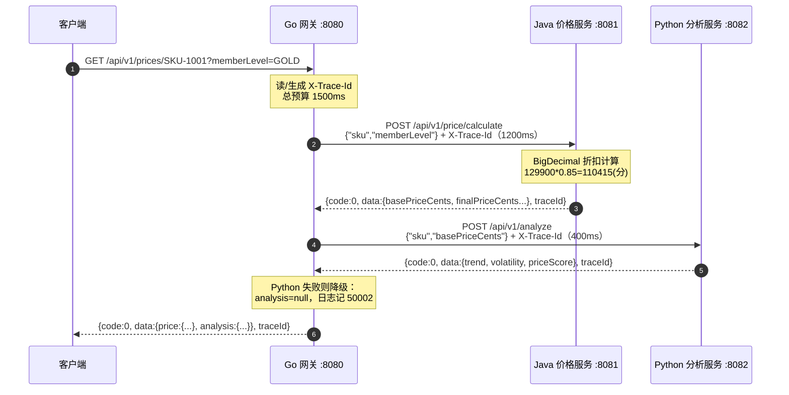

# 第 13 章 企业级实战项目：多语言协同电商价格计算平台

> 所属篇章：第四篇 整合篇

**本章技术占比**：技术 50% + 引导 20% + 案例 30%

**前置 Java 知识映射**：Spring MVC 控制器与统一响应、`BigDecimal` 金额计算、领域服务分层、跨服务 HTTP 调用与超时治理、MDC/traceId 链路追踪、JUC 线程池与连接池调优、Docker 部署与联调

## 本章导读

这是全书的收官章，也是前面十二章的汇流处。第 3 到第 8 章讲的 Go 网关治理、第 9 到第 11 章讲的 Python Web 与数据分析、第 12 章讲的全栈架构分工，都会在这里落成一套**能真正跑起来**的东西：`project/pricing-platform` 下的电商价格计算平台。

它不是 PPT 上的三个方框，而是三个用标准库写成、零第三方依赖、可以在你本机 `go run` / `java` / `python app.py` 直接启动的服务。之所以坚持零依赖，是为了让你把注意力放在**跨语言协同的工程边界**上，而不是先花两小时装 Gin、Spring Boot、FastAPI。等你把链路吃透了，再按第 5 章、第 9 章的路子把它们逐个换成生产框架，反而水到渠成。

本章的读法和前面一样：先问「这件事 Java 通常怎么做」，再看「Go / Python 在这套代码里实际怎么做」，然后判断「为什么这样分工」，最后收集「Java 开发者最容易在这里栽的坑」。我们会逐行走读真实实现，包括这套代码里最见功力的一个设计——Go 网关聚合 Java 价格与 Python 分析两段数据，且 Python 一旦失败**只降级、不阻断**：`data.analysis` 置为 `null`，网关日志记 50002，用户照样拿到价格。

## 技术地图



> 图中就是当前代码里**真实接线**的完整链路：Go 网关先调 Java 拿价格（失败则整体 50401），再携带 `basePriceCents` 调 Python 拿分析（失败仅降级为 `analysis:null`），最后把两段数据聚合进同一个响应壳。「核心必须成功、辅助允许降级」这条边界，后面 13.2、13.3 会反复用到。

## 知识点拆解

| 小节 | 技术内容 | Java 视角切入 | 落地案例 |
| --- | --- | --- | --- |
| 13.1 | 价格链路建模：原价（分）、会员折扣、最终价、分析分数如何串成一条业务链 | 对标 Spring 领域服务 + `BigDecimal` 金额计算 | `PriceService.calculate` 的原价表、折扣 `switch`、`schema.sql` 两张表 |
| 13.2 | 三服务拆分：Go 网关只做入口治理，Java 集中业务规则，Python 承接分析 | 对标 Spring Cloud Gateway + 核心服务 + 数据服务分层 | `main.go` 转发、`PriceService.java` 计算、`app.py` 打分的职责边界 |
| 13.3 | 联调与追踪：接口测试、X-Trace-Id 透传、错误码分类、Python 挂掉时的降级 | 对标 MDC traceId、`@ControllerAdvice` 统一异常、契约测试 | `smoke-test.ps1` 验收、50401 超时兜底、`api-contract.md` 错误码表 |
| 13.4 | 性能与容量：Go 并发模型、Java HttpServer 线程、Python 单线程与缓存 | 对标 Tomcat 线程池、HikariCP 连接池、二级缓存 | 三端并发模型对比、1500ms 超时预算、原价表缓存化路径 |

## 13.1 业务场景：商品实时价格、优惠、权益、分析数据的完整链路

### Java 中我们通常怎么做

在 Java 里做「实时价格」，我们的第一反应是分层：`PriceController` 收请求，`PriceService` 编排领域规则，`ProductRepository` 从数据库取原价，会员折扣可能是一条 `DiscountRule` 策略链，金额一律用 `BigDecimal` 并显式指定 `RoundingMode`，绝不用 `double` 碰钱。响应用一个统一的 `ApiResponse<T>` 壳包起来，异常交给 `@ControllerAdvice` 兜底。这套心智的好处是业务规则集中、可测试、可审计——价格算错在电商里是要赔钱的，所以规则必须有唯一权威出处。

```java
// Java 里典型的领域服务写法（示意，非本项目代码）
BigDecimal finalPrice = basePrice
        .multiply(discountRule.rate(memberLevel))
        .setScale(2, RoundingMode.HALF_UP);
```

### Go / Python 的对应设计

本项目的 Java 服务 `PriceService.java` 把上面这套分层压扁成了一个标准库 `HttpServer`，但**金额纪律一点没丢**。它做了两件电商价格系统最核心的事。

第一，价格以「分」为整数单位存放，杜绝浮点误差：

```java
// java-price-service/src/com/javago/pricing/PriceService.java
private static final Map<String, Integer> BASE_PRICE_CENTS = new HashMap<>();
static {
    BASE_PRICE_CENTS.put("SKU-1001", 129900); // 1299.00 元
    BASE_PRICE_CENTS.put("SKU-2002", 49900);  // 499.00 元
    BASE_PRICE_CENTS.put("SKU-3003", 8999);   // 89.99 元
}
```

第二，会员折扣用 `BigDecimal` 计算并 `HALF_UP` 取整回分，这是全书验收清单里那个 `110415` 的来源：

```java
int base = BASE_PRICE_CENTS.getOrDefault(sku, 99900); // 未知 SKU 兜底 999.00 元
BigDecimal discount = switch (memberLevel) {
    case "GOLD"   -> new BigDecimal("0.85"); // 金卡 85 折
    case "SILVER" -> new BigDecimal("0.92"); // 银卡 92 折
    default       -> BigDecimal.ONE;         // 普通会员不打折
};
int finalCents = new BigDecimal(base).multiply(discount)
        .setScale(0, RoundingMode.HALF_UP).intValue();
```

`SKU-1001` 原价 129900 分，金卡 0.85，`129900 × 0.85 = 110415`，正好是整数分，`smoke-test.ps1` 断言的就是它。返回的 `data` 里同时带上 `basePriceCents`、`finalPriceCents`、`discountRate`、`calculatedAt`，让下游既能拿到结果，也能自证计算过程。

链路的另一端是 Python 的价格分析。它不参与「算钱」，只回答「这个价好不好、稳不稳」：

```python
# python-analysis-service/app.py
base_price = int(payload.get("basePriceCents", 0))
score = 88 if base_price < 100000 else 76  # 低于 1000 元的商品给更高价格分
self.reply({"code": 0, "message": "OK", "data": {
    "sku": payload.get("sku", "UNKNOWN"),
    "trend": "STABLE", "volatility": 0.07, "priceScore": score
}, "traceId": trace_id})
```

而这条链路的持久化目标，写在 `sql/schema.sql` 里——它没有被当前内存版 Java 使用，却清楚指明了生产化方向：

```sql
CREATE TABLE product_price (            -- 替换 Java 里的内存 Map
  sku VARCHAR(64) PRIMARY KEY,
  base_price_cents INT NOT NULL,
  updated_at TIMESTAMP NOT NULL DEFAULT CURRENT_TIMESTAMP
);
CREATE TABLE price_snapshot (           -- 每次计算落一条快照，带 trace_id 可回溯
  id BIGINT PRIMARY KEY,
  sku VARCHAR(64) NOT NULL,
  final_price_cents INT NOT NULL,
  trace_id VARCHAR(128) NOT NULL,
  created_at TIMESTAMP NOT NULL DEFAULT CURRENT_TIMESTAMP
);
```

`product_price` 就是那张 `BASE_PRICE_CENTS` 内存表的数据库版本，`price_snapshot` 用 `trace_id` 把「哪一次请求算出了哪个价」钉死，这正是电商价格审计的刚需。

### 全栈选型逻辑

这条链路的分工其实是被「业务后果」倒推出来的。算钱错一分都要担责，所以它留在 Java：`BigDecimal`、集中规则、强类型、成熟测试生态，是把复杂交易规则关进笼子的最优解。而「这个价格趋势稳不稳、值不值得推」是辅助决策，算错了不赔钱、只影响排序权重，天然适合放到 Python，跟它的数据分析生态（第 11 章）对接。Go 网关则一个业务字段都不碰，只管入口——谁承担多重的责任，谁就用多重的语言，这是全书反复强调的边界原则在一条真实链路上的落地。

### Java 开发者容易踩的坑

1. **把「分」又换回「元」去展示时用了 `double`**。Java 侧全程 `int` 分和 `BigDecimal`，一旦你在网关或前端 `finalPriceCents / 100.0`，浮点误差就回来了。正确做法是格式化时用整数除法加取模拼字符串，或继续用 `BigDecimal.movePointLeft(2)`。
2. **误以为 Python 已经接进主链路**。看技术地图的第一反应是「Java 会调 Python 拿 priceScore」，但真实代码里 `PriceService.calculate` 根本没有出站调用。把 analysis 当成计算依赖去写断言，联调时会一直对不上——它现在是独立服务。
3. **忽略未知 SKU 的兜底价**。`getOrDefault(sku, 99900)` 意味着任何拼错的 SKU 都会返回 999.00 元而不是报错。在 Java 我们习惯 `orElseThrow`，迁移时要想清楚：这里到底该兜底还是该 40001 拒绝。

## 13.2 服务拆分：Go 网关、Java 核心服务、Python 分析服务

### Java 中我们通常怎么做

Java 世界的标准答案是 Spring Cloud Gateway 或 Nginx 做入口，后面挂一堆 Spring Boot 微服务，服务间用 Feign / RestTemplate / WebClient 调用，注册中心做发现，配置中心下发超时与限流参数。网关层负责鉴权、限流、路由、日志埋点，业务服务只关心自己的领域。这套体系强大但重，光是把注册中心、配置中心、网关三件套跑起来就是一天的活。

### Go / Python 的对应设计

本项目把这套「入口治理」浓缩进 `go-gateway/main.go` 一个文件，却把网关最本质的五件事做全了：**超时预算、traceId 生成与透传、请求改写、聚合编排、下游失败兜底与降级**。

先看它如何生成并透传链路 ID——这是跨语言追踪的地基：

```go
// go-gateway/main.go
traceID := r.Header.Get("X-Trace-Id")
if traceID == "" {
    traceID = "trace-go-" + time.Now().Format("20060102150405") // 入口首次生成
}
sku := r.URL.Path[len("/api/v1/prices/"):]   // 路径参数：/api/v1/prices/SKU-1001
member := r.URL.Query().Get("memberLevel")   // 查询参数：?memberLevel=GOLD
if member == "" {
    member = "NORMAL"
}
```

网关把「面向前端的 GET + 路径/查询参数」改写成「面向 Java 的 POST + JSON body」，这是典型的入口适配职责。注意下游地址来自环境变量（默认 localhost，compose 内换成服务名）：

```go
javaBase := envOr("JAVA_SERVICE_URL", "http://localhost:8081")

priceBody := []byte(`{"sku":"` + sku + `","memberLevel":"` + member + `"}`)
price, err := postJSON(ctx, 1200*time.Millisecond,
    javaBase+"/api/v1/price/calculate", priceBody, traceID) // 同一个 traceId 传给 Java
if err != nil { // Java 超时/不可达，整体失败：504 + 50401，绝不裸奔
    writeJSON(w, http.StatusGatewayTimeout,
        apiResponse{Code: 50401, Message: "java price service timeout", TraceID: traceID})
    return
}
```

超时预算在 handler 入口就被钉死并**逐级递减**：整体 1500ms，其中 Java 核心 1200ms，Python 分析只给 400ms：

```go
ctx, cancel := context.WithTimeout(r.Context(), 1500*time.Millisecond)
defer cancel()
```

拿到 Java 的价格后，网关再携带 `basePriceCents` 去调 Python——注意这一步的错误处理姿势与 Java 完全不同，**失败只降级、不失败整个请求**：

```go
analysis := json.RawMessage("null") // 缺省即降级值
if base, ok := extractInt(price.Data, "basePriceCents"); ok {
    analyzeBody := []byte(`{"sku":"` + sku + `","basePriceCents":` + strconv.Itoa(base) + `}`)
    if result, err := postJSON(ctx, 400*time.Millisecond,
        pythonBase+"/api/v1/analyze", analyzeBody, traceID); err == nil && result.Code == 0 {
        analysis = result.Data
    } else {
        logLine(traceID, "/api/v1/analyze", 50002, "python analysis degraded", start)
    }
}
// 聚合响应：data 分为 price 与 analysis 两段
```

最终响应把两段数据装进同一个壳：`{"code":0,"data":{"price":{...},"analysis":{...}},"traceId":"..."}`。Python 挂掉时 `analysis` 是 `null`，价格照常返回——这就是「核心必须成功、辅助允许降级」在代码里的样子。

Java 服务 `PriceService.java` 则守着 `:8081`，只认 `POST`，用两道校验守住入口，非法请求一律返回 `40001`：

```java
if (!"POST".equalsIgnoreCase(exchange.getRequestMethod())) {
    respond(exchange, 405, response(40001, "Only POST is supported", "null", traceId));
    return;
}
if (sku == null || memberLevel == null) {
    respond(exchange, 400, response(40001, "sku and memberLevel are required", "null", traceId));
    return;
}
```

Python 服务 `app.py` 独占 `:8082`，只暴露 `POST /api/v1/analyze` 和 `GET /health`，用 `ensure_ascii=False` 保证中文不被转义。三个服务端口清晰、职责不重叠，这就是「拆分」在代码上的样子。

### 全栈选型逻辑

为什么入口非得是 Go？因为网关的活是「高并发、轻逻辑、要快启动、要小镜像」：它不算钱、不落库，只做 header 改写和转发。Go 的单二进制 + goroutine 天生吃这口红利（第 3、5 章）。为什么核心留 Java？因为价格规则会越长越复杂——多级会员、叠加券、限时秒杀，这些要靠强类型和成熟测试生态压住。为什么分析给 Python？因为趋势、波动率、评分模型迟早要接 NumPy / pandas / 模型推理，那是 Python 的主场。三门语言各自站在自己最擅长的那一段，而不是让一门语言硬扛全链路。

### Java 开发者容易踩的坑

1. **在网关里手拼 JSON**。`main.go` 用字符串拼接造 body，`sku` 一旦含引号或反斜杠就会破坏 JSON。教学版可以接受，生产版必须换成 `json.Marshal`——这正是升级 Gin（第 5 章）时顺手要补的。
2. **把 1500ms 当成单跳超时**。这 1.5 秒是网关的**整体**预算，代码里已经切成了 Java 1200ms + Python 400ms 两份。如果你重构时把三处都写成同一个数，一旦 Java 用满 1500ms，Python 那一跳连发起的机会都没有；更糟的是各层数值相同会让「谁超的时」在日志里无法区分。超时预算要逐层递减分配，不能各层都写同一个数。
3. **在 compose 里误用 localhost**。`docker-compose.yml` 编排了全部三个服务，网关容器里的 `localhost:8081` 指向的是**网关容器自己**，不是 Java 容器。所以 compose 给网关注入了 `JAVA_SERVICE_URL=http://java-price-service:8081`（服务名互访），`main.go` 用 `envOr` 读取并以 localhost 兜底。删掉这两个环境变量,容器内联调必然 50401。

## 13.3 联调测试：接口测试、链路追踪、故障定位

### Java 中我们通常怎么做

Java 联调三板斧：MockMvc / RestAssured 写接口测试，MDC 往日志里塞 traceId 做链路追踪，`@ControllerAdvice` + 统一错误码做故障分类。Sleuth / Micrometer Tracing 会自动把 traceId 在 Feign 调用间透传，出问题时按一个 traceId 就能在 Kibana 里把整条链拉直。这套东西的核心不是工具，而是**约定**：全链路必须用同一个 traceId、同一套错误码。

### Go / Python 的对应设计

本项目把这套约定压缩成了两样东西：一个 `X-Trace-Id` header 和一张错误码表。三个服务对 traceId 的处理完全对称——有就透传，没有就按各自语言生成，前缀标明产地：

- Go：`"trace-go-" + time.Now().Format("20060102150405")`
- Java：`"trace-" + UUID.randomUUID()`
- Python：`f"trace-python-{int(time.time())}"`

正常链路里 Go 先生成 `trace-go-...`，透传给 Java，Java 见到非空就沿用，于是同一次请求在两端日志里 traceId 一致，这就是「按一个 ID 排查全链路」的地基。

错误码则统一到 `docs/protocols/api-contract.md` 这张表，联调时对着它判断故障归属：

| 错误码 | 含义 | 建议 HTTP 状态 | 在本项目里由谁产生 |
| ---: | --- | ---: | --- |
| 0 | 成功 | 200 | 三端正常响应 |
| 40001 | 请求参数非法 | 400 / 405 | Java：非 POST 或缺 sku/memberLevel |
| 40101 | 鉴权失败 | 401 | 预留（当前无鉴权实现） |
| 42901 | 网关限流 | 429 | 预留（当前无限流实现） |
| 50001 | Java 核心服务失败 | 500 | 预留 |
| 50002 | Python 分析服务失败 | 502 | Go：调 Python 失败时降级记录（响应仍为 code=0，`analysis:null`） |
| 50401 | 下游调用超时 | 504 | Go：调 Java 失败/超时时兜底 |

验收有现成脚本 `scripts/smoke-test.ps1`，它按「Java 必测、Python 与网关可达则测」的策略跑三段断言——Java 金卡最终价 110415、Python `priceScore=76`、网关聚合体里 `data.price` 与 `data.analysis` 两段齐全：

```powershell
# 核心断言（节选）：Java 必须通过
$java = Invoke-RestMethod -Method Post -Uri "http://localhost:8081/api/v1/price/calculate" `
    -ContentType "application/json" -Body '{"sku":"SKU-1001","memberLevel":"GOLD"}'
if ($java.data.finalPriceCents -ne 110415) { throw "Unexpected final price" }

# 网关聚合断言（节选）：price 必须有，analysis 为 null 时打 WARN（Python 未启动的正常降级）
$gw = Invoke-RestMethod -Method Get -Uri "http://localhost:8080/api/v1/prices/SKU-1001?memberLevel=GOLD"
if ($gw.data.price.finalPriceCents -ne 110415) { throw "Unexpected gateway price" }
```

想手工验网关整条链，直接打 `:8080`：

```powershell
Invoke-RestMethod -Method Get -Uri "http://localhost:8080/api/v1/prices/SKU-1001?memberLevel=GOLD" `
    -Headers @{ "X-Trace-Id" = "trace-manual-001" }
# 返回体 traceId=trace-manual-001（透传成功），data.price 与 data.analysis 两段齐全
```

**降级行为**是这套设计最见功力的地方，而且两类下游的策略刻意不同。Java 是核心：`postJSON` 一旦出错（挂了或超过 1200ms），网关不把 Go 的原始错误裸抛给前端，而是吐一个结构化的 `{"code":50401,...}`，整个请求宣告失败。Python 是辅助：调用失败时网关只在日志里记一条 50002，把 `data.analysis` 置为 `null`，价格照常返回——把「可选的辅助分析」和「必须的核心计算」在失败语义上彻底分开。你可以亲手验证：停掉 Python 服务再打网关，价格分毫不差，只是 `analysis` 变成 `null`。

### 全栈选型逻辑

联调阶段最贵的成本是「定位故障归属」。三门语言、三个进程，如果没有统一 traceId 和错误码，一次超时你要分别去三个终端翻日志猜是谁的锅。本项目用一个 header + 一张七行的错误码表就把归属问题解决了：看到 50401 就知道是网关判定 Java 超时，看到 40001 就知道是 Java 参数校验拦下，网关日志里出现 50002 就该去查 Python——而且因为它只降级不报错，用户无感，全靠日志和监控兜住。把「跨语言」的复杂度收敛到「跨语言但同契约」，是多语言协同能落地的前提。

### Java 开发者容易踩的坑

1. **traceId 生成后不回填响应**。三端都把 traceId 放进了响应壳的 `traceId` 字段，如果你重构时漏了这一步，客户端拿不到 ID，出问题时无法把「用户截图」和「服务端日志」对上。响应体带 traceId 不是可选项。
2. **用 HTTP 状态码代替业务错误码判断**。Go 兜底那条返回的 HTTP 状态是 504，但业务码是 50401；Java 缺参返回 HTTP 400，业务码却是 40001。联调断言时要认 body 里的 `code` 字段，只看 HTTP 状态会漏判也会误判。
3. **拿 `analysis` 当验收硬指标**。网关聚合体里 `data.analysis` 的语义是「尽力而为」：Python 未启动时它就是 `null`，这是**正常降级**而非故障。若你在 CI 里加一条「`analysis.priceScore` 必须存在」的硬断言，Python 一抖动整条流水线就红。`smoke-test.ps1` 的做法是对的——`analysis` 为 `null` 打 WARN 不判失败，硬断言只留给 `data.price`。

## 13.4 性能调优：Go 并发数、Java 线程池、Python 缓存

### Java 中我们通常怎么做

Java 侧调性能，我们盯的是几个池子：Tomcat 的 `server.tomcat.max-threads` 决定并发处理能力，HikariCP 的连接池大小决定数据库吞吐，再叠一层 Caffeine / Redis 二级缓存挡住热点读。压测用 JMeter / wrk，观测靠 Micrometer + Prometheus，GC 和线程栈用 async-profiler 抓。核心心智是：并发能力受限于「最紧的那个池」，调优就是找瓶颈池、扩它、再找下一个。

### Go / Python 的对应设计

三个服务的并发模型天差地别，这恰恰是多语言协同要正视的现实。

**Go 网关**：`net/http` 默认每个连接起一个 goroutine，几乎没有「线程池上限」的概念，goroutine 极轻，天然抗高并发。它真正的瓶颈不是并发数，而是那 1500ms 的整体超时预算——高并发下如果 Java 变慢，大量请求会卡满 1200ms 那一跳占着连接。生产版要给 client 配 `Transport` 的连接池（`MaxIdleConnsPerHost`），否则每次请求都新建 TCP 连接，反而成瓶颈。

**Java 价格服务**：`HttpServer.create(addr, 0)` 那个 `0` 是 backlog，默认用的是内部的一个同步执行器，**并发能力有限**。这是教学版的刻意简化。生产化第一件事就是给它挂一个真正的线程池：

```java
// 生产化建议：给标准库 HttpServer 显式配线程池，对标 Tomcat max-threads
HttpServer server = HttpServer.create(new InetSocketAddress(8081), 128); // backlog 调大
server.setExecutor(Executors.newFixedThreadPool(64));                    // 独立业务线程池
```

**Python 分析服务**：`HTTPServer` 是单线程串行处理，一次只能服务一个请求，这是它最该被优化的点。而它的计算 `score = 88 if base_price < 100000 else 76` 是纯 CPU、无 IO、结果只依赖入参，天然适合缓存——相同 `basePriceCents` 的评分完全可以记忆化：

```python
# 生产化建议：换 ThreadingHTTPServer + 结果缓存
from http.server import ThreadingHTTPServer
from functools import lru_cache

@lru_cache(maxsize=1024)
def price_score(base_price_cents: int) -> int:
    return 88 if base_price_cents < 100000 else 76
```

**缓存的另一个落点是 Java 的原价表**。当前 `BASE_PRICE_CENTS` 就是一张进程内 `HashMap`，本身就是最快的缓存；生产化改成读 `schema.sql` 里的 `product_price` 表后，反而要在前面补一层 Caffeine，把「读库」挡在热点路径之外，避免每次算价都打数据库。

### 全栈选型逻辑

三个服务对「并发」的诉求根本不同，用同一套调优手段是错的。网关要的是海量连接的低开销转发，Go 的 goroutine 模型不需要你操心线程池，只要管好下游超时和连接复用。Java 要的是复杂计算下的稳定吞吐，线程池 + 连接池 + 缓存三件套是它的主场。Python 要的是把计算结果缓存住、把单线程换成多线程，让辅助分析别拖后腿。选型不只是选语言，更是选「这段负载该用哪种并发模型」——把入口的 C10K 问题交给 Go，把计算密集的稳定性交给 Java，是各取所长而非各自为政。

### Java 开发者容易踩的坑

1. **默认标准库 `HttpServer` 能扛压测**。Java 服务不显式 `setExecutor` 时并发能力很弱，你用 JMeter 一压就排队。别拿教学版的 `HttpServer.create(addr, 0)` 去对标调过参的 Tomcat，压测前先把线程池挂上。
2. **忽略 Go 网关的连接不复用**。`main.go` 用的是带默认 `Transport` 的 client，但没显式配连接池参数，高并发下容易 `TIME_WAIT` 堆积。这在 Java 用 RestTemplate 不配连接池时也会遇到，跨语言后同样的坑要再踩一遍。
3. **把内存 Map 的性能当成生产基线**。当前算价快是因为原价在内存 `HashMap`，一旦接了 `product_price` 数据库，没缓存的话 P99 会陡增。用内存版跑出来的漂亮延迟做容量规划，上线接库后会严重不达标。

## 对比代码示例

同一个「统一响应壳」，三门语言各自的承载方式，字段名与语义必须完全对齐：

```java
// Java：本项目手写的响应壳拼装（PriceService.java，节选）
private static String response(int code, String message, String dataJson, String traceId) {
    return "{\"code\":" + code + ",\"message\":" + json(message)
        + ",\"data\":" + dataJson + ",\"traceId\":" + json(traceId) + "}";
}
```

```go
// Go：网关用 struct + encoding/json 承载同结构响应（main.go，节选）
type apiResponse struct {
    Code    int             `json:"code"`
    Message string          `json:"message"`
    Data    json.RawMessage `json:"data,omitempty"`
    TraceID string          `json:"traceId"`
}
```

```python
# Python：analysis 服务用 dict + json.dumps 产出同结构响应（app.py，节选）
self.reply({"code": 0, "message": "OK",
            "data": {"trend": "STABLE", "volatility": 0.07, "priceScore": score},
            "traceId": trace_id})
```

三段代码结构完全一致：`code / message / data / traceId` 四字段缺一不可。三门语言用了三种承载手段（Java 手拼字符串、Go struct + `encoding/json`、Python dict + `json.dumps`），但对外呈现的契约字节级对齐——这正是跨语言协同的第一性原理：**统一的是契约，不是语言**。生产版 Java 应换成 `Jackson`、Python 换成 `pydantic`，但字段约定不能变。

## 章节综合案例：完整可运行的多语言源码、SQL 脚本、Docker 部署包

下面给出一条从零到验收的完整走通路径，全部命令基于 Windows PowerShell，与 `project/pricing-platform/README.md` 一致。

### 场景输入

用户请求金卡会员购买 `SKU-1001`（原价 1299.00 元）的实时到手价，期望拿到统一响应壳，`data.finalPriceCents` 为 `110415`（即 1104.15 元）。

### 关键流程

**第一步：启动 Java 价格服务（:8081）**

```powershell
cd project/pricing-platform/java-price-service
javac src/com/javago/pricing/PriceService.java
java -cp src com.javago.pricing.PriceService
# 控制台打印：java-price-service started on http://localhost:8081
```

**第二步：启动 Python 分析服务（:8082）**

```powershell
cd project/pricing-platform/python-analysis-service
python app.py
# 控制台打印：python-analysis-service started on http://localhost:8082
```

**第三步：启动 Go 网关（:8080）**

```powershell
cd project/pricing-platform/go-gateway
go run main.go
# 控制台打印：go-gateway started on http://localhost:8080
```

**第四步：验收**

```powershell
# 4.1 直接验 Java（等价于 smoke-test.ps1 的核心断言）
Invoke-RestMethod -Method Post -Uri http://localhost:8081/api/v1/price/calculate `
  -ContentType 'application/json' -Body '{"sku":"SKU-1001","memberLevel":"GOLD"}'
# 期望：code=0，data.finalPriceCents=110415

# 4.2 走网关全链路（GET + 路径/查询参数，验 traceId 透传与聚合）
Invoke-RestMethod -Method Get -Uri "http://localhost:8080/api/v1/prices/SKU-1001?memberLevel=GOLD" `
  -Headers @{ "X-Trace-Id" = "trace-demo-13" }
# 期望：traceId=trace-demo-13，data.price.finalPriceCents=110415，data.analysis.priceScore=76

# 4.3 单独验 Python 分析服务
Invoke-RestMethod -Method Post -Uri http://localhost:8082/api/v1/analyze `
  -ContentType 'application/json' -Body '{"sku":"SKU-1001","basePriceCents":129900}'
# 期望：data.priceScore=76（因 129900 >= 100000），trend=STABLE

# 4.4 一键跑官方冒烟脚本（Java 必测,Python/网关可达则测）
./scripts/smoke-test.ps1
# 期望：SMOKE TEST PASSED

# 4.5 验降级：停掉 Python 再打网关
# 期望：data.price 照常返回，data.analysis=null，网关日志出现 code=50002
```

**第五步：Docker Compose 一键编排全链路**

```powershell
cd project/pricing-platform
docker compose up
# 起全部三个服务：go-gateway(:8080)、java-price-service(:8081)、python-analysis-service(:8082)
```

`docker-compose.yml` 用官方镜像挂载源码即时编译，无需你本机装 Go/JDK/Python：网关用 `golang:1.22` 跑 `go run main.go`，Java 用 `eclipse-temurin:21-jdk` 跑 `javac && java`，Python 用 `python:3.12-slim` 跑 `python app.py`。容器间互访不用 localhost，compose 通过 `JAVA_SERVICE_URL`/`PYTHON_SERVICE_URL` 环境变量把服务名注入网关。

### 本章落地点

跑通这条链路后，你应当能对每一个环节给出「为什么是它」的解释：为什么入口用 Go、算钱用 Java、分析用 Python；为什么金额用分、traceId 要透传、超时要兜底成 50401；为什么 Python 挂了不影响下单、而 Java 挂了网关必须降级。更重要的是，你能指着这套零依赖代码说出它的生产化升级路径——这比记住任何单点语法都更接近真实的架构能力。

## 本章小结

1. 收官项目不是三个孤立 demo，而是一条用统一响应壳和 `X-Trace-Id` 契约串起来的真实链路：Go 网关（:8080）治入口、Java 服务（:8081）算价格、Python 服务（:8082）做分析。
2. 金额纪律是电商价格系统的底线：全程用整数「分」和 `BigDecimal HALF_UP`，`SKU-1001` 金卡 = 110415 分是可验收的确定结果。
3. 网关聚合是这套架构的枢纽：Java 价格是必须成功的核心（失败即 50401），Python 分析是允许降级的辅助（失败仅 `analysis:null` + 日志 50002）——两类下游、两种失败语义，不能混为一谈。
4. 跨语言协同的复杂度靠约定收敛：一个 traceId 前缀标产地、一张七行错误码表定归属，故障定位才不至于在三个终端间来回猜。
5. 三门语言并发模型各异，调优手段不能通用：Go 管超时与连接复用、Java 挂线程池与缓存、Python 换多线程并记忆化——各段负载用最合适的模型。
6. 零依赖标准库版用于吃透链路，生产化路径清晰：网关升 Gin（第 5 章）、分析升 FastAPI（第 9 章）、Java 重构为 Spring Boot、内存表换 `product_price` 并补 Caffeine 缓存。

## 选型思考题

1. 网关现在给 Python 的超时预算是 400ms。如果分析逻辑升级后 P99 涨到 600ms，你会加预算、加缓存，还是把这次调用改成异步预计算？三种选择分别把代价转移给了谁？
2. 当前未知 SKU 会兜底成 999.00 元（`getOrDefault(sku, 99900)`）。在你的业务里，这类「查无此商品」该走兜底价还是该返回 40001 拒绝？两种选择分别把风险转移给了谁？
3. `schema.sql` 已经准备好 `product_price` 和 `price_snapshot` 两张表，但 Java 仍用内存 Map。你会先接哪张表、用什么缓存策略挡住热点读，才能既落地审计快照又不让 P99 延迟塌方？

## 延伸阅读资源

1. 本项目源码 `project/pricing-platform/`：三服务实现、`contracts/openapi.yaml` 契约、`sql/schema.sql`、`docker-compose.yml` 与 `scripts/smoke-test.ps1`，本章所有引用均可对照复核。
2. `docs/protocols/api-contract.md`：跨语言响应壳、七类错误码与日志字段的权威定义，联调时的对表依据。
3. Spring Boot、Gin、FastAPI 官方文档：分别对应 Java 服务、Go 网关、Python 分析服务的生产化框架升级路径（详见第 5、9 章）。
4. Docker Compose 官方文档与 OpenAPI 规范：用于把本地多服务联调扩展为可编排、可契约校验的交付流水线。

## 第 13 章实战验收清单

| 验收项 | 通过标准 |
| --- | --- |
| Java 价格服务 | `SKU-1001 + GOLD` 返回 `finalPriceCents=110415`，`code=0` |
| Go 网关 | `GET /api/v1/prices/SKU-1001?memberLevel=GOLD` 透传 `X-Trace-Id`，返回 `data.price` 与 `data.analysis` 聚合体 |
| Python 分析服务 | `POST /api/v1/analyze` 携 `basePriceCents` 能返回 `trend/volatility/priceScore` |
| 错误码 | 缺 `sku`/`memberLevel` 返回业务码 `40001`；Java 不可达网关返回 `50401`；Python 不可达网关日志记 `50002` |
| 链路追踪 | 同一次请求在 Go、Java、Python 日志中 `traceId` 一致，可按 ID 串排查 |
| 降级 | Python 停掉时网关照常返回价格且 `analysis=null`；Java 停掉时网关返回结构化 504 而非裸错误 |
| 部署 | `docker compose up` 一键启动全部三个服务，`smoke-test.ps1` 全链路通过 |

本章交付的重点是可解释、可联调、可替换：标准库版用于理解链路，后续可逐步替换为 Spring Boot、Gin、FastAPI 的生产实现，并把内存原价表迁移到 `product_price`、把每次计算落成 `price_snapshot` 审计快照。这条从「能跑通」到「敢上线」的路，正是全书想交到你手里的东西。
