# 前言

书名：《Java 视角下的 Go 与 Python 全栈协同实战》

副标题：从 Java 经验到 Go 网关、Python 数据辅助层与多语言企业架构

作者：luoxianggan

版权说明：本书文字内容、图表与站点内容采用 CC BY-NC-SA 4.0 授权；配套源码、脚本与示例项目采用 Apache License 2.0 授权。

Java 开发者学习 Go/Python，最容易陷入两个极端：要么把新语言当作语法清单从零背起，要么把 Java 的工程习惯完整搬过去。前者低效，后者会让新语言失去价值。

本书采用另一条路径：以 Java 为参照，用场景驱动学习 Go/Python，并最终落到 Java+Go+Python 多语言协同的企业级项目中。

全书分为四篇：

1. 认知篇：解释为什么 Java 工程师需要多语言能力。
2. Go 篇：聚焦高并发流量层、网关、云原生组件。
3. Python 篇：聚焦数据处理、自动化脚本、AI 生态适配。
4. 整合篇：把三门语言放到完整价格计算平台中联调。

你读完后应该获得的不是“我也会一点 Go/Python”，而是“我知道什么场景该让哪门语言承担职责，并能把它们用统一工程规范连起来”。

---

# 第 1 章 为什么 Java 工程师要掌握多语言？

> 所属篇章：第一篇 认知篇

**本章技术占比**：技术 50% + 引导 20% + 案例 30%

**前置 Java 知识映射**：Java SE/EE、Spring Boot、微服务拆分、容器化部署、基础运维经验

## 本章导读

本章仍然从 Java 开发者熟悉的工程经验切入。你不需要把 多语言 当作一门完全陌生的语言重新背语法，而是先回答三个问题：Java 中这件事通常怎么做，多语言 为什么采用不同设计，这个差异在全栈协同场景下能带来什么收益或风险。

学习多语言不是为了增加技术栈标签，而是为了获得更细的架构分工能力。Java 继续承担复杂业务、一致性和团队协作沉淀；Go 更适合高并发入口、轻量网关和云原生组件；Python 更适合数据处理、自动化脚本和 AI 生态适配。判断标准始终是业务链路，而不是语言偏好。

## 技术地图

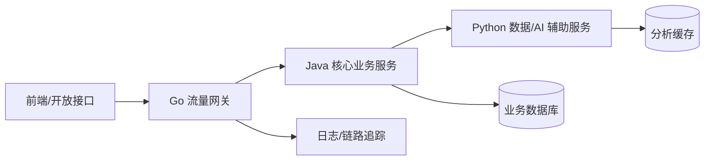

## 知识点拆解

| 小节 | 技术内容 | Java 视角切入 | 落地案例 |
| --- | --- | --- | --- |
| 1.1 | 从“单一语言开发”到“多语言协同全栈架构”的技术演进 | 对标 Java 既有实践，解释设计差异 | 价格计算平台中的对应环节 |
| 1.2 | Java 的技术边界：全栈场景下的优势与短板 | 对标 Java 既有实践，解释设计差异 | 价格计算平台中的对应环节 |
| 1.3 | Go/Python 的核心互补价值：与 Java 的技术选型矩阵 | 对标 Java 既有实践，解释设计差异 | 价格计算平台中的对应环节 |
| 1.4 | 全栈架构下的多语言协作范式：流量分层、数据驱动、服务解耦 | 对标 Java 既有实践，解释设计差异 | 价格计算平台中的对应环节 |

## 1.1 从“单一语言开发”到“多语言协同全栈架构”的技术演进

### Java 中我们通常怎么做

在 Java 技术体系里，这类问题往往通过成熟框架和约定解决：Spring Boot 提供自动配置，Spring MVC 提供注解式入口，Maven/Gradle 统一依赖管理，JUC 和线程池负责并发治理，Bean Validation 与统一异常处理负责边界校验。它的优势是团队认知稳定、生态完整、复杂业务建模能力强。

### 多语言 的对应设计

多语言 的设计目标不完全等价于 Java。它更强调在特定场景下减少样板、降低运行时负担或提升反馈速度。学习时要把“语法差异”翻译成“工程边界差异”：谁负责启动，谁负责依赖，谁暴露错误，谁管理并发，谁承接接口契约。

### 全栈选型逻辑

如果该环节处在核心交易链路、需要复杂领域规则和强团队约束，优先留在 Java。如果该环节更接近流量入口、并发聚合、数据清洗、自动化或算法适配，就可以考虑由 多语言 承担。真正的架构能力，是知道边界在哪里，而不是把所有能力塞进一种语言。

### Java 开发者容易踩的坑

1. 只按语法相似度迁移，不重新设计错误边界。
2. 把 Java 的分层模式机械搬过去，导致新语言项目也变得臃肿。
3. 忽略跨语言调用的超时、错误码、日志字段和版本兼容。
4. 学完语言特性却没有落到真实链路，无法形成可复用经验。

## 1.2 Java 的技术边界：全栈场景下的优势与短板

### Java 中我们通常怎么做

在 Java 技术体系里，这类问题往往通过成熟框架和约定解决：Spring Boot 提供自动配置，Spring MVC 提供注解式入口，Maven/Gradle 统一依赖管理，JUC 和线程池负责并发治理，Bean Validation 与统一异常处理负责边界校验。它的优势是团队认知稳定、生态完整、复杂业务建模能力强。

### 多语言 的对应设计

多语言 的设计目标不完全等价于 Java。它更强调在特定场景下减少样板、降低运行时负担或提升反馈速度。学习时要把“语法差异”翻译成“工程边界差异”：谁负责启动，谁负责依赖，谁暴露错误，谁管理并发，谁承接接口契约。

### 全栈选型逻辑

如果该环节处在核心交易链路、需要复杂领域规则和强团队约束，优先留在 Java。如果该环节更接近流量入口、并发聚合、数据清洗、自动化或算法适配，就可以考虑由 多语言 承担。真正的架构能力，是知道边界在哪里，而不是把所有能力塞进一种语言。

### Java 开发者容易踩的坑

1. 只按语法相似度迁移，不重新设计错误边界。
2. 把 Java 的分层模式机械搬过去，导致新语言项目也变得臃肿。
3. 忽略跨语言调用的超时、错误码、日志字段和版本兼容。
4. 学完语言特性却没有落到真实链路，无法形成可复用经验。

## 1.3 Go/Python 的核心互补价值：与 Java 的技术选型矩阵

### Java 中我们通常怎么做

在 Java 技术体系里，这类问题往往通过成熟框架和约定解决：Spring Boot 提供自动配置，Spring MVC 提供注解式入口，Maven/Gradle 统一依赖管理，JUC 和线程池负责并发治理，Bean Validation 与统一异常处理负责边界校验。它的优势是团队认知稳定、生态完整、复杂业务建模能力强。

### 多语言 的对应设计

多语言 的设计目标不完全等价于 Java。它更强调在特定场景下减少样板、降低运行时负担或提升反馈速度。学习时要把“语法差异”翻译成“工程边界差异”：谁负责启动，谁负责依赖，谁暴露错误，谁管理并发，谁承接接口契约。

### 全栈选型逻辑

如果该环节处在核心交易链路、需要复杂领域规则和强团队约束，优先留在 Java。如果该环节更接近流量入口、并发聚合、数据清洗、自动化或算法适配，就可以考虑由 多语言 承担。真正的架构能力，是知道边界在哪里，而不是把所有能力塞进一种语言。

### Java 开发者容易踩的坑

1. 只按语法相似度迁移，不重新设计错误边界。
2. 把 Java 的分层模式机械搬过去，导致新语言项目也变得臃肿。
3. 忽略跨语言调用的超时、错误码、日志字段和版本兼容。
4. 学完语言特性却没有落到真实链路，无法形成可复用经验。

## 1.4 全栈架构下的多语言协作范式：流量分层、数据驱动、服务解耦

### Java 中我们通常怎么做

在 Java 技术体系里，这类问题往往通过成熟框架和约定解决：Spring Boot 提供自动配置，Spring MVC 提供注解式入口，Maven/Gradle 统一依赖管理，JUC 和线程池负责并发治理，Bean Validation 与统一异常处理负责边界校验。它的优势是团队认知稳定、生态完整、复杂业务建模能力强。

### 多语言 的对应设计

多语言 的设计目标不完全等价于 Java。它更强调在特定场景下减少样板、降低运行时负担或提升反馈速度。学习时要把“语法差异”翻译成“工程边界差异”：谁负责启动，谁负责依赖，谁暴露错误，谁管理并发，谁承接接口契约。

### 全栈选型逻辑

如果该环节处在核心交易链路、需要复杂领域规则和强团队约束，优先留在 Java。如果该环节更接近流量入口、并发聚合、数据清洗、自动化或算法适配，就可以考虑由 多语言 承担。真正的架构能力，是知道边界在哪里，而不是把所有能力塞进一种语言。

### Java 开发者容易踩的坑

1. 只按语法相似度迁移，不重新设计错误边界。
2. 把 Java 的分层模式机械搬过去，导致新语言项目也变得臃肿。
3. 忽略跨语言调用的超时、错误码、日志字段和版本兼容。
4. 学完语言特性却没有落到真实链路，无法形成可复用经验。


## 对比代码示例

```java
// Java: Spring MVC 风格的统一响应
public record ApiResponse<T>(int code, String message, T data, String traceId) {
    public static <T> ApiResponse<T> ok(T data, String traceId) {
        return new ApiResponse<>(0, "OK", data, traceId);
    }
}
```

```go
// Go: 与 Java ApiResponse 对齐的响应壳
type ApiResponse struct {
    Code    int         `json:"code"`
    Message string      `json:"message"`
    Data    interface{} `json:"data,omitempty"`
    TraceID string      `json:"traceId"`
}
```

```python
# Python: 与 Java DTO 对齐的分析入参
from dataclasses import dataclass

@dataclass
class PriceAnalysisRequest:
    sku: str
    base_price: float
    member_level: str
```

这三段代码共同表达同一件事：跨语言协同首先要统一契约。Java 的 record、Go 的 struct、Python 的 dataclass 都只是承载结构的方式，真正需要团队统一的是字段名称、错误码语义、traceId 传递方式和版本兼容策略。

## 章节综合案例：企业级项目技术栈拆分实战

以电商价格计算平台为例，Go 承接高并发入口与鉴权限流，Java 保持交易、权益、优惠等核心业务一致性，Python 负责历史价格统计、竞品对比和智能评分。拆分不是为了炫技，而是让每门语言站在它最能创造价值的位置上。

### 场景输入

用户请求某个 SKU 的实时价格，系统需要读取商品基础价、计算会员优惠、调用分析服务返回历史价格趋势与价格分数，最终对前端返回统一响应。

### 关键流程

1. 网关层校验请求头、生成 traceId、执行限流。
2. Java 核心服务计算价格，保证业务规则集中管理。
3. Python 分析服务处理历史数据，返回趋势、波动率、推荐分。
4. 所有服务按同一响应壳返回，日志中携带相同 traceId。

### 本章落地点

读者完成本章后，应能把 为什么 Java 工程师要掌握多语言？ 中的知识点放回企业项目链路里解释：这个能力解决什么问题，为什么不是 Java 独自承担，跨语言后要补上哪些工程治理。

## 本章小结

1. 本章的核心不是记住 多语言 的单点语法，而是建立 Java 到 多语言 的工程映射。
2. 多语言协同必须先统一接口契约、错误码、日志和超时策略。
3. 技术选型要跟业务链路绑定：入口治理、核心交易、数据辅助三类职责不能混在一起。
4. 所有章节案例最终都会汇入第 13 章的电商价格计算平台。

## 选型思考题

1. 如果把本章场景全部留在 Java，会获得什么稳定性，又会损失什么效率？
2. 如果把核心业务过度迁移到 多语言，团队协作和故障排查会出现什么风险？
3. 你所在团队目前最适合先引入哪一个跨语言边界：网关、数据辅助，还是自动化脚本？

## 延伸阅读资源

1. Java 官方文档与 Spring Boot 参考文档：用于确认 Java 侧基础能力边界。
2. Go 官方文档或 Python 官方文档：用于校准语言基础概念。
3. OpenAPI 与 Protocol Buffers 文档：用于统一跨语言接口契约。
4. Docker Compose 文档：用于本地多服务联调。

## 第 1 章落地设计卡：技术栈拆分决策表

| 判断问题 | 继续使用 Java | 引入 Go | 引入 Python |
| --- | --- | --- | --- |
| 是否包含复杂交易规则 | 是 | 否 | 否 |
| 是否处在高并发入口 | 可用但成本较高 | 是 | 否 |
| 是否以数据清洗、统计、模型适配为主 | 可用但样板较多 | 否 | 是 |
| 是否需要强团队约束和长期演进 | 是 | 视团队经验 | 视边界清晰度 |

企业采用多语言时，第一步不是引入运行时，而是写清楚服务边界。Java 服务持有订单、价格、权益等核心领域状态；Go 网关只做入口治理和聚合；Python 分析服务只返回建议型结果，不直接修改交易状态。

---

# 第 2 章 从 Java 视角学习新语言的高效方法

> 所属篇章：第一篇 认知篇

**本章技术占比**：技术 50% + 引导 20% + 案例 30%

**前置 Java 知识映射**：Java 类型系统、注解、Maven/Gradle、Spring Boot 分层、IDE 调试经验

## 本章导读

本章仍然从 Java 开发者熟悉的工程经验切入。你不需要把 多语言 当作一门完全陌生的语言重新背语法，而是先回答三个问题：Java 中这件事通常怎么做，多语言 为什么采用不同设计，这个差异在全栈协同场景下能带来什么收益或风险。

学习多语言不是为了增加技术栈标签，而是为了获得更细的架构分工能力。Java 继续承担复杂业务、一致性和团队协作沉淀；Go 更适合高并发入口、轻量网关和云原生组件；Python 更适合数据处理、自动化脚本和 AI 生态适配。判断标准始终是业务链路，而不是语言偏好。

## 技术地图

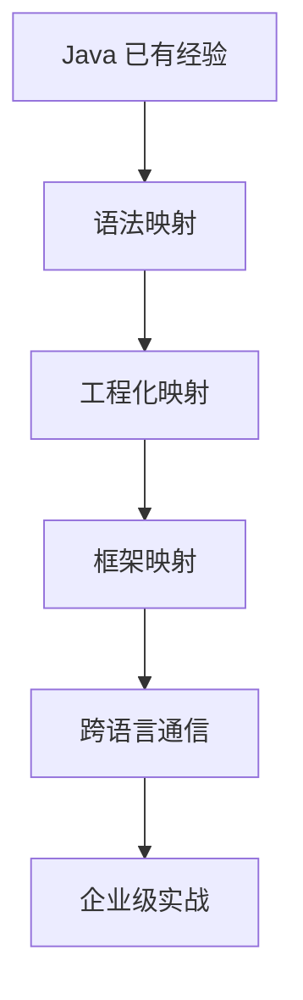

## 知识点拆解

| 小节 | 技术内容 | Java 视角切入 | 落地案例 |
| --- | --- | --- | --- |
| 2.1 | 建立技术映射：把 Go/Python 特性对应到 Java 技术体系 | 对标 Java 既有实践，解释设计差异 | 价格计算平台中的对应环节 |
| 2.2 | 规避无效学习：只掌握全栈场景必需的语言特性 | 对标 Java 既有实践，解释设计差异 | 价格计算平台中的对应环节 |
| 2.3 | 核心学习逻辑：语法到特性到框架到场景到协同 | 对标 Java 既有实践，解释设计差异 | 价格计算平台中的对应环节 |
| 2.4 | 工程化工具链准备：Java+Go+Python 统一开发环境搭建 | 对标 Java 既有实践，解释设计差异 | 价格计算平台中的对应环节 |

## 2.1 建立技术映射：把 Go/Python 特性对应到 Java 技术体系

### Java 中我们通常怎么做

在 Java 技术体系里，这类问题往往通过成熟框架和约定解决：Spring Boot 提供自动配置，Spring MVC 提供注解式入口，Maven/Gradle 统一依赖管理，JUC 和线程池负责并发治理，Bean Validation 与统一异常处理负责边界校验。它的优势是团队认知稳定、生态完整、复杂业务建模能力强。

### 多语言 的对应设计

多语言 的设计目标不完全等价于 Java。它更强调在特定场景下减少样板、降低运行时负担或提升反馈速度。学习时要把“语法差异”翻译成“工程边界差异”：谁负责启动，谁负责依赖，谁暴露错误，谁管理并发，谁承接接口契约。

### 全栈选型逻辑

如果该环节处在核心交易链路、需要复杂领域规则和强团队约束，优先留在 Java。如果该环节更接近流量入口、并发聚合、数据清洗、自动化或算法适配，就可以考虑由 多语言 承担。真正的架构能力，是知道边界在哪里，而不是把所有能力塞进一种语言。

### Java 开发者容易踩的坑

1. 只按语法相似度迁移，不重新设计错误边界。
2. 把 Java 的分层模式机械搬过去，导致新语言项目也变得臃肿。
3. 忽略跨语言调用的超时、错误码、日志字段和版本兼容。
4. 学完语言特性却没有落到真实链路，无法形成可复用经验。

## 2.2 规避无效学习：只掌握全栈场景必需的语言特性

### Java 中我们通常怎么做

在 Java 技术体系里，这类问题往往通过成熟框架和约定解决：Spring Boot 提供自动配置，Spring MVC 提供注解式入口，Maven/Gradle 统一依赖管理，JUC 和线程池负责并发治理，Bean Validation 与统一异常处理负责边界校验。它的优势是团队认知稳定、生态完整、复杂业务建模能力强。

### 多语言 的对应设计

多语言 的设计目标不完全等价于 Java。它更强调在特定场景下减少样板、降低运行时负担或提升反馈速度。学习时要把“语法差异”翻译成“工程边界差异”：谁负责启动，谁负责依赖，谁暴露错误，谁管理并发，谁承接接口契约。

### 全栈选型逻辑

如果该环节处在核心交易链路、需要复杂领域规则和强团队约束，优先留在 Java。如果该环节更接近流量入口、并发聚合、数据清洗、自动化或算法适配，就可以考虑由 多语言 承担。真正的架构能力，是知道边界在哪里，而不是把所有能力塞进一种语言。

### Java 开发者容易踩的坑

1. 只按语法相似度迁移，不重新设计错误边界。
2. 把 Java 的分层模式机械搬过去，导致新语言项目也变得臃肿。
3. 忽略跨语言调用的超时、错误码、日志字段和版本兼容。
4. 学完语言特性却没有落到真实链路，无法形成可复用经验。

## 2.3 核心学习逻辑：语法到特性到框架到场景到协同

### Java 中我们通常怎么做

在 Java 技术体系里，这类问题往往通过成熟框架和约定解决：Spring Boot 提供自动配置，Spring MVC 提供注解式入口，Maven/Gradle 统一依赖管理，JUC 和线程池负责并发治理，Bean Validation 与统一异常处理负责边界校验。它的优势是团队认知稳定、生态完整、复杂业务建模能力强。

### 多语言 的对应设计

多语言 的设计目标不完全等价于 Java。它更强调在特定场景下减少样板、降低运行时负担或提升反馈速度。学习时要把“语法差异”翻译成“工程边界差异”：谁负责启动，谁负责依赖，谁暴露错误，谁管理并发，谁承接接口契约。

### 全栈选型逻辑

如果该环节处在核心交易链路、需要复杂领域规则和强团队约束，优先留在 Java。如果该环节更接近流量入口、并发聚合、数据清洗、自动化或算法适配，就可以考虑由 多语言 承担。真正的架构能力，是知道边界在哪里，而不是把所有能力塞进一种语言。

### Java 开发者容易踩的坑

1. 只按语法相似度迁移，不重新设计错误边界。
2. 把 Java 的分层模式机械搬过去，导致新语言项目也变得臃肿。
3. 忽略跨语言调用的超时、错误码、日志字段和版本兼容。
4. 学完语言特性却没有落到真实链路，无法形成可复用经验。

## 2.4 工程化工具链准备：Java+Go+Python 统一开发环境搭建

### Java 中我们通常怎么做

在 Java 技术体系里，这类问题往往通过成熟框架和约定解决：Spring Boot 提供自动配置，Spring MVC 提供注解式入口，Maven/Gradle 统一依赖管理，JUC 和线程池负责并发治理，Bean Validation 与统一异常处理负责边界校验。它的优势是团队认知稳定、生态完整、复杂业务建模能力强。

### 多语言 的对应设计

多语言 的设计目标不完全等价于 Java。它更强调在特定场景下减少样板、降低运行时负担或提升反馈速度。学习时要把“语法差异”翻译成“工程边界差异”：谁负责启动，谁负责依赖，谁暴露错误，谁管理并发，谁承接接口契约。

### 全栈选型逻辑

如果该环节处在核心交易链路、需要复杂领域规则和强团队约束，优先留在 Java。如果该环节更接近流量入口、并发聚合、数据清洗、自动化或算法适配，就可以考虑由 多语言 承担。真正的架构能力，是知道边界在哪里，而不是把所有能力塞进一种语言。

### Java 开发者容易踩的坑

1. 只按语法相似度迁移，不重新设计错误边界。
2. 把 Java 的分层模式机械搬过去，导致新语言项目也变得臃肿。
3. 忽略跨语言调用的超时、错误码、日志字段和版本兼容。
4. 学完语言特性却没有落到真实链路，无法形成可复用经验。


## 对比代码示例

```java
// Java: Spring MVC 风格的统一响应
public record ApiResponse<T>(int code, String message, T data, String traceId) {
    public static <T> ApiResponse<T> ok(T data, String traceId) {
        return new ApiResponse<>(0, "OK", data, traceId);
    }
}
```

```go
// Go: 与 Java ApiResponse 对齐的响应壳
type ApiResponse struct {
    Code    int         `json:"code"`
    Message string      `json:"message"`
    Data    interface{} `json:"data,omitempty"`
    TraceID string      `json:"traceId"`
}
```

```python
# Python: 与 Java DTO 对齐的分析入参
from dataclasses import dataclass

@dataclass
class PriceAnalysisRequest:
    sku: str
    base_price: float
    member_level: str
```

这三段代码共同表达同一件事：跨语言协同首先要统一契约。Java 的 record、Go 的 struct、Python 的 dataclass 都只是承载结构的方式，真正需要团队统一的是字段名称、错误码语义、traceId 传递方式和版本兼容策略。

## 章节综合案例：配置多语言统一开发、联调环境

本仓库采用 `book/` 管理正文、`project/pricing-platform/` 管理实战源码、`docs/` 管理规范与验收报告。读者可以从 README 进入书稿，也可以直接按部署指南启动三个服务。

### 场景输入

用户请求某个 SKU 的实时价格，系统需要读取商品基础价、计算会员优惠、调用分析服务返回历史价格趋势与价格分数，最终对前端返回统一响应。

### 关键流程

1. 网关层校验请求头、生成 traceId、执行限流。
2. Java 核心服务计算价格，保证业务规则集中管理。
3. Python 分析服务处理历史数据，返回趋势、波动率、推荐分。
4. 所有服务按同一响应壳返回，日志中携带相同 traceId。

### 本章落地点

读者完成本章后，应能把 从 Java 视角学习新语言的高效方法 中的知识点放回企业项目链路里解释：这个能力解决什么问题，为什么不是 Java 独自承担，跨语言后要补上哪些工程治理。

## 本章小结

1. 本章的核心不是记住 多语言 的单点语法，而是建立 Java 到 多语言 的工程映射。
2. 多语言协同必须先统一接口契约、错误码、日志和超时策略。
3. 技术选型要跟业务链路绑定：入口治理、核心交易、数据辅助三类职责不能混在一起。
4. 所有章节案例最终都会汇入第 13 章的电商价格计算平台。

## 选型思考题

1. 如果把本章场景全部留在 Java，会获得什么稳定性，又会损失什么效率？
2. 如果把核心业务过度迁移到 多语言，团队协作和故障排查会出现什么风险？
3. 你所在团队目前最适合先引入哪一个跨语言边界：网关、数据辅助，还是自动化脚本？

## 延伸阅读资源

1. Java 官方文档与 Spring Boot 参考文档：用于确认 Java 侧基础能力边界。
2. Go 官方文档或 Python 官方文档：用于校准语言基础概念。
3. OpenAPI 与 Protocol Buffers 文档：用于统一跨语言接口契约。
4. Docker Compose 文档：用于本地多服务联调。

## 第 2 章工具链检查表

| 工具 | 作用 | 验收方式 |
| --- | --- | --- |
| JDK 21 | 编译 Java 标准库示例 | `javac -version` |
| Go 1.22+ | 运行网关和并发示例 | `go version` |
| Python 3.11+ | 运行分析服务和脚本 | `python --version` |
| Docker Compose | 本地编排多服务 | `docker compose version` |
| Postman/curl | 接口联调 | 能携带 `X-Trace-Id` 请求 |

学习路径建议是先跑通标准库版本，再替换为 Spring Boot/Gin/FastAPI。这样读者能先看清跨语言链路，再理解框架帮我们省掉了哪些工程样板。

---

# 第 3 章 Go 基础语法：与 Java 的核心差异映射

> 所属篇章：第二篇 Java 眼中的 Go 世界

**本章技术占比**：技术 50% + 引导 20% + 案例 30%

**前置 Java 知识映射**：Java 基础语法、类与接口、Maven/Gradle、异常处理机制

## 本章导读

本章仍然从 Java 开发者熟悉的工程经验切入。你不需要把 Go 当作一门完全陌生的语言重新背语法，而是先回答三个问题：Java 中这件事通常怎么做，Go 为什么采用不同设计，这个差异在全栈协同场景下能带来什么收益或风险。

学习多语言不是为了增加技术栈标签，而是为了获得更细的架构分工能力。Java 继续承担复杂业务、一致性和团队协作沉淀；Go 更适合高并发入口、轻量网关和云原生组件；Python 更适合数据处理、自动化脚本和 AI 生态适配。判断标准始终是业务链路，而不是语言偏好。

## 技术地图

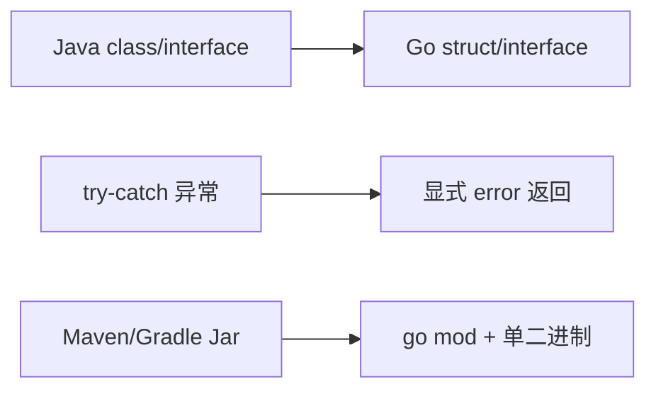

## 知识点拆解

| 小节 | 技术内容 | Java 视角切入 | 落地案例 |
| --- | --- | --- | --- |
| 3.1 | 工程化差异：Go 的依赖管理、项目结构 vs Java 的 Maven/Gradle | 对标 Java 既有实践，解释设计差异 | 价格计算平台中的对应环节 |
| 3.2 | 基础语法对比：变量、流程控制、结构体 vs Java 的类 | 对标 Java 既有实践，解释设计差异 | 价格计算平台中的对应环节 |
| 3.3 | 核心设计差异：组合 vs 继承、接口隐式实现 vs 显式实现 | 对标 Java 既有实践，解释设计差异 | 价格计算平台中的对应环节 |
| 3.4 | 错误处理机制：Go 的显式错误返回 vs Java 的异常捕获机制 | 对标 Java 既有实践，解释设计差异 | 价格计算平台中的对应环节 |

## 3.1 工程化差异：Go 的依赖管理、项目结构 vs Java 的 Maven/Gradle

### Java 中我们通常怎么做

在 Java 技术体系里，这类问题往往通过成熟框架和约定解决：Spring Boot 提供自动配置，Spring MVC 提供注解式入口，Maven/Gradle 统一依赖管理，JUC 和线程池负责并发治理，Bean Validation 与统一异常处理负责边界校验。它的优势是团队认知稳定、生态完整、复杂业务建模能力强。

### Go 的对应设计

Go 的设计目标不完全等价于 Java。它更强调在特定场景下减少样板、降低运行时负担或提升反馈速度。学习时要把“语法差异”翻译成“工程边界差异”：谁负责启动，谁负责依赖，谁暴露错误，谁管理并发，谁承接接口契约。

### 全栈选型逻辑

如果该环节处在核心交易链路、需要复杂领域规则和强团队约束，优先留在 Java。如果该环节更接近流量入口、并发聚合、数据清洗、自动化或算法适配，就可以考虑由 Go 承担。真正的架构能力，是知道边界在哪里，而不是把所有能力塞进一种语言。

### Java 开发者容易踩的坑

1. 只按语法相似度迁移，不重新设计错误边界。
2. 把 Java 的分层模式机械搬过去，导致新语言项目也变得臃肿。
3. 忽略跨语言调用的超时、错误码、日志字段和版本兼容。
4. 学完语言特性却没有落到真实链路，无法形成可复用经验。

## 3.2 基础语法对比：变量、流程控制、结构体 vs Java 的类

### Java 中我们通常怎么做

在 Java 技术体系里，这类问题往往通过成熟框架和约定解决：Spring Boot 提供自动配置，Spring MVC 提供注解式入口，Maven/Gradle 统一依赖管理，JUC 和线程池负责并发治理，Bean Validation 与统一异常处理负责边界校验。它的优势是团队认知稳定、生态完整、复杂业务建模能力强。

### Go 的对应设计

Go 的设计目标不完全等价于 Java。它更强调在特定场景下减少样板、降低运行时负担或提升反馈速度。学习时要把“语法差异”翻译成“工程边界差异”：谁负责启动，谁负责依赖，谁暴露错误，谁管理并发，谁承接接口契约。

### 全栈选型逻辑

如果该环节处在核心交易链路、需要复杂领域规则和强团队约束，优先留在 Java。如果该环节更接近流量入口、并发聚合、数据清洗、自动化或算法适配，就可以考虑由 Go 承担。真正的架构能力，是知道边界在哪里，而不是把所有能力塞进一种语言。

### Java 开发者容易踩的坑

1. 只按语法相似度迁移，不重新设计错误边界。
2. 把 Java 的分层模式机械搬过去，导致新语言项目也变得臃肿。
3. 忽略跨语言调用的超时、错误码、日志字段和版本兼容。
4. 学完语言特性却没有落到真实链路，无法形成可复用经验。

## 3.3 核心设计差异：组合 vs 继承、接口隐式实现 vs 显式实现

### Java 中我们通常怎么做

在 Java 技术体系里，这类问题往往通过成熟框架和约定解决：Spring Boot 提供自动配置，Spring MVC 提供注解式入口，Maven/Gradle 统一依赖管理，JUC 和线程池负责并发治理，Bean Validation 与统一异常处理负责边界校验。它的优势是团队认知稳定、生态完整、复杂业务建模能力强。

### Go 的对应设计

Go 的设计目标不完全等价于 Java。它更强调在特定场景下减少样板、降低运行时负担或提升反馈速度。学习时要把“语法差异”翻译成“工程边界差异”：谁负责启动，谁负责依赖，谁暴露错误，谁管理并发，谁承接接口契约。

### 全栈选型逻辑

如果该环节处在核心交易链路、需要复杂领域规则和强团队约束，优先留在 Java。如果该环节更接近流量入口、并发聚合、数据清洗、自动化或算法适配，就可以考虑由 Go 承担。真正的架构能力，是知道边界在哪里，而不是把所有能力塞进一种语言。

### Java 开发者容易踩的坑

1. 只按语法相似度迁移，不重新设计错误边界。
2. 把 Java 的分层模式机械搬过去，导致新语言项目也变得臃肿。
3. 忽略跨语言调用的超时、错误码、日志字段和版本兼容。
4. 学完语言特性却没有落到真实链路，无法形成可复用经验。

## 3.4 错误处理机制：Go 的显式错误返回 vs Java 的异常捕获机制

### Java 中我们通常怎么做

在 Java 技术体系里，这类问题往往通过成熟框架和约定解决：Spring Boot 提供自动配置，Spring MVC 提供注解式入口，Maven/Gradle 统一依赖管理，JUC 和线程池负责并发治理，Bean Validation 与统一异常处理负责边界校验。它的优势是团队认知稳定、生态完整、复杂业务建模能力强。

### Go 的对应设计

Go 的设计目标不完全等价于 Java。它更强调在特定场景下减少样板、降低运行时负担或提升反馈速度。学习时要把“语法差异”翻译成“工程边界差异”：谁负责启动，谁负责依赖，谁暴露错误，谁管理并发，谁承接接口契约。

### 全栈选型逻辑

如果该环节处在核心交易链路、需要复杂领域规则和强团队约束，优先留在 Java。如果该环节更接近流量入口、并发聚合、数据清洗、自动化或算法适配，就可以考虑由 Go 承担。真正的架构能力，是知道边界在哪里，而不是把所有能力塞进一种语言。

### Java 开发者容易踩的坑

1. 只按语法相似度迁移，不重新设计错误边界。
2. 把 Java 的分层模式机械搬过去，导致新语言项目也变得臃肿。
3. 忽略跨语言调用的超时、错误码、日志字段和版本兼容。
4. 学完语言特性却没有落到真实链路，无法形成可复用经验。


## 对比代码示例

```java
// Java: Spring MVC 风格的统一响应
public record ApiResponse<T>(int code, String message, T data, String traceId) {
    public static <T> ApiResponse<T> ok(T data, String traceId) {
        return new ApiResponse<>(0, "OK", data, traceId);
    }
}
```

```go
// Go: 与 Java ApiResponse 对齐的响应壳
type ApiResponse struct {
    Code    int         `json:"code"`
    Message string      `json:"message"`
    Data    interface{} `json:"data,omitempty"`
    TraceID string      `json:"traceId"`
}
```

```python
# Python: 与 Java DTO 对齐的分析入参
from dataclasses import dataclass

@dataclass
class PriceAnalysisRequest:
    sku: str
    base_price: float
    member_level: str
```

这三段代码共同表达同一件事：跨语言协同首先要统一契约。Java 的 record、Go 的 struct、Python 的 dataclass 都只是承载结构的方式，真正需要团队统一的是字段名称、错误码语义、traceId 传递方式和版本兼容策略。

## 章节综合案例：用户数据解析工具：Java 代码 vs Go 代码对比实现

同一个 JSON 入参解析场景，在 Java 中依赖 Spring MVC 的 `@RequestBody` 与 Bean Validation，在 Go 中依赖结构体标签和显式错误返回。读者要关注的不是语法短多少，而是错误边界在哪里暴露。

### 场景输入

用户请求某个 SKU 的实时价格，系统需要读取商品基础价、计算会员优惠、调用分析服务返回历史价格趋势与价格分数，最终对前端返回统一响应。

### 关键流程

1. 网关层校验请求头、生成 traceId、执行限流。
2. Java 核心服务计算价格，保证业务规则集中管理。
3. Python 分析服务处理历史数据，返回趋势、波动率、推荐分。
4. 所有服务按同一响应壳返回，日志中携带相同 traceId。

### 本章落地点

读者完成本章后，应能把 Go 基础语法：与 Java 的核心差异映射 中的知识点放回企业项目链路里解释：这个能力解决什么问题，为什么不是 Java 独自承担，跨语言后要补上哪些工程治理。

## 本章小结

1. 本章的核心不是记住 Go 的单点语法，而是建立 Java 到 Go 的工程映射。
2. 多语言协同必须先统一接口契约、错误码、日志和超时策略。
3. 技术选型要跟业务链路绑定：入口治理、核心交易、数据辅助三类职责不能混在一起。
4. 所有章节案例最终都会汇入第 13 章的电商价格计算平台。

## 选型思考题

1. 如果把本章场景全部留在 Java，会获得什么稳定性，又会损失什么效率？
2. 如果把核心业务过度迁移到 Go，团队协作和故障排查会出现什么风险？
3. 你所在团队目前最适合先引入哪一个跨语言边界：网关、数据辅助，还是自动化脚本？

## 延伸阅读资源

1. Java 官方文档与 Spring Boot 参考文档：用于确认 Java 侧基础能力边界。
2. Go 官方文档或 Python 官方文档：用于校准语言基础概念。
3. OpenAPI 与 Protocol Buffers 文档：用于统一跨语言接口契约。
4. Docker Compose 文档：用于本地多服务联调。

## 第 3 章代码迁移提示：从类模型到组合模型

Java 中的 `UserServiceImpl extends BaseService implements UserService`，迁移到 Go 时不要急着寻找继承替代品。更自然的写法是用结构体持有依赖，用接口描述行为，用构造函数显式装配。

```go
type UserRepository interface {
    FindByID(id int64) (User, error)
}

type UserService struct {
    repo UserRepository
}

func NewUserService(repo UserRepository) *UserService {
    return &UserService{repo: repo}
}
```

这段代码对标 Spring 的构造器注入，但依赖关系在普通代码里直接可见。

---

# 第 4 章 Go 的并发模型：Java 开发者必须掌握的核心差异

> 所属篇章：第二篇 Java 眼中的 Go 世界

**本章技术占比**：技术 50% + 引导 20% + 案例 30%

**前置 Java 知识映射**：Java Thread、ExecutorService、CompletableFuture、JUC 锁、线程池容量规划

## 本章导读

本章仍然从 Java 开发者熟悉的工程经验切入。你不需要把 Go 当作一门完全陌生的语言重新背语法，而是先回答三个问题：Java 中这件事通常怎么做，Go 为什么采用不同设计，这个差异在全栈协同场景下能带来什么收益或风险。

学习多语言不是为了增加技术栈标签，而是为了获得更细的架构分工能力。Java 继续承担复杂业务、一致性和团队协作沉淀；Go 更适合高并发入口、轻量网关和云原生组件；Python 更适合数据处理、自动化脚本和 AI 生态适配。判断标准始终是业务链路，而不是语言偏好。

## 技术地图

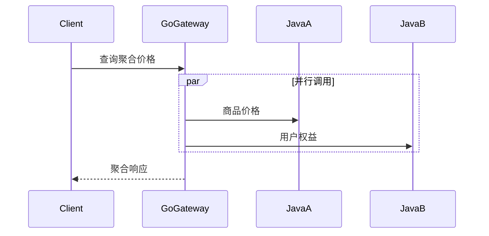

## 知识点拆解

| 小节 | 技术内容 | Java 视角切入 | 落地案例 |
| --- | --- | --- | --- |
| 4.1 | 并发本质差异：Goroutine/Channel vs 线程池/Condition | 对标 Java 既有实践，解释设计差异 | 价格计算平台中的对应环节 |
| 4.2 | Go 的并发原语：sync 包、Context 机制 vs Java JUC | 对标 Java 既有实践，解释设计差异 | 价格计算平台中的对应环节 |
| 4.3 | 并发安全最佳实践：规避 Goroutine 泄漏、数据竞态问题 | 对标 Java 既有实践，解释设计差异 | 价格计算平台中的对应环节 |
| 4.4 | 全栈场景下的并发选型：什么时候用 Go，什么时候用 Java | 对标 Java 既有实践，解释设计差异 | 价格计算平台中的对应环节 |

## 4.1 并发本质差异：Goroutine/Channel vs 线程池/Condition

### Java 中我们通常怎么做

在 Java 技术体系里，这类问题往往通过成熟框架和约定解决：Spring Boot 提供自动配置，Spring MVC 提供注解式入口，Maven/Gradle 统一依赖管理，JUC 和线程池负责并发治理，Bean Validation 与统一异常处理负责边界校验。它的优势是团队认知稳定、生态完整、复杂业务建模能力强。

### Go 的对应设计

Go 的设计目标不完全等价于 Java。它更强调在特定场景下减少样板、降低运行时负担或提升反馈速度。学习时要把“语法差异”翻译成“工程边界差异”：谁负责启动，谁负责依赖，谁暴露错误，谁管理并发，谁承接接口契约。

### 全栈选型逻辑

如果该环节处在核心交易链路、需要复杂领域规则和强团队约束，优先留在 Java。如果该环节更接近流量入口、并发聚合、数据清洗、自动化或算法适配，就可以考虑由 Go 承担。真正的架构能力，是知道边界在哪里，而不是把所有能力塞进一种语言。

### Java 开发者容易踩的坑

1. 只按语法相似度迁移，不重新设计错误边界。
2. 把 Java 的分层模式机械搬过去，导致新语言项目也变得臃肿。
3. 忽略跨语言调用的超时、错误码、日志字段和版本兼容。
4. 学完语言特性却没有落到真实链路，无法形成可复用经验。

## 4.2 Go 的并发原语：sync 包、Context 机制 vs Java JUC

### Java 中我们通常怎么做

在 Java 技术体系里，这类问题往往通过成熟框架和约定解决：Spring Boot 提供自动配置，Spring MVC 提供注解式入口，Maven/Gradle 统一依赖管理，JUC 和线程池负责并发治理，Bean Validation 与统一异常处理负责边界校验。它的优势是团队认知稳定、生态完整、复杂业务建模能力强。

### Go 的对应设计

Go 的设计目标不完全等价于 Java。它更强调在特定场景下减少样板、降低运行时负担或提升反馈速度。学习时要把“语法差异”翻译成“工程边界差异”：谁负责启动，谁负责依赖，谁暴露错误，谁管理并发，谁承接接口契约。

### 全栈选型逻辑

如果该环节处在核心交易链路、需要复杂领域规则和强团队约束，优先留在 Java。如果该环节更接近流量入口、并发聚合、数据清洗、自动化或算法适配，就可以考虑由 Go 承担。真正的架构能力，是知道边界在哪里，而不是把所有能力塞进一种语言。

### Java 开发者容易踩的坑

1. 只按语法相似度迁移，不重新设计错误边界。
2. 把 Java 的分层模式机械搬过去，导致新语言项目也变得臃肿。
3. 忽略跨语言调用的超时、错误码、日志字段和版本兼容。
4. 学完语言特性却没有落到真实链路，无法形成可复用经验。

## 4.3 并发安全最佳实践：规避 Goroutine 泄漏、数据竞态问题

### Java 中我们通常怎么做

在 Java 技术体系里，这类问题往往通过成熟框架和约定解决：Spring Boot 提供自动配置，Spring MVC 提供注解式入口，Maven/Gradle 统一依赖管理，JUC 和线程池负责并发治理，Bean Validation 与统一异常处理负责边界校验。它的优势是团队认知稳定、生态完整、复杂业务建模能力强。

### Go 的对应设计

Go 的设计目标不完全等价于 Java。它更强调在特定场景下减少样板、降低运行时负担或提升反馈速度。学习时要把“语法差异”翻译成“工程边界差异”：谁负责启动，谁负责依赖，谁暴露错误，谁管理并发，谁承接接口契约。

### 全栈选型逻辑

如果该环节处在核心交易链路、需要复杂领域规则和强团队约束，优先留在 Java。如果该环节更接近流量入口、并发聚合、数据清洗、自动化或算法适配，就可以考虑由 Go 承担。真正的架构能力，是知道边界在哪里，而不是把所有能力塞进一种语言。

### Java 开发者容易踩的坑

1. 只按语法相似度迁移，不重新设计错误边界。
2. 把 Java 的分层模式机械搬过去，导致新语言项目也变得臃肿。
3. 忽略跨语言调用的超时、错误码、日志字段和版本兼容。
4. 学完语言特性却没有落到真实链路，无法形成可复用经验。

## 4.4 全栈场景下的并发选型：什么时候用 Go，什么时候用 Java

### Java 中我们通常怎么做

在 Java 技术体系里，这类问题往往通过成熟框架和约定解决：Spring Boot 提供自动配置，Spring MVC 提供注解式入口，Maven/Gradle 统一依赖管理，JUC 和线程池负责并发治理，Bean Validation 与统一异常处理负责边界校验。它的优势是团队认知稳定、生态完整、复杂业务建模能力强。

### Go 的对应设计

Go 的设计目标不完全等价于 Java。它更强调在特定场景下减少样板、降低运行时负担或提升反馈速度。学习时要把“语法差异”翻译成“工程边界差异”：谁负责启动，谁负责依赖，谁暴露错误，谁管理并发，谁承接接口契约。

### 全栈选型逻辑

如果该环节处在核心交易链路、需要复杂领域规则和强团队约束，优先留在 Java。如果该环节更接近流量入口、并发聚合、数据清洗、自动化或算法适配，就可以考虑由 Go 承担。真正的架构能力，是知道边界在哪里，而不是把所有能力塞进一种语言。

### Java 开发者容易踩的坑

1. 只按语法相似度迁移，不重新设计错误边界。
2. 把 Java 的分层模式机械搬过去，导致新语言项目也变得臃肿。
3. 忽略跨语言调用的超时、错误码、日志字段和版本兼容。
4. 学完语言特性却没有落到真实链路，无法形成可复用经验。


## 对比代码示例

```java
// Java: Spring MVC 风格的统一响应
public record ApiResponse<T>(int code, String message, T data, String traceId) {
    public static <T> ApiResponse<T> ok(T data, String traceId) {
        return new ApiResponse<>(0, "OK", data, traceId);
    }
}
```

```go
// Go: 与 Java ApiResponse 对齐的响应壳
type ApiResponse struct {
    Code    int         `json:"code"`
    Message string      `json:"message"`
    Data    interface{} `json:"data,omitempty"`
    TraceID string      `json:"traceId"`
}
```

```python
# Python: 与 Java DTO 对齐的分析入参
from dataclasses import dataclass

@dataclass
class PriceAnalysisRequest:
    sku: str
    base_price: float
    member_level: str
```

这三段代码共同表达同一件事：跨语言协同首先要统一契约。Java 的 record、Go 的 struct、Python 的 dataclass 都只是承载结构的方式，真正需要团队统一的是字段名称、错误码语义、traceId 传递方式和版本兼容策略。

## 章节综合案例：并行数据聚合接口：Go 并发调用 Java 服务

Go 网关用 Context 控制请求生命周期，用 goroutine 并行调用多个 Java 服务，用 channel 或 WaitGroup 汇总结果。Java 仍然负责强一致业务，Go 只做并发聚合和超时隔离。

### 场景输入

用户请求某个 SKU 的实时价格，系统需要读取商品基础价、计算会员优惠、调用分析服务返回历史价格趋势与价格分数，最终对前端返回统一响应。

### 关键流程

1. 网关层校验请求头、生成 traceId、执行限流。
2. Java 核心服务计算价格，保证业务规则集中管理。
3. Python 分析服务处理历史数据，返回趋势、波动率、推荐分。
4. 所有服务按同一响应壳返回，日志中携带相同 traceId。

### 本章落地点

读者完成本章后，应能把 Go 的并发模型：Java 开发者必须掌握的核心差异 中的知识点放回企业项目链路里解释：这个能力解决什么问题，为什么不是 Java 独自承担，跨语言后要补上哪些工程治理。

## 本章小结

1. 本章的核心不是记住 Go 的单点语法，而是建立 Java 到 Go 的工程映射。
2. 多语言协同必须先统一接口契约、错误码、日志和超时策略。
3. 技术选型要跟业务链路绑定：入口治理、核心交易、数据辅助三类职责不能混在一起。
4. 所有章节案例最终都会汇入第 13 章的电商价格计算平台。

## 选型思考题

1. 如果把本章场景全部留在 Java，会获得什么稳定性，又会损失什么效率？
2. 如果把核心业务过度迁移到 Go，团队协作和故障排查会出现什么风险？
3. 你所在团队目前最适合先引入哪一个跨语言边界：网关、数据辅助，还是自动化脚本？

## 延伸阅读资源

1. Java 官方文档与 Spring Boot 参考文档：用于确认 Java 侧基础能力边界。
2. Go 官方文档或 Python 官方文档：用于校准语言基础概念。
3. OpenAPI 与 Protocol Buffers 文档：用于统一跨语言接口契约。
4. Docker Compose 文档：用于本地多服务联调。

## 第 4 章并发验收指标

| 指标 | Java 线程池关注点 | Go 网关关注点 |
| --- | --- | --- |
| 并发上限 | core/max pool size、队列长度 | goroutine 数、下游并发阈值 |
| 超时控制 | Future timeout、WebClient timeout | context deadline |
| 泄漏风险 | 线程池队列堆积 | goroutine 阻塞、channel 无消费者 |
| 排查手段 | jstack、线程池监控 | pprof、请求 traceId |

Go 并发示例的验收标准不是“能并发”，而是每个下游调用都能被 Context 取消，任何失败都能汇总到统一错误结构。

---

# 第 5 章 Go Web 框架 Gin：对标 Spring MVC 的技术映射

> 所属篇章：第二篇 Java 眼中的 Go 世界

**本章技术占比**：技术 50% + 引导 20% + 案例 30%

**前置 Java 知识映射**：Spring MVC 路由、Interceptor、Controller/Service/Repository 分层、统一响应模型

## 本章导读

本章仍然从 Java 开发者熟悉的工程经验切入。你不需要把 Go 当作一门完全陌生的语言重新背语法，而是先回答三个问题：Java 中这件事通常怎么做，Go 为什么采用不同设计，这个差异在全栈协同场景下能带来什么收益或风险。

学习多语言不是为了增加技术栈标签，而是为了获得更细的架构分工能力。Java 继续承担复杂业务、一致性和团队协作沉淀；Go 更适合高并发入口、轻量网关和云原生组件；Python 更适合数据处理、自动化脚本和 AI 生态适配。判断标准始终是业务链路，而不是语言偏好。

## 技术地图

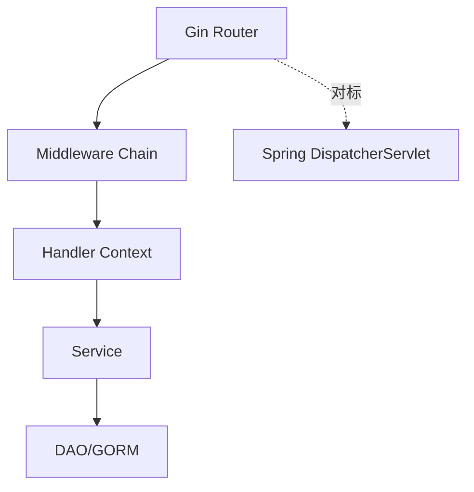

## 知识点拆解

| 小节 | 技术内容 | Java 视角切入 | 落地案例 |
| --- | --- | --- | --- |
| 5.1 | Gin 核心设计：路由引擎、中间件、Context 上下文 vs Spring MVC | 对标 Java 既有实践，解释设计差异 | 价格计算平台中的对应环节 |
| 5.2 | 请求/响应处理：参数绑定、校验、统一响应封装 vs 注解处理 | 对标 Java 既有实践，解释设计差异 | 价格计算平台中的对应环节 |
| 5.3 | 路由分组与中间件：鉴权、限流、日志采集 vs Interceptor | 对标 Java 既有实践，解释设计差异 | 价格计算平台中的对应环节 |
| 5.4 | 数据访问层：GORM CRUD、关联查询 vs Spring Data JPA | 对标 Java 既有实践，解释设计差异 | 价格计算平台中的对应环节 |

## 5.1 Gin 核心设计：路由引擎、中间件、Context 上下文 vs Spring MVC

### Java 中我们通常怎么做

在 Java 技术体系里，这类问题往往通过成熟框架和约定解决：Spring Boot 提供自动配置，Spring MVC 提供注解式入口，Maven/Gradle 统一依赖管理，JUC 和线程池负责并发治理，Bean Validation 与统一异常处理负责边界校验。它的优势是团队认知稳定、生态完整、复杂业务建模能力强。

### Go 的对应设计

Go 的设计目标不完全等价于 Java。它更强调在特定场景下减少样板、降低运行时负担或提升反馈速度。学习时要把“语法差异”翻译成“工程边界差异”：谁负责启动，谁负责依赖，谁暴露错误，谁管理并发，谁承接接口契约。

### 全栈选型逻辑

如果该环节处在核心交易链路、需要复杂领域规则和强团队约束，优先留在 Java。如果该环节更接近流量入口、并发聚合、数据清洗、自动化或算法适配，就可以考虑由 Go 承担。真正的架构能力，是知道边界在哪里，而不是把所有能力塞进一种语言。

### Java 开发者容易踩的坑

1. 只按语法相似度迁移，不重新设计错误边界。
2. 把 Java 的分层模式机械搬过去，导致新语言项目也变得臃肿。
3. 忽略跨语言调用的超时、错误码、日志字段和版本兼容。
4. 学完语言特性却没有落到真实链路，无法形成可复用经验。

## 5.2 请求/响应处理：参数绑定、校验、统一响应封装 vs 注解处理

### Java 中我们通常怎么做

在 Java 技术体系里，这类问题往往通过成熟框架和约定解决：Spring Boot 提供自动配置，Spring MVC 提供注解式入口，Maven/Gradle 统一依赖管理，JUC 和线程池负责并发治理，Bean Validation 与统一异常处理负责边界校验。它的优势是团队认知稳定、生态完整、复杂业务建模能力强。

### Go 的对应设计

Go 的设计目标不完全等价于 Java。它更强调在特定场景下减少样板、降低运行时负担或提升反馈速度。学习时要把“语法差异”翻译成“工程边界差异”：谁负责启动，谁负责依赖，谁暴露错误，谁管理并发，谁承接接口契约。

### 全栈选型逻辑

如果该环节处在核心交易链路、需要复杂领域规则和强团队约束，优先留在 Java。如果该环节更接近流量入口、并发聚合、数据清洗、自动化或算法适配，就可以考虑由 Go 承担。真正的架构能力，是知道边界在哪里，而不是把所有能力塞进一种语言。

### Java 开发者容易踩的坑

1. 只按语法相似度迁移，不重新设计错误边界。
2. 把 Java 的分层模式机械搬过去，导致新语言项目也变得臃肿。
3. 忽略跨语言调用的超时、错误码、日志字段和版本兼容。
4. 学完语言特性却没有落到真实链路，无法形成可复用经验。

## 5.3 路由分组与中间件：鉴权、限流、日志采集 vs Interceptor

### Java 中我们通常怎么做

在 Java 技术体系里，这类问题往往通过成熟框架和约定解决：Spring Boot 提供自动配置，Spring MVC 提供注解式入口，Maven/Gradle 统一依赖管理，JUC 和线程池负责并发治理，Bean Validation 与统一异常处理负责边界校验。它的优势是团队认知稳定、生态完整、复杂业务建模能力强。

### Go 的对应设计

Go 的设计目标不完全等价于 Java。它更强调在特定场景下减少样板、降低运行时负担或提升反馈速度。学习时要把“语法差异”翻译成“工程边界差异”：谁负责启动，谁负责依赖，谁暴露错误，谁管理并发，谁承接接口契约。

### 全栈选型逻辑

如果该环节处在核心交易链路、需要复杂领域规则和强团队约束，优先留在 Java。如果该环节更接近流量入口、并发聚合、数据清洗、自动化或算法适配，就可以考虑由 Go 承担。真正的架构能力，是知道边界在哪里，而不是把所有能力塞进一种语言。

### Java 开发者容易踩的坑

1. 只按语法相似度迁移，不重新设计错误边界。
2. 把 Java 的分层模式机械搬过去，导致新语言项目也变得臃肿。
3. 忽略跨语言调用的超时、错误码、日志字段和版本兼容。
4. 学完语言特性却没有落到真实链路，无法形成可复用经验。

## 5.4 数据访问层：GORM CRUD、关联查询 vs Spring Data JPA

### Java 中我们通常怎么做

在 Java 技术体系里，这类问题往往通过成熟框架和约定解决：Spring Boot 提供自动配置，Spring MVC 提供注解式入口，Maven/Gradle 统一依赖管理，JUC 和线程池负责并发治理，Bean Validation 与统一异常处理负责边界校验。它的优势是团队认知稳定、生态完整、复杂业务建模能力强。

### Go 的对应设计

Go 的设计目标不完全等价于 Java。它更强调在特定场景下减少样板、降低运行时负担或提升反馈速度。学习时要把“语法差异”翻译成“工程边界差异”：谁负责启动，谁负责依赖，谁暴露错误，谁管理并发，谁承接接口契约。

### 全栈选型逻辑

如果该环节处在核心交易链路、需要复杂领域规则和强团队约束，优先留在 Java。如果该环节更接近流量入口、并发聚合、数据清洗、自动化或算法适配，就可以考虑由 Go 承担。真正的架构能力，是知道边界在哪里，而不是把所有能力塞进一种语言。

### Java 开发者容易踩的坑

1. 只按语法相似度迁移，不重新设计错误边界。
2. 把 Java 的分层模式机械搬过去，导致新语言项目也变得臃肿。
3. 忽略跨语言调用的超时、错误码、日志字段和版本兼容。
4. 学完语言特性却没有落到真实链路，无法形成可复用经验。


## 对比代码示例

```java
// Java: Spring MVC 风格的统一响应
public record ApiResponse<T>(int code, String message, T data, String traceId) {
    public static <T> ApiResponse<T> ok(T data, String traceId) {
        return new ApiResponse<>(0, "OK", data, traceId);
    }
}
```

```go
// Go: 与 Java ApiResponse 对齐的响应壳
type ApiResponse struct {
    Code    int         `json:"code"`
    Message string      `json:"message"`
    Data    interface{} `json:"data,omitempty"`
    TraceID string      `json:"traceId"`
}
```

```python
# Python: 与 Java DTO 对齐的分析入参
from dataclasses import dataclass

@dataclass
class PriceAnalysisRequest:
    sku: str
    base_price: float
    member_level: str
```

这三段代码共同表达同一件事：跨语言协同首先要统一契约。Java 的 record、Go 的 struct、Python 的 dataclass 都只是承载结构的方式，真正需要团队统一的是字段名称、错误码语义、traceId 传递方式和版本兼容策略。

## 章节综合案例：Go 搭建商品查询分层接口

章节源码将接口层、业务层、数据访问层拆开，帮助 Java 开发者把熟悉的 Controller/Service/Repository 心智迁移到 Go 的轻量分层上。

### 场景输入

用户请求某个 SKU 的实时价格，系统需要读取商品基础价、计算会员优惠、调用分析服务返回历史价格趋势与价格分数，最终对前端返回统一响应。

### 关键流程

1. 网关层校验请求头、生成 traceId、执行限流。
2. Java 核心服务计算价格，保证业务规则集中管理。
3. Python 分析服务处理历史数据，返回趋势、波动率、推荐分。
4. 所有服务按同一响应壳返回，日志中携带相同 traceId。

### 本章落地点

读者完成本章后，应能把 Go Web 框架 Gin：对标 Spring MVC 的技术映射 中的知识点放回企业项目链路里解释：这个能力解决什么问题，为什么不是 Java 独自承担，跨语言后要补上哪些工程治理。

## 本章小结

1. 本章的核心不是记住 Go 的单点语法，而是建立 Java 到 Go 的工程映射。
2. 多语言协同必须先统一接口契约、错误码、日志和超时策略。
3. 技术选型要跟业务链路绑定：入口治理、核心交易、数据辅助三类职责不能混在一起。
4. 所有章节案例最终都会汇入第 13 章的电商价格计算平台。

## 选型思考题

1. 如果把本章场景全部留在 Java，会获得什么稳定性，又会损失什么效率？
2. 如果把核心业务过度迁移到 Go，团队协作和故障排查会出现什么风险？
3. 你所在团队目前最适合先引入哪一个跨语言边界：网关、数据辅助，还是自动化脚本？

## 延伸阅读资源

1. Java 官方文档与 Spring Boot 参考文档：用于确认 Java 侧基础能力边界。
2. Go 官方文档或 Python 官方文档：用于校准语言基础概念。
3. OpenAPI 与 Protocol Buffers 文档：用于统一跨语言接口契约。
4. Docker Compose 文档：用于本地多服务联调。

## 第 5 章框架映射表

| Spring MVC 心智 | Gin 对应能力 | 迁移提醒 |
| --- | --- | --- |
| DispatcherServlet | Engine/Router | Gin 更轻，路由注册更显式 |
| HandlerInterceptor | Middleware | 中间件顺序直接影响结果 |
| @RequestBody | ShouldBindJSON | 校验依赖结构体 tag |
| @ControllerAdvice | 统一错误中间件 | 需要团队自行约定响应壳 |
| @Autowired | 构造函数/手动装配 | 避免全局变量式依赖 |

Gin 项目要保持轻，不要把 Java 分层全部复制过来。接口、服务、仓储三层足够表达大多数网关和聚合场景。

---

# 第 6 章 Go 与 Java 的协同通信机制

> 所属篇章：第二篇 Java 眼中的 Go 世界

**本章技术占比**：技术 50% + 引导 20% + 案例 30%

**前置 Java 知识映射**：RESTful API、HTTP 连接池、OpenFeign、RestTemplate/WebClient、gRPC 基础

## 本章导读

本章仍然从 Java 开发者熟悉的工程经验切入。你不需要把 Go 当作一门完全陌生的语言重新背语法，而是先回答三个问题：Java 中这件事通常怎么做，Go 为什么采用不同设计，这个差异在全栈协同场景下能带来什么收益或风险。

学习多语言不是为了增加技术栈标签，而是为了获得更细的架构分工能力。Java 继续承担复杂业务、一致性和团队协作沉淀；Go 更适合高并发入口、轻量网关和云原生组件；Python 更适合数据处理、自动化脚本和 AI 生态适配。判断标准始终是业务链路，而不是语言偏好。

## 技术地图

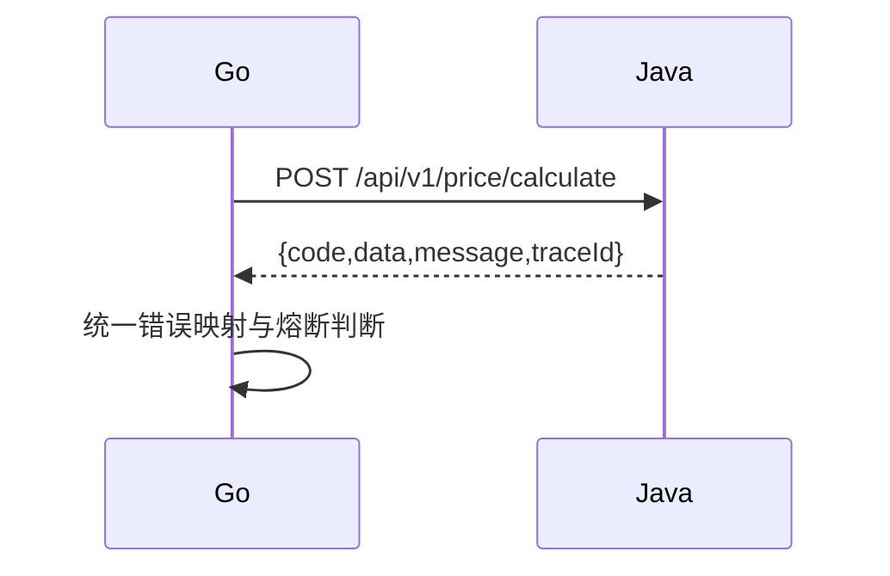

## 知识点拆解

| 小节 | 技术内容 | Java 视角切入 | 落地案例 |
| --- | --- | --- | --- |
| 6.1 | 跨语言通信标准设计：RESTful API/gRPC、数据格式对齐规则 | 对标 Java 既有实践，解释设计差异 | 价格计算平台中的对应环节 |
| 6.2 | Go 客户端调用 Java 服务：Resty 与 gRPC 两种方案 | 对标 Java 既有实践，解释设计差异 | 价格计算平台中的对应环节 |
| 6.3 | 工程级协同优化：连接池、超时重试、加密、容错 | 对标 Java 既有实践，解释设计差异 | 价格计算平台中的对应环节 |
| 6.4 | 跨语言联调排错：链路追踪、报文抓包、日志联动 | 对标 Java 既有实践，解释设计差异 | 价格计算平台中的对应环节 |

## 6.1 跨语言通信标准设计：RESTful API/gRPC、数据格式对齐规则

### Java 中我们通常怎么做

在 Java 技术体系里，这类问题往往通过成熟框架和约定解决：Spring Boot 提供自动配置，Spring MVC 提供注解式入口，Maven/Gradle 统一依赖管理，JUC 和线程池负责并发治理，Bean Validation 与统一异常处理负责边界校验。它的优势是团队认知稳定、生态完整、复杂业务建模能力强。

### Go 的对应设计

Go 的设计目标不完全等价于 Java。它更强调在特定场景下减少样板、降低运行时负担或提升反馈速度。学习时要把“语法差异”翻译成“工程边界差异”：谁负责启动，谁负责依赖，谁暴露错误，谁管理并发，谁承接接口契约。

### 全栈选型逻辑

如果该环节处在核心交易链路、需要复杂领域规则和强团队约束，优先留在 Java。如果该环节更接近流量入口、并发聚合、数据清洗、自动化或算法适配，就可以考虑由 Go 承担。真正的架构能力，是知道边界在哪里，而不是把所有能力塞进一种语言。

### Java 开发者容易踩的坑

1. 只按语法相似度迁移，不重新设计错误边界。
2. 把 Java 的分层模式机械搬过去，导致新语言项目也变得臃肿。
3. 忽略跨语言调用的超时、错误码、日志字段和版本兼容。
4. 学完语言特性却没有落到真实链路，无法形成可复用经验。

## 6.2 Go 客户端调用 Java 服务：Resty 与 gRPC 两种方案

### Java 中我们通常怎么做

在 Java 技术体系里，这类问题往往通过成熟框架和约定解决：Spring Boot 提供自动配置，Spring MVC 提供注解式入口，Maven/Gradle 统一依赖管理，JUC 和线程池负责并发治理，Bean Validation 与统一异常处理负责边界校验。它的优势是团队认知稳定、生态完整、复杂业务建模能力强。

### Go 的对应设计

Go 的设计目标不完全等价于 Java。它更强调在特定场景下减少样板、降低运行时负担或提升反馈速度。学习时要把“语法差异”翻译成“工程边界差异”：谁负责启动，谁负责依赖，谁暴露错误，谁管理并发，谁承接接口契约。

### 全栈选型逻辑

如果该环节处在核心交易链路、需要复杂领域规则和强团队约束，优先留在 Java。如果该环节更接近流量入口、并发聚合、数据清洗、自动化或算法适配，就可以考虑由 Go 承担。真正的架构能力，是知道边界在哪里，而不是把所有能力塞进一种语言。

### Java 开发者容易踩的坑

1. 只按语法相似度迁移，不重新设计错误边界。
2. 把 Java 的分层模式机械搬过去，导致新语言项目也变得臃肿。
3. 忽略跨语言调用的超时、错误码、日志字段和版本兼容。
4. 学完语言特性却没有落到真实链路，无法形成可复用经验。

## 6.3 工程级协同优化：连接池、超时重试、加密、容错

### Java 中我们通常怎么做

在 Java 技术体系里，这类问题往往通过成熟框架和约定解决：Spring Boot 提供自动配置，Spring MVC 提供注解式入口，Maven/Gradle 统一依赖管理，JUC 和线程池负责并发治理，Bean Validation 与统一异常处理负责边界校验。它的优势是团队认知稳定、生态完整、复杂业务建模能力强。

### Go 的对应设计

Go 的设计目标不完全等价于 Java。它更强调在特定场景下减少样板、降低运行时负担或提升反馈速度。学习时要把“语法差异”翻译成“工程边界差异”：谁负责启动，谁负责依赖，谁暴露错误，谁管理并发，谁承接接口契约。

### 全栈选型逻辑

如果该环节处在核心交易链路、需要复杂领域规则和强团队约束，优先留在 Java。如果该环节更接近流量入口、并发聚合、数据清洗、自动化或算法适配，就可以考虑由 Go 承担。真正的架构能力，是知道边界在哪里，而不是把所有能力塞进一种语言。

### Java 开发者容易踩的坑

1. 只按语法相似度迁移，不重新设计错误边界。
2. 把 Java 的分层模式机械搬过去，导致新语言项目也变得臃肿。
3. 忽略跨语言调用的超时、错误码、日志字段和版本兼容。
4. 学完语言特性却没有落到真实链路，无法形成可复用经验。

## 6.4 跨语言联调排错：链路追踪、报文抓包、日志联动

### Java 中我们通常怎么做

在 Java 技术体系里，这类问题往往通过成熟框架和约定解决：Spring Boot 提供自动配置，Spring MVC 提供注解式入口，Maven/Gradle 统一依赖管理，JUC 和线程池负责并发治理，Bean Validation 与统一异常处理负责边界校验。它的优势是团队认知稳定、生态完整、复杂业务建模能力强。

### Go 的对应设计

Go 的设计目标不完全等价于 Java。它更强调在特定场景下减少样板、降低运行时负担或提升反馈速度。学习时要把“语法差异”翻译成“工程边界差异”：谁负责启动，谁负责依赖，谁暴露错误，谁管理并发，谁承接接口契约。

### 全栈选型逻辑

如果该环节处在核心交易链路、需要复杂领域规则和强团队约束，优先留在 Java。如果该环节更接近流量入口、并发聚合、数据清洗、自动化或算法适配，就可以考虑由 Go 承担。真正的架构能力，是知道边界在哪里，而不是把所有能力塞进一种语言。

### Java 开发者容易踩的坑

1. 只按语法相似度迁移，不重新设计错误边界。
2. 把 Java 的分层模式机械搬过去，导致新语言项目也变得臃肿。
3. 忽略跨语言调用的超时、错误码、日志字段和版本兼容。
4. 学完语言特性却没有落到真实链路，无法形成可复用经验。


## 对比代码示例

```java
// Java: Spring MVC 风格的统一响应
public record ApiResponse<T>(int code, String message, T data, String traceId) {
    public static <T> ApiResponse<T> ok(T data, String traceId) {
        return new ApiResponse<>(0, "OK", data, traceId);
    }
}
```

```go
// Go: 与 Java ApiResponse 对齐的响应壳
type ApiResponse struct {
    Code    int         `json:"code"`
    Message string      `json:"message"`
    Data    interface{} `json:"data,omitempty"`
    TraceID string      `json:"traceId"`
}
```

```python
# Python: 与 Java DTO 对齐的分析入参
from dataclasses import dataclass

@dataclass
class PriceAnalysisRequest:
    sku: str
    base_price: float
    member_level: str
```

这三段代码共同表达同一件事：跨语言协同首先要统一契约。Java 的 record、Go 的 struct、Python 的 dataclass 都只是承载结构的方式，真正需要团队统一的是字段名称、错误码语义、traceId 传递方式和版本兼容策略。

## 章节综合案例：Go 网关转发请求到 Java 订单服务

跨语言通信首先统一协议，而不是先写调用代码。本书固定采用 `code/message/data/traceId` 响应壳、毫秒级超时字段、可追踪错误码，减少 Java 与 Go 的排错摩擦。

### 场景输入

用户请求某个 SKU 的实时价格，系统需要读取商品基础价、计算会员优惠、调用分析服务返回历史价格趋势与价格分数，最终对前端返回统一响应。

### 关键流程

1. 网关层校验请求头、生成 traceId、执行限流。
2. Java 核心服务计算价格，保证业务规则集中管理。
3. Python 分析服务处理历史数据，返回趋势、波动率、推荐分。
4. 所有服务按同一响应壳返回，日志中携带相同 traceId。

### 本章落地点

读者完成本章后，应能把 Go 与 Java 的协同通信机制 中的知识点放回企业项目链路里解释：这个能力解决什么问题，为什么不是 Java 独自承担，跨语言后要补上哪些工程治理。

## 本章小结

1. 本章的核心不是记住 Go 的单点语法，而是建立 Java 到 Go 的工程映射。
2. 多语言协同必须先统一接口契约、错误码、日志和超时策略。
3. 技术选型要跟业务链路绑定：入口治理、核心交易、数据辅助三类职责不能混在一起。
4. 所有章节案例最终都会汇入第 13 章的电商价格计算平台。

## 选型思考题

1. 如果把本章场景全部留在 Java，会获得什么稳定性，又会损失什么效率？
2. 如果把核心业务过度迁移到 Go，团队协作和故障排查会出现什么风险？
3. 你所在团队目前最适合先引入哪一个跨语言边界：网关、数据辅助，还是自动化脚本？

## 延伸阅读资源

1. Java 官方文档与 Spring Boot 参考文档：用于确认 Java 侧基础能力边界。
2. Go 官方文档或 Python 官方文档：用于校准语言基础概念。
3. OpenAPI 与 Protocol Buffers 文档：用于统一跨语言接口契约。
4. Docker Compose 文档：用于本地多服务联调。

## 第 6 章通信契约示例

```http
POST /api/v1/price/calculate
X-Trace-Id: trace-20260731-001
Content-Type: application/json

{"sku":"SKU-1001","memberLevel":"GOLD"}
```

```json
{
  "code": 0,
  "message": "OK",
  "data": {
    "sku": "SKU-1001",
    "basePriceCents": 129900,
    "finalPriceCents": 110415
  },
  "traceId": "trace-20260731-001"
}
```

Go 侧要把 Java 的 HTTP 状态、业务错误码、网络错误分开处理。不要把所有异常都折叠成 500，否则联调时很难判断是参数问题、业务失败，还是网络超时。

---

# 第 7 章 Go 在全栈架构下的落地场景实战

> 所属篇章：第二篇 Java 眼中的 Go 世界

**本章技术占比**：技术 50% + 引导 20% + 案例 30%

**前置 Java 知识映射**：Spring Cloud Gateway、Nginx、API 网关、服务发现、配置中心基础

## 本章导读

本章仍然从 Java 开发者熟悉的工程经验切入。你不需要把 Go 当作一门完全陌生的语言重新背语法，而是先回答三个问题：Java 中这件事通常怎么做，Go 为什么采用不同设计，这个差异在全栈协同场景下能带来什么收益或风险。

学习多语言不是为了增加技术栈标签，而是为了获得更细的架构分工能力。Java 继续承担复杂业务、一致性和团队协作沉淀；Go 更适合高并发入口、轻量网关和云原生组件；Python 更适合数据处理、自动化脚本和 AI 生态适配。判断标准始终是业务链路，而不是语言偏好。

## 技术地图

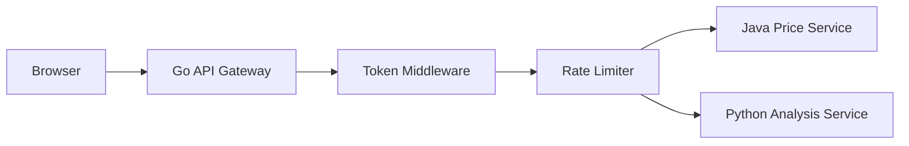

## 知识点拆解

| 小节 | 技术内容 | Java 视角切入 | 落地案例 |
| --- | --- | --- | --- |
| 7.1 | 高性能 API 网关：Go 承载前端流量并转发到 Java 服务 | 对标 Java 既有实践，解释设计差异 | 价格计算平台中的对应环节 |
| 7.2 | 高并发数据聚合层：Go 并行调用多个 Java 服务 | 对标 Java 既有实践，解释设计差异 | 价格计算平台中的对应环节 |
| 7.3 | 云原生基础组件：轻量配置中心、探针服务供 Java 调用 | 对标 Java 既有实践，解释设计差异 | 价格计算平台中的对应环节 |
| 7.4 | 章节综合案例：统一鉴权、流量控制、路由转发 | 对标 Java 既有实践，解释设计差异 | 价格计算平台中的对应环节 |

## 7.1 高性能 API 网关：Go 承载前端流量并转发到 Java 服务

### Java 中我们通常怎么做

在 Java 技术体系里，这类问题往往通过成熟框架和约定解决：Spring Boot 提供自动配置，Spring MVC 提供注解式入口，Maven/Gradle 统一依赖管理，JUC 和线程池负责并发治理，Bean Validation 与统一异常处理负责边界校验。它的优势是团队认知稳定、生态完整、复杂业务建模能力强。

### Go 的对应设计

Go 的设计目标不完全等价于 Java。它更强调在特定场景下减少样板、降低运行时负担或提升反馈速度。学习时要把“语法差异”翻译成“工程边界差异”：谁负责启动，谁负责依赖，谁暴露错误，谁管理并发，谁承接接口契约。

### 全栈选型逻辑

如果该环节处在核心交易链路、需要复杂领域规则和强团队约束，优先留在 Java。如果该环节更接近流量入口、并发聚合、数据清洗、自动化或算法适配，就可以考虑由 Go 承担。真正的架构能力，是知道边界在哪里，而不是把所有能力塞进一种语言。

### Java 开发者容易踩的坑

1. 只按语法相似度迁移，不重新设计错误边界。
2. 把 Java 的分层模式机械搬过去，导致新语言项目也变得臃肿。
3. 忽略跨语言调用的超时、错误码、日志字段和版本兼容。
4. 学完语言特性却没有落到真实链路，无法形成可复用经验。

## 7.2 高并发数据聚合层：Go 并行调用多个 Java 服务

### Java 中我们通常怎么做

在 Java 技术体系里，这类问题往往通过成熟框架和约定解决：Spring Boot 提供自动配置，Spring MVC 提供注解式入口，Maven/Gradle 统一依赖管理，JUC 和线程池负责并发治理，Bean Validation 与统一异常处理负责边界校验。它的优势是团队认知稳定、生态完整、复杂业务建模能力强。

### Go 的对应设计

Go 的设计目标不完全等价于 Java。它更强调在特定场景下减少样板、降低运行时负担或提升反馈速度。学习时要把“语法差异”翻译成“工程边界差异”：谁负责启动，谁负责依赖，谁暴露错误，谁管理并发，谁承接接口契约。

### 全栈选型逻辑

如果该环节处在核心交易链路、需要复杂领域规则和强团队约束，优先留在 Java。如果该环节更接近流量入口、并发聚合、数据清洗、自动化或算法适配，就可以考虑由 Go 承担。真正的架构能力，是知道边界在哪里，而不是把所有能力塞进一种语言。

### Java 开发者容易踩的坑

1. 只按语法相似度迁移，不重新设计错误边界。
2. 把 Java 的分层模式机械搬过去，导致新语言项目也变得臃肿。
3. 忽略跨语言调用的超时、错误码、日志字段和版本兼容。
4. 学完语言特性却没有落到真实链路，无法形成可复用经验。

## 7.3 云原生基础组件：轻量配置中心、探针服务供 Java 调用

### Java 中我们通常怎么做

在 Java 技术体系里，这类问题往往通过成熟框架和约定解决：Spring Boot 提供自动配置，Spring MVC 提供注解式入口，Maven/Gradle 统一依赖管理，JUC 和线程池负责并发治理，Bean Validation 与统一异常处理负责边界校验。它的优势是团队认知稳定、生态完整、复杂业务建模能力强。

### Go 的对应设计

Go 的设计目标不完全等价于 Java。它更强调在特定场景下减少样板、降低运行时负担或提升反馈速度。学习时要把“语法差异”翻译成“工程边界差异”：谁负责启动，谁负责依赖，谁暴露错误，谁管理并发，谁承接接口契约。

### 全栈选型逻辑

如果该环节处在核心交易链路、需要复杂领域规则和强团队约束，优先留在 Java。如果该环节更接近流量入口、并发聚合、数据清洗、自动化或算法适配，就可以考虑由 Go 承担。真正的架构能力，是知道边界在哪里，而不是把所有能力塞进一种语言。

### Java 开发者容易踩的坑

1. 只按语法相似度迁移，不重新设计错误边界。
2. 把 Java 的分层模式机械搬过去，导致新语言项目也变得臃肿。
3. 忽略跨语言调用的超时、错误码、日志字段和版本兼容。
4. 学完语言特性却没有落到真实链路，无法形成可复用经验。

## 7.4 章节综合案例：统一鉴权、流量控制、路由转发

### Java 中我们通常怎么做

在 Java 技术体系里，这类问题往往通过成熟框架和约定解决：Spring Boot 提供自动配置，Spring MVC 提供注解式入口，Maven/Gradle 统一依赖管理，JUC 和线程池负责并发治理，Bean Validation 与统一异常处理负责边界校验。它的优势是团队认知稳定、生态完整、复杂业务建模能力强。

### Go 的对应设计

Go 的设计目标不完全等价于 Java。它更强调在特定场景下减少样板、降低运行时负担或提升反馈速度。学习时要把“语法差异”翻译成“工程边界差异”：谁负责启动，谁负责依赖，谁暴露错误，谁管理并发，谁承接接口契约。

### 全栈选型逻辑

如果该环节处在核心交易链路、需要复杂领域规则和强团队约束，优先留在 Java。如果该环节更接近流量入口、并发聚合、数据清洗、自动化或算法适配，就可以考虑由 Go 承担。真正的架构能力，是知道边界在哪里，而不是把所有能力塞进一种语言。

### Java 开发者容易踩的坑

1. 只按语法相似度迁移，不重新设计错误边界。
2. 把 Java 的分层模式机械搬过去，导致新语言项目也变得臃肿。
3. 忽略跨语言调用的超时、错误码、日志字段和版本兼容。
4. 学完语言特性却没有落到真实链路，无法形成可复用经验。


## 对比代码示例

```java
// Java: Spring MVC 风格的统一响应
public record ApiResponse<T>(int code, String message, T data, String traceId) {
    public static <T> ApiResponse<T> ok(T data, String traceId) {
        return new ApiResponse<>(0, "OK", data, traceId);
    }
}
```

```go
// Go: 与 Java ApiResponse 对齐的响应壳
type ApiResponse struct {
    Code    int         `json:"code"`
    Message string      `json:"message"`
    Data    interface{} `json:"data,omitempty"`
    TraceID string      `json:"traceId"`
}
```

```python
# Python: 与 Java DTO 对齐的分析入参
from dataclasses import dataclass

@dataclass
class PriceAnalysisRequest:
    sku: str
    base_price: float
    member_level: str
```

这三段代码共同表达同一件事：跨语言协同首先要统一契约。Java 的 record、Go 的 struct、Python 的 dataclass 都只是承载结构的方式，真正需要团队统一的是字段名称、错误码语义、traceId 传递方式和版本兼容策略。

## 章节综合案例：基于 Go 的 API 网关简易实现

网关代码强调入口治理：请求 ID 注入、鉴权、限流、超时、下游错误映射。它不承载交易规则，避免把 Java 核心域逻辑搬到入口层导致职责漂移。

### 场景输入

用户请求某个 SKU 的实时价格，系统需要读取商品基础价、计算会员优惠、调用分析服务返回历史价格趋势与价格分数，最终对前端返回统一响应。

### 关键流程

1. 网关层校验请求头、生成 traceId、执行限流。
2. Java 核心服务计算价格，保证业务规则集中管理。
3. Python 分析服务处理历史数据，返回趋势、波动率、推荐分。
4. 所有服务按同一响应壳返回，日志中携带相同 traceId。

### 本章落地点

读者完成本章后，应能把 Go 在全栈架构下的落地场景实战 中的知识点放回企业项目链路里解释：这个能力解决什么问题，为什么不是 Java 独自承担，跨语言后要补上哪些工程治理。

## 本章小结

1. 本章的核心不是记住 Go 的单点语法，而是建立 Java 到 Go 的工程映射。
2. 多语言协同必须先统一接口契约、错误码、日志和超时策略。
3. 技术选型要跟业务链路绑定：入口治理、核心交易、数据辅助三类职责不能混在一起。
4. 所有章节案例最终都会汇入第 13 章的电商价格计算平台。

## 选型思考题

1. 如果把本章场景全部留在 Java，会获得什么稳定性，又会损失什么效率？
2. 如果把核心业务过度迁移到 Go，团队协作和故障排查会出现什么风险？
3. 你所在团队目前最适合先引入哪一个跨语言边界：网关、数据辅助，还是自动化脚本？

## 延伸阅读资源

1. Java 官方文档与 Spring Boot 参考文档：用于确认 Java 侧基础能力边界。
2. Go 官方文档或 Python 官方文档：用于校准语言基础概念。
3. OpenAPI 与 Protocol Buffers 文档：用于统一跨语言接口契约。
4. Docker Compose 文档：用于本地多服务联调。

## 第 7 章网关职责边界

Go 网关可以做：

1. 统一鉴权、限流、traceId 注入。
2. 对 Java/Python 下游做超时隔离。
3. 聚合多个只读接口，减少前端请求次数。
4. 将下游错误映射成统一响应。

Go 网关不应该做：

1. 维护订单状态。
2. 计算复杂优惠规则。
3. 直接写核心交易数据库。
4. 绕过 Java 服务调用 Python 修改业务结果。

这个边界一旦写清楚，多语言架构就会变得可控。

---

# 第 8 章 Python 基础语法：与 Java 的核心差异映射

> 所属篇章：第三篇 Java 眼中的 Python 世界

**本章技术占比**：技术 50% + 引导 20% + 案例 30%

**前置 Java 知识映射**：Java 类型系统、集合框架、注解、异常、IO、Jackson JSON 处理

## 本章导读

本章仍然从 Java 开发者熟悉的工程经验切入。你不需要把 Python 当作一门完全陌生的语言重新背语法，而是先回答三个问题：Java 中这件事通常怎么做，Python 为什么采用不同设计，这个差异在全栈协同场景下能带来什么收益或风险。

学习多语言不是为了增加技术栈标签，而是为了获得更细的架构分工能力。Java 继续承担复杂业务、一致性和团队协作沉淀；Go 更适合高并发入口、轻量网关和云原生组件；Python 更适合数据处理、自动化脚本和 AI 生态适配。判断标准始终是业务链路，而不是语言偏好。

## 技术地图

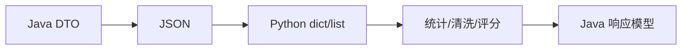

## 知识点拆解

| 小节 | 技术内容 | Java 视角切入 | 落地案例 |
| --- | --- | --- | --- |
| 8.1 | 工程化差异：虚拟环境、pip 依赖管理 vs Maven/Gradle | 对标 Java 既有实践，解释设计差异 | 价格计算平台中的对应环节 |
| 8.2 | 基础语法对比：动态类型、鸭子类型、装饰器 vs 静态类型与注解 | 对标 Java 既有实践，解释设计差异 | 价格计算平台中的对应环节 |
| 8.3 | 集合类型差异：list/dict/set vs List/Map/Set | 对标 Java 既有实践，解释设计差异 | 价格计算平台中的对应环节 |
| 8.4 | 异常处理与文件操作：Python 简化实现 vs Java IO 与 try-catch | 对标 Java 既有实践，解释设计差异 | 价格计算平台中的对应环节 |

## 8.1 工程化差异：虚拟环境、pip 依赖管理 vs Maven/Gradle

### Java 中我们通常怎么做

在 Java 技术体系里，这类问题往往通过成熟框架和约定解决：Spring Boot 提供自动配置，Spring MVC 提供注解式入口，Maven/Gradle 统一依赖管理，JUC 和线程池负责并发治理，Bean Validation 与统一异常处理负责边界校验。它的优势是团队认知稳定、生态完整、复杂业务建模能力强。

### Python 的对应设计

Python 的设计目标不完全等价于 Java。它更强调在特定场景下减少样板、降低运行时负担或提升反馈速度。学习时要把“语法差异”翻译成“工程边界差异”：谁负责启动，谁负责依赖，谁暴露错误，谁管理并发，谁承接接口契约。

### 全栈选型逻辑

如果该环节处在核心交易链路、需要复杂领域规则和强团队约束，优先留在 Java。如果该环节更接近流量入口、并发聚合、数据清洗、自动化或算法适配，就可以考虑由 Python 承担。真正的架构能力，是知道边界在哪里，而不是把所有能力塞进一种语言。

### Java 开发者容易踩的坑

1. 只按语法相似度迁移，不重新设计错误边界。
2. 把 Java 的分层模式机械搬过去，导致新语言项目也变得臃肿。
3. 忽略跨语言调用的超时、错误码、日志字段和版本兼容。
4. 学完语言特性却没有落到真实链路，无法形成可复用经验。

## 8.2 基础语法对比：动态类型、鸭子类型、装饰器 vs 静态类型与注解

### Java 中我们通常怎么做

在 Java 技术体系里，这类问题往往通过成熟框架和约定解决：Spring Boot 提供自动配置，Spring MVC 提供注解式入口，Maven/Gradle 统一依赖管理，JUC 和线程池负责并发治理，Bean Validation 与统一异常处理负责边界校验。它的优势是团队认知稳定、生态完整、复杂业务建模能力强。

### Python 的对应设计

Python 的设计目标不完全等价于 Java。它更强调在特定场景下减少样板、降低运行时负担或提升反馈速度。学习时要把“语法差异”翻译成“工程边界差异”：谁负责启动，谁负责依赖，谁暴露错误，谁管理并发，谁承接接口契约。

### 全栈选型逻辑

如果该环节处在核心交易链路、需要复杂领域规则和强团队约束，优先留在 Java。如果该环节更接近流量入口、并发聚合、数据清洗、自动化或算法适配，就可以考虑由 Python 承担。真正的架构能力，是知道边界在哪里，而不是把所有能力塞进一种语言。

### Java 开发者容易踩的坑

1. 只按语法相似度迁移，不重新设计错误边界。
2. 把 Java 的分层模式机械搬过去，导致新语言项目也变得臃肿。
3. 忽略跨语言调用的超时、错误码、日志字段和版本兼容。
4. 学完语言特性却没有落到真实链路，无法形成可复用经验。

## 8.3 集合类型差异：list/dict/set vs List/Map/Set

### Java 中我们通常怎么做

在 Java 技术体系里，这类问题往往通过成熟框架和约定解决：Spring Boot 提供自动配置，Spring MVC 提供注解式入口，Maven/Gradle 统一依赖管理，JUC 和线程池负责并发治理，Bean Validation 与统一异常处理负责边界校验。它的优势是团队认知稳定、生态完整、复杂业务建模能力强。

### Python 的对应设计

Python 的设计目标不完全等价于 Java。它更强调在特定场景下减少样板、降低运行时负担或提升反馈速度。学习时要把“语法差异”翻译成“工程边界差异”：谁负责启动，谁负责依赖，谁暴露错误，谁管理并发，谁承接接口契约。

### 全栈选型逻辑

如果该环节处在核心交易链路、需要复杂领域规则和强团队约束，优先留在 Java。如果该环节更接近流量入口、并发聚合、数据清洗、自动化或算法适配，就可以考虑由 Python 承担。真正的架构能力，是知道边界在哪里，而不是把所有能力塞进一种语言。

### Java 开发者容易踩的坑

1. 只按语法相似度迁移，不重新设计错误边界。
2. 把 Java 的分层模式机械搬过去，导致新语言项目也变得臃肿。
3. 忽略跨语言调用的超时、错误码、日志字段和版本兼容。
4. 学完语言特性却没有落到真实链路，无法形成可复用经验。

## 8.4 异常处理与文件操作：Python 简化实现 vs Java IO 与 try-catch

### Java 中我们通常怎么做

在 Java 技术体系里，这类问题往往通过成熟框架和约定解决：Spring Boot 提供自动配置，Spring MVC 提供注解式入口，Maven/Gradle 统一依赖管理，JUC 和线程池负责并发治理，Bean Validation 与统一异常处理负责边界校验。它的优势是团队认知稳定、生态完整、复杂业务建模能力强。

### Python 的对应设计

Python 的设计目标不完全等价于 Java。它更强调在特定场景下减少样板、降低运行时负担或提升反馈速度。学习时要把“语法差异”翻译成“工程边界差异”：谁负责启动，谁负责依赖，谁暴露错误，谁管理并发，谁承接接口契约。

### 全栈选型逻辑

如果该环节处在核心交易链路、需要复杂领域规则和强团队约束，优先留在 Java。如果该环节更接近流量入口、并发聚合、数据清洗、自动化或算法适配，就可以考虑由 Python 承担。真正的架构能力，是知道边界在哪里，而不是把所有能力塞进一种语言。

### Java 开发者容易踩的坑

1. 只按语法相似度迁移，不重新设计错误边界。
2. 把 Java 的分层模式机械搬过去，导致新语言项目也变得臃肿。
3. 忽略跨语言调用的超时、错误码、日志字段和版本兼容。
4. 学完语言特性却没有落到真实链路，无法形成可复用经验。


## 对比代码示例

```java
// Java: Spring MVC 风格的统一响应
public record ApiResponse<T>(int code, String message, T data, String traceId) {
    public static <T> ApiResponse<T> ok(T data, String traceId) {
        return new ApiResponse<>(0, "OK", data, traceId);
    }
}
```

```go
// Go: 与 Java ApiResponse 对齐的响应壳
type ApiResponse struct {
    Code    int         `json:"code"`
    Message string      `json:"message"`
    Data    interface{} `json:"data,omitempty"`
    TraceID string      `json:"traceId"`
}
```

```python
# Python: 与 Java DTO 对齐的分析入参
from dataclasses import dataclass

@dataclass
class PriceAnalysisRequest:
    sku: str
    base_price: float
    member_level: str
```

这三段代码共同表达同一件事：跨语言协同首先要统一契约。Java 的 record、Go 的 struct、Python 的 dataclass 都只是承载结构的方式，真正需要团队统一的是字段名称、错误码语义、traceId 传递方式和版本兼容策略。

## 章节综合案例：JSON 数据处理工具：Java 代码 vs Python 代码

Python 的优势不在大型领域模型，而在快速处理半结构化数据。Java 开发者要学会把 Python 作为数据辅助层，而不是把核心交易状态迁移过去。

### 场景输入

用户请求某个 SKU 的实时价格，系统需要读取商品基础价、计算会员优惠、调用分析服务返回历史价格趋势与价格分数，最终对前端返回统一响应。

### 关键流程

1. 网关层校验请求头、生成 traceId、执行限流。
2. Java 核心服务计算价格，保证业务规则集中管理。
3. Python 分析服务处理历史数据，返回趋势、波动率、推荐分。
4. 所有服务按同一响应壳返回，日志中携带相同 traceId。

### 本章落地点

读者完成本章后，应能把 Python 基础语法：与 Java 的核心差异映射 中的知识点放回企业项目链路里解释：这个能力解决什么问题，为什么不是 Java 独自承担，跨语言后要补上哪些工程治理。

## 本章小结

1. 本章的核心不是记住 Python 的单点语法，而是建立 Java 到 Python 的工程映射。
2. 多语言协同必须先统一接口契约、错误码、日志和超时策略。
3. 技术选型要跟业务链路绑定：入口治理、核心交易、数据辅助三类职责不能混在一起。
4. 所有章节案例最终都会汇入第 13 章的电商价格计算平台。

## 选型思考题

1. 如果把本章场景全部留在 Java，会获得什么稳定性，又会损失什么效率？
2. 如果把核心业务过度迁移到 Python，团队协作和故障排查会出现什么风险？
3. 你所在团队目前最适合先引入哪一个跨语言边界：网关、数据辅助，还是自动化脚本？

## 延伸阅读资源

1. Java 官方文档与 Spring Boot 参考文档：用于确认 Java 侧基础能力边界。
2. Go 官方文档或 Python 官方文档：用于校准语言基础概念。
3. OpenAPI 与 Protocol Buffers 文档：用于统一跨语言接口契约。
4. Docker Compose 文档：用于本地多服务联调。

## 第 8 章 Python 数据处理范式

Java 开发者看到 Python 的动态类型时，容易误以为它“不适合工程化”。更准确的理解是：Python 适合在边界清楚的输入输出内快速处理数据。

```python
def score_price(base_price_cents: int, final_price_cents: int) -> int:
    discount = final_price_cents / base_price_cents
    if discount <= 0.85:
        return 92
    if discount <= 0.95:
        return 84
    return 70
```

类型提示不是强制运行时约束，但能帮助 IDE、审查和团队协作。面向 Java 团队交付 Python 服务时，应把类型提示、单元测试和接口契约作为最低工程标准。

---

# 第 9 章 Python Web 框架：对标 Spring Boot 的技术映射

> 所属篇章：第三篇 Java 眼中的 Python 世界

**本章技术占比**：技术 50% + 引导 20% + 案例 30%

**前置 Java 知识映射**：Spring Boot 自动配置、Spring MVC 参数校验、JPA、第三方 SDK 集成

## 本章导读

本章仍然从 Java 开发者熟悉的工程经验切入。你不需要把 Python 当作一门完全陌生的语言重新背语法，而是先回答三个问题：Java 中这件事通常怎么做，Python 为什么采用不同设计，这个差异在全栈协同场景下能带来什么收益或风险。

学习多语言不是为了增加技术栈标签，而是为了获得更细的架构分工能力。Java 继续承担复杂业务、一致性和团队协作沉淀；Go 更适合高并发入口、轻量网关和云原生组件；Python 更适合数据处理、自动化脚本和 AI 生态适配。判断标准始终是业务链路，而不是语言偏好。

## 技术地图

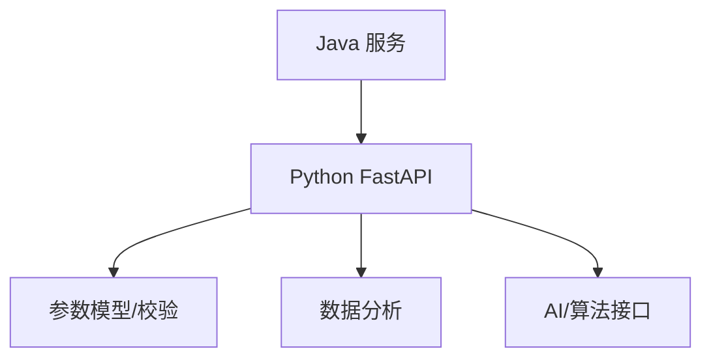

## 知识点拆解

| 小节 | 技术内容 | Java 视角切入 | 落地案例 |
| --- | --- | --- | --- |
| 9.1 | 轻量级框架选择：Flask/FastAPI 核心设计 vs Spring Boot 自动配置 | 对标 Java 既有实践，解释设计差异 | 价格计算平台中的对应环节 |
| 9.2 | 请求/响应处理：参数校验、统一响应封装 vs Spring MVC 注解 | 对标 Java 既有实践，解释设计差异 | 价格计算平台中的对应环节 |
| 9.3 | 数据访问层：SQLAlchemy CRUD、关联查询 vs Spring Data JPA | 对标 Java 既有实践，解释设计差异 | 价格计算平台中的对应环节 |
| 9.4 | 生态集成：数据分析库、AI 模型接口 vs Java 第三方库 | 对标 Java 既有实践，解释设计差异 | 价格计算平台中的对应环节 |

## 9.1 轻量级框架选择：Flask/FastAPI 核心设计 vs Spring Boot 自动配置

### Java 中我们通常怎么做

在 Java 技术体系里，这类问题往往通过成熟框架和约定解决：Spring Boot 提供自动配置，Spring MVC 提供注解式入口，Maven/Gradle 统一依赖管理，JUC 和线程池负责并发治理，Bean Validation 与统一异常处理负责边界校验。它的优势是团队认知稳定、生态完整、复杂业务建模能力强。

### Python 的对应设计

Python 的设计目标不完全等价于 Java。它更强调在特定场景下减少样板、降低运行时负担或提升反馈速度。学习时要把“语法差异”翻译成“工程边界差异”：谁负责启动，谁负责依赖，谁暴露错误，谁管理并发，谁承接接口契约。

### 全栈选型逻辑

如果该环节处在核心交易链路、需要复杂领域规则和强团队约束，优先留在 Java。如果该环节更接近流量入口、并发聚合、数据清洗、自动化或算法适配，就可以考虑由 Python 承担。真正的架构能力，是知道边界在哪里，而不是把所有能力塞进一种语言。

### Java 开发者容易踩的坑

1. 只按语法相似度迁移，不重新设计错误边界。
2. 把 Java 的分层模式机械搬过去，导致新语言项目也变得臃肿。
3. 忽略跨语言调用的超时、错误码、日志字段和版本兼容。
4. 学完语言特性却没有落到真实链路，无法形成可复用经验。

## 9.2 请求/响应处理：参数校验、统一响应封装 vs Spring MVC 注解

### Java 中我们通常怎么做

在 Java 技术体系里，这类问题往往通过成熟框架和约定解决：Spring Boot 提供自动配置，Spring MVC 提供注解式入口，Maven/Gradle 统一依赖管理，JUC 和线程池负责并发治理，Bean Validation 与统一异常处理负责边界校验。它的优势是团队认知稳定、生态完整、复杂业务建模能力强。

### Python 的对应设计

Python 的设计目标不完全等价于 Java。它更强调在特定场景下减少样板、降低运行时负担或提升反馈速度。学习时要把“语法差异”翻译成“工程边界差异”：谁负责启动，谁负责依赖，谁暴露错误，谁管理并发，谁承接接口契约。

### 全栈选型逻辑

如果该环节处在核心交易链路、需要复杂领域规则和强团队约束，优先留在 Java。如果该环节更接近流量入口、并发聚合、数据清洗、自动化或算法适配，就可以考虑由 Python 承担。真正的架构能力，是知道边界在哪里，而不是把所有能力塞进一种语言。

### Java 开发者容易踩的坑

1. 只按语法相似度迁移，不重新设计错误边界。
2. 把 Java 的分层模式机械搬过去，导致新语言项目也变得臃肿。
3. 忽略跨语言调用的超时、错误码、日志字段和版本兼容。
4. 学完语言特性却没有落到真实链路，无法形成可复用经验。

## 9.3 数据访问层：SQLAlchemy CRUD、关联查询 vs Spring Data JPA

### Java 中我们通常怎么做

在 Java 技术体系里，这类问题往往通过成熟框架和约定解决：Spring Boot 提供自动配置，Spring MVC 提供注解式入口，Maven/Gradle 统一依赖管理，JUC 和线程池负责并发治理，Bean Validation 与统一异常处理负责边界校验。它的优势是团队认知稳定、生态完整、复杂业务建模能力强。

### Python 的对应设计

Python 的设计目标不完全等价于 Java。它更强调在特定场景下减少样板、降低运行时负担或提升反馈速度。学习时要把“语法差异”翻译成“工程边界差异”：谁负责启动，谁负责依赖，谁暴露错误，谁管理并发，谁承接接口契约。

### 全栈选型逻辑

如果该环节处在核心交易链路、需要复杂领域规则和强团队约束，优先留在 Java。如果该环节更接近流量入口、并发聚合、数据清洗、自动化或算法适配，就可以考虑由 Python 承担。真正的架构能力，是知道边界在哪里，而不是把所有能力塞进一种语言。

### Java 开发者容易踩的坑

1. 只按语法相似度迁移，不重新设计错误边界。
2. 把 Java 的分层模式机械搬过去，导致新语言项目也变得臃肿。
3. 忽略跨语言调用的超时、错误码、日志字段和版本兼容。
4. 学完语言特性却没有落到真实链路，无法形成可复用经验。

## 9.4 生态集成：数据分析库、AI 模型接口 vs Java 第三方库

### Java 中我们通常怎么做

在 Java 技术体系里，这类问题往往通过成熟框架和约定解决：Spring Boot 提供自动配置，Spring MVC 提供注解式入口，Maven/Gradle 统一依赖管理，JUC 和线程池负责并发治理，Bean Validation 与统一异常处理负责边界校验。它的优势是团队认知稳定、生态完整、复杂业务建模能力强。

### Python 的对应设计

Python 的设计目标不完全等价于 Java。它更强调在特定场景下减少样板、降低运行时负担或提升反馈速度。学习时要把“语法差异”翻译成“工程边界差异”：谁负责启动，谁负责依赖，谁暴露错误，谁管理并发，谁承接接口契约。

### 全栈选型逻辑

如果该环节处在核心交易链路、需要复杂领域规则和强团队约束，优先留在 Java。如果该环节更接近流量入口、并发聚合、数据清洗、自动化或算法适配，就可以考虑由 Python 承担。真正的架构能力，是知道边界在哪里，而不是把所有能力塞进一种语言。

### Java 开发者容易踩的坑

1. 只按语法相似度迁移，不重新设计错误边界。
2. 把 Java 的分层模式机械搬过去，导致新语言项目也变得臃肿。
3. 忽略跨语言调用的超时、错误码、日志字段和版本兼容。
4. 学完语言特性却没有落到真实链路，无法形成可复用经验。


## 对比代码示例

```java
// Java: Spring MVC 风格的统一响应
public record ApiResponse<T>(int code, String message, T data, String traceId) {
    public static <T> ApiResponse<T> ok(T data, String traceId) {
        return new ApiResponse<>(0, "OK", data, traceId);
    }
}
```

```go
// Go: 与 Java ApiResponse 对齐的响应壳
type ApiResponse struct {
    Code    int         `json:"code"`
    Message string      `json:"message"`
    Data    interface{} `json:"data,omitempty"`
    TraceID string      `json:"traceId"`
}
```

```python
# Python: 与 Java DTO 对齐的分析入参
from dataclasses import dataclass

@dataclass
class PriceAnalysisRequest:
    sku: str
    base_price: float
    member_level: str
```

这三段代码共同表达同一件事：跨语言协同首先要统一契约。Java 的 record、Go 的 struct、Python 的 dataclass 都只是承载结构的方式，真正需要团队统一的是字段名称、错误码语义、traceId 传递方式和版本兼容策略。

## 章节综合案例：FastAPI 搭建商品价格分析接口

FastAPI 的模型校验对标 Spring MVC + Bean Validation，但它更适合表达数据计算接口。Java 服务只需要按契约调用，不需要知道 Python 内部使用 Pandas、NumPy 还是模型 SDK。

### 场景输入

用户请求某个 SKU 的实时价格，系统需要读取商品基础价、计算会员优惠、调用分析服务返回历史价格趋势与价格分数，最终对前端返回统一响应。

### 关键流程

1. 网关层校验请求头、生成 traceId、执行限流。
2. Java 核心服务计算价格，保证业务规则集中管理。
3. Python 分析服务处理历史数据，返回趋势、波动率、推荐分。
4. 所有服务按同一响应壳返回，日志中携带相同 traceId。

### 本章落地点

读者完成本章后，应能把 Python Web 框架：对标 Spring Boot 的技术映射 中的知识点放回企业项目链路里解释：这个能力解决什么问题，为什么不是 Java 独自承担，跨语言后要补上哪些工程治理。

## 本章小结

1. 本章的核心不是记住 Python 的单点语法，而是建立 Java 到 Python 的工程映射。
2. 多语言协同必须先统一接口契约、错误码、日志和超时策略。
3. 技术选型要跟业务链路绑定：入口治理、核心交易、数据辅助三类职责不能混在一起。
4. 所有章节案例最终都会汇入第 13 章的电商价格计算平台。

## 选型思考题

1. 如果把本章场景全部留在 Java，会获得什么稳定性，又会损失什么效率？
2. 如果把核心业务过度迁移到 Python，团队协作和故障排查会出现什么风险？
3. 你所在团队目前最适合先引入哪一个跨语言边界：网关、数据辅助，还是自动化脚本？

## 延伸阅读资源

1. Java 官方文档与 Spring Boot 参考文档：用于确认 Java 侧基础能力边界。
2. Go 官方文档或 Python 官方文档：用于校准语言基础概念。
3. OpenAPI 与 Protocol Buffers 文档：用于统一跨语言接口契约。
4. Docker Compose 文档：用于本地多服务联调。

## 第 9 章 FastAPI 对标 Spring Boot

FastAPI 的自动 OpenAPI 文档，对 Java 团队很友好，因为它让 Python 服务不再是“脚本接口黑盒”。Pydantic 模型相当于 DTO + Bean Validation 的组合。

```python
from pydantic import BaseModel, Field

class AnalyzeRequest(BaseModel):
    sku: str = Field(min_length=1)
    basePriceCents: int = Field(gt=0)
    finalPriceCents: int = Field(gt=0)
```

生产落地时，Python 服务仍需统一响应壳、traceId、超时、缓存和降级，不要因为框架轻量就省掉工程治理。

---

# 第 10 章 Python 与 Java 的协同通信机制

> 所属篇章：第三篇 Java 眼中的 Python 世界

**本章技术占比**：技术 50% + 引导 20% + 案例 30%

**前置 Java 知识映射**：Java HTTP 客户端、OpenFeign、线程池隔离、缓存、服务降级

## 本章导读

本章仍然从 Java 开发者熟悉的工程经验切入。你不需要把 Python 当作一门完全陌生的语言重新背语法，而是先回答三个问题：Java 中这件事通常怎么做，Python 为什么采用不同设计，这个差异在全栈协同场景下能带来什么收益或风险。

学习多语言不是为了增加技术栈标签，而是为了获得更细的架构分工能力。Java 继续承担复杂业务、一致性和团队协作沉淀；Go 更适合高并发入口、轻量网关和云原生组件；Python 更适合数据处理、自动化脚本和 AI 生态适配。判断标准始终是业务链路，而不是语言偏好。

## 技术地图

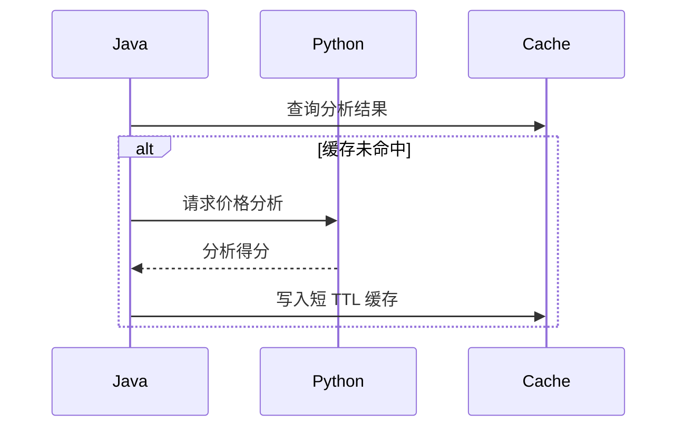

## 知识点拆解

| 小节 | 技术内容 | Java 视角切入 | 落地案例 |
| --- | --- | --- | --- |
| 10.1 | 跨语言通信场景：Python 作为数据辅助层被 Java 调用 | 对标 Java 既有实践，解释设计差异 | 价格计算平台中的对应环节 |
| 10.2 | Java 调用 Python 服务：RESTful API 与 gRPC | 对标 Java 既有实践，解释设计差异 | 价格计算平台中的对应环节 |
| 10.3 | 高性能集成：Py4J/JPype 的进程内调用边界 | 对标 Java 既有实践，解释设计差异 | 价格计算平台中的对应环节 |
| 10.4 | 工程级协同优化：限流、缓存、异步调用、服务降级 | 对标 Java 既有实践，解释设计差异 | 价格计算平台中的对应环节 |

## 10.1 跨语言通信场景：Python 作为数据辅助层被 Java 调用

### Java 中我们通常怎么做

在 Java 技术体系里，这类问题往往通过成熟框架和约定解决：Spring Boot 提供自动配置，Spring MVC 提供注解式入口，Maven/Gradle 统一依赖管理，JUC 和线程池负责并发治理，Bean Validation 与统一异常处理负责边界校验。它的优势是团队认知稳定、生态完整、复杂业务建模能力强。

### Python 的对应设计

Python 的设计目标不完全等价于 Java。它更强调在特定场景下减少样板、降低运行时负担或提升反馈速度。学习时要把“语法差异”翻译成“工程边界差异”：谁负责启动，谁负责依赖，谁暴露错误，谁管理并发，谁承接接口契约。

### 全栈选型逻辑

如果该环节处在核心交易链路、需要复杂领域规则和强团队约束，优先留在 Java。如果该环节更接近流量入口、并发聚合、数据清洗、自动化或算法适配，就可以考虑由 Python 承担。真正的架构能力，是知道边界在哪里，而不是把所有能力塞进一种语言。

### Java 开发者容易踩的坑

1. 只按语法相似度迁移，不重新设计错误边界。
2. 把 Java 的分层模式机械搬过去，导致新语言项目也变得臃肿。
3. 忽略跨语言调用的超时、错误码、日志字段和版本兼容。
4. 学完语言特性却没有落到真实链路，无法形成可复用经验。

## 10.2 Java 调用 Python 服务：RESTful API 与 gRPC

### Java 中我们通常怎么做

在 Java 技术体系里，这类问题往往通过成熟框架和约定解决：Spring Boot 提供自动配置，Spring MVC 提供注解式入口，Maven/Gradle 统一依赖管理，JUC 和线程池负责并发治理，Bean Validation 与统一异常处理负责边界校验。它的优势是团队认知稳定、生态完整、复杂业务建模能力强。

### Python 的对应设计

Python 的设计目标不完全等价于 Java。它更强调在特定场景下减少样板、降低运行时负担或提升反馈速度。学习时要把“语法差异”翻译成“工程边界差异”：谁负责启动，谁负责依赖，谁暴露错误，谁管理并发，谁承接接口契约。

### 全栈选型逻辑

如果该环节处在核心交易链路、需要复杂领域规则和强团队约束，优先留在 Java。如果该环节更接近流量入口、并发聚合、数据清洗、自动化或算法适配，就可以考虑由 Python 承担。真正的架构能力，是知道边界在哪里，而不是把所有能力塞进一种语言。

### Java 开发者容易踩的坑

1. 只按语法相似度迁移，不重新设计错误边界。
2. 把 Java 的分层模式机械搬过去，导致新语言项目也变得臃肿。
3. 忽略跨语言调用的超时、错误码、日志字段和版本兼容。
4. 学完语言特性却没有落到真实链路，无法形成可复用经验。

## 10.3 高性能集成：Py4J/JPype 的进程内调用边界

### Java 中我们通常怎么做

在 Java 技术体系里，这类问题往往通过成熟框架和约定解决：Spring Boot 提供自动配置，Spring MVC 提供注解式入口，Maven/Gradle 统一依赖管理，JUC 和线程池负责并发治理，Bean Validation 与统一异常处理负责边界校验。它的优势是团队认知稳定、生态完整、复杂业务建模能力强。

### Python 的对应设计

Python 的设计目标不完全等价于 Java。它更强调在特定场景下减少样板、降低运行时负担或提升反馈速度。学习时要把“语法差异”翻译成“工程边界差异”：谁负责启动，谁负责依赖，谁暴露错误，谁管理并发，谁承接接口契约。

### 全栈选型逻辑

如果该环节处在核心交易链路、需要复杂领域规则和强团队约束，优先留在 Java。如果该环节更接近流量入口、并发聚合、数据清洗、自动化或算法适配，就可以考虑由 Python 承担。真正的架构能力，是知道边界在哪里，而不是把所有能力塞进一种语言。

### Java 开发者容易踩的坑

1. 只按语法相似度迁移，不重新设计错误边界。
2. 把 Java 的分层模式机械搬过去，导致新语言项目也变得臃肿。
3. 忽略跨语言调用的超时、错误码、日志字段和版本兼容。
4. 学完语言特性却没有落到真实链路，无法形成可复用经验。

## 10.4 工程级协同优化：限流、缓存、异步调用、服务降级

### Java 中我们通常怎么做

在 Java 技术体系里，这类问题往往通过成熟框架和约定解决：Spring Boot 提供自动配置，Spring MVC 提供注解式入口，Maven/Gradle 统一依赖管理，JUC 和线程池负责并发治理，Bean Validation 与统一异常处理负责边界校验。它的优势是团队认知稳定、生态完整、复杂业务建模能力强。

### Python 的对应设计

Python 的设计目标不完全等价于 Java。它更强调在特定场景下减少样板、降低运行时负担或提升反馈速度。学习时要把“语法差异”翻译成“工程边界差异”：谁负责启动，谁负责依赖，谁暴露错误，谁管理并发，谁承接接口契约。

### 全栈选型逻辑

如果该环节处在核心交易链路、需要复杂领域规则和强团队约束，优先留在 Java。如果该环节更接近流量入口、并发聚合、数据清洗、自动化或算法适配，就可以考虑由 Python 承担。真正的架构能力，是知道边界在哪里，而不是把所有能力塞进一种语言。

### Java 开发者容易踩的坑

1. 只按语法相似度迁移，不重新设计错误边界。
2. 把 Java 的分层模式机械搬过去，导致新语言项目也变得臃肿。
3. 忽略跨语言调用的超时、错误码、日志字段和版本兼容。
4. 学完语言特性却没有落到真实链路，无法形成可复用经验。


## 对比代码示例

```java
// Java: Spring MVC 风格的统一响应
public record ApiResponse<T>(int code, String message, T data, String traceId) {
    public static <T> ApiResponse<T> ok(T data, String traceId) {
        return new ApiResponse<>(0, "OK", data, traceId);
    }
}
```

```go
// Go: 与 Java ApiResponse 对齐的响应壳
type ApiResponse struct {
    Code    int         `json:"code"`
    Message string      `json:"message"`
    Data    interface{} `json:"data,omitempty"`
    TraceID string      `json:"traceId"`
}
```

```python
# Python: 与 Java DTO 对齐的分析入参
from dataclasses import dataclass

@dataclass
class PriceAnalysisRequest:
    sku: str
    base_price: float
    member_level: str
```

这三段代码共同表达同一件事：跨语言协同首先要统一契约。Java 的 record、Go 的 struct、Python 的 dataclass 都只是承载结构的方式，真正需要团队统一的是字段名称、错误码语义、traceId 传递方式和版本兼容策略。

## 章节综合案例：Java 优惠规则服务调用 Python 价格分析接口

Java 调用 Python 的关键是隔离：超时短、失败可降级、结果可缓存、错误可观测。Python 适合辅助判断，不适合阻塞核心交易链路太久。

### 场景输入

用户请求某个 SKU 的实时价格，系统需要读取商品基础价、计算会员优惠、调用分析服务返回历史价格趋势与价格分数，最终对前端返回统一响应。

### 关键流程

1. 网关层校验请求头、生成 traceId、执行限流。
2. Java 核心服务计算价格，保证业务规则集中管理。
3. Python 分析服务处理历史数据，返回趋势、波动率、推荐分。
4. 所有服务按同一响应壳返回，日志中携带相同 traceId。

### 本章落地点

读者完成本章后，应能把 Python 与 Java 的协同通信机制 中的知识点放回企业项目链路里解释：这个能力解决什么问题，为什么不是 Java 独自承担，跨语言后要补上哪些工程治理。

## 本章小结

1. 本章的核心不是记住 Python 的单点语法，而是建立 Java 到 Python 的工程映射。
2. 多语言协同必须先统一接口契约、错误码、日志和超时策略。
3. 技术选型要跟业务链路绑定：入口治理、核心交易、数据辅助三类职责不能混在一起。
4. 所有章节案例最终都会汇入第 13 章的电商价格计算平台。

## 选型思考题

1. 如果把本章场景全部留在 Java，会获得什么稳定性，又会损失什么效率？
2. 如果把核心业务过度迁移到 Python，团队协作和故障排查会出现什么风险？
3. 你所在团队目前最适合先引入哪一个跨语言边界：网关、数据辅助，还是自动化脚本？

## 延伸阅读资源

1. Java 官方文档与 Spring Boot 参考文档：用于确认 Java 侧基础能力边界。
2. Go 官方文档或 Python 官方文档：用于校准语言基础概念。
3. OpenAPI 与 Protocol Buffers 文档：用于统一跨语言接口契约。
4. Docker Compose 文档：用于本地多服务联调。

## 第 10 章 Java 调 Python 的保护策略

| 风险 | 保护策略 |
| --- | --- |
| Python 分析慢 | Java 侧 300-800ms 超时 |
| Python 结果不稳定 | 缓存最近一次可用结果 |
| Python 服务不可用 | 返回默认分析分，不阻断交易 |
| 参数版本不一致 | OpenAPI 契约和兼容字段 |

Java 调 Python 时要牢记：价格分析是增强能力，不是交易前置条件。只要业务允许，就应该把 Python 调用设计成可降级。

---

# 第 11 章 Python 在全栈架构下的落地场景实战

> 所属篇章：第三篇 Java 眼中的 Python 世界

**本章技术占比**：技术 50% + 引导 20% + 案例 30%

**前置 Java 知识映射**：Java 批处理、日志分析、运维脚本、AI SDK 接入、任务调度

## 本章导读

本章仍然从 Java 开发者熟悉的工程经验切入。你不需要把 Python 当作一门完全陌生的语言重新背语法，而是先回答三个问题：Java 中这件事通常怎么做，Python 为什么采用不同设计，这个差异在全栈协同场景下能带来什么收益或风险。

学习多语言不是为了增加技术栈标签，而是为了获得更细的架构分工能力。Java 继续承担复杂业务、一致性和团队协作沉淀；Go 更适合高并发入口、轻量网关和云原生组件；Python 更适合数据处理、自动化脚本和 AI 生态适配。判断标准始终是业务链路，而不是语言偏好。

## 技术地图

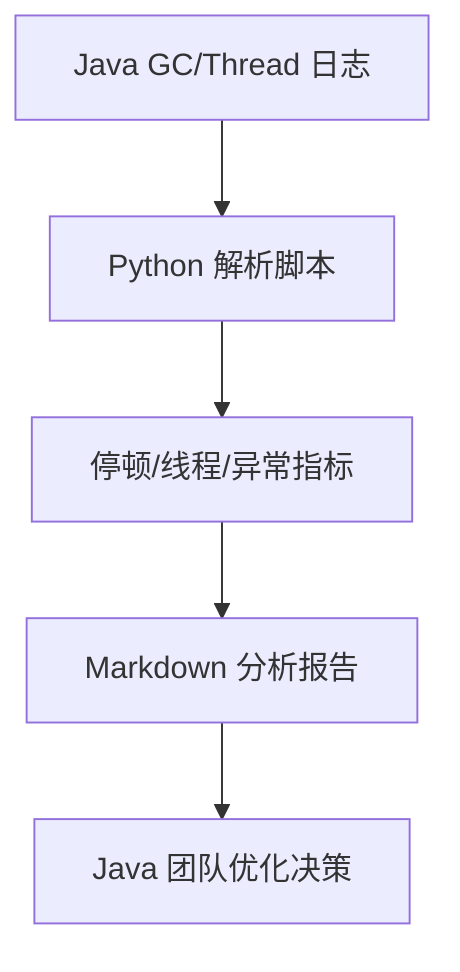

## 知识点拆解

| 小节 | 技术内容 | Java 视角切入 | 落地案例 |
| --- | --- | --- | --- |
| 11.1 | 数据处理辅助层：接收 Java 业务数据并完成 ETL 分析 | 对标 Java 既有实践，解释设计差异 | 价格计算平台中的对应环节 |
| 11.2 | 自动化工程化脚本：替代 Java 开发重复运维工具 | 对标 Java 既有实践，解释设计差异 | 价格计算平台中的对应环节 |
| 11.3 | AI 生态适配层：集成模型接口并为 Java 提供智能能力 | 对标 Java 既有实践，解释设计差异 | 价格计算平台中的对应环节 |
| 11.4 | 章节综合案例：解析 GC 日志、线程快照并生成报告 | 对标 Java 既有实践，解释设计差异 | 价格计算平台中的对应环节 |

## 11.1 数据处理辅助层：接收 Java 业务数据并完成 ETL 分析

### Java 中我们通常怎么做

在 Java 技术体系里，这类问题往往通过成熟框架和约定解决：Spring Boot 提供自动配置，Spring MVC 提供注解式入口，Maven/Gradle 统一依赖管理，JUC 和线程池负责并发治理，Bean Validation 与统一异常处理负责边界校验。它的优势是团队认知稳定、生态完整、复杂业务建模能力强。

### Python 的对应设计

Python 的设计目标不完全等价于 Java。它更强调在特定场景下减少样板、降低运行时负担或提升反馈速度。学习时要把“语法差异”翻译成“工程边界差异”：谁负责启动，谁负责依赖，谁暴露错误，谁管理并发，谁承接接口契约。

### 全栈选型逻辑

如果该环节处在核心交易链路、需要复杂领域规则和强团队约束，优先留在 Java。如果该环节更接近流量入口、并发聚合、数据清洗、自动化或算法适配，就可以考虑由 Python 承担。真正的架构能力，是知道边界在哪里，而不是把所有能力塞进一种语言。

### Java 开发者容易踩的坑

1. 只按语法相似度迁移，不重新设计错误边界。
2. 把 Java 的分层模式机械搬过去，导致新语言项目也变得臃肿。
3. 忽略跨语言调用的超时、错误码、日志字段和版本兼容。
4. 学完语言特性却没有落到真实链路，无法形成可复用经验。

## 11.2 自动化工程化脚本：替代 Java 开发重复运维工具

### Java 中我们通常怎么做

在 Java 技术体系里，这类问题往往通过成熟框架和约定解决：Spring Boot 提供自动配置，Spring MVC 提供注解式入口，Maven/Gradle 统一依赖管理，JUC 和线程池负责并发治理，Bean Validation 与统一异常处理负责边界校验。它的优势是团队认知稳定、生态完整、复杂业务建模能力强。

### Python 的对应设计

Python 的设计目标不完全等价于 Java。它更强调在特定场景下减少样板、降低运行时负担或提升反馈速度。学习时要把“语法差异”翻译成“工程边界差异”：谁负责启动，谁负责依赖，谁暴露错误，谁管理并发，谁承接接口契约。

### 全栈选型逻辑

如果该环节处在核心交易链路、需要复杂领域规则和强团队约束，优先留在 Java。如果该环节更接近流量入口、并发聚合、数据清洗、自动化或算法适配，就可以考虑由 Python 承担。真正的架构能力，是知道边界在哪里，而不是把所有能力塞进一种语言。

### Java 开发者容易踩的坑

1. 只按语法相似度迁移，不重新设计错误边界。
2. 把 Java 的分层模式机械搬过去，导致新语言项目也变得臃肿。
3. 忽略跨语言调用的超时、错误码、日志字段和版本兼容。
4. 学完语言特性却没有落到真实链路，无法形成可复用经验。

## 11.3 AI 生态适配层：集成模型接口并为 Java 提供智能能力

### Java 中我们通常怎么做

在 Java 技术体系里，这类问题往往通过成熟框架和约定解决：Spring Boot 提供自动配置，Spring MVC 提供注解式入口，Maven/Gradle 统一依赖管理，JUC 和线程池负责并发治理，Bean Validation 与统一异常处理负责边界校验。它的优势是团队认知稳定、生态完整、复杂业务建模能力强。

### Python 的对应设计

Python 的设计目标不完全等价于 Java。它更强调在特定场景下减少样板、降低运行时负担或提升反馈速度。学习时要把“语法差异”翻译成“工程边界差异”：谁负责启动，谁负责依赖，谁暴露错误，谁管理并发，谁承接接口契约。

### 全栈选型逻辑

如果该环节处在核心交易链路、需要复杂领域规则和强团队约束，优先留在 Java。如果该环节更接近流量入口、并发聚合、数据清洗、自动化或算法适配，就可以考虑由 Python 承担。真正的架构能力，是知道边界在哪里，而不是把所有能力塞进一种语言。

### Java 开发者容易踩的坑

1. 只按语法相似度迁移，不重新设计错误边界。
2. 把 Java 的分层模式机械搬过去，导致新语言项目也变得臃肿。
3. 忽略跨语言调用的超时、错误码、日志字段和版本兼容。
4. 学完语言特性却没有落到真实链路，无法形成可复用经验。

## 11.4 章节综合案例：解析 GC 日志、线程快照并生成报告

### Java 中我们通常怎么做

在 Java 技术体系里，这类问题往往通过成熟框架和约定解决：Spring Boot 提供自动配置，Spring MVC 提供注解式入口，Maven/Gradle 统一依赖管理，JUC 和线程池负责并发治理，Bean Validation 与统一异常处理负责边界校验。它的优势是团队认知稳定、生态完整、复杂业务建模能力强。

### Python 的对应设计

Python 的设计目标不完全等价于 Java。它更强调在特定场景下减少样板、降低运行时负担或提升反馈速度。学习时要把“语法差异”翻译成“工程边界差异”：谁负责启动，谁负责依赖，谁暴露错误，谁管理并发，谁承接接口契约。

### 全栈选型逻辑

如果该环节处在核心交易链路、需要复杂领域规则和强团队约束，优先留在 Java。如果该环节更接近流量入口、并发聚合、数据清洗、自动化或算法适配，就可以考虑由 Python 承担。真正的架构能力，是知道边界在哪里，而不是把所有能力塞进一种语言。

### Java 开发者容易踩的坑

1. 只按语法相似度迁移，不重新设计错误边界。
2. 把 Java 的分层模式机械搬过去，导致新语言项目也变得臃肿。
3. 忽略跨语言调用的超时、错误码、日志字段和版本兼容。
4. 学完语言特性却没有落到真实链路，无法形成可复用经验。


## 对比代码示例

```java
// Java: Spring MVC 风格的统一响应
public record ApiResponse<T>(int code, String message, T data, String traceId) {
    public static <T> ApiResponse<T> ok(T data, String traceId) {
        return new ApiResponse<>(0, "OK", data, traceId);
    }
}
```

```go
// Go: 与 Java ApiResponse 对齐的响应壳
type ApiResponse struct {
    Code    int         `json:"code"`
    Message string      `json:"message"`
    Data    interface{} `json:"data,omitempty"`
    TraceID string      `json:"traceId"`
}
```

```python
# Python: 与 Java DTO 对齐的分析入参
from dataclasses import dataclass

@dataclass
class PriceAnalysisRequest:
    sku: str
    base_price: float
    member_level: str
```

这三段代码共同表达同一件事：跨语言协同首先要统一契约。Java 的 record、Go 的 struct、Python 的 dataclass 都只是承载结构的方式，真正需要团队统一的是字段名称、错误码语义、traceId 传递方式和版本兼容策略。

## 章节综合案例：Python 实现 Java 服务日志分析脚本

Python 在工程化脚本上胜过 Java 的地方是反馈速度。对日志、CSV、JSON、文本快照这类输入，Python 可以用更少样板代码完成清洗、统计和报告生成。

### 场景输入

用户请求某个 SKU 的实时价格，系统需要读取商品基础价、计算会员优惠、调用分析服务返回历史价格趋势与价格分数，最终对前端返回统一响应。

### 关键流程

1. 网关层校验请求头、生成 traceId、执行限流。
2. Java 核心服务计算价格，保证业务规则集中管理。
3. Python 分析服务处理历史数据，返回趋势、波动率、推荐分。
4. 所有服务按同一响应壳返回，日志中携带相同 traceId。

### 本章落地点

读者完成本章后，应能把 Python 在全栈架构下的落地场景实战 中的知识点放回企业项目链路里解释：这个能力解决什么问题，为什么不是 Java 独自承担，跨语言后要补上哪些工程治理。

## 本章小结

1. 本章的核心不是记住 Python 的单点语法，而是建立 Java 到 Python 的工程映射。
2. 多语言协同必须先统一接口契约、错误码、日志和超时策略。
3. 技术选型要跟业务链路绑定：入口治理、核心交易、数据辅助三类职责不能混在一起。
4. 所有章节案例最终都会汇入第 13 章的电商价格计算平台。

## 选型思考题

1. 如果把本章场景全部留在 Java，会获得什么稳定性，又会损失什么效率？
2. 如果把核心业务过度迁移到 Python，团队协作和故障排查会出现什么风险？
3. 你所在团队目前最适合先引入哪一个跨语言边界：网关、数据辅助，还是自动化脚本？

## 延伸阅读资源

1. Java 官方文档与 Spring Boot 参考文档：用于确认 Java 侧基础能力边界。
2. Go 官方文档或 Python 官方文档：用于校准语言基础概念。
3. OpenAPI 与 Protocol Buffers 文档：用于统一跨语言接口契约。
4. Docker Compose 文档：用于本地多服务联调。

## 第 11 章日志分析脚本输出样例

```markdown
# Java 服务运行分析报告

- 最大 GC 暂停：182ms
- 线程池峰值队列长度：240
- 慢接口 Top 1：POST /api/v1/price/calculate
- 建议：将会员权益查询拆入并行调用，并给 Python 分析接口增加短 TTL 缓存。
```

Python 脚本的价值是把零散日志转成工程判断。它不替代 APM，但能让团队快速把一次故障复盘沉淀成可执行的排查工具。

---

# 第 12 章 全栈架构设计：Java+Go+Python 技术栈整合

> 所属篇章：第四篇 整合篇

**本章技术占比**：技术 50% + 引导 20% + 案例 30%

**前置 Java 知识映射**：微服务分层、接口版本、错误码、日志规范、Docker Compose、链路追踪

## 本章导读

本章仍然从 Java 开发者熟悉的工程经验切入。你不需要把 多语言 当作一门完全陌生的语言重新背语法，而是先回答三个问题：Java 中这件事通常怎么做，多语言 为什么采用不同设计，这个差异在全栈协同场景下能带来什么收益或风险。

学习多语言不是为了增加技术栈标签，而是为了获得更细的架构分工能力。Java 继续承担复杂业务、一致性和团队协作沉淀；Go 更适合高并发入口、轻量网关和云原生组件；Python 更适合数据处理、自动化脚本和 AI 生态适配。判断标准始终是业务链路，而不是语言偏好。

## 技术地图

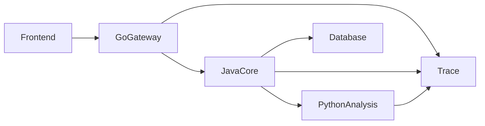

## 知识点拆解

| 小节 | 技术内容 | Java 视角切入 | 落地案例 |
| --- | --- | --- | --- |
| 12.1 | 架构分层逻辑：前端到 Go 网关到 Java 核心到 Python 辅助层 | 对标 Java 既有实践，解释设计差异 | 价格计算平台中的对应环节 |
| 12.2 | 技术栈最终选型：组件选择、版本对齐、依赖管理规则 | 对标 Java 既有实践，解释设计差异 | 价格计算平台中的对应环节 |
| 12.3 | 统一工程化规范：仓库拆分、接口版本、错误码、日志格式 | 对标 Java 既有实践，解释设计差异 | 价格计算平台中的对应环节 |
| 12.4 | 容器化部署方案：Dockerfile 与 Docker Compose 编排 | 对标 Java 既有实践，解释设计差异 | 价格计算平台中的对应环节 |

## 12.1 架构分层逻辑：前端到 Go 网关到 Java 核心到 Python 辅助层

### Java 中我们通常怎么做

在 Java 技术体系里，这类问题往往通过成熟框架和约定解决：Spring Boot 提供自动配置，Spring MVC 提供注解式入口，Maven/Gradle 统一依赖管理，JUC 和线程池负责并发治理，Bean Validation 与统一异常处理负责边界校验。它的优势是团队认知稳定、生态完整、复杂业务建模能力强。

### 多语言 的对应设计

多语言 的设计目标不完全等价于 Java。它更强调在特定场景下减少样板、降低运行时负担或提升反馈速度。学习时要把“语法差异”翻译成“工程边界差异”：谁负责启动，谁负责依赖，谁暴露错误，谁管理并发，谁承接接口契约。

### 全栈选型逻辑

如果该环节处在核心交易链路、需要复杂领域规则和强团队约束，优先留在 Java。如果该环节更接近流量入口、并发聚合、数据清洗、自动化或算法适配，就可以考虑由 多语言 承担。真正的架构能力，是知道边界在哪里，而不是把所有能力塞进一种语言。

### Java 开发者容易踩的坑

1. 只按语法相似度迁移，不重新设计错误边界。
2. 把 Java 的分层模式机械搬过去，导致新语言项目也变得臃肿。
3. 忽略跨语言调用的超时、错误码、日志字段和版本兼容。
4. 学完语言特性却没有落到真实链路，无法形成可复用经验。

## 12.2 技术栈最终选型：组件选择、版本对齐、依赖管理规则

### Java 中我们通常怎么做

在 Java 技术体系里，这类问题往往通过成熟框架和约定解决：Spring Boot 提供自动配置，Spring MVC 提供注解式入口，Maven/Gradle 统一依赖管理，JUC 和线程池负责并发治理，Bean Validation 与统一异常处理负责边界校验。它的优势是团队认知稳定、生态完整、复杂业务建模能力强。

### 多语言 的对应设计

多语言 的设计目标不完全等价于 Java。它更强调在特定场景下减少样板、降低运行时负担或提升反馈速度。学习时要把“语法差异”翻译成“工程边界差异”：谁负责启动，谁负责依赖，谁暴露错误，谁管理并发，谁承接接口契约。

### 全栈选型逻辑

如果该环节处在核心交易链路、需要复杂领域规则和强团队约束，优先留在 Java。如果该环节更接近流量入口、并发聚合、数据清洗、自动化或算法适配，就可以考虑由 多语言 承担。真正的架构能力，是知道边界在哪里，而不是把所有能力塞进一种语言。

### Java 开发者容易踩的坑

1. 只按语法相似度迁移，不重新设计错误边界。
2. 把 Java 的分层模式机械搬过去，导致新语言项目也变得臃肿。
3. 忽略跨语言调用的超时、错误码、日志字段和版本兼容。
4. 学完语言特性却没有落到真实链路，无法形成可复用经验。

## 12.3 统一工程化规范：仓库拆分、接口版本、错误码、日志格式

### Java 中我们通常怎么做

在 Java 技术体系里，这类问题往往通过成熟框架和约定解决：Spring Boot 提供自动配置，Spring MVC 提供注解式入口，Maven/Gradle 统一依赖管理，JUC 和线程池负责并发治理，Bean Validation 与统一异常处理负责边界校验。它的优势是团队认知稳定、生态完整、复杂业务建模能力强。

### 多语言 的对应设计

多语言 的设计目标不完全等价于 Java。它更强调在特定场景下减少样板、降低运行时负担或提升反馈速度。学习时要把“语法差异”翻译成“工程边界差异”：谁负责启动，谁负责依赖，谁暴露错误，谁管理并发，谁承接接口契约。

### 全栈选型逻辑

如果该环节处在核心交易链路、需要复杂领域规则和强团队约束，优先留在 Java。如果该环节更接近流量入口、并发聚合、数据清洗、自动化或算法适配，就可以考虑由 多语言 承担。真正的架构能力，是知道边界在哪里，而不是把所有能力塞进一种语言。

### Java 开发者容易踩的坑

1. 只按语法相似度迁移，不重新设计错误边界。
2. 把 Java 的分层模式机械搬过去，导致新语言项目也变得臃肿。
3. 忽略跨语言调用的超时、错误码、日志字段和版本兼容。
4. 学完语言特性却没有落到真实链路，无法形成可复用经验。

## 12.4 容器化部署方案：Dockerfile 与 Docker Compose 编排

### Java 中我们通常怎么做

在 Java 技术体系里，这类问题往往通过成熟框架和约定解决：Spring Boot 提供自动配置，Spring MVC 提供注解式入口，Maven/Gradle 统一依赖管理，JUC 和线程池负责并发治理，Bean Validation 与统一异常处理负责边界校验。它的优势是团队认知稳定、生态完整、复杂业务建模能力强。

### 多语言 的对应设计

多语言 的设计目标不完全等价于 Java。它更强调在特定场景下减少样板、降低运行时负担或提升反馈速度。学习时要把“语法差异”翻译成“工程边界差异”：谁负责启动，谁负责依赖，谁暴露错误，谁管理并发，谁承接接口契约。

### 全栈选型逻辑

如果该环节处在核心交易链路、需要复杂领域规则和强团队约束，优先留在 Java。如果该环节更接近流量入口、并发聚合、数据清洗、自动化或算法适配，就可以考虑由 多语言 承担。真正的架构能力，是知道边界在哪里，而不是把所有能力塞进一种语言。

### Java 开发者容易踩的坑

1. 只按语法相似度迁移，不重新设计错误边界。
2. 把 Java 的分层模式机械搬过去，导致新语言项目也变得臃肿。
3. 忽略跨语言调用的超时、错误码、日志字段和版本兼容。
4. 学完语言特性却没有落到真实链路，无法形成可复用经验。


## 对比代码示例

```java
// Java: Spring MVC 风格的统一响应
public record ApiResponse<T>(int code, String message, T data, String traceId) {
    public static <T> ApiResponse<T> ok(T data, String traceId) {
        return new ApiResponse<>(0, "OK", data, traceId);
    }
}
```

```go
// Go: 与 Java ApiResponse 对齐的响应壳
type ApiResponse struct {
    Code    int         `json:"code"`
    Message string      `json:"message"`
    Data    interface{} `json:"data,omitempty"`
    TraceID string      `json:"traceId"`
}
```

```python
# Python: 与 Java DTO 对齐的分析入参
from dataclasses import dataclass

@dataclass
class PriceAnalysisRequest:
    sku: str
    base_price: float
    member_level: str
```

这三段代码共同表达同一件事：跨语言协同首先要统一契约。Java 的 record、Go 的 struct、Python 的 dataclass 都只是承载结构的方式，真正需要团队统一的是字段名称、错误码语义、traceId 传递方式和版本兼容策略。

## 章节综合案例：多语言服务的容器化本地部署测试

整合篇把前面章节的点状知识收束成一套工程规范：接口壳统一、错误码统一、日志字段统一、容器启动顺序统一、联调脚本统一。

### 场景输入

用户请求某个 SKU 的实时价格，系统需要读取商品基础价、计算会员优惠、调用分析服务返回历史价格趋势与价格分数，最终对前端返回统一响应。

### 关键流程

1. 网关层校验请求头、生成 traceId、执行限流。
2. Java 核心服务计算价格，保证业务规则集中管理。
3. Python 分析服务处理历史数据，返回趋势、波动率、推荐分。
4. 所有服务按同一响应壳返回，日志中携带相同 traceId。

### 本章落地点

读者完成本章后，应能把 全栈架构设计：Java+Go+Python 技术栈整合 中的知识点放回企业项目链路里解释：这个能力解决什么问题，为什么不是 Java 独自承担，跨语言后要补上哪些工程治理。

## 本章小结

1. 本章的核心不是记住 多语言 的单点语法，而是建立 Java 到 多语言 的工程映射。
2. 多语言协同必须先统一接口契约、错误码、日志和超时策略。
3. 技术选型要跟业务链路绑定：入口治理、核心交易、数据辅助三类职责不能混在一起。
4. 所有章节案例最终都会汇入第 13 章的电商价格计算平台。

## 选型思考题

1. 如果把本章场景全部留在 Java，会获得什么稳定性，又会损失什么效率？
2. 如果把核心业务过度迁移到 多语言，团队协作和故障排查会出现什么风险？
3. 你所在团队目前最适合先引入哪一个跨语言边界：网关、数据辅助，还是自动化脚本？

## 延伸阅读资源

1. Java 官方文档与 Spring Boot 参考文档：用于确认 Java 侧基础能力边界。
2. Go 官方文档或 Python 官方文档：用于校准语言基础概念。
3. OpenAPI 与 Protocol Buffers 文档：用于统一跨语言接口契约。
4. Docker Compose 文档：用于本地多服务联调。

## 第 12 章工程规范基线

1. 所有接口必须有版本前缀，例如 `/api/v1`。
2. 所有响应必须包含 `code/message/data/traceId`。
3. 所有跨语言调用必须设置超时，禁止无限等待。
4. 金额统一使用整数分传输，避免浮点精度漂移。
5. 服务日志必须包含 `service/traceId/endpoint/latencyMs/code`。
6. Docker Compose 只用于本地联调，生产部署需接入正式配置与密钥管理。

规范是多语言架构的地基。没有统一规范，多语言只会放大沟通成本。

---

# 第 13 章 企业级实战项目：多语言协同电商价格计算平台

> 所属篇章：第四篇 整合篇

**本章技术占比**：技术 50% + 引导 20% + 案例 30%

**前置 Java 知识映射**：Java 领域建模、Go 网关治理、Python 数据分析、端到端联调、性能调优

## 本章导读

本章仍然从 Java 开发者熟悉的工程经验切入。你不需要把 多语言 当作一门完全陌生的语言重新背语法，而是先回答三个问题：Java 中这件事通常怎么做，多语言 为什么采用不同设计，这个差异在全栈协同场景下能带来什么收益或风险。

学习多语言不是为了增加技术栈标签，而是为了获得更细的架构分工能力。Java 继续承担复杂业务、一致性和团队协作沉淀；Go 更适合高并发入口、轻量网关和云原生组件；Python 更适合数据处理、自动化脚本和 AI 生态适配。判断标准始终是业务链路，而不是语言偏好。

## 技术地图

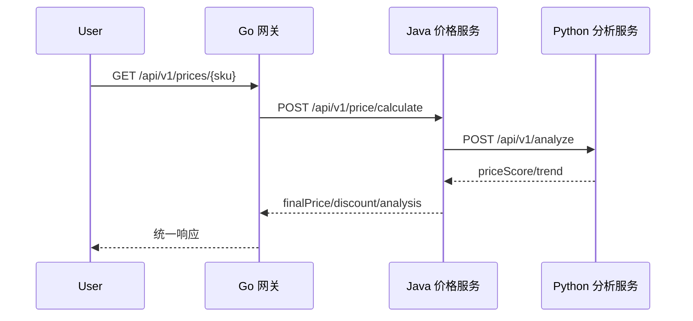

## 知识点拆解

| 小节 | 技术内容 | Java 视角切入 | 落地案例 |
| --- | --- | --- | --- |
| 13.1 | 业务场景：商品实时价格、优惠、权益、分析数据的完整链路 | 对标 Java 既有实践，解释设计差异 | 价格计算平台中的对应环节 |
| 13.2 | 服务拆分：Go 网关、Java 核心服务、Python 分析服务 | 对标 Java 既有实践，解释设计差异 | 价格计算平台中的对应环节 |
| 13.3 | 联调测试：接口测试、链路追踪、故障定位 | 对标 Java 既有实践，解释设计差异 | 价格计算平台中的对应环节 |
| 13.4 | 性能调优：Go 并发数、Java 线程池、Python 缓存 | 对标 Java 既有实践，解释设计差异 | 价格计算平台中的对应环节 |

## 13.1 业务场景：商品实时价格、优惠、权益、分析数据的完整链路

### Java 中我们通常怎么做

在 Java 技术体系里，这类问题往往通过成熟框架和约定解决：Spring Boot 提供自动配置，Spring MVC 提供注解式入口，Maven/Gradle 统一依赖管理，JUC 和线程池负责并发治理，Bean Validation 与统一异常处理负责边界校验。它的优势是团队认知稳定、生态完整、复杂业务建模能力强。

### 多语言 的对应设计

多语言 的设计目标不完全等价于 Java。它更强调在特定场景下减少样板、降低运行时负担或提升反馈速度。学习时要把“语法差异”翻译成“工程边界差异”：谁负责启动，谁负责依赖，谁暴露错误，谁管理并发，谁承接接口契约。

### 全栈选型逻辑

如果该环节处在核心交易链路、需要复杂领域规则和强团队约束，优先留在 Java。如果该环节更接近流量入口、并发聚合、数据清洗、自动化或算法适配，就可以考虑由 多语言 承担。真正的架构能力，是知道边界在哪里，而不是把所有能力塞进一种语言。

### Java 开发者容易踩的坑

1. 只按语法相似度迁移，不重新设计错误边界。
2. 把 Java 的分层模式机械搬过去，导致新语言项目也变得臃肿。
3. 忽略跨语言调用的超时、错误码、日志字段和版本兼容。
4. 学完语言特性却没有落到真实链路，无法形成可复用经验。

## 13.2 服务拆分：Go 网关、Java 核心服务、Python 分析服务

### Java 中我们通常怎么做

在 Java 技术体系里，这类问题往往通过成熟框架和约定解决：Spring Boot 提供自动配置，Spring MVC 提供注解式入口，Maven/Gradle 统一依赖管理，JUC 和线程池负责并发治理，Bean Validation 与统一异常处理负责边界校验。它的优势是团队认知稳定、生态完整、复杂业务建模能力强。

### 多语言 的对应设计

多语言 的设计目标不完全等价于 Java。它更强调在特定场景下减少样板、降低运行时负担或提升反馈速度。学习时要把“语法差异”翻译成“工程边界差异”：谁负责启动，谁负责依赖，谁暴露错误，谁管理并发，谁承接接口契约。

### 全栈选型逻辑

如果该环节处在核心交易链路、需要复杂领域规则和强团队约束，优先留在 Java。如果该环节更接近流量入口、并发聚合、数据清洗、自动化或算法适配，就可以考虑由 多语言 承担。真正的架构能力，是知道边界在哪里，而不是把所有能力塞进一种语言。

### Java 开发者容易踩的坑

1. 只按语法相似度迁移，不重新设计错误边界。
2. 把 Java 的分层模式机械搬过去，导致新语言项目也变得臃肿。
3. 忽略跨语言调用的超时、错误码、日志字段和版本兼容。
4. 学完语言特性却没有落到真实链路，无法形成可复用经验。

## 13.3 联调测试：接口测试、链路追踪、故障定位

### Java 中我们通常怎么做

在 Java 技术体系里，这类问题往往通过成熟框架和约定解决：Spring Boot 提供自动配置，Spring MVC 提供注解式入口，Maven/Gradle 统一依赖管理，JUC 和线程池负责并发治理，Bean Validation 与统一异常处理负责边界校验。它的优势是团队认知稳定、生态完整、复杂业务建模能力强。

### 多语言 的对应设计

多语言 的设计目标不完全等价于 Java。它更强调在特定场景下减少样板、降低运行时负担或提升反馈速度。学习时要把“语法差异”翻译成“工程边界差异”：谁负责启动，谁负责依赖，谁暴露错误，谁管理并发，谁承接接口契约。

### 全栈选型逻辑

如果该环节处在核心交易链路、需要复杂领域规则和强团队约束，优先留在 Java。如果该环节更接近流量入口、并发聚合、数据清洗、自动化或算法适配，就可以考虑由 多语言 承担。真正的架构能力，是知道边界在哪里，而不是把所有能力塞进一种语言。

### Java 开发者容易踩的坑

1. 只按语法相似度迁移，不重新设计错误边界。
2. 把 Java 的分层模式机械搬过去，导致新语言项目也变得臃肿。
3. 忽略跨语言调用的超时、错误码、日志字段和版本兼容。
4. 学完语言特性却没有落到真实链路，无法形成可复用经验。

## 13.4 性能调优：Go 并发数、Java 线程池、Python 缓存

### Java 中我们通常怎么做

在 Java 技术体系里，这类问题往往通过成熟框架和约定解决：Spring Boot 提供自动配置，Spring MVC 提供注解式入口，Maven/Gradle 统一依赖管理，JUC 和线程池负责并发治理，Bean Validation 与统一异常处理负责边界校验。它的优势是团队认知稳定、生态完整、复杂业务建模能力强。

### 多语言 的对应设计

多语言 的设计目标不完全等价于 Java。它更强调在特定场景下减少样板、降低运行时负担或提升反馈速度。学习时要把“语法差异”翻译成“工程边界差异”：谁负责启动，谁负责依赖，谁暴露错误，谁管理并发，谁承接接口契约。

### 全栈选型逻辑

如果该环节处在核心交易链路、需要复杂领域规则和强团队约束，优先留在 Java。如果该环节更接近流量入口、并发聚合、数据清洗、自动化或算法适配，就可以考虑由 多语言 承担。真正的架构能力，是知道边界在哪里，而不是把所有能力塞进一种语言。

### Java 开发者容易踩的坑

1. 只按语法相似度迁移，不重新设计错误边界。
2. 把 Java 的分层模式机械搬过去，导致新语言项目也变得臃肿。
3. 忽略跨语言调用的超时、错误码、日志字段和版本兼容。
4. 学完语言特性却没有落到真实链路，无法形成可复用经验。


## 对比代码示例

```java
// Java: Spring MVC 风格的统一响应
public record ApiResponse<T>(int code, String message, T data, String traceId) {
    public static <T> ApiResponse<T> ok(T data, String traceId) {
        return new ApiResponse<>(0, "OK", data, traceId);
    }
}
```

```go
// Go: 与 Java ApiResponse 对齐的响应壳
type ApiResponse struct {
    Code    int         `json:"code"`
    Message string      `json:"message"`
    Data    interface{} `json:"data,omitempty"`
    TraceID string      `json:"traceId"`
}
```

```python
# Python: 与 Java DTO 对齐的分析入参
from dataclasses import dataclass

@dataclass
class PriceAnalysisRequest:
    sku: str
    base_price: float
    member_level: str
```

这三段代码共同表达同一件事：跨语言协同首先要统一契约。Java 的 record、Go 的 struct、Python 的 dataclass 都只是承载结构的方式，真正需要团队统一的是字段名称、错误码语义、traceId 传递方式和版本兼容策略。

## 章节综合案例：完整可运行的多语言源码、SQL 脚本、Docker 部署包

实战项目以最小依赖实现完整链路，读者可以先运行本地标准库版本理解通信，再替换为 Spring Boot、Gin、FastAPI 等生产框架。

### 场景输入

用户请求某个 SKU 的实时价格，系统需要读取商品基础价、计算会员优惠、调用分析服务返回历史价格趋势与价格分数，最终对前端返回统一响应。

### 关键流程

1. 网关层校验请求头、生成 traceId、执行限流。
2. Java 核心服务计算价格，保证业务规则集中管理。
3. Python 分析服务处理历史数据，返回趋势、波动率、推荐分。
4. 所有服务按同一响应壳返回，日志中携带相同 traceId。

### 本章落地点

读者完成本章后，应能把 企业级实战项目：多语言协同电商价格计算平台 中的知识点放回企业项目链路里解释：这个能力解决什么问题，为什么不是 Java 独自承担，跨语言后要补上哪些工程治理。

## 本章小结

1. 本章的核心不是记住 多语言 的单点语法，而是建立 Java 到 多语言 的工程映射。
2. 多语言协同必须先统一接口契约、错误码、日志和超时策略。
3. 技术选型要跟业务链路绑定：入口治理、核心交易、数据辅助三类职责不能混在一起。
4. 所有章节案例最终都会汇入第 13 章的电商价格计算平台。

## 选型思考题

1. 如果把本章场景全部留在 Java，会获得什么稳定性，又会损失什么效率？
2. 如果把核心业务过度迁移到 多语言，团队协作和故障排查会出现什么风险？
3. 你所在团队目前最适合先引入哪一个跨语言边界：网关、数据辅助，还是自动化脚本？

## 延伸阅读资源

1. Java 官方文档与 Spring Boot 参考文档：用于确认 Java 侧基础能力边界。
2. Go 官方文档或 Python 官方文档：用于校准语言基础概念。
3. OpenAPI 与 Protocol Buffers 文档：用于统一跨语言接口契约。
4. Docker Compose 文档：用于本地多服务联调。

## 第 13 章实战验收清单

| 验收项 | 通过标准 |
| --- | --- |
| Java 价格服务 | `SKU-1001 + GOLD` 返回 `finalPriceCents=110415` |
| Go 网关 | 能透传 `X-Trace-Id` 并转发 Java 响应 |
| Python 分析服务 | 能返回 `trend/volatility/priceScore` |
| 错误码 | 参数缺失返回 `40001` |
| 日志 | 三端都能按 traceId 排查 |
| 部署 | Docker Compose 能启动 Java/Python 基础服务 |

本章交付的重点是可解释、可联调、可替换。标准库版本用于理解链路，后续可以逐步替换成 Spring Boot、Gin、FastAPI 的生产版实现。

---

# 附录 A：Java、Go、Python 核心技术特性对比表

| 维度 | Java | Go | Python |
| --- | --- | --- | --- |
| 类型系统 | 静态强类型，面向对象完整 | 静态强类型，结构体与接口组合 | 动态类型，鸭子类型 |
| 并发模型 | OS 线程、线程池、JUC | Goroutine、Channel、Context | 线程受 GIL 影响，多进程/协程常用 |
| Web 入口 | Spring MVC/WebFlux | Gin/标准库 net/http | FastAPI/Flask |
| 部署方式 | Jar/镜像，依赖 JVM | 单二进制/镜像 | 解释器/虚拟环境/镜像 |
| 最适合场景 | 核心业务、一致性、复杂领域模型 | 网关、聚合、云原生组件 | 数据分析、脚本、AI 生态 |

---

# 附录 B：多语言协同常用工具链配置指南

## 推荐目录

```
project/pricing-platform
├── go-gateway
├── java-price-service
├── python-analysis-service
├── contracts
├── sql
└── scripts
```

## 本地端口

| 服务 | 端口 | 说明 |
| --- | ---: | --- |
| Go 网关 | 8080 | 对外入口 |
| Java 价格服务 | 8081 | 核心价格计算 |
| Python 分析服务 | 8082 | 历史价格与评分 |

---

# 附录 C：核心框架常用配置对照表

| 能力 | Spring MVC | Gin | FastAPI |
| --- | --- | --- | --- |
| 路由 | @GetMapping/@PostMapping | r.GET/r.POST | @app.get/@app.post |
| 参数校验 | Bean Validation | binding tag | Pydantic model |
| 拦截器 | HandlerInterceptor | middleware | middleware/dependency |
| 统一异常 | @ControllerAdvice | error middleware | exception_handler |
| 文档 | springdoc-openapi | swaggo | OpenAPI 自动生成 |

---

# 附录 D：跨语言通信常见问题排查手册

| 问题 | 典型现象 | 排查方法 | 修复建议 |
| --- | --- | --- | --- |
| JSON 字段不一致 | 某语言收到空字段 | 对照 OpenAPI 契约和日志原文 | 固定字段命名，不混用 snake_case/camelCase |
| 超时未隔离 | 网关请求堆积 | 检查下游耗时和连接池 | 设置请求级 timeout 和降级 |
| traceId 丢失 | 日志无法串链 | 搜索三端日志 traceId | 网关注入，所有服务透传 |
| 错误码漂移 | 前端无法判断失败类型 | 对照错误码表 | 错误码集中维护，禁止服务自造 |
| 数据精度问题 | 价格小数异常 | 检查浮点计算与序列化 | 金额使用整数分或 BigDecimal/Decimal |

---

# 附录 E：延伸学习资源推荐

1. Java：Oracle Java 文档、Spring Boot Reference、Spring Framework Reference。
2. Go：Go Tour、Go Language Specification、Effective Go。
3. Python：Python 官方教程、FastAPI 文档、SQLAlchemy 文档。
4. 协议：OpenAPI Specification、Protocol Buffers、gRPC 文档。
5. 工程化：Docker Compose、OpenTelemetry、Postman 文档。
