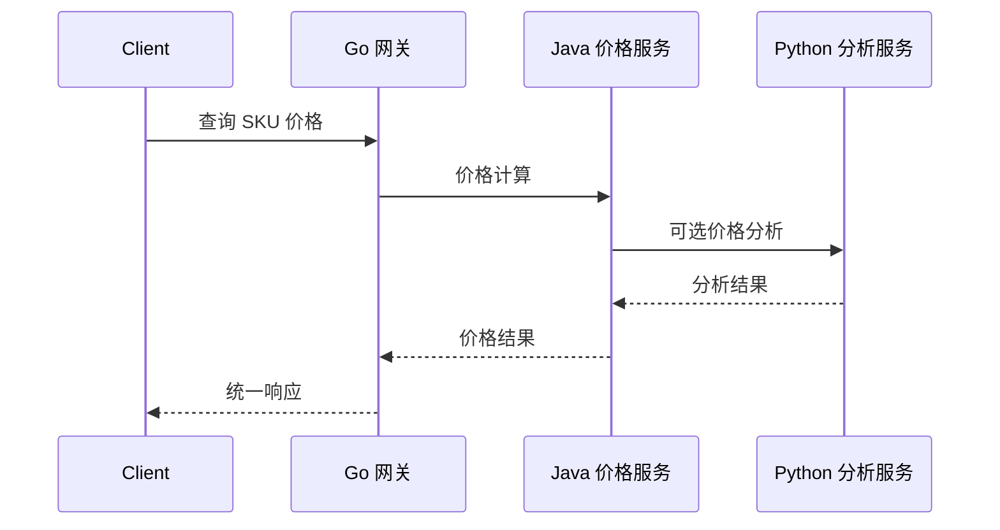

# 全书实战验收报告

## 验收链路

目标链路为：



## 已交付测试用例

| 用例 | 输入 | 期望 |
| --- | --- | --- |
| Java 价格计算 | SKU-1001 + GOLD | finalPriceCents = 110415 |
| Java 默认商品 | 未配置 SKU + NORMAL | basePriceCents = 99900 |
| 参数缺失 | 缺少 sku/memberLevel | code = 40001 |
| 健康检查 | GET /health | status = UP |

## 当前验收状态

Java 核心服务已在本机 JDK 21 编译运行，并完成真实 HTTP 请求验收。完整 Go/Python 联调依赖本机安装 Go 与可用 Python 解释器，运行前置条件已在项目 README 中标注。

## Java 服务实测结果

请求：

```json
{"sku":"SKU-1001","memberLevel":"GOLD"}
```

响应关键字段：

```json
{
  "code": 0,
  "message": "OK",
  "data": {
    "sku": "SKU-1001",
    "memberLevel": "GOLD",
    "basePriceCents": 129900,
    "finalPriceCents": 110415,
    "discountRate": "0.85"
  }
}
```
