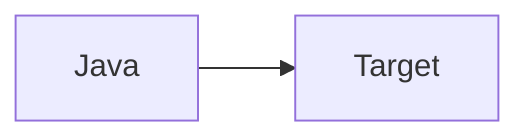

# 统一写作模板

```markdown
# 第 N 章 章节标题

> 所属篇章：...

**本章技术占比**：技术 50% + 引导 20% + 案例 30%

**前置 Java 知识映射**：...

## 本章导读

先用 Java 经验切入，再引出 Go/Python 的差异。

## 技术地图



## N.1 小节标题

### Java 中我们通常怎么做

### Go/Python 的对应设计

### 全栈选型逻辑

### Java 开发者容易踩的坑

## 对比代码示例

## 章节综合案例

## 本章小结

## 选型思考题

## 延伸阅读资源
```
