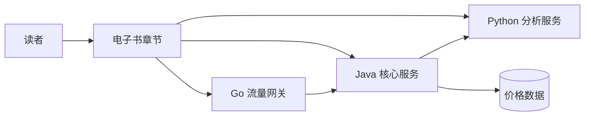

## 交付内容

| 模块 | 内容 |
| --- | --- |
| 电子书正文 | 前言、13 章正文、5 个附录 |
| 实战项目 | Go 网关、Java 价格服务、Python 分析服务 |
| 工程规范 | OpenAPI 契约、错误码、日志字段、Docker Compose |
| 验收资料 | 技术校验报告、实战验收报告、导出指南 |

## 架构链路

## 版权协议

Copyright © 2026 luoxianggan

书稿正文、图表与站点内容采用 CC BY-NC-SA 4.0；示例代码、脚本、配置文件与实战项目源码采用 Apache License 2.0。
